<div align="center">

</img><br>

Universidad Peruana de Ciencias Aplicadas<br>
Carrera de Ingeniería de Software<br><br>

<strong>1ASI0730</strong><br>
<strong>Aplicaciones Web</strong><br>
NRC<br>
<strong>8084</strong><br>
<strong>Informe del Trabajo Final</strong><br>
Docente<br>
<strong>Velasquez Nuñez, Angel Augusto</strong><br>
Equipo<br>
<strong>FuturosSeniors</strong><br><br>

Proyecto<br>
<strong>Destilatech</strong><br><br>

<strong>Integrantes</strong>

<table>
  <thead>
    <tr>
      <th>Código</th>
      <th>Apellidos y Nombres</th>
    </tr>
  </thead>
  <tbody>
    <tr>
      <td>U202317807</td>
      <td>Fernandez Seer Mario Alonso</td>
    </tr>
    <tr>
      <td>U202418755</td>
      <td>Santiago Atanacio, Jairo Mathias</td>
    </tr>
    <tr>
      <td>U202316845</td>
      <td>Almandroz Carbajal, Pierina Marysabel</td>
    </tr>
    <tr>
      <td>U202418405</td>
      <td>Condor Sandoval, Jean Pierre</td>
    </tr>
    <tr>
      <td>U202322404</td>
      <td>Domenack Angeles, Miguel</td>
    </tr>
  </tbody>
</table>

<strong>Período 202620</strong><br><br>

<strong>Septiembre 2026</strong>
</div>
<div style="page-break-after: always;"></div>


## Registro de Versiones del Informe


| Versión |   Fecha    |                                                                               Autor                                                                               |                                                  Descripción de modificación                                                   |
| :-----: |:----------:|:-----------------------------------------------------------------------------------------------------------------------------------------------------------------:| :----------------------------------------------------------------------------------------------------------------------------: |
|   AV1   | xxxxxxxx |       xxxxxxxxxxxxxx     | Avance del trabajo: xxxxxxxxxxxx |


<div style="page-break-after: always;"></div>

## Project Report Collaboration Insights
A continuación, se detallan los repositorios utilizados a lo largo del proyecto:

#### Link del repositorio del Reporte:

- xxxxxxxx

#### Link del repositorio del Website:

- xxxxxx


### **Entrega AV1:**
xxxxxxx

##### Participación por integrante:

- U202317807      <br>
- U202418755 
- U202316845 
- U202418405 
- U202322404  

+ **Evidencias de colaboración y commits - Github:**
    * **Análiticos de colaboración** <br><br>
        + **Pulse Image of Github Insights**
        xxxxxxxxx


        + **Contributors Image of Github Insights**
        xxxxxxxxx


    * **Commits**

         A continuación se muestran algunos commits realizados en este entrega de TB1.

        + **xxxxxxxxxx **

            </div><br>

        + **xxxxxxxxxx **

            </div><br>

        + **xxxxxxxxxx **

            </div><br>
        + **xxxxxxxxxx **

            </div><br>
        + **xxxxxxxxxx **

            </div><br>


# Contenido

## Índice

- [Registro de versiones del informe](#registro-de-versiones-del-informe)

- [Project Report Collaboration Insights](#project-report-collaboration-insights)

- [Contenido](#contenido)

- [Student Outcome](#student-outcome)

- [Capítulo I: Introducción](#capitulo-i-introducción)
  - [1.1. StartUp Profile](#11-startup-profile)
    - [1.1.1. Descripción de la StartUp](#111-descripción-de-la-startup)
    - [1.1.2. Perfiles de Integrantes del equipo](#112-perfiles-de-integrantes-del-equipo)
  - [1.2. Solution Profile](#12-solution-profile)
    - [1.2.1. Antecedentes y Problemática](#121-antecedentes-y-problemática)
    - [1.2.2. Lean UX Process](#122-lean-ux-process)
      - [1.2.2.1. Lean UX Problem Statements](#1221-lean-ux-problem-statements)
      - [1.2.2.2. Lean UX Assumptions](#1221-lean-ux-assumptions)
      - [1.2.2.3. Lean UX Hypothesis Statements](#1223-lean-ux-hyphotesis-statements)
      - [1.2.2.4. Lean UX Canvas](#1224-lean-ux-canvas)
  - [1.3. Segmentos objetivo](#13-segmentos-objetivo)
- [Capítulo II: Requirements Elicitation & Analysis]()
  - [2.1. Competidores](#21-competidores)
    - [2.1.1. Análisis competitivo](#211-análisis-competitivo)
    - [2.1.2. Estrategias y tácticas frente a competidores](#212-estrategias-y-tácticas-frente-a-competidores)
  - [2.2. Entrevistas](#22-entrevistas)
    - [2.2.1. Diseño de entrevistas](#221-diseño-de-entrevistas)
    - [2.2.2. Registro de entrevistas](#222-registro-de-entrevistas)
    - [2.2.3. Análisis de entrevistas](#223-análisis-de-entrevistas)
  - [2.3. Needfinding](#23-needfinding)
    - [2.3.1. User Persona](#231-user-persona)
    - [2.3.2. User Task Matrix](#232-user-task-matrix)
    - [2.3.3. User Journey Mapping](#233-user-journey-mapping)
    - [2.3.4. Empathy Mapping](#234-empathy-mapping)
  - [2.4 Big Picture Event Storming](#24-big-picture-event-storming)
  - [2.5 Ubiquitous Language](#25-ubiquitous-language)
- [Capítulo III: Requirements Specification]()
  - [3.1. User Stories](#31-user-stories)
  - [3.2. Impact Mapping](#32-impact-mapping)
  - [3.3. Product Backlog](#33-product-backlog)
- [Capítulo IV: Product Design]()
  - [4.1. Style Guidelines](#41-style-guidelines)
    - [4.1.1. General Style Guidelines](#411-general-style-guidelines)
    - [4.1.2. Web Style Guidelines](#412-web-style-guidelines)
  - [4.2. Information Architecture](#42-information-architecture)
    - [4.2.1. Organization Systems](#421-organization-systems)
    - [4.2.2. Labeling Systems](#422-labeling-systems)
    - [4.2.3. SEO Tags and Meta Tags](#423-seo-tags-and-meta-tags)
    - [4.2.4. Searching Systems](#424-searching-systems)
    - [4.2.5. Navigation Systems](#425-navigation-systems)
  - [4.3. Landing Page UI Design](#43-landing-page-ui-design)
    - [4.3.1. Landing Page Wireframe](#431-landing-page-wireframe)
    - [4.3.2. Landing Page Mock-up](#432-landing-page-mock-up)
  - [4.4. Web Applications UX/UI Design](#44-web-applications-uxui-design)
    - [4.4.1. Web Applications Wireframes](#441-web-applications-wireframes)
    - [4.4.2. Web Applications Wireflow Diagrams](#442-web-applications-wireflow-diagrams)
    - [4.4.3. Web Applications Mock-ups](#443-web-applications-mock-ups)
    - [4.4.4. Web Applications User Flow Diagrams](#444-web-applications-user-flow-diagrams)
  - [4.5. Web Applications Prototyping](#45-web-applications-prototyping)
  - [4.6. Domain-Driven Software Architecture](#46-domain-driven-software-architecture)
    - [4.6.1. Design-Level Event Storming](#461-design-level-event-storming)
    - [4.6.2. Software Architecture Context Diagram](#462-software-architecture-context-diagram)
    - [4.6.3. Software Architecture Container Diagrams](#463-software-architecture-container-diagrams)
    - [4.6.4. Software Architecture Components Diagrams](#464-software-architecture-components-diagrams)
  - [4.7. Software Object-Oriented Design](#47-software-object-oriented-design)
    - [4.7.1. Class Diagrams](#471-class-diagrams)
  - [4.8. Database Design](#48-database-design)
    - [4.8.1. Database Diagram](#481-database-diagram)
- [Capítulo V: Product Implementation, Validation & Deployment]()
  - [5.1. Software Configuration Management](#51-software-configuration-management)
    - [5.1.1. Software Development Environment Configuration](#511-software-development-environment-configuration)
    - [5.1.2. Source Code Management](#512-source-code-management)
    - [5.1.3. Source Code Style Guide & Conventions](#513-source-code-style-guide--conventions)
    - [5.1.4. Software Deployment Configuration](#514-software-deployment-configuration)
  - [5.2. Landing Page, Services & Applications Implementation](#52-landing-page-services--applications-implementation)
    - [5.2.1. Sprint 1](#521-sprint-1)
      - [5.2.1.1. Sprint Planning 1](#5211-sprint-planning-1)
      - [5.2.1.2. Aspect Leaders and Collaborators](#5212-aspect-leaders-and-collaborators)
      - [5.2.1.3. Sprint Backlog 1](#5213-sprint-backlog-1)
      - [5.2.1.4. Development Evidence for Sprint Review](#5214-development-evidence-for-sprint-review)
      - [5.2.1.5. Execution Evidence for Sprint Review](#5215-execution-evidence-for-sprint-review)
      - [5.2.1.6. Services Documentation Evidence for Sprint Review](#5216-services-documentation-evidence-for-sprint-review)
      - [5.2.1.7. Software Deployment Evidence for Sprint Review](#5217-software-deployment-evidence-for-sprint-review)
      - [5.2.1.8. Team Collaboration Insights during Sprint](#5218-team-collaboration-insights-during-sprint)
- [Conclusiones](#conclusiones)
- [Bibliografía](#bibliografía)
- [Anexos](#anexos)


<div style="page-break-after: always;"></div>


## Student Outcome

Objetivo general, ABET – EAC - Student Outcome 3: Capacidad de comunicarse efectivamente con un rango de audiencias.

| Criterio Especifico | Acciones realizadas | Conclusiones |
|--|--|--|
| Comunica oralmente con efectividad a diferentes rangos de audiencia. |  |
| Comunica por escrito con efectividad a diferentes rangos de audiencia |  |

## Capitulo I: Introducción

### 1.1. StartUp Profile

#### 1.1.1. Descripción de la StartUp

**FuturosSeniors** es una startup tecnológica orientada al desarrollo de soluciones digitales que permitan optimizar procesos productivos y comerciales mediante el uso de tecnologías web, análisis de datos e integración con soluciones IoT.

Su producto principal, **Destilatech**, es una plataforma web orientada inicialmente al ecosistema peruano del pisco. La solución busca centralizar información relacionada con la producción, inventario y comercialización del producto, permitiendo que diferentes actores puedan consultar y gestionar información relevante desde una misma plataforma.

El principal grupo de usuarios de Destilatech está conformado por pequeños y medianos productores de pisco. Para ellos, la plataforma contempla herramientas de monitoreo de producción, gestión de lotes, inventario, alertas y análisis de información. Adicionalmente, se considera como segmento complementario a pequeños negocios encargados de la comercialización de pisco, como licorerías, bodegas comerciales y pequeños distribuidores, quienes podrán utilizar principalmente funcionalidades relacionadas con inventario, pedidos y reposición.

Destilatech contempla una futura integración con dispositivos IoT capaces de registrar variables relevantes durante los procesos de producción y almacenamiento. Dentro del alcance académico del proyecto, los dispositivos físicos no serán desarrollados; en su lugar, se utilizarán fuentes de datos simuladas que permitan representar el comportamiento de sensores y desarrollar la arquitectura de software necesaria para una futura integración con hardware real.

La propuesta de negocio se plantea bajo un modelo **Business-to-Business (B2B)** basado en **Software as a Service (SaaS)**. Los potenciales clientes podrán acceder a un **periodo de prueba gratuito de hasta 14 días**, luego del cual deberán contratar un plan de suscripción para continuar utilizando la plataforma.

Como oportunidad de crecimiento futura, Destilatech podrá complementar su modelo de suscripción mediante servicios de instalación, configuración, integración y mantenimiento de dispositivos IoT compatibles con la plataforma. De esta manera, el modelo de negocio podría generar ingresos tanto mediante la suscripción al software como por servicios tecnológicos especializados.

El mercado inicial se concentra en el sector pisquero peruano. De acuerdo con información publicada por el Ministerio de la Producción, durante 2024 la industria del pisco estuvo conformada por más de **527 empresas formales, en su mayoría MYPE**, y alcanzó una producción aproximada de **7.8 millones de litros** (Ministerio de la Producción, 2025).

La solución se enfocará inicialmente en el pisco con la finalidad de mantener un dominio de negocio específico y un alcance viable para el desarrollo del producto. En una etapa futura, luego de validar la propuesta dentro de este mercado, Destilatech podría adaptarse a productores y comercializadores de otras bebidas alcohólicas que presenten necesidades similares.

**Propuesta de valor:**

> Destilatech centraliza el monitoreo de producción, la gestión de inventario y las operaciones comerciales relacionadas con el pisco en una plataforma web, integrando datos IoT y herramientas de análisis para facilitar una toma de decisiones más rápida, informada y eficiente.

**Principales capacidades de la solución:**

1. **Monitoreo inteligente de producción:** permite visualizar información relacionada con las condiciones del proceso productivo y almacenamiento mediante datos provenientes de fuentes IoT simuladas y, en una implementación futura, dispositivos físicos.

2. **Gestión de inventario y operaciones:** permite registrar productos, lotes, existencias, movimientos de inventario, clientes y pedidos desde una misma plataforma.

3. **Análisis y apoyo a la planificación:** utiliza información histórica de inventario y operaciones para generar alertas y estimaciones que permitan anticipar necesidades de reposición o nueva producción.

### 1.1.2. Perfiles de Integrantes del equipo

| **Nombre Completo del integrante** | 	**Descripcion de la carrera**                                   | **Fotografia** | **Conocimientos y habilidades**
|:-----------------------------------|:-----------------------------------------------------------------|:---------------|:------------------------------------ |
| Fernandez Seer, Mario Alonso       | Ingeniería de Software Universidad Peruana de Ciencias Aplicadas | foto           |  Estudiante de Ingeniería de Software con conocimientos relacionados con desarrollo de software, análisis de requerimientos y diseño de soluciones tecnológicas. Como líder del proyecto, participa en la definición de la propuesta de Destilatech, organización del equipo y alineamiento de las funcionalidades del producto con las necesidades identificadas dentro del dominio.
| Santiago Atanacio, Jairo Mathias   | Ingeniería de Software Universidad Peruana de Ciencias Aplicadas | foto           | Soy estudiante de Ingeniería de Software. Cuento con una base sólida en el desarrollo de algoritmos en C++, la creación de interfaces web interactivas mediante HTML, CSS y JavaScript, y el dominio de bases de datos relacionales (MySQL) y no relacionales (MongoDB). Me apasiona transformar problemas complejos en soluciones de software eficientes, escalables y con una gestión de datos versátil. Mi enfoque combina la rigurosidad técnica con habilidades blandas como la proactividad y la empatía, lo que me permite integrarme fácilmente en equipos colaborativos bajo metodologías ágiles.
| Estudiante 3                       | Ingeniería de Software Universidad Peruana de Ciencias Aplicadas | foto           | descripcion
| Condor Sandoval, Jean Pierre       | Ingeniería de Software Universidad Peruana de Ciencias Aplicadas | foto           | Estudiante de Ingeniería de Software con conocimientos en desarrollo de software, programación, análisis de requerimientos y diseño de soluciones tecnológicas. Cuenta con experiencia académica en el desarrollo de aplicaciones y gestión de proyectos de software. Se caracteriza por su capacidad para resolver problemas, trabajar en equipo y adaptarse a diferentes tecnologías y metodologías de desarrollo.
| Domenack Angeles, Miguel           | Ingeniería de software Universidad Peruana de Ciencias Aplicadas | foto           | Soy estudiante de Ingeniería de Software y actualmente estoy cursando el 6to ciclo en la Universidad de Ciencias Aplicadas. Tengo conocimientos en lenguaje de programación de Python y experiencia con una gran cantidad de grupos de trabajo. Me presento como una persona que desea aprender todo lo relacionado a la programación, redes móviles y la tecnología del futuro, mientras me esfuerzo tanto de manera individual como con mis compañeros de grupos al realizar trabajos que pidan disciplina organización y resiliencia. 


## 1.2. Solution Profile

### 1.2.1. Antecedentes y Problemática

La producción y comercialización de pisco involucra diferentes actividades relacionadas con elaboración, supervisión de lotes, almacenamiento, inventario, pedidos y distribución del producto. Durante estas actividades se genera información que puede ser utilizada para conocer el estado de las operaciones y apoyar la toma de decisiones.

Destilatech parte de la hipótesis de que, especialmente en pequeños y medianos negocios, parte de esta información puede encontrarse distribuida entre registros manuales, hojas de cálculo, herramientas de comunicación, instrumentos de medición y otros mecanismos independientes. Como consecuencia, los responsables de una operación pueden necesitar consultar diferentes fuentes para determinar el estado de su producción, inventario o necesidades de reposición.

En el caso de los productores, además, existen variables relacionadas con los procesos de producción y almacenamiento que pueden ser monitoreadas mediante sensores y dispositivos IoT. Integrar estos datos con la información operativa representa una oportunidad para desarrollar un sistema centralizado de supervisión y gestión.

Por otra parte, licorerías, bodegas comerciales y pequeños distribuidores necesitan controlar las existencias de los productos que comercializan y planificar su reposición. La incorporación de este segmento permite analizar otra etapa dentro de la cadena comercial del pisco y explorar necesidades relacionadas con inventario, pedidos y abastecimiento.

Destilatech propone una plataforma común para ambos tipos de usuarios, presentando funcionalidades diferentes según sus necesidades. Los productores podrán utilizar capacidades relacionadas con producción, lotes, monitoreo IoT e inventario; mientras que los comercializadores utilizarán principalmente herramientas relacionadas con inventario, pedidos, alertas y reposición.

Las problemáticas presentadas constituyen hipótesis iniciales del equipo y deberán ser contrastadas posteriormente mediante entrevistas y actividades de Requirements Elicitation & Analysis.

**Análisis 5W + 2H:**

| Elemento | Pregunta | Definición para Destilatech
| :--- | :--- | :--- |
| **Who - ¿Quién?** | ¿A quién afecta el problema / Quién es el usuario? | Pequeños y medianos productores de pisco y pequeños negocios dedicados a su comercialización, incluyendo licorerías, bodegas comerciales y distribuidores. |
| **What - ¿Qué?** | ¿Cuál es el problema / Qué se ofrece? | Existe una posible fragmentación de información relacionada con producción, lotes, inventario, pedidos y reposición, dificultando disponer de una visión centralizada de las operaciones. |
| **Where - ¿Dónde?** | ¿Dónde ocurre el problema / Dónde se usará? | Para los productores, principalmente en las zonas peruanas autorizadas para la producción de Pisco con Denominación de Origen. Para los comercializadores, en negocios peruanos dedicados a la venta o distribución de pisco. |
| **When - ¿Cuándo?** | ¿Cuándo ocurre / Cuándo se usará? | Durante actividades de producción, almacenamiento, supervisión, control de inventario, registro de pedidos y planificación de reposiciones. |
| **Why - ¿Por qué?** | ¿Por qué es importante resolverlo? | Porque disponer de información distribuida entre diferentes medios puede incrementar el esfuerzo necesario para supervisar las operaciones y dificultar la detección oportuna de situaciones que requieren atención. |
| **How - ¿Cómo?** | ¿Cómo se va a resolver? | Se plantea que parte del seguimiento puede realizarse mediante registros manuales, hojas de cálculo, instrumentos de medición, aplicaciones de mensajería u otras herramientas no integradas. Este supuesto deberá validarse mediante entrevistas. |
| **How Much - ¿Cuánto?** | ¿Cuál es el impacto? | El impacto puede manifestarse en tiempo destinado a consolidar información, dificultad para conocer el stock disponible, reposiciones tardías o demora en identificar condiciones productivas que requieren atención. Su magnitud será determinada durante la investigación con usuarios. |

## Objetivos

**Objetivo general:**

Desarrollar una plataforma web que centralice información relacionada con la producción, inventario y comercialización de pisco, incorporando datos provenientes de soluciones IoT y herramientas de análisis para facilitar la supervisión, gestión y toma de decisiones.

**Objetivos específicos:**

- Centralizar información relevante sobre producción, inventario y operaciones.
- Permitir la visualización de variables relacionadas con los procesos de producción y almacenamiento.
- Facilitar el registro y seguimiento de lotes de producción.
- Permitir el control de productos, existencias y movimientos de inventario.
- Facilitar el registro básico de clientes y pedidos.
- Permitir a los negocios comercializadores controlar sus existencias y necesidades de reposición.
- Generar alertas ante condiciones que requieran atención.
- Utilizar información histórica para proporcionar estimaciones relacionadas con inventario y reposición.
- Diseñar la arquitectura de software considerando una futura integración con dispositivos IoT físicos.

**Alcance inicial de la solución:**

El Minimum Viable Product (MVP) de Destilatech contempla las siguientes funcionalidades:

- Autenticación de usuarios.
- Dashboard general adaptado al tipo de usuario.
- Monitoreo de variables IoT simuladas.
- Gestión de lotes de producción.
- Gestión de productos.
- Gestión de inventario.
- Registro de movimientos de stock.
- Gestión básica de clientes y pedidos.
- Sistema de alertas.
- Visualización de indicadores.
- Estimaciones básicas relacionadas con inventario y reposición.

Las funcionalidades disponibles dependerán del tipo de usuario.

**Productor:**

- Dashboard de producción.
- Monitoreo IoT.
- Gestión de lotes.
- Gestión de inventario.
- Clientes y pedidos.
- Alertas.
- Indicadores y estimaciones.

**Comercializador:**

- Dashboard comercial.
- Gestión de productos.
- Gestión de inventario.
- Registro de pedidos.
- Alertas de stock.
- Estimaciones de reposición.

## Restricciones


**Restricciones del alcance:**
- El proyecto académico se concentra en el desarrollo de software y no incluye la fabricación de dispositivos electrónicos.
- Los datos provenientes de dispositivos IoT serán simulados durante el desarrollo.
- La solución se enfocará inicialmente en el ecosistema peruano del pisco.
- Destilatech no busca reemplazar sistemas completos de contabilidad, facturación, recursos humanos o ERP.
- No se implementará un marketplace completo entre productores y comercializadores dentro del MVP.
- Las funcionalidades relacionadas con clientes y pedidos tendrán un alcance básico.
- La funcionalidad predictiva inicial estará enfocada principalmente en inventario y reposición.
- No se implementarán algoritmos avanzados de optimización de rutas logísticas durante el MVP.
- Las funcionalidades propuestas podrán modificarse de acuerdo con los resultados obtenidos durante las entrevistas y posteriores actividades de validación.

**Restricciones de Tiempo y Costo:**

- El desarrollo se enmarca en el calendario académico del curso 1ASI0730 (ciclo 2026-20), con entregables en las semanas 4 (AV1), 7 (TB1), 12 (AV2) y 15 (TB2), lo que limita el tiempo disponible para iterar sobre cada funcionalidad.
- El equipo no cuenta con presupuesto de inversión real, por lo que la implementación y el despliegue se realizarán utilizando planes gratuitos o de nivel educativo de las herramientas y servicios cloud seleccionados.
- La dedicación del equipo al proyecto es parcial, al compartirse con la carga académica de otros cursos del ciclo, lo cual condiciona el volumen de funcionalidades que pueden completarse por Sprint.
- No se contempla presupuesto para la adquisición de dispositivos IoT físicos ni sensores durante el desarrollo académico del proyecto.


### 1.2.2. Lean UX Process

El Lean UX Process de Destilatech permite estructurar las hipótesis iniciales relacionadas con el problema, los usuarios, los resultados esperados y las posibles funcionalidades de la solución.

Estas hipótesis no representan hechos confirmados. Deberán ser posteriormente validadas mediante entrevistas, actividades de Needfinding y pruebas con usuarios pertenecientes a los segmentos objetivo.

La visión de negocio considera a Destilatech como una plataforma B2B bajo un modelo SaaS. Los potenciales clientes podrán probar las principales funcionalidades mediante un **periodo de prueba gratuito de hasta 14 días**. Una vez terminado este periodo, será necesaria la contratación de una suscripción para continuar utilizando la plataforma.

En una etapa posterior, el modelo de negocio podrá complementarse mediante servicios de instalación, configuración, integración y mantenimiento de dispositivos IoT físicos compatibles con Destilatech.


#### 1.2.2.1. Lean UX Problem Statements

El estado actual del dominio de producción y comercialización de pisco se encuentra principalmente enfocado en la ejecución de procesos de producción, control de inventario, comercialización y reposición mediante diferentes procedimientos y herramientas.

Lo que los procedimientos y soluciones existentes podrían no abordar adecuadamente es la centralización de información productiva, operativa y comercial dentro de una plataforma especializada que permita visualizar información relevante y apoyar decisiones relacionadas con producción e inventario.

Nuestro producto abordará esta oportunidad mediante una plataforma web que integre monitoreo IoT, gestión de lotes, gestión de inventario, clientes, pedidos, alertas y herramientas de análisis.

Nuestro enfoque inicial estará dirigido a pequeños y medianos productores de pisco y a pequeños negocios responsables de su comercialización, como licorerías, bodegas comerciales y pequeños distribuidores.

Sabremos que la solución genera valor cuando estos usuarios utilicen Destilatech recurrentemente para consultar y registrar información relacionada con sus operaciones, gestionar inventario y detectar situaciones que requieran atención, reduciendo su dependencia de múltiples fuentes de información independientes.


#### 1.2.2.2. Lean UX Assumptions

**Business Assumptions:**

1. Creemos que existe una oportunidad para una solución digital especializada en producción, inventario y comercialización dentro del ecosistema peruano del pisco.
2. Creemos que un modelo SaaS permite ofrecer Destilatech sin requerir una gran inversión inicial en infraestructura de software por parte del cliente.
3. Creemos que un periodo de prueba gratuito de hasta 14 días permitirá que potenciales clientes conozcan las principales funcionalidades antes de adquirir una suscripción.
4. Creemos que las funcionalidades de monitoreo, inventario, alertas y análisis pueden generar suficiente valor para justificar una suscripción.
5. Creemos que la instalación, integración y mantenimiento de dispositivos IoT puede convertirse posteriormente en una fuente complementaria de ingresos.
6. Creemos que atender tanto a productores como a pequeños comercializadores permitirá desarrollar una solución aplicable a diferentes etapas de la cadena del pisco.
7. Creemos que la solución podría adaptarse posteriormente a otros tipos de bebidas alcohólicas.

**Business Outcome Assumptions:**

1. Esperamos conseguir usuarios que completen el periodo de prueba y posteriormente contraten una suscripción.
2. Esperamos que los clientes consulten recurrentemente sus dashboards.
3. Esperamos reducir el esfuerzo necesario para consultar información operativa.
4. Esperamos incrementar el registro digital de lotes, productos, movimientos y pedidos.
5. Esperamos reducir situaciones de inventario insuficiente que no hayan sido identificadas oportunamente.
6. Esperamos que las funcionalidades de monitoreo generen interés por futuras integraciones con dispositivos IoT físicos.
7. Esperamos que el monitoreo de variables productivas mediante IoT mejore la capacidad de supervisión y respuesta de los productores ante condiciones anómalas del proceso productivo.
8. Esperamos que las estimaciones basadas en información histórica mejoren la planificación de reposición de inventario y de nuevos lotes de producción.

Estos resultados podrán medirse posteriormente mediante indicadores como usuarios activos, frecuencia de acceso, cantidad de registros de inventario, alertas atendidas, utilización de las funcionalidades principales y conversión del periodo de prueba hacia una suscripción.

**User Assumptions:**

1. Creemos que los propietarios y administradores de pequeñas productoras necesitan conocer rápidamente el estado de sus operaciones.
2. Creemos que los responsables de producción necesitan registrar y consultar información relacionada con lotes.
3. Creemos que los productores pueden beneficiarse de visualizar información proveniente de sensores desde una plataforma centralizada.
4. Creemos que licorerías, bodegas comerciales y pequeños distribuidores necesitan controlar sus existencias y reposiciones.
5. Creemos que algunos usuarios administran actualmente información mediante diferentes herramientas o registros.
6. Creemos que los usuarios valorarán una interfaz web sencilla que muestre principalmente las funcionalidades relevantes para sus actividades.
7. Creemos que los usuarios no necesitan comprender técnicamente el funcionamiento de los dispositivos IoT para obtener valor de la información generada.

**User Outcome and Benefit Assumptions:**

1. Los productores desean tener mayor visibilidad sobre sus operaciones de producción.
2. Los responsables de producción desean detectar oportunamente condiciones que requieren atención.
3. Los productores desean conservar información organizada sobre sus lotes.
4. Los usuarios desean conocer sus existencias de manera rápida.
5. Los comercializadores desean identificar cuándo necesitan reponer un producto.
6. Los usuarios desean reducir la necesidad de consultar diferentes registros para obtener información.
7. Los usuarios desean recibir alertas relevantes sobre sus operaciones.
8. Los responsables de los negocios desean disponer de información histórica que apoye sus decisiones.

**Feature Assumptions:**

1. Creemos que un **dashboard adaptado al tipo de usuario** permitirá visualizar rápidamente la información más importante.
2. Creemos que un módulo de **monitoreo IoT** permitirá a los productores supervisar variables relevantes relacionadas con sus procesos productivos.
3. Creemos que un módulo de **gestión de lotes** permitirá organizar el historial de producción.
4. Creemos que un módulo de **inventario y movimientos de stock** permitirá a productores y comercializadores controlar sus existencias.
5. Creemos que las **alertas de stock y condiciones de producción** permitirán detectar situaciones que requieren atención.
6. Creemos que un módulo básico de **clientes y pedidos** permitirá organizar información asociada con la comercialización.
7. Creemos que las **estimaciones de inventario y reposición** permitirán anticipar posibles necesidades futuras.


#### 1.2.2.3. Lean UX Hypothesis Statements


**Hypothesis Statement 1 — Dashboard**
Creemos que lograremos **reducir el esfuerzo necesario para consultar el estado general de una operación** si **productores y comercializadores** obtienen **una vista centralizada y adaptada a sus principales necesidades** mediante **dashboards personalizados según el tipo de usuario**.

**Hypothesis Statement 2 — Monitoreo IoT**
Creemos que lograremos **mejorar la capacidad de supervisión y respuesta ante condiciones anómalas del proceso productivo** si **los productores y responsables de producción** obtienen **acceso centralizado a variables relevantes** mediante **un módulo de monitoreo conectado a fuentes de datos IoT**.

**Hypothesis Statement 3 — Gestión de lotes** 
Creemos que lograremos **mejorar la organización del historial de producción** si **los productores** obtienen **una forma estructurada de registrar y consultar sus procesos productivos** mediante **un módulo de gestión de lotes**.

**Hypothesis Statement 4 — Inventario** 
Creemos que lograremos **mejorar la visibilidad de las existencias** si **productores y comercializadores** obtienen **información organizada sobre productos, stock y movimientos** mediante **un módulo centralizado de inventario**.

**Hypothesis Statement 5 — Alertas** 
Creemos que lograremos **reducir situaciones relevantes que no sean detectadas oportunamente** si **productores y comercializadores** obtienen **avisos cuando una condición requiere atención** mediante **un sistema automático de alertas de producción e inventario**.

**Hypothesis Statement 6 — Clientes y pedidos** 
Creemos que lograremos **mejorar la organización de información comercial** si **los usuarios responsables de ventas y abastecimiento** obtienen **una manera sencilla de registrar operaciones comerciales** mediante **un módulo básico de clientes y pedidos**.

**Hypothesis Statement 7 — Estimaciones de inventario** 
Creemos que lograremos **mejorar la planificación de reposición y de nueva producción** si **productores y comercializadores** obtienen **información anticipada sobre posibles necesidades futuras de inventario** mediante **estimaciones construidas a partir de información histórica**.

#### 1.2.2.4. Lean UX Canvas

<table>  
<tr>  
<td>  
<h2>Business Problem</h2>  
Productores y pequeños comercializadores de pisco pueden gestionar información mediante diferentes registros y herramientas, dificultando disponer de una visión centralizada de producción, inventario y operaciones.
</td>  
<td>  
<h2>Solutions</h2>  
Dashboard adaptado al tipo de usuario, monitoreo IoT (simulado), gestión de lotes, inventario y movimientos de stock, alertas de producción/inventario, módulo básico de clientes y pedidos, estimaciones de inventario y reposición.
</td>  
<td>  
<h2>Business Outcomes</h2>  
1. Conseguir clientes mediante suscripciones (conversión del trial).<br>
2. Aumentar el uso recurrente de la plataforma (consulta de dashboards).<br>
3. Reducir el esfuerzo para consultar información operativa.<br>
4. Incrementar el registro digital de lotes, productos, movimientos y pedidos.<br>
5. Reducir inventario insuficiente no detectado a tiempo.<br>
6. Generar interés en integraciones futuras de IoT físico.<br>
7. Mejorar la supervisión y respuesta ante condiciones anómalas de producción.<br>
8. Mejorar la planificación de reposición y de nueva producción.
</td>  
</tr>  
<tr>  
<td>  
<h2>Users</h2>  
Pequeños y medianos productores de pisco (Lima, Ica, Arequipa, Moquegua, Tacna) y propietarios/administradores/responsables de inventario de licorerías, bodegas comerciales, minimarkets y pequeños distribuidores de pisco.
</td>  
<td></td>  
<td>  
<h2>User Outcomes & Benefits</h2>  
Mayor visibilidad de las operaciones de producción; detección oportuna de condiciones que requieren atención; información organizada sobre lotes; conocimiento rápido de existencias; identificación oportuna de necesidades de reposición; menor dependencia de registros dispersos; información histórica que apoya decisiones.
</td>  
</tr>  
<tr>  
<td>  
<h2>Hypotheses</h2>  
Si productores y comercializadores acceden a información centralizada y a herramientas adaptadas a sus operaciones mediante Destilatech, podrán supervisar su producción, controlar su inventario y anticipar necesidades de reposición con menor dependencia de registros y herramientas independientes, lo que se reflejará en un uso recurrente de la plataforma y en la conversión de la prueba gratuita hacia una suscripción paga.
</td>  
<td>  
<h2>What’s the most important thing we need to learn first?</h2>  
Cómo administran hoy la producción, el inventario y la reposición ambos segmentos; qué herramientas usan actualmente (cuadernos, Excel, WhatsApp, instrumentos de medición); cuáles son sus principales dificultades; qué información consideran crítica; qué funcionalidades valorarían de una plataforma especializada; y si estarían dispuestos a pagar una suscripción SaaS por ella.
</td>  
<td>  
<h2>What’s the least amount of work we need to do to learn the next most important thing?</h2>  
Entrevistar de 3 a 5 representantes de cada segmento (productores y comercializadores) y, con esos hallazgos, validar las funcionalidades priorizadas mediante wireframes/prototipos de baja fidelidad antes de construir las características de mayor complejidad (monitoreo IoT y estimaciones predictivas).
</td>  
</tr>  
</table>


## 1.3. Segmentos objetivo

Destilatech se orienta inicialmente hacia actores relacionados con la producción y comercialización de pisco en el Perú.

De acuerdo con el Ministerio de la Producción, durante 2024 la industria del pisco estuvo compuesta por más de **527 empresas formales, en su mayoría MYPE**, y alcanzó aproximadamente **7.8 millones de litros de producción nacional**. Adicionalmente, las micro y pequeñas empresas representaron el **99.1 % de las empresas formales del Perú durante 2024**, mientras que los sectores de comercio y servicios concentraron el 85.8 % de las MYPE (Ministerio de la Producción, 2025).

Para el desarrollo inicial del producto se identificaron dos segmentos objetivo.


### Segmento 1: Pequeños y medianos productores de pisco

Este segmento está compuesto por propietarios, administradores y responsables de operaciones de pequeñas y medianas empresas productoras de pisco.

La Denominación de Origen Pisco comprende zonas ubicadas en **Lima, Ica, Arequipa, Moquegua y Tacna**, por lo que estas regiones representan el principal ámbito geográfico asociado al segmento productor (Indecopi, 2024).

**Características iniciales:**

- Propietarios, administradores o responsables de empresas productoras de pisco.
- Principalmente vinculados con empresas de pequeña y mediana escala.
- Participan en procesos relacionados con producción, almacenamiento e inventario.
- Requieren consultar información relacionada con el estado de sus operaciones.
- Toman o apoyan decisiones relacionadas con producción, existencias y planificación.

**Necesidades asumidas a validar:**

- Supervisar información relacionada con la producción.
- Registrar y consultar lotes.
- Controlar el inventario disponible.
- Detectar condiciones que requieran atención.
- Mantener información organizada sobre productos y movimientos.
- Utilizar información histórica para apoyar decisiones.
- Reducir la dependencia de registros separados.

Este segmento representa al principal usuario de las capacidades de **producción, monitoreo IoT y gestión de lotes** de Destilatech.


### Segmento 2: Pequeños comercializadores de pisco

Este segmento está compuesto por propietarios, administradores o responsables de inventario de pequeños establecimientos y negocios dedicados a comercializar pisco y otras bebidas alcohólicas.

Dentro de este segmento se consideran principalmente:

- Licorerías.
- Bodegas comerciales.
- Minimarkets que comercialicen bebidas alcohólicas.
- Pequeños distribuidores.
- Otros pequeños comercios especializados en bebidas.

Estos usuarios no requieren acceder a las funcionalidades relacionadas directamente con el proceso de elaboración del pisco. Su interacción con Destilatech estará centrada principalmente en inventario, pedidos, alertas y reposición.

**Características iniciales:**

- Propietarios, administradores o responsables de pequeños negocios comerciales.
- Personal encargado de inventario o abastecimiento.
- Comercializan diferentes productos y presentaciones.
- Necesitan conocer las existencias disponibles.
- Realizan procesos periódicos de reposición de productos.
- Participan en decisiones relacionadas con compra y abastecimiento.

**Necesidades asumidas a validar:**

- Consultar rápidamente el stock disponible.
- Registrar entradas y salidas de productos.
- Identificar productos con niveles bajos de inventario.
- Registrar pedidos.
- Consultar información histórica de inventario.
- Anticipar posibles necesidades de abastecimiento.
- Mantener información relacionada con inventario en una ubicación centralizada.

Este segmento representa principalmente al usuario de las capacidades de **inventario, pedidos y reposición** de Destilatech.


### Relación entre los segmentos

Los dos segmentos participan en diferentes etapas relacionadas con el pisco, pero presentan necesidades que pueden ser atendidas mediante componentes compartidos de Destilatech.

El **productor** se concentra principalmente en:

- Producción.
- Monitoreo.
- Lotes.
- Almacenamiento.
- Inventario.
- Pedidos.

El **comercializador** se concentra principalmente en:

- Inventario.
- Pedidos.
- Reposición.
- Comercialización.

Destilatech utilizará una misma plataforma tecnológica, pero presentará diferentes funcionalidades y vistas de acuerdo con las necesidades del usuario.

Esta estrategia permite mantener un alcance manejable para el desarrollo, debido a que componentes como usuarios, productos, inventario, pedidos y alertas pueden ser reutilizados entre ambos segmentos, mientras que las funcionalidades de producción y monitoreo IoT estarán disponibles específicamente para los productores.

Las características y necesidades descritas constituyen hipótesis iniciales del equipo. Durante el Capítulo II se realizarán entrevistas con representantes de ambos segmentos para validar, modificar o descartar los problemas, comportamientos y necesidades identificados.


## Capítulo II: Requirements Elicitation & Analysis

### 2.1. Competidores

En este apartado, examinamos el ecosistema de soluciones existentes en el mercado peruano que ofrecen servicios de producción, gestión de lotes/inventario y comercialización específicamente para pisco.

### 2.1.1. Análisis competitivo

**¿Por qué llevar a cabo este análisis?** Determinar si existe una solución digital que ya resuelva de forma integrada el monitoreo de producción, la gestión de inventario/lotes y la comercialización del pisco, y con ello confirmar el espacio de diferenciación de Destilatech frente a otras soluciones.
<table border="1" cellpadding="5" cellspacing="0">
  <tr>
    <th colspan="6"><b>Competitive Analysis Landscape</b></th>
  </tr>
  <tr>
    <td>¿Por qué llevar a cabo este análisis?</td>
    <td colspan="5">Queremos saber cómo está posicionado cada posible competidor con nuestro producto, así podemos detectar ventajas competitivas y diferenciar nuestra propuesta de valor.</td>
  </tr>
  <tr>
    <td colspan="2">Nombre y logo de competidor</td>
    <td><b>Destilatech</b></td>
    <td><b>Solmicro–eXpertis</b></td>
    <td><b>Ubidots</b></td>
    <td><b>Defontana Perú</b></td>
  </tr>
  <tr>
    <td rowspan="2"><b>Perfil</b></td>
    <td><b>Overview</b></td>
    <td>Plataforma web B2B SaaS que centraliza monitoreo IoT de producción, gestión de lotes/inventario y comercialización básica (clientes/pedidos) para productores y comercializadores de pisco en el Perú.</td>
    <td>ERP especializado para bodegas vitivinícolas y de pisco (viñedo–elaboración–embotellado–venta), del grupo español Solmicro, con distribución activa en Perú.</td>
    <td>Plataforma de IoT industrial "AI-native" para monitoreo, alertas y mantenimiento predictivo de variables de proceso, con enfoque regional en Latinoamérica.</td>
    <td>ERP peruano en la nube con IA agéntica, orientado a facturación, inventario, ventas/CRM y punto de venta para pymes y medianas empresas.</td>
  </tr>
  <tr>
    <td><b>Ventaja competitiva ¿Qué valor ofrece a los clientes?</b></td>
    <td>- Única solución (identificada) que integra IoT de producción + inventario/lotes + comercialización en un mismo producto, especializada en el dominio del pisco.<br>- Visión centralizada de producción e inventario, alertas oportunas y estimaciones de reposición, reduciendo la dependencia de registros dispersos.</td>
    <td>- Cobertura completa del ciclo productivo vitivinícola (incluida trazabilidad y costos), con experiencia previa en el sector vino/pisco.<br>- Control administrativo y de costos de la producción vitivinícola, con trazabilidad end-to-end para cumplimiento y calidad.</td>
    <td>- Motor de IoT maduro, flexible y multi-industria, con capacidades de IA/mantenimiento predictivo ya probadas a escala.<br>- Visibilidad en tiempo real de variables físicas de cualquier proceso, con automatización de alertas y acciones.</td>
    <td>- Marca establecida y confianza en el mercado peruano ("N.º 1 en Perú"), con integración nativa a SUNAT y soporte local.<br>- Cumplimiento tributario automatizado, control de inventario y ventas omnicanal para el día a día del negocio.</td>
  </tr>
  <tr>
    <td rowspan="2"><b>Perfil de Marketing</b></td>
    <td><b>Mercado objetivo</b></td>
    <td>Pequeños y medianos productores de pisco (Lima, Ica, Arequipa, Moquegua, Tacna) y pequeños comercializadores de pisco (licorerías, bodegas, minimarkets, distribuidores).</td>
    <td>Bodegas productoras de vino y pisco de mediana escala en el Perú (ej. Arequipa/Ica).</td>
    <td>Empresas industriales, agroindustria, energía y ciudades inteligentes en LatAm/EE. UU. — sin foco específico en bebidas alcohólicas.</td>
    <td>Pymes y medianas empresas peruanas de cualquier rubro comercial.</td>
  </tr>
  <tr>
    <td><b>Estrategias de marketing</b></td>
    <td>Modelo B2B SaaS con prueba gratuita de hasta 14 días, marketing directo a gremios y asociaciones de productores de pisco.</td>
    <td>Venta consultiva vía distribuidor local, referencias de clientes existentes (casos de éxito) en el sector.</td>
    <td>Marketing de producto (documentación técnica, comunidad de desarrolladores), prueba gratuita de 30 días.</td>
    <td>Marketing digital masivo (SEO/SEM), cotización y demo gratuita en línea, equipo comercial local.</td>
  </tr>
  <tr>
    <td rowspan="3"><b>Perfil de Producto</b></td>
    <td><b>Productos y Servicios</b></td>
    <td>Monitoreo IoT simulado, gestión de lotes, inventario, alertas, clientes/pedidos, estimaciones predictivas; futuro: instalación y mantenimiento de sensores físicos.</td>
    <td>Gestión de viñedo/vendimia, elaboración, guarda/embotellado, trazabilidad, costos, logística, CRM comercial.</td>
    <td>Dashboards, reglas de automatización, gestión de dispositivos, agentes de IA, analítica predictiva.</td>
    <td>Facturación electrónica, inventario, ventas/CRM, contabilidad, RR. HH., punto de venta.</td>
  </tr>
  <tr>
    <td><b>Precios y Costos</b></td>
    <td>SaaS por suscripción (planes a definir), prueba gratuita de 14 días; ingresos complementarios por instalación/mantenimiento de IoT físico.</td>
    <td>No publica precios; modelo de cotización personalizada por distribuidor.</td>
    <td>Plan Profesional desde USD 99/mes; planes Industrial y Enterprise con precio personalizado; prueba gratuita de 30 días sin tarjeta (Ubidots, 2026).</td>
    <td>No publica precios; modelo de cotización y demo personalizada.</td>
  </tr>
  <tr>
    <td><b>Canales de distribución (Web y/o móvil)</b></td>
    <td>Plataforma web responsive; app móvil no contemplada en el MVP.</td>
    <td>Software de escritorio/web distribuido a través de partner local; sin app móvil evidenciada.</td>
    <td>Plataforma web + app móvil, con SDKs para integración de dispositivos.</td>
    <td>Plataforma web + POS móvil para ventas en punto de venta y e-commerce.</td>
  </tr>
  <tr>
    <td rowspan="5"><b>Análisis SWOT</b></td>
    <td colspan="5">Realice esto para su startup y sus competidores. Sus fortalezas deberían apoyar sus oportunidades y contribuir a lo que ustedes definen como su posible ventaja competitiva.</td>
  </tr>
  <tr>
    <td><b>Fortalezas</b></td>
    <td>Propuesta única de integración (IoT + inventario + comercialización) enfocada en el nicho del pisco; modelo SaaS de bajo costo de entrada (trial de 14 días).</td>
    <td>Producto maduro con trazabilidad y control de costos ya probados en bodegas reales.</td>
    <td>Plataforma de IoT robusta, probada y multi-industria, con capacidades de IA.</td>
    <td>Marca reconocida en Perú, integración nativa con SUNAT y soporte local.</td>
  </tr>
  <tr>
    <td><b>Debilidades</b></td>
    <td>Producto nuevo, sin base de clientes ni casos de éxito; dispositivos IoT físicos aún no desarrollados (datos simulados).</td>
    <td>Sin módulo de monitoreo IoT ni de comercialización minorista; orientado a bodegas medianas/grandes, con curva de adopción más compleja para MYPE.</td>
    <td>No ofrece gestión de inventario, lotes, clientes ni pedidos; requiere conocimiento técnico para configurar el monitoreo de un proceso específico como la destilación de pisco.</td>
    <td>Sin ninguna funcionalidad de producción o monitoreo IoT; es un ERP genérico no especializado en pisco.</td>
  </tr>
  <tr>
    <td><b>Oportunidades</b></td>
    <td>Mercado con más de 527 empresas formales (mayoritariamente MYPE) y bajo nivel de digitalización reportado (Ministerio de la Producción, 2025); posible adopción de un ERP genérico sin experiencia previa en el sector.</td>
    <td>Bajo conocimiento de ERPs en el mercado vitivinícola peruano (mencionado por su propio distribuidor), lo que deja espacio para alternativas más simples.</td>
    <td>Demanda creciente de monitoreo remoto en agroindustria latinoamericana.</td>
    <td>Amplia base instalada de pymes peruanas que ya usan o conocen Defontana.</td>
  </tr>
  <tr>
    <td><b>Amenazas</b></td>
    <td>Entrada de ERPs vitivinícolas ya consolidados (como Solmicro) hacia el mercado peruano; posibilidad de que productores arme soluciones "caseras" combinando Ubidots + un ERP genérico a menor costo percibido.</td>
    <td>Que soluciones locales y más económicas (como Destilatech) capturen primero a las MYPE antes de que Solmicro escale su distribución en el país.</td>
    <td>Que plataformas verticales especializadas (como Destilatech) empaqueten IoT + gestión para el usuario final sin que este necesite configurar nada.</td>
    <td>Que comercializadores que ya usan Defontana no vean necesidad de migrar o integrarse con una solución adicional especializada.</td>
  </tr>
</table>

### 2.1.2. Estrategias y tácticas frente a competidores

Frente a Solmicro–eXpertis, Destilatech no competirá en profundidad de control de costos ni en trazabilidad contable, sino en simplicidad y en el módulo que Solmicro no ofrece: el monitoreo IoT de variables productivas. La táctica preliminar es priorizar en el MVP una experiencia de configuración simple (datos simulados primero, sensores físicos después) y un precio de entrada accesible para MYPE, buscando posicionar a Destilatech como la opción "más simple y más barata de empezar" frente a un ERP vitivinícola que exige mayor inversión y curva de adopción.

Frente a Ubidots, la estrategia es no competir como plataforma de IoT genérica, sino ofrecer una solución "lista para usar" en el dominio del pisco: variables y alertas preconfiguradas para el proceso de destilación/almacenamiento, sin que el productor tenga que programar reglas ni dashboards desde cero. Esto aprovecha la debilidad de Ubidots (requiere configuración técnica) y evita competir directamente en la robustez de su motor de IoT, donde Destilatech no tiene ventaja.

Frente a Defontana Perú (y ERPs genéricos similares), la táctica es capturar al segmento comercializador ofreciendo, dentro del mismo producto que ya usan sus proveedores productores, un módulo de inventario/pedidos/alertas de stock enfocado específicamente en bebidas alcohólicas (presentaciones, lotes, vencimientos si aplica), de forma que un comercializador que trabaja con varios productores encuentre valor en compartir una misma plataforma con ellos, en lugar de mantener un ERP genérico desconectado de sus proveedores.

Como táctica transversal, dado que ninguno de los tres competidores identificados atiende el dominio combinado (producción + inventario + comercialización del pisco) desde una sola plataforma, la estrategia central de Destilatech durante el MVP es validar rápidamente con productores y comercializadores reales (mediante las entrevistas descritas en la sección 2.2) si esta integración es realmente valorada, antes de invertir en profundizar cualquiera de los tres módulos por separado.

---

### 2.2. Entrevistas

### 2.2.1. Diseño de entrevistas

**Estructura común a ambas guías**

1. Apertura: presentación del equipo, propósito de la investigación (sin mencionar aún la solución para no sesgar respuestas), consentimiento para grabar en video, duración estimada (20–30 min).
2. Datos demográficos y de contexto (para el User Persona).
3. Bloque de comportamiento actual (core de la indagación del problema).
4. Bloque de herramientas y tecnología.
5. Bloque de necesidades, frustraciones y priorización.
6. Cierre: agradecimiento y pregunta abierta final ("¿hay algo importante que no te haya preguntado?").

#### A. Guía de entrevista — Segmento Productor de pisco

**1. Datos demográficos y de contexto (complementaria — para el arquetipo)**
- Nombre, edad, distrito/región donde opera la bodega, estado civil y composición familiar (¿la empresa es un negocio familiar?).
- Rol/cargo dentro de la empresa (propietario, administrador, jefe de producción) y años de experiencia en el rubro.
- Tamaño aproximado de la producción (litros/año) y número de colaboradores.

**2. Producción y almacenamiento (principal)**
- Cuéntame cómo es, paso a paso, tu proceso desde que empieza la producción de un lote hasta que el pisco queda embotellado. *(complementaria: ¿qué variables monitoreas durante ese proceso — temperatura, grados alcohólicos, tiempos —, y cómo las mides hoy?)*
- ¿Cómo registras y consultas la información de cada lote de producción? *(complementaria: ¿en qué medio — cuaderno, Excel, memoria —, y quién más accede a esa información?)*
- Cuéntame de alguna vez en que algo salió mal durante la producción o el almacenamiento (una condición fuera de lo normal). ¿Cómo te enteraste y qué hiciste? *(complementaria: ¿cuánto tiempo pasó entre que ocurrió el problema y que lo detectaste?)*

**3. Inventario y comercialización (principal)**
- ¿Cómo sabes hoy cuánto stock de producto terminado tienes disponible para vender? *(complementaria: ¿con qué frecuencia actualizas o revisas esa información?)*
- ¿Cómo gestionas la información de tus clientes y de los pedidos que te hacen? *(complementaria: ¿qué información de un cliente consideras importante guardar?)*

**4. Herramientas y tecnología (complementaria)**
- ¿Qué aplicaciones o herramientas digitales usas actualmente para tu negocio (mensajería, hojas de cálculo, redes sociales, algún software)? *(complementaria: ¿en qué dispositivo las usas más — celular, computadora —, y qué tan cómodo te sientes usándolas?)*
- ¿Has usado o escuchado de algún sensor o dispositivo que mida variables de tu proceso automáticamente? ¿Qué opinas de esa idea?

**5. Necesidades y frustraciones (principal)**
- ¿Qué es lo que más tiempo o esfuerzo te quita hoy en la gestión de tu producción o inventario?
- Si pudieras resolver un solo problema de los que me has contado hoy mismo, ¿cuál sería y por qué?
- ¿Pagarías por un servicio que te ayude a resolver esto? *(complementaria: ¿cuánto estarías dispuesto a invertir al mes, aproximadamente, y por qué esa cifra?)*

#### B. Guía de entrevista — Segmento Comercializador (licorerías, bodegas, distribuidores)

**1. Datos demográficos y de contexto (complementaria — para el arquetipo)**
- Nombre, edad, distrito donde está ubicado el negocio, estado civil/familia.
- Rol dentro del negocio (propietario, administrador, encargado de inventario) y tipo de establecimiento (licorería, bodega, minimarket, distribuidor).
- Cuántos productos/marcas de pisco y otras bebidas comercializa aproximadamente.

**2. Control de inventario (principal)**
- Cuéntame cómo haces hoy para saber qué productos y cuánta cantidad tienes en tu local en un momento dado. *(complementaria: ¿en qué medio llevas ese registro?)*
- Cuéntame de alguna vez en que te quedaste sin stock de un producto que un cliente pedía. ¿Cómo te diste cuenta y qué pasó después? *(complementaria: ¿con qué frecuencia te pasa esto?)*

**3. Reposición y proveedores (principal)**
- ¿Cómo decides hoy cuándo y cuánto pedir de reposición a tus proveedores? *(complementaria: ¿qué información usas para tomar esa decisión?)*
- ¿Cómo te comunicas y coordinas los pedidos con tus proveedores (productores/distribuidores)?

**4. Herramientas y tecnología (complementaria)**
- ¿Qué herramientas digitales usas hoy para llevar tu negocio (punto de venta, hojas de cálculo, mensajería)? *(complementaria: ¿en qué dispositivo las usas más?)*
- ¿Has usado antes algún sistema de inventario o punto de venta? ¿Qué te gustó o no te gustó de esa experiencia?

**5. Necesidades y frustraciones (principal)**
- ¿Qué es lo que más te complica hoy del control de tu inventario o de tus pedidos?
- Si pudieras resolver un solo problema de los que me has contado hoy, ¿cuál sería y por qué?
- ¿Pagarías por un servicio que te ayude con esto? *(complementaria: ¿cuánto estarías dispuesto a invertir al mes, aproximadamente?)*

### 2.2.2. Registro de entrevistas

URL DEL VIDEO: [https://upcedupe-my.sharepoint.com/personal/u202418755_upc_edu_pe/_layouts/15/stream.aspx?id=%2Fpersonal%2Fu202418755%5Fupc%5Fedu%5Fpe%2FDocuments%2Fentrevistas%2Emp4&referrer=StreamWebApp%2EWeb&referrerScenario=AddressBarCopied%2Eview%2E8a859f76%2D82ca%2D49cb%2D84d8%2D934b1dd892e3](https://upcedupe-my.sharepoint.com/personal/u202418755_upc_edu_pe/_layouts/15/stream.aspx?id=%2Fpersonal%2Fu202418755%5Fupc%5Fedu%5Fpe%2FDocuments%2Fentrevistas%2Emp4&referrer=StreamWebApp%2EWeb&referrerScenario=AddressBarCopied%2Eview%2E8a859f76%2D82ca%2D49cb%2D84d8%2D934b1dd892e3)

<br>

**Segmento #1: Productor de pisco**

<table>
  <thead>
    <tr>
      <th colspan="2">Entrevista #1</th>
    </tr>
  </thead>
  <tbody>
    <tr>
      <td width="30%"><b>Nombre</b></td>
      <td>Luciana<br>
    </tr>
    <tr>
      <td><b>Apellidos</b></td>
      <td>Cueva</td>
    </tr>
    <tr>
      <td><b>Edad</b></td>
      <td>20 años</td>
    </tr>
    <tr>
      <td><b>Distrito</b></td>
      <td>Lima</td>
    </tr>
    <tr>
      <td><b>Evidencia</b></td>
      <td>
        <div align="center">
          
        </div>
      </td>
    </tr>
    <tr>
      <td><b>Duración / Timing</b></td>
      <td>11:27 min / 00:00</td>
    </tr>
    <tr>
      <td><b>Resumen</b></td>
      <td> Luciana, de 20 años, trabaja en el área administrativa de un negocio familiar de pisco (10 años en el mercado, 8,000–100,000 L/año). El proceso va desde recepción de uva y molienda hasta fermentación, destilación, reposo, controles y embotellado. Registran cada lote en cuadernos y luego lo pasan a Excel, y el stock lo verifican con conteo físico semanal, lo que genera errores y demoras cuando hay varios pedidos. Los pedidos se coordinan por WhatsApp y usan Instagram/Facebook para promoción. Tuvieron un problema de temperatura en fermentación que malogró un lote y solo lo detectaron manualmente. Le gustaría un sistema centralizado en el celular, con alertas automáticas ante desviaciones del proceso, y pagarían entre 50 y 100 soles mensuales por una solución sencilla.</td>
    </tr>
  </tbody>
</table>

<br>

<table>
  <thead>
    <tr>
      <th colspan="2">Entrevista #2</th>
    </tr>
  </thead>
  <tbody>
    <tr>
      <td width="30%"><b>Nombre</b></td>
      <td>Mario</td>
    </tr>
    <tr>
      <td><b>Apellidos</b></td>
      <td>Fernández</td>
    </tr>
    <tr>
      <td><b>Edad</b></td>
      <td>59 años</td>
    </tr>
    <tr>
      <td><b>Distrito</b></td>
      <td>Santiago de Surco (Chacarilla)</td>
    </tr>
    <tr>
      <td><b>Ubicación de la bodega</b></td>
      <td>Mala, Cañete</td>
    </tr>
    <tr>
      <td><b>Estado civil y familia</b></td>
      <td>Divorciado. Participa en una empresa familiar dedicada a la producción y comercialización de pisco.</td>
    </tr>
    <tr>
      <td><b>Rol</b></td>
      <td>Propietario y productor de Pisco Don Ítalo</td>
    </tr>
     <tr>
      <td><b>Evidencia</b></td>
      <td>
        <div align="center">
          
        </div>
      </td>
    </tr>
    <tr>
      <td><b>Duración / Timing</b></td>
      <td>14:23 min / 11:28</td>
    </tr>
    <tr>
      <td><b>Resumen</b></td>
      <td>Mario Fernández, de 59 años, reside en Chacarilla, distrito de Santiago de Surco, y es propietario de Pisco Don Ítalo, una empresa familiar cuya bodega de producción se encuentra ubicada en Mala, Cañete. Cuenta con varios años de experiencia en la elaboración de pisco y aproximadamente tres años de presencia formal en el mercado. La empresa produce pisco puro quebranta, pisco puro Italia, mosto verde quebranta y mosto verde Italia, y tiene previsto incorporar variedades acholadas elaboradas a partir de una mezcla de cepas quebranta e Italia. La producción aproximada es de 22,000 litros anuales y en la bodega trabajan tres colaboradores: un responsable general y dos operarios encargados de actividades como el pesaje de la uva, despalillado, prensado y manejo del alambique. El proceso productivo comprende la poda y cosecha de la uva, recepción y pesaje, despalillado, prensado, fermentación, destilación, separación de cabeza y cola, reposo en tanques, filtrado, embotellado, etiquetado y distribución. Durante este proceso se controlan manualmente variables como el peso, tiempo, temperatura, grado de azúcar y grado alcohólico, utilizando principalmente termómetros y la supervisión directa del personal. La información correspondiente a la producción, lotes, inventario, clientes y pedidos se registra principalmente en hojas de cálculo de Excel, debido a que actualmente no cuentan con una aplicación especializada. La empresa dispone de aproximadamente 5,500 litros de la producción de 2024 pendientes de envasar, 10,000 litros correspondientes a 2025 en proceso y cerca de 1,000 litros de producto terminado almacenado en Lima. La información de clientes y pedidos también se administra mediante Excel, mientras que un vendedor visita a los clientes aproximadamente cada quince días para revisar sus necesidades, ofrecer degustaciones y coordinar actividades comerciales. Para la comunicación y gestión directa con los clientes utiliza principalmente el celular; sin embargo, para administrar el inventario y otros registros del negocio emplea una computadora y el navegador Google Chrome. La empresa mantiene presencia en Instagram y Facebook, aunque su estrategia comercial depende principalmente de las degustaciones y del contacto presencial debido al carácter sensorial del producto. Actualmente no utiliza sensores, dispositivos IoT ni sistemas automatizados durante la producción. El entrevistado considera que uno de los principales retos consiste en controlar adecuadamente variables críticas como el grado de azúcar de la uva, la temperatura y el grado alcohólico del producto final. También señaló que los traslados hacia la bodega ubicada en Mala requieren tiempo y coordinación. Su comportamiento refleja experiencia práctica, conocimiento técnico del proceso artesanal y una actitud cautelosa, pero abierta a la incorporación de nuevas tecnologías cuando estas demuestren beneficios concretos. Estaría dispuesto a evaluar el pago de una suscripción aproximada de entre S/80 y S/100 mensuales, siempre que la solución permita optimizar los procesos, reducir errores y generar un beneficio proporcional a su costo.</td>
    </tr>
  </tbody>
</table>

<br>

<table>
  <thead>
    <tr>
      <th colspan="2">Entrevista #3</th>
    </tr>
  </thead>
  <tbody>
    <tr>
      <td width="30%"><b>Nombre</b></td>
      <td>Stacy<br>
    </tr>
    <tr>
      <td><b>Apellidos</b></td>
      <td>Guerra</td>
    </tr>
    <tr>
      <td><b>Edad</b></td>
      <td>19 años</td>
    </tr>
    <tr>
      <td><b>Distrito</b></td>
      <td>La Victoria</td>
    </tr>
    <tr>
      <td><b>Evidencia</b></td>
      <td>
        <div align="center">
          
        </div>
      </td>
    </tr>
    <tr>
      <td><b>Duración / Timing</b></td>
      <td>25:51 min / 00:00</td>
    </tr>
    <tr>
      <td><b>Resumen</b></td>
      <td>Stacy Guerrra, de 19 años, es la administradora de la bodega familiar de pisco cuya sede comercial opera en el distrito de La Victoria, Lima, mientras que su centro de producción se encuentra ubicado en Ica. Aunque su rol principal es administrativo, también participa activamente en las labores productivas cuando se requiere. La empresa cuenta con una producción anual aproximada de entre 6,000 y 8,000 litros, cifra que varía en función de los rendimientos de cada cosecha. Su proceso productivo inicia con la cosecha de la uva en Ica, seguido del pesaje y el prensado para la extracción del mosto, el cual se deja fermentar en tanques de acero durante un periodo de 10 a 15 días, según las condiciones del clima. Posteriormente, se realiza la destilación en un alambique de cobre —etapa supervisada de forma muy estricta por su padre para asegurar la calidad—, culminando con una fase de reposo antes del embotellado final. La información sobre la producción, el registro de lotes y el inventario de botellas producidas y vendidas se gestiona de manera combinada mediante apuntes en cuadros manuales y hojas de cálculo en Excel. Esta información se revisa y actualiza con una frecuencia quincenal o mensual, presentándose ocasionalmente pequeñas discrepancias debido a ventas que no se registran de forma inmediata. La administración de clientes y la coordinación de pedidos se realiza casi en su totalidad mediante la aplicación WhatsApp, donde coordinan los datos del comprador y el volumen solicitado. Para el funcionamiento de su negocio, Stacy utiliza principalmente su teléfono celular, empleando herramientas digitales como WhatsApp para la atención, Excel para el control administrativo e Instagram para promocionar la bodega y exhibir el producto. Actualmente, la empresa no utiliza sensores, dispositivos IoT ni sistemas automatizados en sus instalaciones. La entrevistada reconoce que el mayor esfuerzo y tiempo en la gestión productiva se destina al monitoreo continuo de los tanques de fermentación, lo cual exige visitas presenciales varias veces al día para controlar la temperatura y evitar la pérdida de lotes completos. Su principal necesidad identificada es la posibilidad de monitorear el proceso de fermentación de manera remota sin la necesidad de estar físicamente en la bodega todo el tiempo. Ante esta problemática, muestra una disposición favorable hacia la adopción tecnológica y estaría dispuesta a pagar una suscripción aproximada de entre S/60 y S/80 mensuales por un servicio que resuelva este inconveniente, al considerarlo una inversión menor en comparación con las pérdidas económicas que representa un lote mal logrado.</td>
    </tr>
  </tbody>
</table>

 <br>     

  **Segmento #2: Comercializador**


<table>
  <thead>
    <tr>
      <th colspan="2">Entrevista #4</th>
    </tr>
  </thead>
  <tbody>
    <tr>
      <td width="30%"><b>Nombre</b></td>
      <td>Marco<br>
    </tr>
    <tr>
      <td><b>Apellidos</b></td>
      <td>Vargas</td>
    </tr>
    <tr>
      <td><b>Edad</b></td>
      <td>22 años</td>
    </tr>
    <tr>
      <td><b>Distrito</b></td>
      <td>San Miguel</td>
    </tr>
    <tr>
      <td><b>Evidencia</b></td>
      <td>
        <div align="center">
      
        </div>
      </td>
    </tr>
    <tr>
      <td><b>Duración / Timing</b></td>
      <td>8:55 min / 31:26</td>
    </tr>
    <tr>
      <td><b>Resumen</b></td>
      <td>Marco Vargas, de 22 años, es propietario de una bodega y licorería ubicada en San Miguel, Lima. Comentó que actualmente controla su inventario principalmente de memoria, mediante un cuaderno y Excel, aunque los registros no siempre están actualizados por la cantidad de ventas. Señaló que suele quedarse sin stock de algunos productos una o dos veces al mes, especialmente en fechas de alta demanda, ocasionando la pérdida de algunas ventas. Para realizar pedidos, revisa las existencias y se basa en su experiencia y en las promociones de sus proveedores, con quienes se comunica principalmente por WhatsApp. Indicó que su principal dificultad es conocer rápidamente cuánto stock tiene y cuáles productos necesitan reposición, ya que debe revisar el almacén manualmente y en ocasiones algunos productos se agotan sin que lo note. Por ello, le gustaría contar con un sistema que pueda consultar desde su celular y que le envíe alertas cuando un producto esté por terminarse. Finalmente, mencionó que estaría dispuesto a pagar entre 40 y 80 soles mensuales por una solución sencilla que le permita ahorrar tiempo y evitar pérdidas.</td>
    </tr>
  </tbody>
</table>

<br>

<table>
  <thead>
    <tr>
      <th colspan="2">Entrevista #5</th>
    </tr>
  </thead>
  <tbody>
    <tr>
      <td width="30%"><b>Nombre</b></td>
      <td>Carlos<br>
    </tr>
    <tr>
      <td><b>Apellidos</b></td>
      <td>Moreno</td>
    </tr>
    <tr>
      <td><b>Edad</b></td>
      <td>29 años</td>
    </tr>
    <tr>
      <td><b>Distrito</b></td>
      <td>Magdalena</td>
    </tr>
    <tr>
      <td><b>Evidencia</b></td>
      <td>
        <div align="center">
       
        </div>
      </td>
    </tr>
    <tr>
      <td><b>Duración / Timing</b></td>
      <td>12:24 min / 40:22</td>
    </tr>
    <tr>
      <td><b>Resumen</b></td>
      <td>Carlos Mendoza, de 29 años, tiene una licorería ubicada en Magdalena y administra el negocio junto con su hermano. Comentó que comercializa entre 120 y 150 productos, incluyendo aproximadamente 8 a 10 marcas de pisco. Actualmente controla el inventario principalmente de forma manual, utilizando un cuaderno y un Excel básico, pero durante las horas de mayor demanda no siempre registra las ventas. Esto ocasiona que en algunas ocasiones se quede sin productos importantes y se dé cuenta recién cuando un cliente los solicita. Señaló que este problema ocurre una o dos veces al mes, especialmente durante fines de semana largos y fechas de alta demanda. Sobre la reposición, explicó que decide cuánto comprar basándose principalmente en su experiencia, revisando las existencias y tomando en cuenta las promociones de los proveedores. La comunicación con ellos se realiza principalmente mediante WhatsApp. En cuanto a tecnología, utiliza principalmente su celular para gestionar proveedores, pagos y otras actividades del negocio, mientras que utiliza Excel en una laptop para algunos registros. Mencionó que anteriormente probó un sistema de inventario, pero dejó de usarlo porque era complicado registrar y actualizar los productos y el inventario terminó descuadrándose. Actualmente, su principal necesidad es conocer en tiempo real qué productos tiene disponibles y recibir una alerta antes de que alguno se agote. Considera que una herramienta sencilla que funcione desde el celular le ayudaría a evitar pérdidas de ventas y ahorrar tiempo. Estaría dispuesto a pagar entre 50 y 80 soles mensuales, siempre que el sistema sea fácil de utilizar y realmente le ayude a mejorar el control de su inventario.</td>
    </tr>
  </tbody>
</table>

<br>

<table>
  <thead>
    <tr>
      <th colspan="2">Entrevista #6</th>
    </tr>
  </thead>
  <tbody>
    <tr>
      <td width="30%"><b>Nombre</b></td>
      <td>Rubens<br>
    </tr>
    <tr>
      <td><b>Apellidos</b></td>
      <td>Moreno</td>
    </tr>
    <tr>
      <td><b>Edad</b></td>
      <td>24 años</td>
    </tr>
    <tr>
      <td><b>Distrito</b></td>
      <td>Comas</td>
    </tr>
    <tr>
      <td><b>Evidencia</b></td>
      <td>
        <div align="center">
        
        </div>
      </td>
    </tr>
    <tr>
      <td><b>Duración / Timing</b></td>
      <td>3:36 min / 52:46</td>
    </tr>
    <tr>
      <td><b>Resumen</b></td>
      <td>Rubens, de 24 años, administra una licorería ubicada en Comas y vive con su familia. Se encarga de las compras, pedidos e inventario del negocio, donde comercializa aproximadamente 10 marcas de pisco y alrededor de 80 productos entre bebidas y otros artículos. Actualmente controla el inventario revisando directamente el almacén y utilizando un cuaderno y Excel. Comentó que en algunas ocasiones se queda sin productos solicitados por los clientes, especialmente los fines de semana, lo que puede ocasionar la pérdida de ventas. Para realizar los pedidos de reposición se basa principalmente en su experiencia, revisando las existencias y sus registros. Mantiene comunicación con sus proveedores principalmente por WhatsApp y utiliza su celular como principal herramienta digital. También probó anteriormente un sistema de inventario, pero lo consideró complicado debido a la cantidad de información que debía registrar y actualizar. Su principal necesidad es conocer con anticipación cuándo un producto está por agotarse para poder reponerlo a tiempo. Finalmente, indicó que estaría dispuesto a pagar entre 30 y 80 soles mensuales por un servicio sencillo que realmente le ayude a controlar su inventario y evitar pérdidas de ventas.</td>
    </tr>
  </tbody>
</table>

<br>

<table>
  <thead>
    <tr>
      <th colspan="2">Entrevista #7</th>
    </tr>
  </thead>
  <tbody>
    <tr>
      <td width="30%"><b>Nombre</b></td>
      <td>Andrea<br>
    </tr>
    <tr>
      <td><b>Apellidos</b></td>
      <td>Mendoza</td>
    </tr>
    <tr>
      <td><b>Edad</b></td>
      <td>41 años</td>
    </tr>
    <tr>
      <td><b>Distrito</b></td>
      <td>Surquillo</td>
    </tr>
    <tr>
      <td><b>Evidencia</b></td>
      <td>
        <div align="center">
      
        </div>
      </td>
    </tr>
    <tr>
      <td><b>Duración / Timing</b></td>
      <td>6:11 min / 56:23</td>
    </tr>
    <tr>
      <td><b>Resumen</b></td>
      <td>Soy Andrea Mendoza, tengo 41 años, casada, con dos hijos, y administro junto a mi familia una licorería de barrio en Surquillo donde ofrezco unas 15 marcas de pisco y alrededor de 80 variedades de otras bebidas. Para llevar el inventario me apoyo en la revisión visual directa y en anotaciones en un cuaderno, pero la carga diaria impide registrar cada venta en tiempo real, lo que me ha llevado a quedarme sin stock frente a los clientes en fechas clave como Fiestas Patrias, perdiendo ingresos importantes y dándome cuenta de la falta de producto al menos dos o tres veces al mes. La reposición la calculo al ojo según el espacio libre en los estantes y coordino los pedidos directamente por WhatsApp con distribuidores y productores artesanales, lidiando frecuentemente con demoras en sus respuestas o faltantes imprevistos de mercadería. Aunque intenté usar una hoja de cálculo en laptop, la descarté porque me quitaba agilidad en el mostrador; hoy resuelvo todo desde el celular con WhatsApp, Yape, Plin y la banca móvil. Mi principal frustración es la incertidumbre de no saber con exactitud cuánto stock me queda sin ir a revisar físicamente el almacén y el riesgo constante de perder ventas, por lo que una alerta sencilla al teléfono que me avise cuándo pedir reposición resolvería mi mayor dolor de cabeza; por una herramienta práctica de este tipo, manejable enteramente desde el móvil y sin pasos complejos, estaría dispuesta a pagar entre 40 y 50 soles mensuales.</td>
    </tr>
  </tbody>
</table>

<br>

### 2.2.3. Análisis de entrevistas

El análisis de las entrevistas realizadas a los dos segmentos objetivo (Productor de pisco y Comercializador) permite identificar patrones demográficos, comportamentales y tecnológicos que fundamentan la construcción de los User Personas y las decisiones de diseño de la solución. A continuación, se presenta un análisis estadístico detallado por cada segmento, considerando las características objetivas (demográficas) y subjetivas (personalidad, habilidades, canales de interacción, dispositivos de preferencia, marcas e influencias).

#### Segmento 1: Productor de pisco

El análisis de las 3 entrevistas realizadas a los productores de pisco revela patrones claros en su perfil:

**Características demográficas (objetivas):**

-El 100% de los entrevistados tiene la sede comercial o reside en Lima Metropolitana (Lima, Santiago de Surco y La Victoria), manteniendo sus plantas y bodegas de producción en valles pisqueros (Cañete e Ica).

-Las edades de los entrevistados varían entre 19 y 59 años, representando tanto a la nueva generación de administradores familiares jóvenes como a productores experimentados.

-El 100% gestiona bodegas familiares con volúmenes de producción que van desde los 6,000 hasta los 100,000 litros anuales, comercializando variedades de pisco puro (quebranta e Italia) y mosto verde.

**Características de personalidad (subjetivas):**

-El 100% muestra una actitud receptiva y abierta hacia la adopción de soluciones tecnológicas que ayuden a optimizar procesos, reducir errores operacionales y evitar la pérdida de lotes.

-El 100% valora la precisión en el control de calidad artesanal y busca resguardar su inversión previniendo fallas en etapas críticas del proceso como la fermentación o destilación (Necesidad de seguridad operativa).

-El 100% experimenta frustración por la falta de monitoreo continuo en tiempo real de variables físicas (temperatura, grados Brix, alcohol) y los tiempos demandados en viajes de supervisión presencial hacia las bodegas (Pain Point).

**Habilidades y tecnología:**

-El 100% utiliza actualmente una combinación de registros manuales en cuadernos/hojas de papel y plantillas de Excel para el control de lotes, inventarios y clientes.

-El 67% reporta haber experimentado pérdidas de lotes o demoras/errores en la verificación de stock por falta de alertas automáticas y controles manuales desfasados.

-El 100% no utiliza sensores, dispositivos IoT ni plataformas digitales automatizadas en sus instalaciones de producción actual.

El 100% expresa disposición a pagar una tarifa de suscripción mensual por un sistema especializado, situándose las propuestas en un rango de S/ 50 a S/ 100.

**Canales de interacción:**

-El 100% utiliza WhatsApp como el canal principal para la coordinación de pedidos con clientes y gestión de ventas.

El 100% emplea redes sociales (Instagram y Facebook) para la promoción del producto y la exhibición de su marca.

El 67% combina las herramientas digitales con la interacción presencial (degustaciones directas o visitas de vendedores) debido al carácter orgánico y sensorial del pisco.

**Dispositivos de preferencia:**

-El 100% utiliza smartphones para la atención rápida de clientes, coordinación por WhatsApp y supervisión operativa diaria.

-El 67% utiliza laptops o computadoras de escritorio (navegador Google Chrome y Excel) para labores administrativas avanzadas y control detallado de inventarios.

**Marcas e influencias:**

-El 100% fundamenta sus decisiones técnicas en el conocimiento artesanal/familiar acumulado y en la supervisión empírica constante durante la producción.

-El 100% se ve influenciado por el costo-beneficio directo de las herramientas tecnológicas, priorizando aquellas que prevengan pérdidas económicas significativas sobre el valor de la suscripción.

**Conclusiones del análisis:**

En resumen, los productores de pisco entrevistados dependen de métodos tradicionales de control (termómetros manuales, registros en cuadernos y hojas de Excel), lo que expone a sus negocios a pérdidas imprevistas de lotes de fermentación por variaciones climáticas o desfasajes de inventario. El segmento muestra un uso intensivo del celular para ventas y comunicación vía WhatsApp e Instagram, pero carece de herramientas automatizadas para la planta productiva. Existe un 100% de predisposición a adoptar tecnología móvil y pagar entre 50 y 100 soles mensuales por un sistema centralizado. La prioridad del segmento es contar con alertas automáticas de temperatura/parámetros en tiempo real y supervisión remota que reduzca la necesidad de traslados físicos continuos a la bodega y garantice la calidad constante de su producción.

#### Segmento 2: Comercializador

El análisis de las 4 entrevistas realizadas a comercializadores revela los siguientes patrones:

**Características demográficas (objetivas):**

-El 100% de los comercializadores entrevistados reside en Lima Metropolitana (distritos de San Miguel, Magdalena y Comas).

-Las edades de los entrevistados varían entre 22 y 29 años (rango de edad de 22 a 29 años), lo que refleja un perfil joven y familiarizado con el uso de herramientas digitales cotidianas.

-El 100% administra negocios minoristas del rubro de bebidas e inventarios (bodegas y licorerías) ofreciendo un catálogo promedio de entre 80 y 150 productos, integrando entre 8 y 10 marcas de pisco.

**Características de personalidad (subjetivas):**

-El 100% muestra interés en adoptar una solución tecnológica sencilla que les permita ahorrar tiempo y optimizar el control de sus existencias.

-El 100% busca evitar la pérdida de ventas provocada por el desabastecimiento en momentos de alta demanda (como fines de semana o feriados largos) (Necesidad de eficiencia operativa).

-El 100% experimenta frustración al quedarse sin productos clave sin haberlo notado a tiempo y tener que revisar el almacén de manera manual (Pain Point).

**Habilidades y tecnología:**

-El 100% utiliza actualmente métodos manuales e informales para el control de inventario (cuaderno y Excel), sumando en algunos casos la revisión visual directa del almacén.

-El 100% reporta quedarse sin stock de productos 1 o 2 veces al mes, detectando la falta de mercadería principalmente en el momento en que el cliente la solicita.

-El 67% (2 de 3 entrevistados) probó anteriormente un sistema de inventario digital, pero lo abandonó por la complejidad de registrar los productos y los descuadres ocasionados.

-El 100% manifiesta disposición a pagar por una solución digital sencilla, con propuestas de tarifa mensual que van de 30 a 80 soles (Marco: S/ 40-80, Carlos: S/ 50-80, Rubens: S/ 30-80).

**Canales de interacción:**

-El 100% utiliza WhatsApp como canal exclusivo para comunicarse con sus proveedores, gestionar pedidos y consultar promociones.

-El 100% realiza revisiones presenciales o manuales de su mercadería previa a la emisión de un nuevo pedido.

**Dispositivos de preferencia:**

-El 100% considera el smartphone como su dispositivo principal para la gestión diaria del negocio y la comunicación.

-El 33% (1 de 3 entrevistados) menciona el uso complementario de una laptop para el registro de datos en Excel.

**Marcas e influencias:**

-El 100% decide la reposición de inventario basándose en su experiencia comercial, la revisión de existencias y las ofertas/promociones que envían los proveedores.

-El 67% influye su percepción del software comercial debido a malas experiencias previas con sistemas complejos y poco adaptados a pequeños comercios.

**Conclusiones del análisis:**

En resumen, los comercializadores entrevistados dependen de métodos manuales como el cuaderno, el Excel y la revisión física del almacén para gestionar sus inventarios. Esta falta de automatización genera desabastecimientos recurrentes (1 a 2 veces al mes) y la consecuente pérdida de ventas en fechas clave. Aunque la mayoría (67%) tuvo malas experiencias con softwares complejos en el pasado, existe un 100% de apertura a pagar entre 30 y 80 soles mensuales por una herramienta accesible desde el smartphone. La prioridad unánime del segmento es contar con un sistema intuitivo que emita alertas de reposición antes de que los productos se agoten y permita consultar el stock en tiempo real sin complicaciones operativas.

### 2.3. Needfinding

El proceso de Needfinding permitió transformar los hallazgos de las entrevistas en herramientas de diseño centradas en el usuario. A partir del análisis estadístico de las características demográficas, comportamentales y subjetivas de cada segmento, se construyeron los siguientes artefactos que guiarán el diseño de la solución Destulatech.

### 2.3.1. User Personas

A continuación, se presentan las fichas de User Persona elaboradas en UXPressia para cada uno de los dos segmentos objetivo. Cada ficha integra los hallazgos de las entrevistas, incluyendo características demográficas, personalidad, habilidades, marcas e influencias, dispositivos de preferencia y canales de interacción.

* **Segmento 1: Productor de pisco**

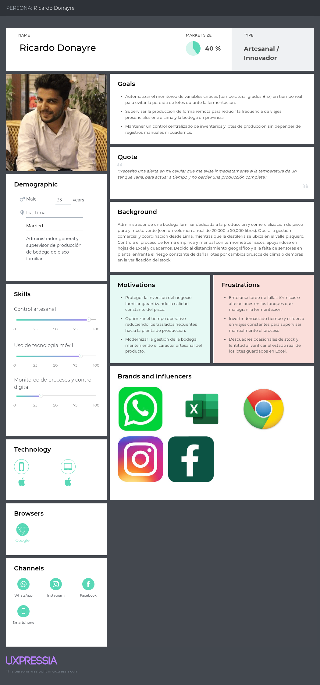

* **Segmento 2: Comercializador**

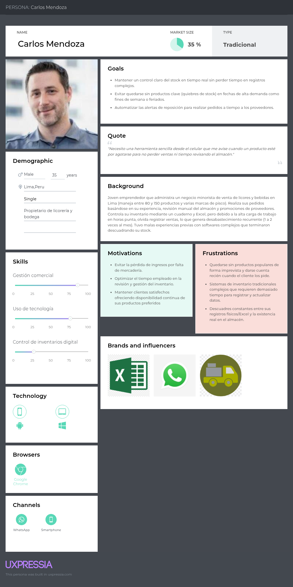

### 2.3.2. User Task Matrix

La User Task Matrix permite visualizar y comparar las tareas que cada segmento objetivo realiza para cumplir sus objetivos, independientemente de la existencia de la solución tecnológica. A continuación, se presentan las tareas identificadas a partir de las entrevistas, junto con su frecuencia e importancia para cada User Persona.

| Tarea | **Productor de pisco** (Frecuencia / Importancia) | **Comercializador** (Frecuencia / Importancia) |
| :--- |:-------------------------------------------------:|:----------------------------------------:|
| **Monitorear variables IoT (Temperatura, pH, Nivel)** |                  Horaria / Alta                   |               N/A / N/A               |
| **Atender alertas críticas de producción / stock** |                    Horaria / Alta                    |              Diaria / Alta               |
| **Consultar Dashboard General de estado del negocio** |                   Diaria / Alta                   |               Diaria / Alta                |
| **Registrar y actualizar lotes de producción** |                   Mensual / Alta                    |              N/A / N/A               |
| **Consultar stock disponible en almacén/tienda** |                   Diaria / Alta                    |               Diaria / Alta                |
| **Registrar entradas y salidas de inventario (Kardex)** |                    Diaria / Alta                    |               Diaria / Alta                |
| **Registrar clientes y pedidos de venta** |                    Diaria / Media                    |               N/A / N/A               |
| **Generar y emitir pedidos de reposición de stock** |                   N/A / N/A                    |              Semanal / Alta               |
| **Revisar estimaciones/predicciones de agotamiento de stock** |                   Semanal / Media                   |               Semanal / Media               |
| **Analizar indicadores históricos de producción y venta** |                    Mensual / Media                    |               Mensual / Media                |
| **Configurar parámetros de alertas y umbrales IoT** |                    Ocasional / Media                    |              N/A / N/A               |
| **Gestionar suscripción y usuarios del sistema** |                    Ocasional / Baja                    |              Ocasional / Baja               |


Tareas de Alta Frecuencia y Alta Prioridad (Núcleo del MVP):

-Para el Productor, el monitoreo en tiempo real de las variables de fermentación/destilación (IoT) y el control de inventario/lotes son operaciones críticas y de alta frecuencia. La plataforma debe garantizar accesibilidad inmediata desde el Dashboard principal a estos módulos.

-Para el Comercializador, la consulta diaria de existencias, el registro de movimientos y la recepción de alertas de bajo stock representan el núcleo de sus interacciones diarias.

Diferenciación de Experiencia por Rol:

-Las tareas relacionadas al seguimiento de variables físicas de producción (temperatura, nivel) y la gestión por lotes son exclusivas del perfil Productor, confirmando la necesidad de vistas y paneles de navegación segmentados (Dashboards específicos).

-El Comercializador centra su interacción en el flujo de reabastecimiento (pedidos de reposición y control rápido de stock), lo cual demanda un flujo UX optimizado para realizar operaciones operativas en pocos clics.

### 2.3.3. User Journey Mapping

Los User Journey Maps representan el recorrido end-to-end que cada User Persona realiza actualmente (situación As-Is) para cumplir con sus objetivos, sin la existencia de la solución Destilatech. Estos mapas permiten identificar los puntos de dolor (pains) y las oportunidades de mejora (gains) que la plataforma debe abordar.


* **Segmento 1: Productor de pisco**

El siguiente Journey Map ilustra el proceso que sigue Ricardo Donayre, productor de pisco, para monitorear el proceso de elaboración de pisco (desde la fermentación hasta el reposo y venta) y gestionar su negocio entre la planta productora y la oficina comercial. El recorrido muestra cómo Ricardo depende de controles manuales e inspecciones empíricas, enfrentando incertidumbre y pérdidas económicas por variaciones térmicas o descuadres en el registro de lotes.

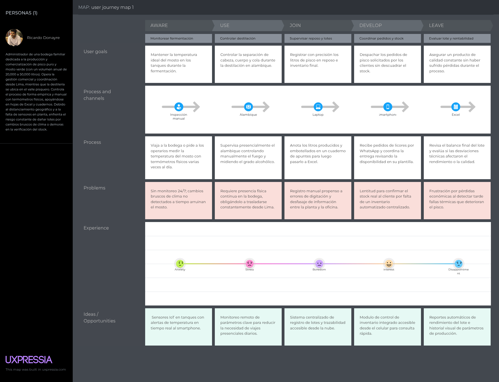

* **Segmento 2: Comercializador**

El siguiente Journey Map ilustra el proceso que sigue Carlos Mendoza, propietario de una licorería y bodega en Lima, para gestionar el stock de sus productos y realizar los pedidos de reposición a sus proveedores. El recorrido muestra cómo Carlos depende de métodos manuales e informales (cuaderno, memoria, Excel) y enfrenta perdidas económicas por quiebres de stock en momentos de alta demanda.

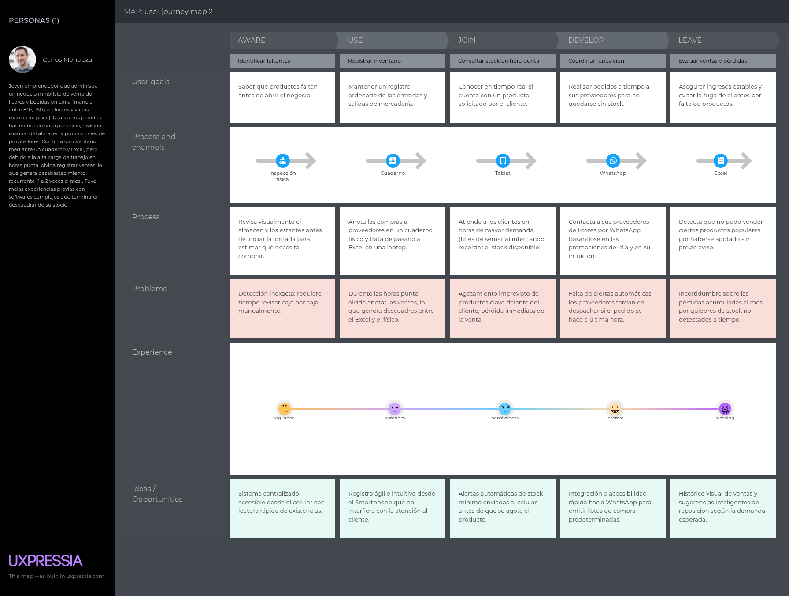

### 2.3.4. Empathy Mapping

Los Empathy Maps permiten profundizar en la comprensión de cada User Persona, explorando lo que piensa, siente, ve, oye, dice y hace en su contexto diario. Estos mapas fueron construidos a partir de las observaciones y hallazgos de las entrevistas, y permiten identificar los principales pains y gains de cada segmento.

* **Segmento 1: Productor de pisco**

El siguiente Mapa de Empatía profundiza en la experiencia de Ricardo Donayre, productor y administrador de una bodega pisquera. Se identifican sus principales pensamientos y sentimientos (preocupación por la calidad del lote, estrés por los viajes constantes), lo que ve en su entorno (tanques de fermentación, registros manuales), lo que oye de su entorno familiar y técnico (temores a perder cosechas, recomendaciones de control), lo que dice y hace (monitoreo presencial, uso de WhatsApp y Excel), así como sus principales pains (pérdidas por fallas térmicas, desfasaje de inventario) y gains (tranquilidad operativa, control remoto y optimización del tiempo).

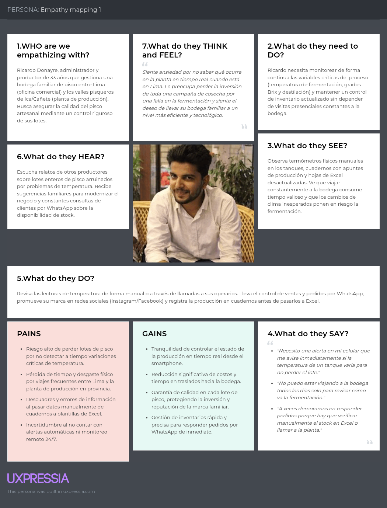

* **Segmento 2: Comercializador**

El siguiente Journey Map ilustra el proceso que sigue Carlos Mendoza, propietario de una licorería y bodega en Lima, para gestionar el stock de sus productos y realizar los pedidos de reposición a sus proveedores. El recorrido muestra cómo Carlos depende de métodos manuales e informales (cuaderno, memoria, Excel) y enfrenta perdidas económicas por quiebres de stock en momentos de alta demanda.

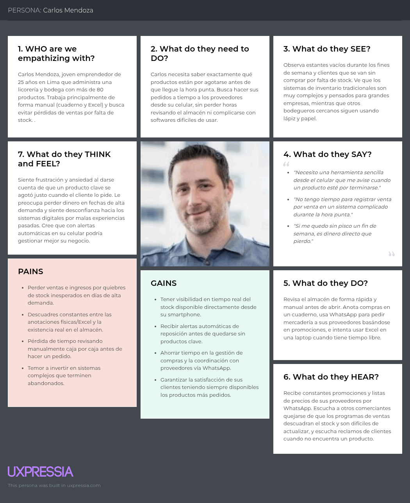

### 2.4. Big Picture EventStorming

Según Qlerify (s.f.), el Big Picture Event Storming constituye una de las variantes del Event Storming, técnica de descubrimiento de dominio orientada a que equipos multidisciplinarios —negocio y tecnología— construyan de forma colaborativa una línea de tiempo de los eventos relevantes de un proceso, utilizando notas adhesivas de colores sobre una superficie compartida. Esta variante fue originalmente propuesta por Alberto Brandolini (2018) como punto de partida de Domain-Driven Design, con el objetivo de explorar dominios de negocio complejos sin quedar limitados por la estructura de un modelo de datos preexistente. Chatuev (2020) señala además que este ejercicio permite identificar de manera temprana el lenguaje ubicuo del dominio y sentar las bases para la posterior delimitación de Bounded Contexts.
 
Para Destilatech, se aplicó esta técnica con el fin de representar de manera visual los dos flujos principales de la plataforma —el del productor de pisco y el del comercializador— identificando los eventos de dominio, los objetos relevantes, los sistemas externos involucrados y los puntos de incertidumbre o fricción del proceso, insumo directo para la posterior definición de los Bounded Contexts del sistema.
 
#### 2.4.1. Metodología aplicada
 
La construcción del tablero siguió la guía de Philippe Bourgau (2022) en su artículo *"Step by Step Guide to run your Big Picture Event Storming"*, adaptando sus pasos al contexto del proyecto: (1) definición del alcance del proceso a explorar (producción y comercialización de pisco), (2) identificación libre y cronológica de los eventos de dominio relevantes para cada flujo, (3) señalización de los puntos donde el equipo tenía dudas o vacíos de información (hotspots), (4) incorporación de los objetos del dominio y los sistemas externos que participan o disparan eventos, y (5) agrupación de los eventos en posibles Bounded Contexts como cierre del ejercicio.
 
Para la notación de colores se consultó adicionalmente el material teórico de Draft.io (s.f.) sobre Event Storming, que describe el uso de notas de distintos colores según el tipo de elemento representado. Con base en ello, para Destilatech se definió la siguiente convención de cuatro categorías.
 
**Big Picture Event Storming — Leyenda**
 
- **Eventos del dominio (naranja):** hechos relevantes que ya ocurrieron en el negocio, redactados como objeto + verbo en participio pasado (p. ej. "Lote de producción registrado").
- **Objetos del dominio (amarillo claro):** entidades o conceptos relevantes del proceso sobre los que ocurren los eventos (p. ej. "Lote de Producción", "Inventario de Productor").
- **Sistemas externos (rosa):** sistemas ajenos a Destilatech que disparan o reciben eventos (p. ej. sensor IoT simulado, pasarela de pago, WhatsApp).
- **Preguntas / hotspots (rojo):** dudas, vacíos de información o puntos de fricción identificados durante el ejercicio, pendientes de profundizar (p. ej. "¿Qué pasarela de pago se integrará para las suscripciones?").
#### 2.4.2. Big Picture Event Storming — Mapa
 
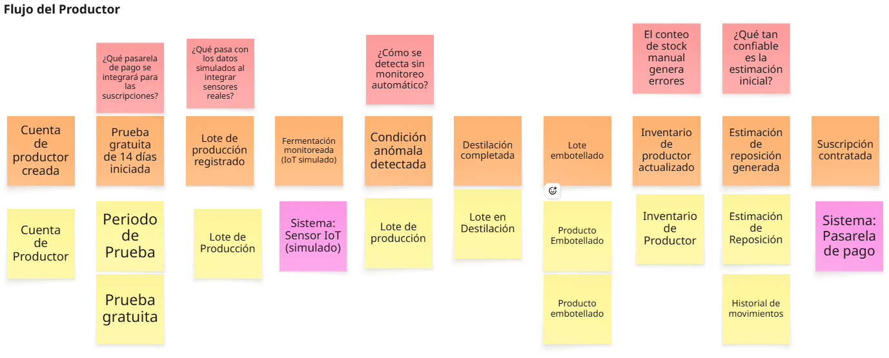

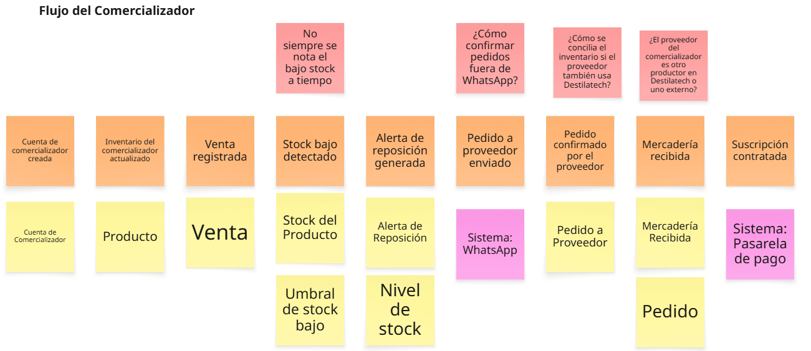

**Interpretación de hallazgos clave**
 
**Interpretación por función de notas.** Las notas naranjas trazan la línea de tiempo de ambos flujos: en el del productor, desde la creación de la cuenta y el inicio del período de prueba hasta el registro del lote, el monitoreo de fermentación, la destilación, el embotellado y la actualización de inventario; en el del comercializador, desde la creación de cuenta hasta el registro de ventas, la actualización de stock y la generación de pedidos a proveedores. Las notas amarillo claro identifican los objetos de dominio que persisten a lo largo del proceso (Lote de Producción, Producto Embotellado, Inventario de Productor, Producto, Stock del Producto, Pedido a Proveedor, entre otros), mientras que las notas rosa evidencian que Destilatech no opera de forma aislada, sino que depende de sistemas externos como el sensor IoT (simulado en el alcance académico), la pasarela de pago para las suscripciones y WhatsApp como canal informal de coordinación de pedidos.
 
**Hallazgos clave del análisis.** Las notas rojas concentraron los principales puntos de incertidumbre del dominio: la ausencia de monitoreo automático dificulta la detección temprana de condiciones anómalas, el conteo manual de stock genera errores en el flujo del comercializador, y persisten dudas sobre la confiabilidad de las estimaciones de reposición generadas por el sistema. Se identificaron también dos fricciones adicionales relevantes para el modelo de negocio: la falta de definición sobre la pasarela de pago a integrar para las suscripciones, y la ausencia de un mecanismo formal de conciliación de inventario cuando un mismo proveedor también utiliza Destilatech, lo que podría derivar en registros duplicados o inconsistentes entre cuentas.
 
**Conclusiones.** El ejercicio de Big Picture Event Storming permitió confirmar que Destilatech no corresponde a un dominio único y monolítico, sino a un ecosistema modular compuesto por seis Bounded Contexts: Identity/Access & Subscriptions, Production & Monitoring, Inventory & Stock Management, Orders & Replenishment, Alerts & Notifications y Analytics & Estimations. Esta separación —surgida directamente de la agrupación natural de eventos, objetos y sistemas externos identificados en el tablero— sienta las bases para el diseño de una arquitectura de software desacoplada, en la que cada contexto podrá evolucionar de forma independiente y facilitar la futura integración con dispositivos IoT reales.

### 2.5. Ubiquitous Language

El siguiente glosario recoge los términos del dominio de negocio de Destilatech (producción, almacenamiento y comercialización de pisco).

| Term | Definición |
| :--- | :--- |
| **Batch** (Lote) | Cantidad específica de pisco producida en conjunto bajo condiciones uniformes, que se rastrea como una unidad trazable desde la recepción de la materia prima hasta el embotellado. |
| **Must** (Mosto) | Jugo de uva obtenido antes de la fermentación, materia prima base del proceso productivo. |
| **Fermentation** (Fermentación) | Proceso bioquímico mediante el cual el mosto se transforma en un líquido alcohólico base, previo a la destilación. |
| **Distillation** (Destilación) | Proceso de separación y concentración del alcohol a partir del fermentado, mediante el cual se obtiene el pisco. |
| **Resting Period** (Reposo) | Periodo posterior a la destilación durante el cual el pisco reposa en recipientes de material neutro antes de su envasado, según el Reglamento de la Denominación de Origen Pisco. |
| **Bottling** (Embotellado) | Proceso de envasado del pisco terminado en botellas listas para su comercialización. |
| **Denomination of Origin** (Denominación de Origen) | Designación oficial que restringe el uso del término "Pisco" al producto elaborado en las zonas peruanas autorizadas, bajo un reglamento específico. |
| **Producer** (Productor) | Segmento principal de usuario: pequeño o mediano negocio que elabora pisco, desde la recepción de uva hasta el embotellado. |
| **Retailer** (Comercializador) | Segmento complementario de usuario: negocio (licorería, bodega, minimarket, distribuidor) que compra pisco y otras bebidas para revenderlas al consumidor final. |
| **Inventory Item** (Ítem de inventario / Existencia) | Producto o presentación específica que se controla dentro del inventario de un productor o comercializador. |
| **Stock Movement** (Movimiento de inventario) | Registro de una entrada o salida de cantidad de un ítem de inventario. |
| **Replenishment** (Reposición) | Acción de reabastecer un ítem de inventario cuando su cantidad disponible cae por debajo de lo necesario. |
| **Low-Stock Alert** (Alerta de stock bajo) | Notificación automática generada cuando el stock de un producto alcanza o cae por debajo del umbral configurado. |
| **Anomaly Alert** (Alerta de anomalía) | Notificación automática generada cuando una variable monitoreada del proceso productivo se sale del rango configurado como normal. |
| **Sensor Reading** (Lectura de sensor) | Valor capturado de una variable de proceso monitoreada, proveniente de un dispositivo IoT (simulado en el MVP). |
| **Trial Period** (Periodo de prueba) | Periodo gratuito de hasta 14 días durante el cual un nuevo cliente puede usar Destilatech antes de requerir una suscripción paga. |
| **Subscription** (Suscripción) | Plan de pago recurrente que un cliente debe contratar para continuar usando Destilatech al finalizar el periodo de prueba. |
| **Order** (Pedido) | Solicitud de productos realizada por un cliente a un productor, o por un comercializador a su proveedor. |
| **Customer** (Cliente) | Parte que adquiere pisco u otro producto de un productor o comercializador. |
| **Supplier** (Proveedor) | Parte a la que un comercializador (o un productor, para insumos) solicita el abastecimiento de un producto. |


## Capítulo III: Requirements Specification

### 3.1. User Stories

En esta sección, profundizaremos en la definición y elaboración de las User Stories relacionadas con nuestro proyecto. Las historias de usuario son una herramienta fundamental en el desarrollo de software ágil, conceptualizadas formalmente bajo los principios propuestos por Cohn (2004), diseñadas para asegurar que las funcionalidades del sistema aporten valor directo a los objetivos del usuario final.

**EPICS**

| Epic ID | Título | Descripción | Criterio de Aceptación |
| :--- | :--- | :--- | :--- |
| EP01 | Autenticación y cuentas | Registro, inicio de sesión y gestión del periodo de prueba gratuito. | Given que un visitante completa el registro con datos válidos, When confirma el formulario, Then el sistema crea la cuenta y activa el periodo de prueba de 14 días.<br>Given que un usuario intenta acceder a una función restringida sin sesión iniciada, When lo intenta, Then el sistema lo redirige a la pantalla de inicio de sesión. |
| EP02 | Dashboard | Vistas principales adaptadas por tipo de usuario. | Given que un usuario autenticado ingresa a la plataforma, When accede a su cuenta, Then el sistema muestra el dashboard correspondiente a su tipo de usuario.<br>Given que un usuario no tiene datos registrados aún, When accede a su dashboard, Then el sistema muestra un estado vacío guiándolo a registrar su primera información. |
| EP03 | Gestión de lotes de producción | Registro y seguimiento de lotes de producción. | Given que un productor gestiona un lote, When lo registra y actualiza su estado, Then el sistema mantiene un historial trazable del lote.<br>Given que un productor consulta un lote existente, When lo selecciona, Then el sistema muestra su historial completo de cambios. |
| EP04 | Monitoreo IoT | Visualización y configuración de variables de proceso (simuladas). | Given que un productor tiene un lote activo con variables configuradas, When se recibe una lectura simulada fuera de rango, Then el sistema genera una alerta de condición anómala.<br>Given que un productor consulta el monitoreo de un lote, When accede al módulo, Then visualiza las lecturas simuladas más recientes. |
| EP05 | Gestión de inventario | Catálogo de productos, movimientos y consulta de stock. | Given que un usuario registra productos y movimientos, When consulta su inventario, Then el sistema refleja el stock actualizado.<br>Given que un movimiento dejaría el stock en negativo, When se intenta registrar, Then el sistema lo rechaza con una advertencia. |
| EP06 | Sistema de alertas | Umbrales de stock y gestión de alertas. | Given que el stock de un producto llega a su umbral mínimo, When se actualiza el inventario, Then el sistema genera una alerta automática de stock bajo.<br>Given que un usuario atiende una alerta, When la marca como resuelta, Then el sistema actualiza su estado. |
| EP07 | Clientes y pedidos | Gestión comercial básica de clientes y pedidos. | Given que un usuario registra un pedido de un cliente, When lo confirma, Then el sistema descuenta el stock correspondiente y lo agrega al historial de pedidos.<br>Given que un pedido excede el stock disponible, When se intenta confirmar, Then el sistema muestra una advertencia antes de continuar. |
| EP08 | Estimaciones y reposición | Analítica predictiva básica sobre inventario y reposición. | Given que un producto cuenta con historial suficiente de movimientos, When un usuario consulta su ficha, Then el sistema muestra una estimación de reposición.<br>Given que un usuario consulta indicadores históricos, When accede al módulo, Then visualiza la evolución de su inventario/producción. |
| EP09 | Landing Page (visitante) | Sitio web estático de Destilatech. | Given que un visitante ingresa al sitio web, When navega por sus secciones, Then encuentra la propuesta de valor, planes, funcionalidades y un call-to-action hacia el registro.<br>Given que un visitante accede desde un dispositivo móvil, When navega el landing page, Then la interfaz se adapta correctamente a su pantalla. |
| EP10 | Technical Stories (RESTful API) | Endpoints necesarios para soportar las features anteriores. | Given que la Web Application requiere autenticar usuarios y gestionar inventario, When consume los endpoints del API, Then recibe respuestas consistentes con los códigos HTTP y datos esperados.<br>Given que se envía una lectura IoT simulada fuera de rango, When el API la procesa, Then almacena la lectura y genera la alerta correspondiente. |


**USER STORIES**


| Epic/Story ID | Título | Descripción | Criterios de Aceptación | Relacionado con (Epic ID) |
| :--- | :--- | :--- | :--- | :--- |
| US01 | Registrarme como productor o comercializador | Como visitante quiero registrar una cuenta indicando mi tipo de negocio para comenzar mi periodo de prueba gratuito. | Given que soy un visitante no registrado, When completo el formulario con datos válidos y selecciono mi tipo de negocio, Then el sistema crea mi cuenta y activa un periodo de prueba de 14 días.<br>Given que el correo ya está en uso, When envío el formulario, Then el sistema muestra un error y no crea una cuenta duplicada. | EP01 |
| US02 | Iniciar sesión | Como usuario registrado quiero iniciar sesión para acceder a las funcionalidades de mi tipo de usuario. | Given que tengo una cuenta activa, When ingreso credenciales correctas, Then el sistema me redirige al dashboard de mi tipo de usuario.<br>Given que ingreso una contraseña incorrecta, When intento iniciar sesión, Then el sistema muestra un error sin indicar el dato incorrecto. | EP01 |
| US03 | Recibir aviso de fin de periodo de prueba | Como usuario en prueba quiero recibir un aviso antes de que finalice mi periodo gratuito para decidir si me suscribo. | Given que mi prueba finaliza en 3 días, When inicio sesión, Then el sistema muestra un aviso con los días restantes y la opción de suscribirme.<br>Given que mi prueba finalizó sin suscripción, When intento acceder a una función restringida, Then el sistema me redirige a los planes de suscripción. | EP01 |
| US04 | Ver dashboard de producción | Como productor quiero ver un dashboard con el estado general de mi producción e inventario. | Given que soy productor autenticado, When accedo al dashboard, Then visualizo lotes activos, alertas pendientes y niveles de inventario.<br>Given que no tengo lotes ni inventario, When accedo al dashboard, Then el sistema muestra un estado vacío con guía para mi primer lote. | EP02 |
| US05 | Ver dashboard comercial | Como comercializador quiero ver un dashboard con el estado de mi inventario y pedidos. | Given que soy comercializador autenticado, When accedo al dashboard, Then visualizo productos con stock bajo, alertas pendientes y pedidos recientes. | EP02 |
| US06 | Registrar lote de producción | Como productor quiero registrar un nuevo lote para llevar un historial organizado de mis procesos. | Given que soy productor autenticado, When registro un lote con fecha, producto y cantidad estimada, Then el sistema lo guarda y lo muestra en mis lotes activos.<br>Given que no indico la fecha de inicio, When envío el formulario, Then el sistema muestra un error y no guarda el lote. | EP03 |
| US07 | Actualizar estado de un lote | Como productor quiero actualizar el estado de un lote para reflejar el avance real del proceso. | Given que tengo un lote registrado, When actualizo su estado a la siguiente etapa, Then el sistema registra la fecha del cambio y actualiza su historial. | EP03 |
| US08 | Consultar historial de un lote | Como productor quiero consultar el historial completo de un lote para revisar su trazabilidad. | Given que tengo lotes registrados, When selecciono un lote, Then el sistema muestra todos sus cambios de estado y variables monitoreadas. | EP03 |
| US09 | Visualizar variables de proceso | Como productor quiero visualizar las variables de un lote (simuladas) para supervisar el proceso a distancia. | Given que tengo un lote en fermentación/destilación, When accedo al monitoreo, Then visualizo las lecturas simuladas más recientes de ese lote. | EP04 |
| US10 | Configurar rango normal de una variable | Como productor quiero definir el rango normal de una variable para que el sistema detecte anomalías automáticamente. | Given que tengo un lote activo, When configuro un rango mínimo y máximo, Then el sistema guarda la configuración y la aplica a las siguientes lecturas. | EP04 |
| US11 | Recibir notificación de condición anómala | Como productor quiero ser notificado cuando una variable salga del rango normal para actuar a tiempo. | Given que configuré un rango normal, When una lectura simulada lo excede, Then el sistema genera una alerta visible en el dashboard y en el módulo de alertas. | EP04 |
| US12 | Registrar producto | Como productor o comercializador quiero registrar mis productos para tener un catálogo organizado. | Given que soy usuario autenticado, When registro un producto con nombre, presentación y unidad, Then el sistema lo agrega a mi catálogo. | EP05 |
| US13 | Registrar movimiento de inventario | Como productor o comercializador quiero registrar entradas/salidas de un producto para mantener mi stock actualizado. | Given que tengo un producto registrado, When registro un movimiento con una cantidad, Then el sistema actualiza el stock disponible.<br>Given que la salida es mayor al stock disponible, When envío el movimiento, Then el sistema muestra una advertencia antes de confirmar. | EP05 |
| US14 | Consultar stock disponible | Como productor o comercializador quiero consultar el stock disponible sin revisar físicamente el almacén. | Given que tengo productos con movimientos registrados, When accedo al inventario, Then visualizo el stock actual ordenado por nivel de existencias. | EP05 |
| US15 | Configurar umbral de stock bajo | Como productor o comercializador quiero definir un umbral mínimo por producto para recibir alertas antes de quedarme sin stock. | Given que tengo un producto registrado, When configuro un umbral mínimo, Then el sistema genera una alerta automática cuando el stock llegue o caiga por debajo de ese umbral. | EP06 |
| US16 | Visualizar y atender alertas | Como usuario quiero visualizar mis alertas pendientes y marcarlas como atendidas. | Given que tengo alertas generadas, When accedo al módulo de alertas, Then visualizo la lista ordenada por fecha, pendientes y atendidas.<br>Given que reviso una alerta pendiente, When la marco como atendida, Then el sistema actualiza su estado. | EP06 |
| US17 | Registrar cliente | Como productor o comercializador quiero registrar información básica de mis clientes. | Given que soy usuario autenticado, When registro un cliente con nombre y contacto, Then el sistema lo agrega a mi lista de clientes. | EP07 |
| US18 | Registrar pedido | Como productor o comercializador quiero registrar un pedido de un cliente para llevar control de mis ventas. | Given que tengo clientes y productos registrados, When registro un pedido con cliente, productos y cantidades, Then el sistema lo guarda y descuenta el stock correspondiente.<br>Given que el pedido excede el stock disponible, When intento confirmarlo, Then el sistema muestra una advertencia antes de continuar. | EP07 |
| US19 | Consultar historial de pedidos | Como productor o comercializador quiero consultar mis pedidos anteriores. | Given que tengo pedidos registrados, When accedo al módulo de pedidos, Then visualizo la lista con fecha, cliente, productos y estado. | EP07 |
| US20 | Ver estimación de reposición | Como productor o comercializador quiero ver una estimación de cuándo reponer un producto según mi historial. | Given que un producto tiene historial suficiente, When accedo a su ficha, Then el sistema muestra una estimación de fecha o cantidad de reposición.<br>Given que no tiene historial suficiente, When accedo a su ficha, Then el sistema indica que aún no hay datos suficientes. | EP08 |
| US21 | Ver indicadores históricos | Como productor o comercializador quiero visualizar indicadores históricos de inventario/producción. | Given que tengo historial registrado, When accedo a indicadores, Then visualizo gráficos de evolución en el periodo seleccionado. | EP08 |
| US22 | Conocer la propuesta de valor | Como visitante quiero conocer qué ofrece Destilatech para decidir si me interesa registrarme. | Given que soy visitante, When ingreso a la página de inicio, Then visualizo la propuesta de valor y las capacidades principales. | EP09 |
| US23 | Conocer planes y periodo de prueba | Como visitante quiero conocer los planes y el trial gratuito antes de registrarme. | Given que soy visitante, When accedo a la sección de planes, Then visualizo los planes, precios y duración del periodo de prueba. | EP09 |
| US24 | Registrarme desde la landing page | Como visitante productor o comercializador quiero acceder al registro desde la página de inicio. | Given que soy visitante, When hago clic en el call-to-action principal, Then el sistema me redirige al formulario de registro. | EP09 |
| US25 | Conocer casos de uso por segmento | Como visitante de un segmento quiero ver contenido específico sobre cómo Destilatech resuelve mis necesidades. | Given que soy visitante, When navego a la sección de productores, Then visualizo contenido sobre monitoreo IoT, lotes e inventario.<br>Given que soy visitante, When navego a la sección de comercializadores, Then visualizo contenido sobre inventario, pedidos y alertas de reposición. | EP09 |
| US26 | Endpoint de autenticación | Como Developer quiero un endpoint de autenticación que devuelva un token para que la Web Application autentique usuarios. | Given un POST /auth/login con credenciales válidas, When el servicio las valida, Then responde 200 con un token y datos básicos del usuario.<br>Given credenciales inválidas, When el servicio las valida, Then responde 401 sin indicar el dato incorrecto. | EP10 |
| US27 | Endpoint de movimientos de inventario | Como Developer quiero un endpoint que registre movimientos de inventario de forma consistente. | Given un POST /inventory/movements válido, When el servicio lo procesa, Then responde 201 con el movimiento y el nuevo stock.<br>Given un movimiento que deja el stock negativo, When el servicio lo valida, Then responde 409 y no lo aplica. | EP10 |
| US28 | Endpoint de lecturas IoT simuladas | Como Developer quiero un endpoint que reciba lecturas simuladas y las evalúe contra los rangos configurados. | Given un POST /batches/{id}/readings dentro de rango, When se procesa, Then responde 201 y almacena la lectura sin alerta.<br>Given una lectura fuera de rango, When se procesa, Then responde 201, la almacena y genera una alerta asociada al lote. | EP10 |
| US29 | Endpoint de estimaciones de reposición | Como Developer quiero un endpoint que devuelva la estimación de reposición de un producto. | Given un GET /products/{id}/replenishment-estimate con historial suficiente, When se calcula, Then responde 200 con la estimación.<br>Given historial insuficiente, When se evalúa, Then responde 200 indicando que no hay datos suficientes. | EP10 |
| US30 | Implementación de la sección del Header | Como Developer quiero implementar la sección Header del landing page para que los visitantes identifiquen la marca y naveguen entre las secciones principales. | Given que un visitante carga el landing page, When la página termina de renderizar, Then el Header muestra el logo de Destilatech y los enlaces de navegación a las secciones principales.<br>Given que un visitante hace clic en un enlace del Header, When la página se desplaza, Then es llevado a la sección correspondiente sin recargar la página. | EP09 |
| US31 | Implementación de la sección Description | Como Developer quiero implementar la sección Description para que los visitantes entiendan qué es Destilatech y a quién está dirigido. | Given que un visitante llega a la sección Description, When la visualiza, Then encuentra el nombre del producto, su propuesta de valor y los segmentos objetivo (productor y comercializador). | EP09 |
| US32 | Implementación de la sección Goals | Como Developer quiero implementar la sección Goals para comunicar los principales beneficios que ofrece Destilatech. | Given que un visitante llega a la sección Goals, When la visualiza, Then encuentra los beneficios principales de la plataforma (monitoreo, inventario, alertas, estimaciones) presentados de forma clara. | EP09 |
| US33 | Implementación de la sección Pricing | Como Developer quiero implementar la sección Pricing para que los visitantes conozcan los planes de suscripción y el periodo de prueba gratuito. | Given que un visitante llega a la sección Pricing, When la visualiza, Then encuentra los planes disponibles, sus precios y la duración del periodo de prueba gratuito.<br>Given que un visitante selecciona un plan, When hace clic en su call-to-action, Then es redirigido al formulario de registro con el plan preseleccionado. | EP09 |
| US34 | Implementación de la sección Impact | Como Developer quiero implementar la sección Impact para mostrar cifras que respalden la relevancia de Destilatech en el sector pisquero. | Given que un visitante llega a la sección Impact, When la visualiza, Then encuentra cifras del sector pisquero peruano (empresas formales, producción anual) que respaldan la propuesta. | EP09 |
| US35 | Implementación de la sección Platform Features | Como Developer quiero implementar la sección Platform Features para mostrar las capacidades de la plataforma diferenciadas por segmento. | Given que un visitante llega a la sección Platform Features, When la visualiza, Then encuentra las funcionalidades principales agrupadas para productor y para comercializador. | EP09 |
| US36 | Implementación de la sección del Footer | Como Developer quiero implementar la sección Footer para que los visitantes encuentren información de contacto y enlaces adicionales. | Given que un visitante llega al final del landing page, When visualiza el Footer, Then encuentra información de contacto, enlaces legales/redes sociales y el call-to-action de registro. | EP09 |
| US37 | Implementación de la adaptabilidad móvil | Como Developer quiero implementar la adaptabilidad móvil del landing page para que la experiencia sea consistente en distintos tamaños de pantalla. | Given que un visitante accede al landing page desde un smartphone, When la página carga, Then todas las secciones se adaptan correctamente sin elementos cortados o desbordados.<br>Given que un visitante accede desde una tablet o desktop, When la página carga, Then el diseño aprovecha el espacio disponible manteniendo la misma jerarquía de contenido. | EP09 |


### 3.2. Impact Mapping

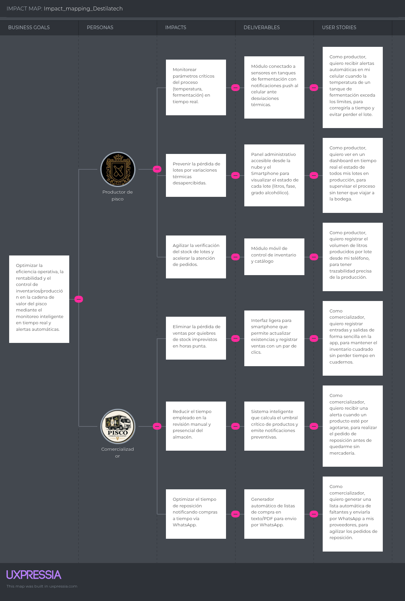

### 3.3. Product Backlog

| # Orden | User Story ID | Título | Descripción | Story Points |
| :---: | :--- | :--- | :--- | :---: |
| 1 | US30 | Implementación de la sección del Header | Header con navegación del landing page. | 2 |
| 2 | US31 | Implementación de la sección Description | Sección de propuesta de valor. | 2 |
| 3 | US32 | Implementación de la sección Goals | Sección de beneficios principales. | 2 |
| 4 | US33 | Implementación de la sección Pricing | Sección de planes y trial gratuito. | 3 |
| 5 | US34 | Implementación de la sección Impact | Sección de cifras del sector pisquero. | 2 |
| 6 | US35 | Implementación de la sección Platform Features | Sección de funcionalidades por segmento. | 3 |
| 7 | US36 | Implementación de la sección del Footer | Footer con contacto y enlaces. | 1 |
| 8 | US37 | Implementación de la adaptabilidad móvil | Responsividad de todas las secciones del landing page. | 3 |
| 9 | US22 | Conocer la propuesta de valor | Contenido de la sección principal del landing page. | 2 |
| 10 | US23 | Conocer planes y periodo de prueba | Contenido de planes y trial gratuito. | 2 |
| 11 | US25 | Conocer casos de uso por segmento | Contenido diferenciado por segmento. | 3 |
| 12 | US24 | Registrarme desde la landing page | Call-to-action hacia el registro. | 1 |
| 13 | US01 | Registrarme como productor o comercializador | Registro de cuenta con periodo de prueba. | 3 |
| 14 | US26 | Endpoint de autenticación | API: login con emisión de token. | 3 |
| 15 | US02 | Iniciar sesión | Login de usuario registrado. | 2 |
| 16 | US04 | Ver dashboard de producción | Dashboard adaptado al productor. | 5 |
| 17 | US05 | Ver dashboard comercial | Dashboard adaptado al comercializador. | 5 |
| 18 | US12 | Registrar producto | Catálogo de productos. | 2 |
| 19 | US27 | Endpoint de movimientos de inventario | API: registro consistente de movimientos de stock. | 3 |
| 20 | US13 | Registrar movimiento de inventario | Entradas/salidas de stock. | 3 |
| 21 | US14 | Consultar stock disponible | Vista de stock actual por producto. | 2 |
| 22 | US06 | Registrar lote de producción | Alta de un nuevo lote. | 3 |
| 23 | US15 | Configurar umbral de stock bajo | Umbral mínimo por producto. | 2 |
| 24 | US16 | Visualizar y atender alertas | Módulo de alertas. | 3 |
| 25 | US07 | Actualizar estado de un lote | Seguimiento del avance del lote. | 2 |
| 26 | US17 | Registrar cliente | Alta de clientes. | 2 |
| 27 | US18 | Registrar pedido | Registro de pedido con descuento de stock. | 5 |
| 28 | US08 | Consultar historial de un lote | Trazabilidad de un lote. | 2 |
| 29 | US19 | Consultar historial de pedidos | Listado de pedidos anteriores. | 2 |
| 30 | US28 | Endpoint de lecturas IoT simuladas | API: ingestión y evaluación de lecturas. | 3 |
| 31 | US09 | Visualizar variables de proceso | Monitoreo IoT en el lote. | 5 |
| 32 | US10 | Configurar rango normal de una variable | Umbrales de variables de proceso. | 3 |
| 33 | US11 | Recibir notificación de condición anómala | Alerta de anomalía en producción. | 3 |
| 34 | US29 | Endpoint de estimaciones de reposición | API: cálculo de estimación de reposición. | 3 |
| 35 | US20 | Ver estimación de reposición | Estimación en la ficha de inventario. | 5 |
| 36 | US21 | Ver indicadores históricos | Gráficos de evolución de inventario/producción. | 5 |
| 37 | US03 | Recibir aviso de fin de periodo de prueba | Aviso previo al fin del trial. | 2 |

## Capítulo IV: Product Design

### 4.1. Style Guidelines

Un Style Guideline es un conjunto de directrices y normas que establecen los estándares y criterios a seguir en la redacción, diseño y presentación de documentos, contenido web, software y otros productos creativos. A continuación, se presentan las especificaciones detalladas de los parámetros implementados en la estructura de Destilatech.

#### 4.1.1. General Style Guidelines

**Branding**

Para el desarrollo del logotipo e identidad visual de Destilatech, hemos elegido un diseño que encapsula la esencia del ecosistema del pisco peruano y su modernización tecnológica. El logotipo presenta una tipografía sólida, elegante y legible. El ícono combina la silueta de un alambique/copa de destilado tradicional con un acento circular luminoso que simboliza la precisión del monitoreo digital en tiempo real. La elección de colores —encabezada por el color cobre/terracota profundo (Deep Copper), acentos cálidos ambarinos (Amber Gold) y fondos cremas/cálidos (Cask Cream)— transmite la tradición artesanal del pisco respaldada por la estabilidad técnica, la trazabilidad y la eficiencia analítica del modelo SaaS.


**Typography**

Para el diseño tipográfico de Destilatech, se ha seleccionado una combinación de fuentes de la biblioteca de Google Fonts (Poppins e Inter) que refleja elegancia, claridad y funcionalidad tecnológica, garantizando máxima legibilidad tanto en pantallas de computadora como en dispositivos móviles utilizados en bodegas y puntos de venta. La tipografía principal para encabezados es Poppins, elegida por sus formas geométricas limpias y estructura sólida. Para los textos de párrafo, tablas e indicadores de sensores/inventario, se utiliza Inter, una fuente optimizada para pantallas digitales que favorece una lectura fluida e intuitiva de métricas y datos operativos.

A continuación, se detallan las especificaciones tipográficas adoptadas para Destilatech:

| Elemento | TextColor | Background | Font | Weight | Size | Line Height | Alignment |
| :--- | :--- | :--- | :--- | :--- | :--- | :--- | :--- |
| **H1** | #5c2b21 | none | Montserrat (bold, clean, professional) | Bold | 48 px | 1.2 | Left |
| **H2** | #5c2b21 | none | Montserrat (semi-bold) | Semi-bold | 36 px | 1.3 | Left |
| **H3** | #5c2b21 | none | Montserrat (medium-bold) | Semi-bold | 24 px | 1.4 | Left |
| **H4** | #7a3b2e | none | Montserrat (medium) | Medium | 20 px | 1.4 | Left |
| **Paragraph** | #2c2320 | none | Roboto (regular, legible, data-focused) | Regular | 16 px | 1.5 | Left |
| **Small Text** | #6b5d55 | none | Roboto (light) | Light | 12 px | 1.5 | Left |

**Colors**

La paleta de colores de Destilatech fue seleccionada para evocar el proceso de maduración y destilación artesanal del pisco, complementada con tonos de alerta e interfaz que garantizan usabilidad y prevención en el control de stock. Los tonos tierra y terracota dominantes transmiten tradición, mientras que los acentos amarillos y verdes aportan modernidad y resaltan los estados del sistema.

A continuación, se detallan los colores seleccionados para Destilatech:

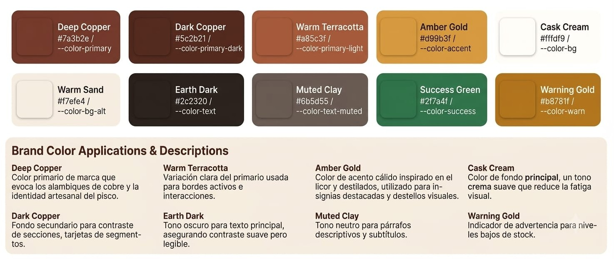

**Spacing**

El espaciado en Destilatech está definido para garantizar una interfaz organizada, limpia y altamente táctil en dispositivos móviles. Se emplean variables y escalas estandarizadas que mejoran la legibilidad de métricas de lotes e inventario:

| Token | Valor | Caso de uso principal |
| :--- | :--- | :--- |
| **Spacing 01** | `8 px` | Botones compactos, badges e íconos pequeños. |
| **Spacing 02** | `16 px` | Cards pequeñas, menús de navegación y separación ícono-texto. |
| **Spacing 03** | `24 px` | Cards de planes, contenedores e ítems de grids. |
| **Spacing 04** | `36 px` | Bloques de contenido, columnas y títulos de sección. |
| **Spacing 05** | `64 px - 88 px` | Padding vertical para secciones completas de la página. |

---

#### 4.1.2. Web Style Guidelines

Destilatech cuenta con un diseño web adaptativo (Responsive Web Design) que garantiza una experiencia fluida tanto en computadoras de escritorio (oficinas administrativas) como en dispositivos móviles (operarios en bodega o comerciales en punto de venta).

En la versión desktop, la Landing Page implementa una estructura en Z que guía la mirada del visitante desde la propuesta de valor en el Hero (H1 y resumen de plataforma) hacia los indicadores en tiempo real de temperatura de tanques y stock de botellas.
El logotipo institucional (Destilatech) se posiciona fijado en la esquina superior izquierda. La barra de navegación superior permite desplazamientos suaves (smooth scroll) hacia secciones clave (Descripción, Objetivos, Precios, Impacto, Funcionalidades), seguida por el selector de idioma en tiempo real (ES / EN) y el Botón de Acción Principal (CTA) "Prueba gratis 14 días" ubicado estratégicamente a la derecha.
En pantallas menores a 768px, la navegación principal colapsa de forma intuitiva en un menú desplegable de tipo "hamburguesa" con soporte para gestos y teclado, manteniendo el CTA al alcance del pulgar.

### 4.2. Information Architecture

#### 4.2.1. Organization Systems

1. ***Visual Organization***

Para facilitar la asimilación visual y reducir la carga cognitiva del usuario, Destilatech aplica los siguientes modelos de organización visual en las distintas secciones de la plataforma:


-Se aplica en el Hero Section y se extiende al Dashboard de Monitoreo (US01 - Monitoreo IoT). En el panel de control del productor, la información más crítica (como alertas rojas/amarillas de "Temperatura Fuera de Rango" en tanques de fermentación o el estado crítico de "Reponer pronto" en Pisco Quebranta) tiene el mayor peso visual, ubicándose en tarjetas destacadas superiormente con colores de advertencia (color-warn) y tipografía Poppins Bold. La información secundaria (como configuraciones de usuario) mantiene un peso menor.

-Se emplea en los flujos que requieren alta precisión para evitar errores en el trabajo diario. Esto aplica al flujo de Registro de Usuario con prueba gratuita de 14 días (US02), la Configuración de un Nuevo Lote de Destilación (US04) y el Registro de Movimiento de Inventario de Insumos (US06). La interfaz guía al usuario mediante componentes paso a paso (ej. Paso 1: Selección de Tipo de Uva -> Paso 2: Lectura inicial de Mosto -> Paso 3: Asignación de Tanque/Alambique).

-Se utiliza para cruzar datos de producción y comercialización en tiempo real. Su principal aplicación se da en el Panel de Trazabilidad de Lotes (US08) y el Control de Stock de Comercializadores (US10), donde el usuario visualiza tablas matriciales cruzando filas (Lote/Botella de Pisco) con columnas (Fecha de destilación, Graduación alcohólica, Stock actual, Alerta de reposición).

#### 4.2.2. Labeling Systems

La plataforma aplica un sistema de etiquetado claro, coherente y adaptado a los dos perfiles principales del ecosistema del pisco: Bodegas Productoras y Comercializadores/Distribuidores.


- ***Para el visitante / usuario nuevo (Landing Page):*** Se utilizan llamadas a la acción claras e inequívocas como "Prueba gratis 14 días", "Ver funcionalidades" y etiquetas de entrada de datos sencillas para los formularios de registro ("Nombre", "Nombre de la Bodega / Empresa", "Correo electrónico").


- ***Para el Productor de Pisco (Perfil Técnico/Operativo):*** Se emplean etiquetas técnicas estandarizadas para la industria vitivinícola y destilería. Las métricas se etiquetan con sus unidades de medida explícitas: "Temperatura (°C)", "Brix del mosto (°Bx)", "Volumen en Tanque (L)" y "Trazabilidad de Lote ID". Los botones de acción rápida responden a acciones directas: "Registrar Destilación", "Agregar Tanque", "Exportar Trazabilidad".


- ***Para el Comercializador / Distribuidor (Perfil Comercial):*** Las etiquetas adoptan un enfoque orientado al flujo de caja y gestión de stock. Se muestran etiquetas centradas en negocio como "Unidades Disponibles (uds.)", "Punto de Reorden", "Alertas de Stock Bajo" y botones de acción rápida como "Registrar Entrada/Salida", "Solicitar Reposición a Proveedor" y "Ver Análisis Predictivo".

#### 4.2.3. SEO Tags and Meta Tags

Los SEO tags son etiquetas HTML que ayudan a los motores de búsqueda a entender y posicionar en los resultados. Los meta tags son etiquetas que proporcionan información sobre la página, como su descripción, palabras clave y autor, lo cual ayuda al ser buscado en el navegador. A continuación se presentan los SEO tags y meta tags que se utilizarán en la plataforma Destilatech:

***Title Tag:*** Este tag define el título de la página y es uno de los factores más importantes para el SEO. Debe ser único y contener palabras clave relevantes.

```html
<title>Destilatech - Software SaaS e IoT para Control de Producción e Inventario de Pisco</title>
```

***Meta Description:*** Este tag proporciona una breve descripción del contenido de la página. Permite a los usuarios entender de qué trata la página antes de hacer clic en el enlace. Debe ser conciso y atractivo.

```html
<meta name="description" content="Destilatech es la plataforma SaaS que optimiza la producción de pisco mediante monitoreo IoT en tanques de fermentación, trazabilidad de lotes y control de inventario en tiempo real.">```
```

***Language tag:*** Este tag indica el idioma principal del contenido de la página. Es importante para la accesibilidad y el SEO local.

```html
<meta http-equiv="Content-Language" content="es-PE">
```

***Robots tag:*** Este tag indica a los motores de búsqueda cómo deben indexar la página. Puede ser utilizado para evitar que ciertas páginas sean indexadas (por ejemplo, el dashboard interno de producción).
```html
<meta name="robots" content="index, follow">
```

***Author tag:*** Este tag indica el autor del contenido de la página. Es útil para dar crédito a los creadores de contenido.

```html
<meta name="author" content="Destilatech Engineering Team">
```

***Meta Viewport:*** Este tag es esencial para que la página sea responsiva en dispositivos móviles (vital para operarios en la bodega o vendedores en punto de venta). Mejora la experiencia del usuario y es un factor importante para el SEO técnico.

```html
<meta name="viewport" content="width=device-width, initial-scale=1.0">
```

***Canonical Tag:*** Este tag especifica la URL canónica de la página para evitar problemas de contenido duplicado en motores de búsqueda. Ayuda a consolidar el posicionamiento de una sola versión de la página.

```html
<link rel="canonical" href="https://www.destilatech.com/">
```

#### 4.2.4. Searching Systems

Para encontrar ciertas funcionalidades de nuestra aplicación, usamos varios botones y empleamos varios indicadores visuales para que el usuario sepa dónde encontrar lo que necesita. A continuación se muestran los ejemplos de los tipos de búsqueda que usaremos:

- ***Búsqueda de tanques y sensores:*** Para facilitar el monitoreo en bodegas y áreas de fermentación, usamos una serie de filtros y un selector desplegable para que el productor pueda hallar exactamente el tanque de fermentación o el sensor IoT individual (ID) del cual desea ver los datos en tiempo real.


- ***Búsqueda en histórico de lotes:*** Usamos filtros por rango de fechas, tipo de uva/pisco (Quebranta, Italia, Acholado, Torontel, etc.) y parámetro (Temperatura, Brix o Graduación alcohólica) para que el maestro destilador pueda graficar las tendencias de fermentación y garantizar la consistencia en el perfil del pisco.


- ***Búsqueda de inventario y pedidos:*** Para los comercializadores y distribuidores, se les da una forma de buscar rápidamente el stock disponible por bodega proveedora, SKU de botella o lote específico, permitiéndoles acceder ágilmente al estado de reorden y a la exportación de reportes de existencias.

#### 4.2.5. Navigation Systems

- ***Registro e Inicio de Sesión:*** Para poder entrar, el usuario ingresará sus credenciales y el sistema registrará qué tipo de usuario es: Bodega Productora, que busca monitorear la fermentación/destilación de sus lotes y garantizar trazabilidad, o Comercializador / Distribuidor, que requiere visualizar niveles de stock, controlar alertas de reposición y gestionar pedidos de ventas.


- ***Dashboard de Monitoreo:*** Permite a los usuarios visualizar los indicadores clave de los tanques en tiempo real (temperatura y densidad), ver el estado actual del inventario de botellas e insumos, y acceder rápidamente a notificaciones y alertas predictivas de variaciones térmicas o quiebres de stock.


- ***Trazabilidad y Lotes:*** Permite a los productores navegar por el ciclo de vida de cada lote de pisco (desde la recepción de la uva hasta el embotellado final), permitiendo auditar parámetros técnicos y generar reportes de calidad.


- ***Gestión de Dispositivos e Inventario:*** Una sección dedicada donde el productor puede vincular nuevos sensores IoT físicamente instalados en sus tanques y configurar umbrales de alerta personalizados, mientras que el comercializador puede registrar entradas/salidas de cajas y botellas.


- ***Mi Perfil:*** Permite a los usuarios configurar sus preferencias personales, actualizar la información comercial de su bodega o distribuidora, gestionar los roles de su equipo y cambiar su contraseña.

### 4.3. Landing Page UI Design

El diseño de la interfaz de usuario en la landing page de Destilatech será clave para causar una primera impresión positiva y transmitir la innovación tecnológica que respalda a nuestro equipo. Buscamos ofrecer una experiencia visual limpia, elegante y altamente funcional que inspire confianza e invite a los productores de pisco, dueños de bodegas y comercializadores a iniciar su prueba gratuita de 14 días y explorar nuestro ecosistema de monitoreo IoT y gestión de inventarios.

#### 4.3.1. Landing Page Wireframe

**Landing Page para Desktop Browser**

Boceto estructural de la sección principal (Hero Section), definiendo un diseño de dos columnas para ubicar la propuesta de valor a la izquierda y un elemento visual destacado a la derecha con tarjetas flotantes informativas de tanques de fermentación y stock.

<p align="center">
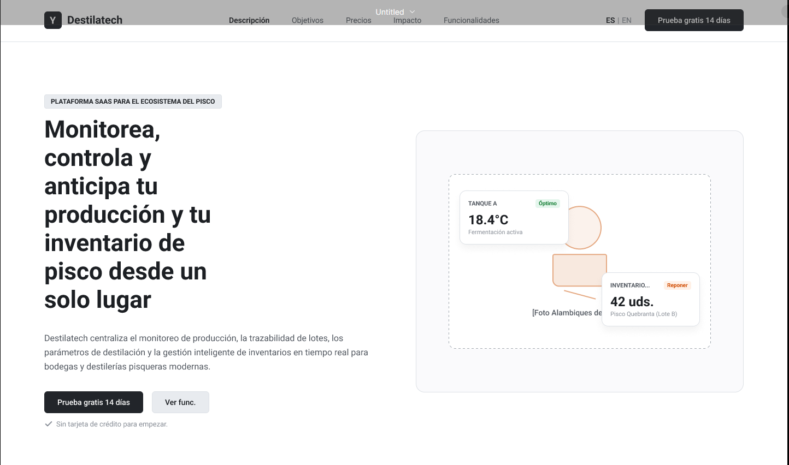
</p>

Utilizando tarjetas de dos columnas para diferenciar bodegas productoras y comercializadores, seguido de una cuadrícula de cuatro columnas para los pilares u objetivos operativos de la plataforma.


<p align="center">
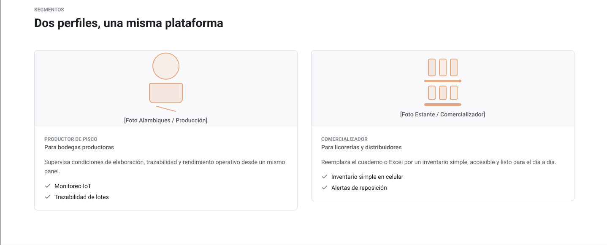
</p>
<p align="center">
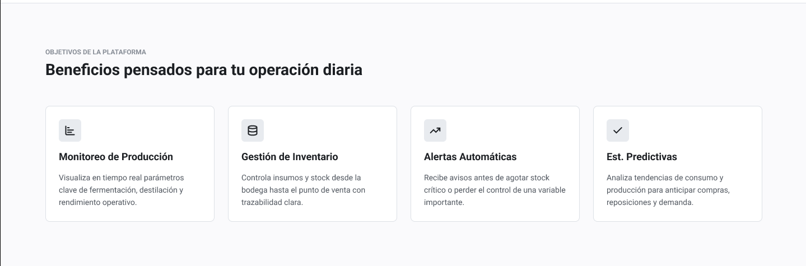
</p>

Define una cuadrícula adaptable (responsive grid) de tres columnas para los planes de suscripción (Básico, Profesional y Empresarial) y un bloque de dos columnas para las estadísticas del impacto en el sector pisco.


<p align="center">
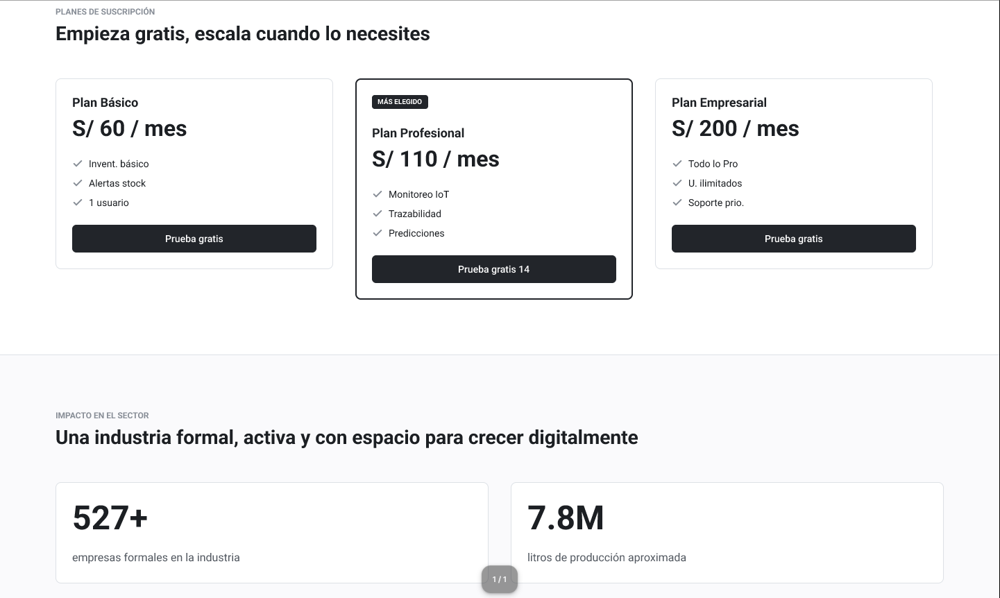
</p>

Esquema de pestañas interactivas para filtrar funcionalidades por perfil (Productor / Comercializador), un bloque centralizado para el llamado a la acción final y un pie de página estructurado en múltiples columnas para navegación, enlaces legales y contacto.


<p align="center">
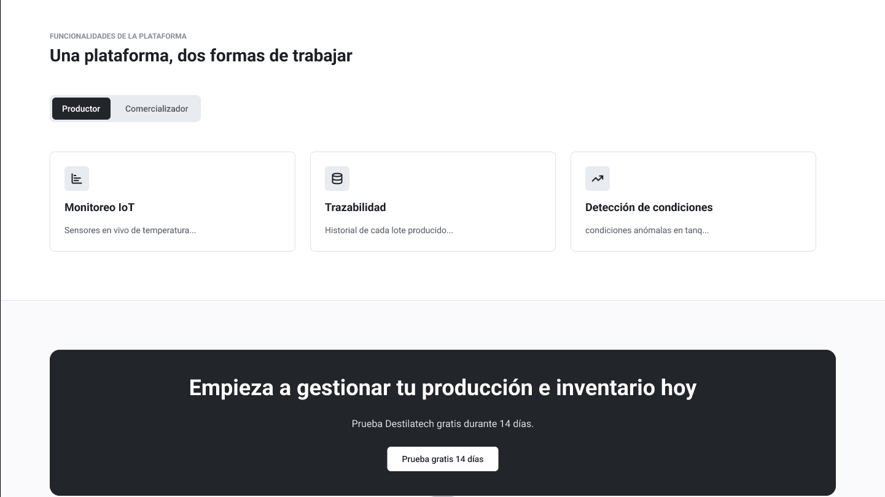
</p>
<p align="center">
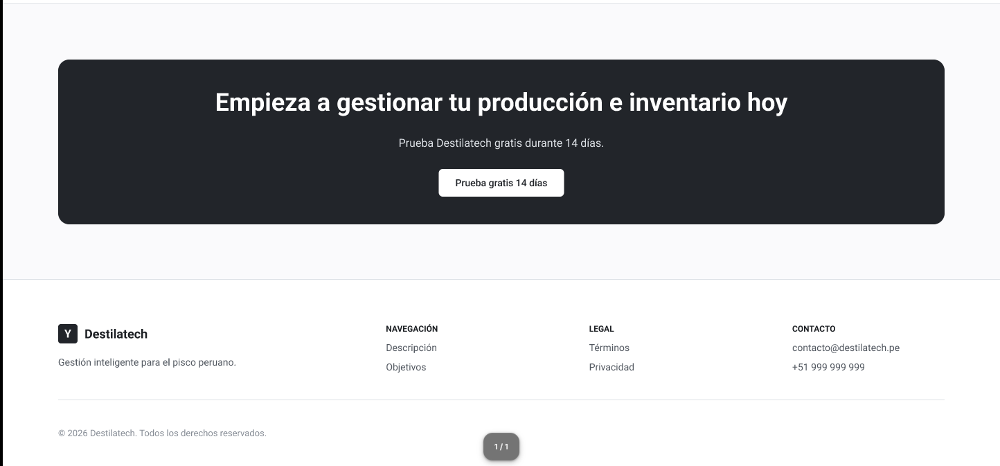
</p>

#### 4.3.2. Landing Page Mock-up.

Interfaz final del Hero Section destaca la integración de la paleta de colores corporativa (Deep Copper y Cask Cream), tipografía moderna (Poppins e Inter) y la imagen de alambiques de cobre integrados con tarjetas flotantes que muestran métricas en tiempo real de fermentación (18.4°C, Óptimo) e inventario (42 uds., Reponer pronto), logrando captar la atención del usuario inmediatamente.

<p align="center">
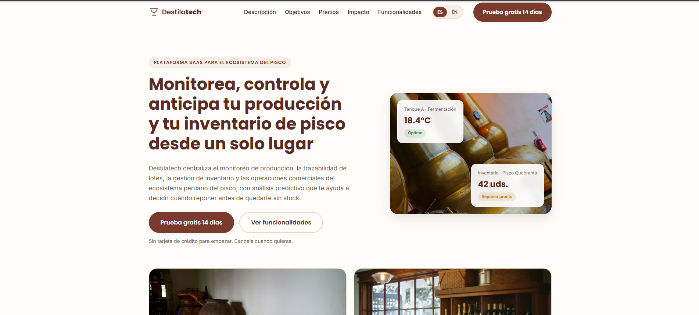
</p>

Implementación final de las tarjetas de Segmentos y Objetivos se incorporaron imágenes fotográficas de alta calidad de bodegas artesanales y estanterías de licorerías, junto con un diseño de tarjeta limpia (Clean UI) con íconos minimalistas y listas de verificación (checklists) que resumen los cuatro pilares operativos de la plataforma para facilitar la lectura.

<p align="center">
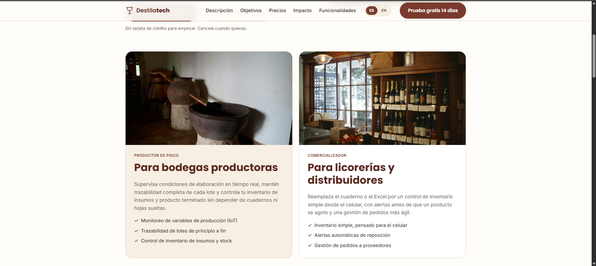
</p>
<p align="center">
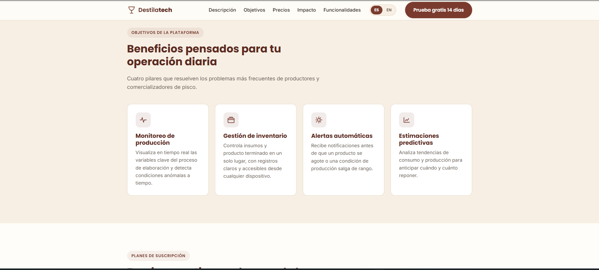
</p>


Resultado visual de la sección de Precios e Impacto presenta formalmente los tres planes de suscripción (Básico, Profesional y Empresarial) resaltando el "Plan Profesional" con la insignia "Más elegido", seguido de un bloque de impacto visual con fondo fotográfico oscuro y métricas destacadas de la industria formal del pisco (527+ empresas y 7.8M de litros) para transmitir solidez y confianza técnica al visitante.

<p align="center">
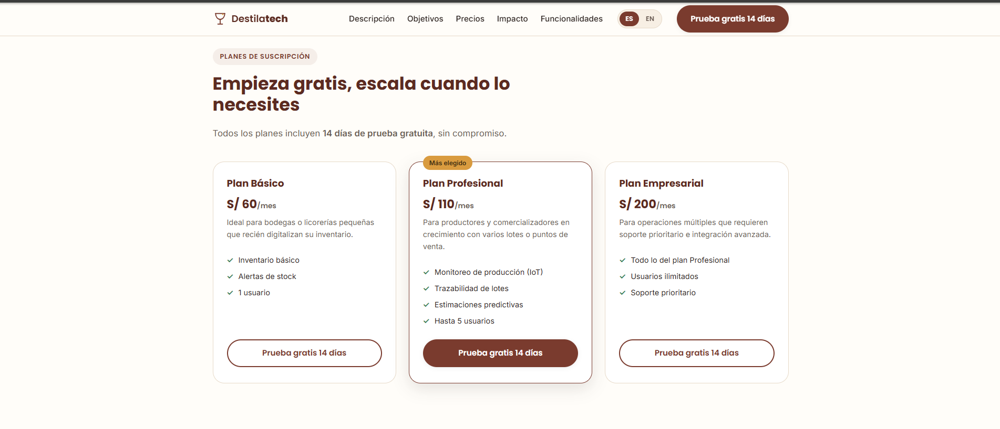
</p>
<p align="center">
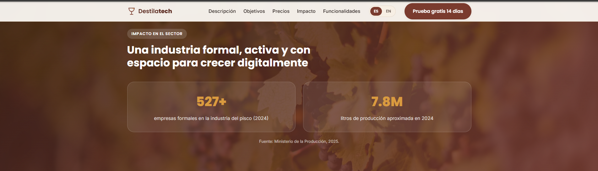
</p>

Versión construida de Funcionalidades, CTA final y Footer utiliza un sistema de pestañas interactivas para alternar entre perfiles (Productor / Comercializador), un bloque de conversión central con fondo crema cálido que enfoca la atención en la "Prueba gratis 14 días", y cierra la página con un pie de página en tono oscuro corporativo (#241a16) estructurado en columnas para navegación, enlaces legales, redes sociales y contacto directo.

<p align="center">
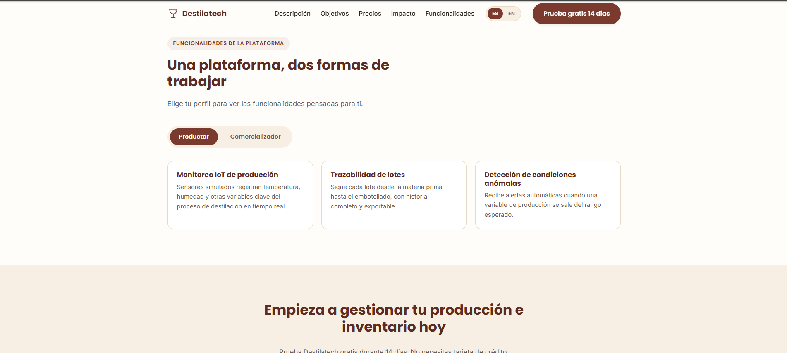
</p>
<p align="center">
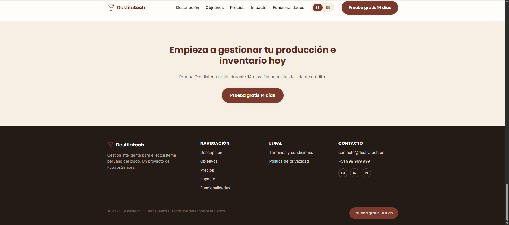
</p>

### 4.4. Web Applications UX/UI Design


#### 4.4.1. Web Applications Wireframes


#### 4.4.2. Web Applications Wireflow Diagrams


#### 4.4.3. Web Applications Mock-ups


#### 4.4.4. Web Applications User Flow Diagrams


### 4.5. Web Applications Prototyping


### 4.6. Domain-Driven Software Architecture

Partiendo de los logros alcanzados en el Big Picture Event Storming (sección 2.4) y del Ubiquitous Language definido en la sección 2.5, en esta sección el equipo profundiza el análisis del dominio aplicando Domain-Driven Design (Evans, 2003). Se ejecuta un Design-Level Event Storming para cada uno de los seis Bounded Contexts identificados —Identity/Access & Subscriptions, Production & Monitoring, Inventory & Stock Management, Orders & Replenishment, Alerts & Notifications y Analytics & Estimations—, llegando a la identificación de Commands, Aggregates, Domain Events, Policies y Read Models para cada uno. A partir de este modelo se deriva la representación de la arquitectura de software de la solución aplicando el C4 Model (Brown, 2018), documentando los niveles de Context, Container y Component. Todos los diagramas de esta sección se elaboraron con la herramienta Mermaid, embebidos directamente en este documento Markdown para que se rendericen como imagen al visualizar el repositorio en GitHub.

#### 4.6.1. Design-Level Event Storming

El equipo organizó una sesión de Design-Level Event Storming con una duración de 1 hora con 45 minutos, siguiendo la guía de referencia del curso (https://bit.ly/dles-guide), partiendo de los seis Bounded Contexts identificados en el Big Picture Event Storming. Para cada Bounded Context se identificaron los Commands (acciones que un actor o sistema externo dispara), el Aggregate que procesa el Command y garantiza sus invariantes, los Domain Events resultantes, las Policies (reacciones automáticas del sistema ante un evento, que pueden disparar Commands en el mismo Bounded Context o en otro) y los Read Models (vistas de consulta que el sistema expone como resultado de los eventos).

**Leyenda utilizada en los diagramas:**

| Elemento | Color | Descripción |
| :--- | :--- | :--- |
| Command | Azul | Acción o intención disparada por un actor o sistema externo. |
| Aggregate | Amarillo | Objeto del dominio que procesa el Command y mantiene su consistencia. |
| Domain Event | Naranja | Hecho relevante ya ocurrido en el dominio, resultado de procesar un Command. |
| Policy | Morado | Reacción automática del sistema ante un evento, que puede disparar otro Command. |
| Read Model | Verde | Vista de consulta construida a partir de los eventos. |
| Sistema externo | Rosa | Sistema ajeno a Destilatech que dispara o recibe eventos. |

**a. Identity/Access & Subscriptions**

Este Bounded Context gestiona el ciclo de vida de la cuenta del usuario (productor o comercializador), su periodo de prueba y su suscripción paga, respondiendo a los Epics EP01.

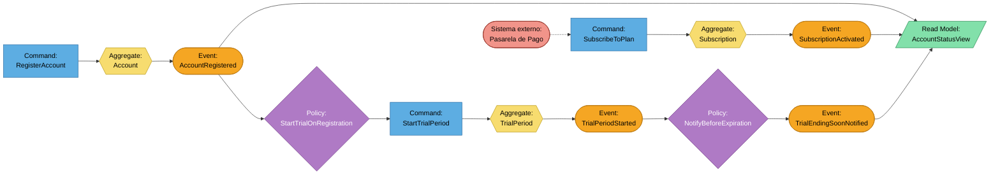
```mermaid
flowchart LR
    classDef command fill:#5DADE2,stroke:#2E6DA4,color:#000
    classDef aggregate fill:#F7DC6F,stroke:#B7950B,color:#000
    classDef event fill:#F5A623,stroke:#B9770E,color:#000
    classDef policy fill:#AF7AC5,stroke:#6C3483,color:#fff
    classDef readmodel fill:#82E0AA,stroke:#1E8449,color:#000
    classDef external fill:#F1948A,stroke:#943126,color:#000

    C1["Command:\nRegisterAccount"]:::command --> A1{{"Aggregate:\nAccount"}}:::aggregate --> E1(["Event:\nAccountRegistered"]):::event
    E1 --> P1{"Policy:\nStartTrialOnRegistration"}:::policy --> C2["Command:\nStartTrialPeriod"]:::command --> A2{{"Aggregate:\nTrialPeriod"}}:::aggregate --> E2(["Event:\nTrialPeriodStarted"]):::event
    E2 --> P2{"Policy:\nNotifyBeforeExpiration"}:::policy --> E3(["Event:\nTrialEndingSoonNotified"]):::event
    C3["Command:\nSubscribeToPlan"]:::command --> A3{{"Aggregate:\nSubscription"}}:::aggregate --> E4(["Event:\nSubscriptionActivated"]):::event
    EXT1(["Sistema externo:\nPasarela de Pago"]):::external -.-> C3
    E1 --> RM1[/"Read Model:\nAccountStatusView"/]:::readmodel
    E4 --> RM1
    E3 --> RM1
```

El evento `AccountRegistered` dispara la política `StartTrialOnRegistration`, que activa automáticamente el periodo de prueba de 14 días (US01). La política `NotifyBeforeExpiration` observa el paso del tiempo sobre `TrialPeriod` y genera el aviso al usuario cuando quedan 3 días (US03). La suscripción (`SubscribeToPlan`) depende de la Pasarela de Pago como sistema externo, identificada como hotspot en el Big Picture Event Storming.

**b. Production & Monitoring**

Gestiona los lotes de producción y el monitoreo de variables de proceso (EP03, EP04).

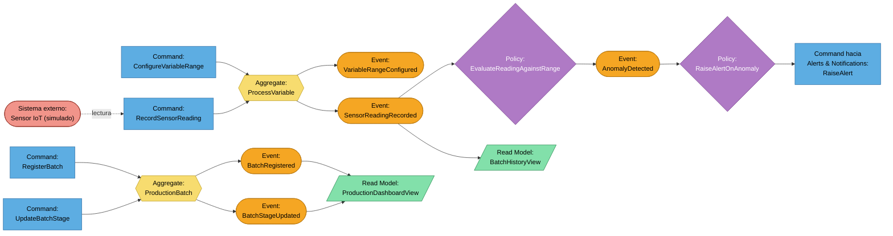
```mermaid
flowchart LR
    classDef command fill:#5DADE2,stroke:#2E6DA4,color:#000
    classDef aggregate fill:#F7DC6F,stroke:#B7950B,color:#000
    classDef event fill:#F5A623,stroke:#B9770E,color:#000
    classDef policy fill:#AF7AC5,stroke:#6C3483,color:#fff
    classDef readmodel fill:#82E0AA,stroke:#1E8449,color:#000
    classDef external fill:#F1948A,stroke:#943126,color:#000

    C1["Command:\nRegisterBatch"]:::command --> A1{{"Aggregate:\nProductionBatch"}}:::aggregate --> E1(["Event:\nBatchRegistered"]):::event
    C2["Command:\nUpdateBatchStage"]:::command --> A1
    A1 --> E2(["Event:\nBatchStageUpdated"]):::event
    C3["Command:\nConfigureVariableRange"]:::command --> A2{{"Aggregate:\nProcessVariable"}}:::aggregate --> E3(["Event:\nVariableRangeConfigured"]):::event
    EXT1(["Sistema externo:\nSensor IoT (simulado)"]):::external -.->|"lectura"| C4["Command:\nRecordSensorReading"]:::command --> A2 --> E4(["Event:\nSensorReadingRecorded"]):::event
    E4 --> P1{"Policy:\nEvaluateReadingAgainstRange"}:::policy --> E5(["Event:\nAnomalyDetected"]):::event
    E5 --> P2{"Policy:\nRaiseAlertOnAnomaly"}:::policy --> XC1["Command hacia\nAlerts & Notifications:\nRaiseAlert"]:::command
    E1 --> RM1[/"Read Model:\nProductionDashboardView"/]:::readmodel
    E2 --> RM1
    E4 --> RM2[/"Read Model:\nBatchHistoryView"/]:::readmodel
```

La política `EvaluateReadingAgainstRange` es el corazón del monitoreo: compara cada `SensorReadingRecorded` contra el rango configurado en `ConfigureVariableRange` (US10) y, de estar fuera de rango, genera `AnomalyDetected` (US11), que a su vez dispara un Command hacia el Bounded Context Alerts & Notifications. El Sensor IoT se mantiene simulado dentro del alcance académico, tal como se identificó en el Big Picture Event Storming.

**c. Inventory & Stock Management**

Gestiona el catálogo de productos y el control de stock (EP05, EP06).

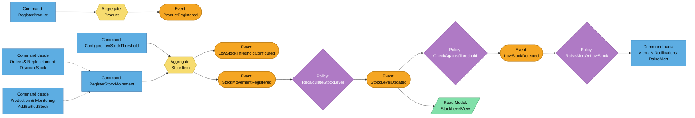
```mermaid
flowchart LR
    classDef command fill:#5DADE2,stroke:#2E6DA4,color:#000
    classDef aggregate fill:#F7DC6F,stroke:#B7950B,color:#000
    classDef event fill:#F5A623,stroke:#B9770E,color:#000
    classDef policy fill:#AF7AC5,stroke:#6C3483,color:#fff
    classDef readmodel fill:#82E0AA,stroke:#1E8449,color:#000

    C1["Command:\nRegisterProduct"]:::command --> A1{{"Aggregate:\nProduct"}}:::aggregate --> E1(["Event:\nProductRegistered"]):::event
    C2["Command:\nConfigureLowStockThreshold"]:::command --> A2{{"Aggregate:\nStockItem"}}:::aggregate --> E2(["Event:\nLowStockThresholdConfigured"]):::event
    C3["Command:\nRegisterStockMovement"]:::command --> A2 --> E3(["Event:\nStockMovementRegistered"]):::event
    E3 --> P1{"Policy:\nRecalculateStockLevel"}:::policy --> E4(["Event:\nStockLevelUpdated"]):::event
    E4 --> P2{"Policy:\nCheckAgainstThreshold"}:::policy --> E5(["Event:\nLowStockDetected"]):::event
    E5 --> P3{"Policy:\nRaiseAlertOnLowStock"}:::policy --> XC1["Command hacia\nAlerts & Notifications:\nRaiseAlert"]:::command
    XC2["Command desde\nOrders & Replenishment:\nDiscountStock"]:::command -.-> C3
    XC3["Command desde\nProduction & Monitoring:\nAddBottledStock"]:::command -.-> C3
    E4 --> RM1[/"Read Model:\nStockLevelView"/]:::readmodel
```

`RegisterStockMovement` puede originarse directamente en la interfaz del usuario (US13) o ser disparado por Commands cruzados desde otros Bounded Contexts: `DiscountStock` (cuando Orders & Replenishment confirma un pedido, US18) y `AddBottledStock` (cuando Production & Monitoring embotella un lote). La política `CheckAgainstThreshold` compara el nuevo nivel contra el umbral configurado (US15) para decidir si dispara `LowStockDetected` (US16).

**d. Orders & Replenishment**

Gestiona clientes y pedidos de venta, y los pedidos de reposición a proveedores (EP07).

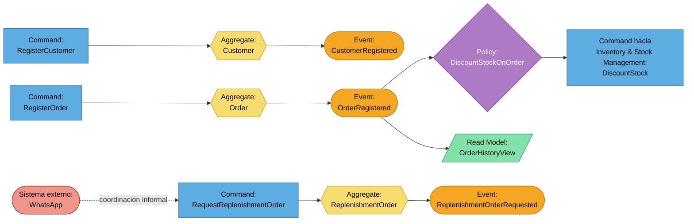
```mermaid
flowchart LR
    classDef command fill:#5DADE2,stroke:#2E6DA4,color:#000
    classDef aggregate fill:#F7DC6F,stroke:#B7950B,color:#000
    classDef event fill:#F5A623,stroke:#B9770E,color:#000
    classDef policy fill:#AF7AC5,stroke:#6C3483,color:#fff
    classDef readmodel fill:#82E0AA,stroke:#1E8449,color:#000
    classDef external fill:#F1948A,stroke:#943126,color:#000

    C1["Command:\nRegisterCustomer"]:::command --> A1{{"Aggregate:\nCustomer"}}:::aggregate --> E1(["Event:\nCustomerRegistered"]):::event
    C2["Command:\nRegisterOrder"]:::command --> A2{{"Aggregate:\nOrder"}}:::aggregate --> E2(["Event:\nOrderRegistered"]):::event
    E2 --> P1{"Policy:\nDiscountStockOnOrder"}:::policy --> XC1["Command hacia\nInventory & Stock Management:\nDiscountStock"]:::command
    C3["Command:\nRequestReplenishmentOrder"]:::command --> A3{{"Aggregate:\nReplenishmentOrder"}}:::aggregate --> E3(["Event:\nReplenishmentOrderRequested"]):::event
    EXT1(["Sistema externo:\nWhatsApp"]):::external -.->|"coordinación informal"| C3
    E2 --> RM1[/"Read Model:\nOrderHistoryView"/]:::readmodel
```

`RegisterOrder` (US18) dispara la política `DiscountStockOnOrder`, que emite un Command hacia Inventory & Stock Management para descontar el stock vendido, evitando que Orders & Replenishment conozca o manipule directamente el Aggregate `StockItem` (los Bounded Contexts se comunican por eventos/commands, no compartiendo agregados). WhatsApp se mantiene como canal informal externo de coordinación de pedidos de reposición, tal como se identificó en el Big Picture.

**e. Alerts & Notifications**

Actúa como un Bounded Context transversal que centraliza las alertas generadas por Production & Monitoring e Inventory & Stock Management (EP04, EP06).

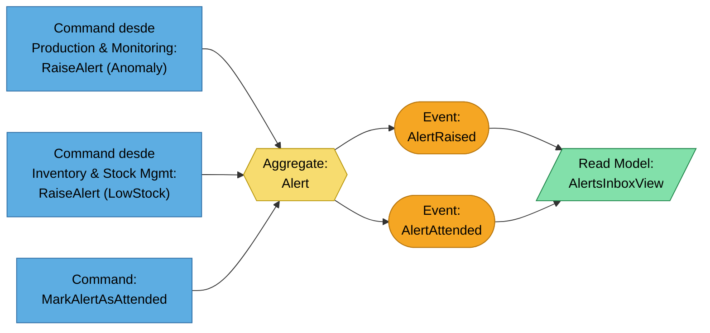
```mermaid
flowchart LR
    classDef command fill:#5DADE2,stroke:#2E6DA4,color:#000
    classDef aggregate fill:#F7DC6F,stroke:#B7950B,color:#000
    classDef event fill:#F5A623,stroke:#B9770E,color:#000
    classDef readmodel fill:#82E0AA,stroke:#1E8449,color:#000

    XC1["Command desde\nProduction & Monitoring:\nRaiseAlert (Anomaly)"]:::command --> A1{{"Aggregate:\nAlert"}}:::aggregate
    XC2["Command desde\nInventory & Stock Mgmt:\nRaiseAlert (LowStock)"]:::command --> A1
    A1 --> E1(["Event:\nAlertRaised"]):::event
    C1["Command:\nMarkAlertAsAttended"]:::command --> A1 --> E2(["Event:\nAlertAttended"]):::event
    E1 --> RM1[/"Read Model:\nAlertsInboxView"/]:::readmodel
    E2 --> RM1
```

Este Bounded Context no origina Commands desde el usuario salvo `MarkAlertAsAttended` (US16); su Aggregate `Alert` se crea a partir de los Commands cruzados que le envían Production & Monitoring y Inventory & Stock Management, manteniendo el desacoplamiento entre contextos.

**f. Analytics & Estimations**

Calcula estimaciones de reposición e indicadores históricos a partir del historial de otros Bounded Contexts (EP08).

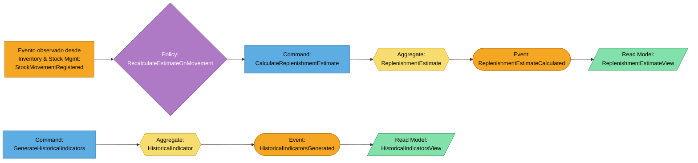
```mermaid
flowchart LR
    classDef command fill:#5DADE2,stroke:#2E6DA4,color:#000
    classDef aggregate fill:#F7DC6F,stroke:#B7950B,color:#000
    classDef event fill:#F5A623,stroke:#B9770E,color:#000
    classDef policy fill:#AF7AC5,stroke:#6C3483,color:#fff
    classDef readmodel fill:#82E0AA,stroke:#1E8449,color:#000

    XC1["Evento observado desde\nInventory & Stock Mgmt:\nStockMovementRegistered"]:::event --> P1{"Policy:\nRecalculateEstimateOnMovement"}:::policy --> C1["Command:\nCalculateReplenishmentEstimate"]:::command --> A1{{"Aggregate:\nReplenishmentEstimate"}}:::aggregate --> E1(["Event:\nReplenishmentEstimateCalculated"]):::event
    C2["Command:\nGenerateHistoricalIndicators"]:::command --> A2{{"Aggregate:\nHistoricalIndicator"}}:::aggregate --> E2(["Event:\nHistoricalIndicatorsGenerated"]):::event
    E1 --> RM1[/"Read Model:\nReplenishmentEstimateView"/]:::readmodel
    E2 --> RM2[/"Read Model:\nHistoricalIndicatorsView"/]:::readmodel
```

Este contexto suscribe al evento `StockMovementRegistered` publicado por Inventory & Stock Management para recalcular la estimación de reposición (US20) sin acoplarse a su modelo interno. `GenerateHistoricalIndicators` se ejecuta de forma periódica/bajo demanda para alimentar los gráficos de evolución de inventario y producción (US21), consumiendo el historial de Production & Monitoring e Inventory & Stock Management.


#### 4.6.2. Software Architecture Context Diagram


#### 4.6.3. Software Architecture Container Diagrams


#### 4.6.4. Software Architecture Components Diagrams


### 4.7. Software Object-Oriented Design

En esta sección el equipo profundiza el diseño orientado a objetos de la RESTful API, presentando el Class Diagram de UML correspondiente a cada uno de los seis Bounded Contexts identificados. El nivel de detalle incluye clases, atributos, métodos, el scope de cada miembro (`+` public, `-` private, `#` protected) y las relaciones entre clases con su calificación, dirección y multiplicidad.

#### 4.7.1. Class Diagrams

**a. Identity/Access & Subscriptions**

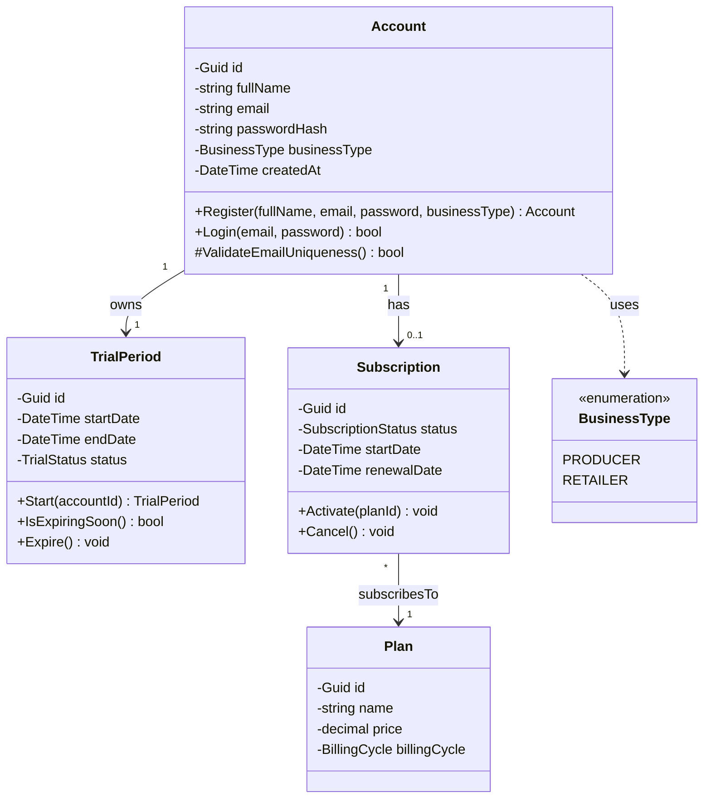
```mermaid
classDiagram
    class Account {
        -Guid id
        -string fullName
        -string email
        -string passwordHash
        -BusinessType businessType
        -DateTime createdAt
        +Register(fullName, email, password, businessType) Account
        +Login(email, password) bool
        #ValidateEmailUniqueness() bool
    }
    class TrialPeriod {
        -Guid id
        -DateTime startDate
        -DateTime endDate
        -TrialStatus status
        +Start(accountId) TrialPeriod
        +IsExpiringSoon() bool
        +Expire() void
    }
    class Subscription {
        -Guid id
        -SubscriptionStatus status
        -DateTime startDate
        -DateTime renewalDate
        +Activate(planId) void
        +Cancel() void
    }
    class Plan {
        -Guid id
        -string name
        -decimal price
        -BillingCycle billingCycle
    }
    class BusinessType {
        <<enumeration>>
        PRODUCER
        RETAILER
    }

    Account "1" --> "1" TrialPeriod : owns
    Account "1" --> "0..1" Subscription : has
    Subscription "*" --> "1" Plan : subscribesTo
    Account ..> BusinessType : uses
```

**b. Production & Monitoring**

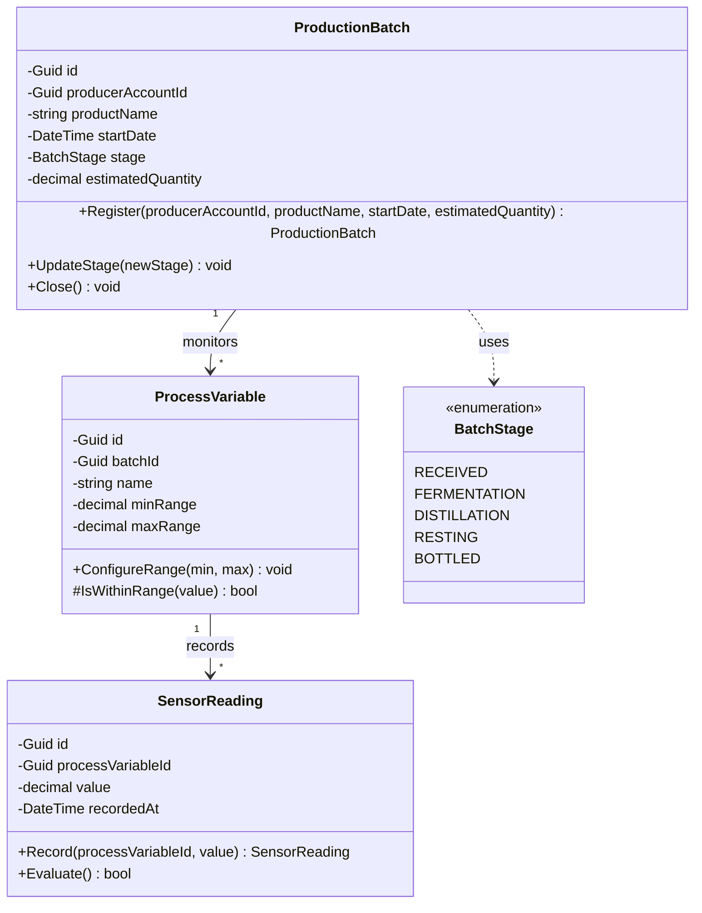
```mermaid
classDiagram
    class ProductionBatch {
        -Guid id
        -Guid producerAccountId
        -string productName
        -DateTime startDate
        -BatchStage stage
        -decimal estimatedQuantity
        +Register(producerAccountId, productName, startDate, estimatedQuantity) ProductionBatch
        +UpdateStage(newStage) void
        +Close() void
    }
    class ProcessVariable {
        -Guid id
        -Guid batchId
        -string name
        -decimal minRange
        -decimal maxRange
        +ConfigureRange(min, max) void
        #IsWithinRange(value) bool
    }
    class SensorReading {
        -Guid id
        -Guid processVariableId
        -decimal value
        -DateTime recordedAt
        +Record(processVariableId, value) SensorReading
        +Evaluate() bool
    }
    class BatchStage {
        <<enumeration>>
        RECEIVED
        FERMENTATION
        DISTILLATION
        RESTING
        BOTTLED
    }

    ProductionBatch "1" --> "*" ProcessVariable : monitors
    ProcessVariable "1" --> "*" SensorReading : records
    ProductionBatch ..> BatchStage : uses
```

**c. Inventory & Stock Management**

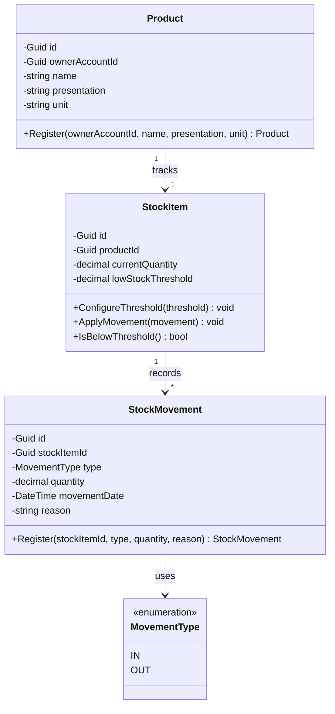
```mermaid
classDiagram
    class Product {
        -Guid id
        -Guid ownerAccountId
        -string name
        -string presentation
        -string unit
        +Register(ownerAccountId, name, presentation, unit) Product
    }
    class StockItem {
        -Guid id
        -Guid productId
        -decimal currentQuantity
        -decimal lowStockThreshold
        +ConfigureThreshold(threshold) void
        +ApplyMovement(movement) void
        +IsBelowThreshold() bool
    }
    class StockMovement {
        -Guid id
        -Guid stockItemId
        -MovementType type
        -decimal quantity
        -DateTime movementDate
        -string reason
        +Register(stockItemId, type, quantity, reason) StockMovement
    }
    class MovementType {
        <<enumeration>>
        IN
        OUT
    }

    Product "1" --> "1" StockItem : tracks
    StockItem "1" --> "*" StockMovement : records
    StockMovement ..> MovementType : uses
```

**d. Orders & Replenishment**

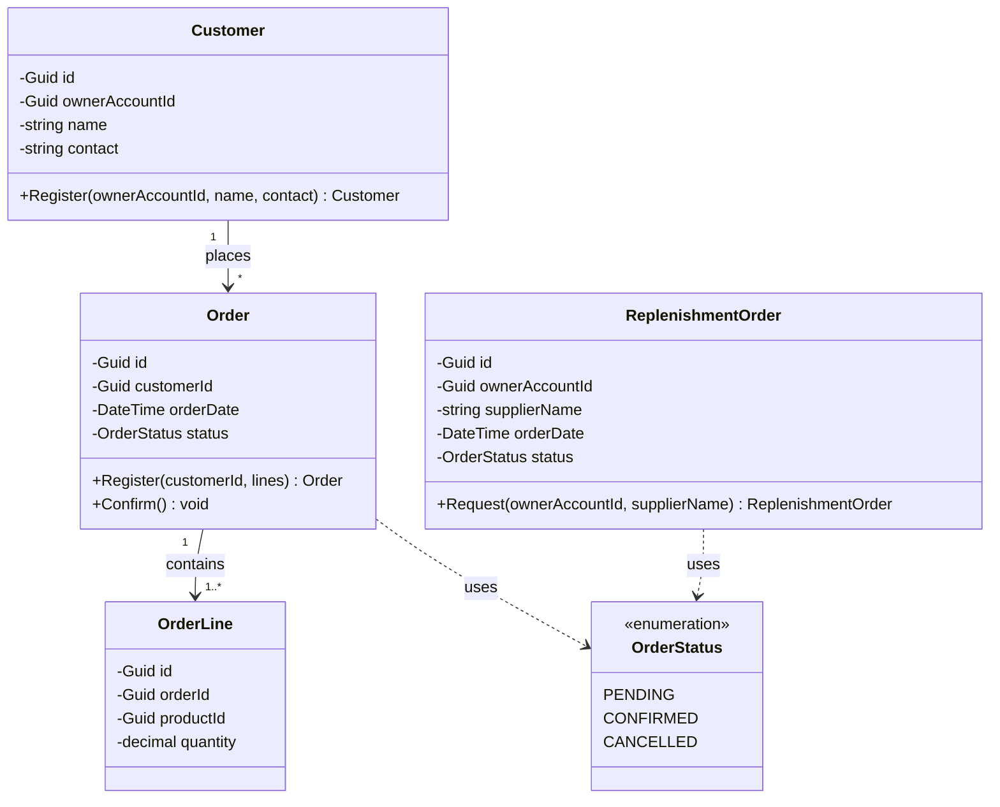
```mermaid
classDiagram
    class Customer {
        -Guid id
        -Guid ownerAccountId
        -string name
        -string contact
        +Register(ownerAccountId, name, contact) Customer
    }
    class Order {
        -Guid id
        -Guid customerId
        -DateTime orderDate
        -OrderStatus status
        +Register(customerId, lines) Order
        +Confirm() void
    }
    class OrderLine {
        -Guid id
        -Guid orderId
        -Guid productId
        -decimal quantity
    }
    class ReplenishmentOrder {
        -Guid id
        -Guid ownerAccountId
        -string supplierName
        -DateTime orderDate
        -OrderStatus status
        +Request(ownerAccountId, supplierName) ReplenishmentOrder
    }
    class OrderStatus {
        <<enumeration>>
        PENDING
        CONFIRMED
        CANCELLED
    }

    Customer "1" --> "*" Order : places
    Order "1" --> "1..*" OrderLine : contains
    Order ..> OrderStatus : uses
    ReplenishmentOrder ..> OrderStatus : uses
```

**e. Alerts & Notifications**

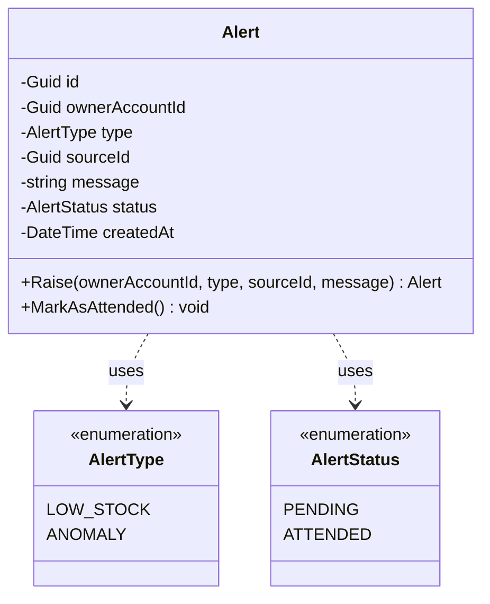
```mermaid
classDiagram
    class Alert {
        -Guid id
        -Guid ownerAccountId
        -AlertType type
        -Guid sourceId
        -string message
        -AlertStatus status
        -DateTime createdAt
        +Raise(ownerAccountId, type, sourceId, message) Alert
        +MarkAsAttended() void
    }
    class AlertType {
        <<enumeration>>
        LOW_STOCK
        ANOMALY
    }
    class AlertStatus {
        <<enumeration>>
        PENDING
        ATTENDED
    }

    Alert ..> AlertType : uses
    Alert ..> AlertStatus : uses
```

**f. Analytics & Estimations**

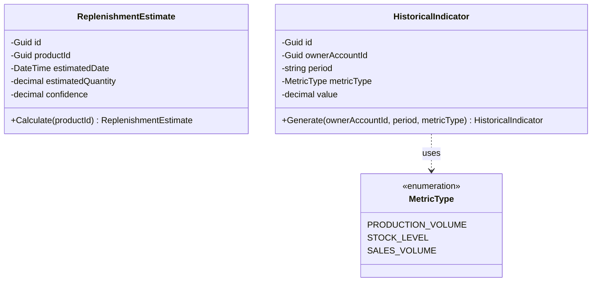
```mermaid
classDiagram
    class ReplenishmentEstimate {
        -Guid id
        -Guid productId
        -DateTime estimatedDate
        -decimal estimatedQuantity
        -decimal confidence
        +Calculate(productId) ReplenishmentEstimate
    }
    class HistoricalIndicator {
        -Guid id
        -Guid ownerAccountId
        -string period
        -MetricType metricType
        -decimal value
        +Generate(ownerAccountId, period, metricType) HistoricalIndicator
    }
    class MetricType {
        <<enumeration>>
        PRODUCTION_VOLUME
        STOCK_LEVEL
        SALES_VOLUME
    }

    HistoricalIndicator ..> MetricType : uses
```


### 4.8. Database Design


#### 4.8.1. Database Diagrams


## Capítulo V: Product Implementation, Validation & Deployment

### 5.1. Software Configuration Management


En esta sección se detallan las decisiones tecnológicas, herramientas de colaboración y convenciones de código que garantizan la integridad y escalabilidad de Destilatech. Según Bourque y Fairley (2014) en el estándar SWEBOK, la gestión de la configuración del software es crucial para mantener la visibilidad y el control del rendimiento funcional y físico del producto a lo largo de todo su ciclo de vida.


#### 5.1.1. Software Development Environment Configuration


Para el desarrollo del ecosistema de Destilatech, el equipo integró las siguientes herramientas y plataformas, organizadas según su propósito en el ciclo de vida del software:

+ **Project Management**<br>La gestión de proyectos asegura que el desarrollo se entregue dentro de los plazos y presupuestos previstos. Según el Project Management Institute (2021), una gestión efectiva es fundamental para coordinar recursos, mitigar riesgos y alinear el trabajo colaborativo con los objetivos del negocio.<br><br>
  +	**Jira Software:** Herramienta de gestión de proyectos ágil (Atlassian, 2023) que permite planificar y gestionar el trabajo mediante tableros Scrum o Kanban, facilitando la colaboración transparente entre los equipos de desarrollo.<br>https://www.atlassian.com/software/jira<br><br>
  + **Trello:** Herramienta visual basada en tableros Kanban (Atlassian, 2024), utilizada como complemento ágil para gestionar tareas rápidas, lluvia de ideas y organizar el flujo de trabajo diario de los desarrolladores.<br>https://trello.com/<br><br>

+ **Requirements Management**<br>Implica transformar las necesidades abstractas de los usuarios en requisitos de software medibles. La trazabilidad de estos requerimientos garantiza que el producto final no diverja del valor de negocio esperado por los *stakeholders* (Bourque & Fairley, 2014).<br><br>
  + **Jira Software:** En su función de gestión de backlog, permite estructurar Historias de Usuario (*User Stories*) y Épicas, priorizando el trabajo orientado a aportar valor continuo en cada iteración.<br>https://www.atlassian.com/software/jira<br><br>

+ **Product UX/UI Design**<br>El diseño de experiencia (UX) e interfaz (UI) se apoya en el modelo de diseño centrado en el humano (Norman, 2013), buscando optimizar la forma en que los usuarios interactúan con el sistema en momentos de alta carga cognitiva.<br><br>
  + **Figma:** Herramienta colaborativa en la nube para la creación de interfaces y prototipos de alta fidelidad, vital para validar flujos antes del desarrollo de código.<br>https://www.figma.com/ <br><br>
  + **UXPressia:** Plataforma empleada para mapear el *Customer Journey* y construir *User Personas*, traduciendo la investigación cualitativa en artefactos visuales de diseño.<br>https://uxpressia.com/ <br><br>
  + **MIRO:** Tablero digital colaborativo utilizado para las sesiones de *Big Picture Event Storming* y *Domain-Driven Design*.<br>https://miro.com/ <br><br> 
  + **Canva:** Herramienta de diseño gráfico en línea utilizada para la elaboración de la identidad visual de la marca y la estructuración de la presentación final del proyecto.<br>https://www.canva.com/<br><br> 
  + **Structurizr:** Plataforma basada en el modelo C4 para visualizar interacciones entre microservicios y contextos delimitados (*Bounded Contexts*) (Brown, 2020).<br>https://structurizr.com/ <br><br>
  + **Lucidchart:** Herramienta de diagramación empleada para los esquemas lógicos, flujos de base de datos y arquitectura preliminar.<br>https://www.lucidchart.com/<br><br>
  + **PlantUML:** Herramienta de código abierto que implementa *Diagrams as Code*, permitiendo que la arquitectura del sistema evolucione y se versione junto con el código fuente en GitHub.<br>https://plantuml.com/es/<br><br>
  + **Mermaid:** Biblioteca JavaScript utilizada para la renderización de flujos de usuario (*User Flow Diagrams*) mediante sintaxis textual directamente soportada por GitHub (Mermaid, 2023).<br>https://mermaid.js.org/<br><br>

+ **Software Development**<br>Etapa donde se materializa la arquitectura de software. Se seleccionaron lenguajes y frameworks tipados y de alto rendimiento para garantizar la tolerancia a fallos del sistema clínico.<br><br> 
  + **GitHub:** Plataforma base para el control de versiones distribuido mediante Git, permitiendo la integración y revisión de código asíncrona.<br>https://github.com/ <br><br> 
  + **Visual Studio Code:** Editor de código fuente ligero y versátil (Microsoft, 2024), utilizado por parte del equipo gracias a su amplio ecosistema de extensiones para múltiples lenguajes.<br>https://code.visualstudio.com/ <br><br>
  + **JetBrains Rider:** Entorno de Desarrollo Integrado (IDE) multiplataforma y de alto rendimiento (JetBrains, 2024), utilizado como herramienta principal para el desarrollo de la lógica de negocio y la API en C# / .NET.<br>https://www.jetbrains.com/rider/<br><br>
  + **JetBrains WebStorm:** IDE especializado en el desarrollo web moderno (JetBrains, 2024), empleado para la programación y depuración de todo el ecosistema frontend con Vue.js y TypeScript.<br>https://www.jetbrains.com/webstorm/<br><br>
  + **HTML & CSS:** Lenguajes estándar web utilizados para estructurar el contenido (HTML) y definir la apariencia y diseño visual (CSS) de la Landing Page y la Web App.<br>https://developer.mozilla.org/es/docs/Web/HTML<br><br> 
  + **JavaScript / TypeScript:** Lenguajes web que dotan de tipado estricto y dinamismo al cliente web, reduciendo la incidencia de errores en tiempo de ejecución.<br>https://www.typescriptlang.org/<br><br> 

+ **Software Testing**<br>La evaluación de la calidad del software garantiza que la solución cumpla con los estándares médicos exigidos.<br><br> 
  + **Lenguaje Gherkin (Cucumber):** Lenguaje de dominio (DSL) implementado para el *Behavior-Driven Development* (BDD) (Smart, 2014). Permite traducir criterios de aceptación en pruebas legibles por negocio mediante sintaxis *Given-When-Then*.<br>https://cucumber.io/<br><br> 

+ **Software Deployment**<br>Consiste en la automatización y alojamiento de los artefactos compilados para su consumo público.<br><br> 
  + **Github Pages:** Servicio de *hosting* estático aprovechado para el despliegue automático de la *Landing Page* institucional.<br>https://pages.github.com/ <br><br>

+ **Software Documentation**<br>Mantenimiento de la información técnica esencial para reducir la curva de aprendizaje de nuevos desarrolladores e interesados en el proyecto.<br><br> 
  + **Markdown:** Lenguaje de marcado ligero, pilar de la documentación técnica moderna en repositorios, facilitando legibilidad humana y renderización web.<br>https://www.markdownguide.org/getting-started/<br><br>
  + **Microsoft Office 365:** Suite colaborativa en la nube para la gestión del reporte académico final y documentación adjunta.<br>https://www.microsoft.com/microsoft-365<br><br>


#### 5.1.2. Source Code Management
Se implementa la metodología Git Flow para gestionar el desarrollo de Destilatech, garantizando que el monitoreo de salud nunca se vea interrumpido por código inestable. Adicionalmente, se eligió GitHub como plataforma de control de versiones, aprovechando su funcionalidad GitHub Pages. Esta característica permite desplegar el proyecto de manera sencilla, facilitando la visualización del sitio web a partir de archivos en formato .html mediante la generación de un enlace accesible. Respecto a la documentación de nuevas funcionalidades, se decidió crear ramas bajo la nomenclatura "feature/sprint-1-development" para cada componente implementado. De esta forma, se asegura el orden y progreso al momento de desarrollar el proyecto.

**Enlace del Website (Landing Page):** [https://upc-pre-202620-1asi0730-2620-8084-desti.github.io/destilatech-website/](https://upc-pre-202620-1asi0730-2620-8084-desti.github.io/destilatech-website/)


**Repositorio GitHub del Website (Landing Page):** [https://github.com/upc-pre-202620-1ASI0730-2620-8084-desti/destilatech-website](https://github.com/upc-pre-202620-1ASI0730-2620-8084-desti/destilatech-website)

**Evidencia de Gestión de Ramas (Git Flow)**

Para aislar el desarrollo de nuevas características sin afectar el código estable, todo el equipo trabaja bajo una nomenclatura estandarizada:

* `main`: Rama de producción, contiene el código 100% testeado que se despliega automáticamente en Azure y GitHub Pages.
* `develop`: Rama principal de integración para el equipo.
* `feature/[nombre]`: Ramas temporales para tareas específicas (ej. `feature/sprint-1-development`). 

A continuación, se evidencia la correcta aplicación de estas ramas y los flujos de trabajo (Pull Requests) integrados en nuestros repositorios durante el desarrollo del Sprint:


### 5.1.3. Source Code Style Guide & Conventions.

Esta sección define las reglas de codificación y nomenclatura definidas por el equipo de trabajo que serán aplicadas en Destilatech. De esta manera, el grupo asegura la conservación de la legibilidad, mantenibilidad y escalabilidad en las etapas de desarrollo de la solución.

El proyecto utilizará HTML, CSS, JavaScript, TypeScript, C# y Gherkin con el propósito de favorecer la implementación y validación de comportamiento. Para el código fuente, el idioma empleado será el inglés y se respetará el uso de estándares tecnológicos oficiales.

#### 5.1.3.1 Principios generales para todos los lenguajes

##### 5.1.3.1.1 Nomenclatura obligatoria en inglés

Todo el código (variables, clases, comentarios, commits) debe ser redactado estrictamente en inglés.

Reglas transversales:

- Los nombres deben ser descriptivos y orientados al dominio.
- Las abreviaciones ambiguas (`tmp`, `obj`, `val`) están prohibidas a excepción de tratarse de contextos locales muy acotados.
- La semántica del nombre debe anticipar su responsabilidad y tipo de dato.
- Los nombres de una sola letra se reservan para iteradores de alcance corto (`i`, `j`) o coordenadas matemáticas (`x`, `y`, `z`).

##### 5.1.3.1.2 Formato base de código

- Los archivos serán guardados en UTF-8.
- Las líneas de código excesivamente largas serán evitadas, debido a que se prioriza la legibilidad.
- Los comentarios serán usados para la documentación técnica de las clases y métodos complejos.

##### 5.1.3.1.3 Convenciones de estilo por tecnología

Cada lenguaje conserva su convención estándar:

- HTML/CSS/JavaScript/TypeScript: Estilo de Google, MDN y recomendaciones del ecosistema oficial de Vue.js.
- C#: Convenciones oficiales de Microsoft y del ecosistema ASP.NET Core.
- Gherkin: Enfoque de legibilidad y comportamiento orientado a negocio.

#### 5.1.3.2 Convenciones para HTML

Se adoptará HTML5 con el objetivo de buscar un enfoque semántico y accesible.

##### 5.1.3.2.1 Estructura y sintaxis

- Es necesario declarar `<!doctype html>` al inicio.
- Se requiere escribir etiquetas y atributos en minúsculas.
- Se necesita el uso de comillas dobles para valores de atributos.

##### 5.1.3.2.2 Semántica y accesibilidad

- Se requerirá del uso de elementos semánticos (`header`, `main`, `nav`, `section`, `article`, `footer`) en lugar de `div` sin propósito.
- Se prefiere evitar controladores *inline* (`onclick`, `onchange`), debido a que se busca que la lógica sea delegada a los eventos de Vue.js (`@click`, `@change`).
- Se exige la inclusión de texto alternativo significativo en imágenes.
- Se desea asociar etiquetas y controles de formulario (`label` + `for`).

Ejemplo recomendado:

```html
<!doctype html>
<html lang="en">
  <head>
    <meta charset="utf-8">
    <meta name="viewport" content="width=device-width, initial-scale=1">
    <title>Account Settings</title>
  </head>
  <body>
    <main>
      <h1>Account Settings</h1>
      
      <a href="/comments">All comments</a>
    </main>
  </body>
</html>
```

#### 5.1.3.3 Convenciones para CSS

Se adopta CSS con enfoque mantenible, predecible y escalable.

##### 5.1.3.3.1 Nomenclatura

- Se exige nomenclatura de clases en inglés y formato `kebab-case`.
- Se prioriza semántica de componente/rol (`checkout-form`, `product-card-title`).
- Se busca evitar nombres crípticos (`.rg`, `.x`, `.blueText`).

##### 5.1.3.3.2 Reglas de estilo

- Se requiere del uso de un espacio después de `:` en cada declaración.
- Se necesita finalizar cada declaración con `;`.
- Se sugiere usar las llaves de apertura en la misma línea del selector.
- Se recomienda evitar la sentencia `!important` salvo justificación técnica documentada.

Ejemplo recomendado:

```css
.checkout-form {
  padding: 0 1rem 1.5rem;
  border-top: 0;
}

.checkout-form__title {
  margin-bottom: 0.75rem;
  font: 600 1.25rem/1.4 "Open Sans", sans-serif;
}
```

Complementación conveniente:

- Se recomienda el uso de unidades relativas (`rem`, `%`) con el propósito de mejorar la escalabilidad y accesibilidad.
- Se sugiere realizar la estandarización de la paleta de colores y espaciados mediante variables CSS (`:root { --color-primary: ... }`).

#### 5.1.3.4 Convenciones para JavaScript y TypeScript

Se adopta JavaScript moderno (ES202x) y TypeScript como lenguajes principales del cliente web.

##### 5.1.3.4.1 Nomenclatura y estructura

- Se exige el uso de identificadores en inglés.
- Se sugiere la denominación de variables y funciones en `camelCase`.
- Se sugiere la denominación de clases y constructores en `PascalCase`.
- Se recomienda la denominación de constantes globales en `UPPER_SNAKE_CASE`.

##### 5.1.3.4.2 Reglas de codificación

- Preferir el uso de la igualdad estricta (`===`, `!==`).
- Dejar espacios alrededor de operadores y después de comas.
- Incorporar el uso del punto y coma al final de sentencias.
- Usar comillas simples por defecto; reservar *template literals* (``) para interpolación.
- Manejar errores de forma explícita (`try/catch` o propagación controlada).

##### 5.1.3.4.3 Reglas específicas para TypeScript y Vue.js

- Buscar el tipado explícito de parámetros, retornos y estructuras de datos cuando el tipo no sea obvio por inferencia.
- Preferir `interface` para contratos de datos de la API.
- Mantener el uso de componentes con una sola responsabilidad.
- Nombrar archivos de Vue.js siguiendo la convención *Single File Component (SFC)* en `PascalCase` (`DoctorDashboard.vue`, `MetricCard.vue`).
- Evitar lógica compleja en templates HTML; mover cálculos y transformaciones a propiedades computadas (`computed`) o al store global (`Pinia`).

Ejemplo recomendado:

```ts
const MAX_RETRY_ATTEMPTS = 3;

function calculateSquare(value: number): number {
  return value * value;
}

function getGreeting(hour: number): string {
  if (hour < 20) {
    return 'Good day';
  }

  return 'Good evening';
}
```

#### 5.1.3.5 Convenciones para C# y .NET

Se adoptan las convenciones oficiales de Microsoft y buenas prácticas compatibles con ASP.NET Core.

##### 5.1.3.5.1 Nomenclatura

Todos los nombres serán escritos en el idioma inglés.

- Las clases, registros (*records*), métodos, propiedades y eventos serán denominados bajo `PascalCase`.
- Las variables locales y parámetros de métodos serán nombrados bajo `camelCase`.
- Los campos privados de una clase deben llevar el prefijo guion bajo (`_camelCase`) para distinguirlos rápidamente de las variables locales.
- En las interfaces, el prefijo `I` es **obligatorio** (`IOrderRepository`, `IPaymentService`).

##### 5.1.3.5.2 Formato y prácticas

- Se exige el uso de llaves `{}` en líneas separadas (convención Allman).
- Se exige que los métodos posean una responsabilidad única y clara.
- Las clases de servicio y repositorios requieren nombres orientados al modelo de dominio.
- Los métodos asíncronos obligatoriamente deben llevar el sufijo `Async` (Ej. `SaveDataAsync`).

Ejemplo recomendado:

```csharp
public class OrderService
{
    private readonly IOrderRepository _orderRepository;

    public OrderService(IOrderRepository orderRepository)
    {
        _orderRepository = orderRepository;
    }

    public async Task<Order?> FindByIdAsync(Guid orderId)
    {
        if (orderId == Guid.Empty)
        {
            return null;
        }

        return await _orderRepository.FindByIdAsync(orderId);
    }
}
```

#### 5.1.3.6 Convenciones para Gherkin

Gherkin se utiliza para especificaciones legibles por negocio y equipo técnico.

##### 5.1.3.6.1 Reglas de legibilidad

- Los escenarios presentan estructura clara, mediante la denominación `Given-When-Then`.
- La sentencia `And` se usa para continuidad lógica dentro del mismo bloque.
- Se exigen *steps* concretos, observables y sin ruido irrelevante.
- Cuando un *step* requiere una tabla de datos, debe finalizar con `:`.
- Se recomienda dejar líneas en blanco entre escenarios para facilitar su lectura.

Ejemplo recomendado:

```gherkin
Feature: Contact channels

  Scenario: Visitor sends a contact form request
    Given the visitor provides the following data:
      | field   | value               |
      | name    | Ana Torres          |
      | email   | ana@example.com     |
      | message | I need more details |
    When the visitor submits the form
    Then the system confirms the request was received
```

Estas referencias serán aplicadas de manera complementaria. Si existiera conflicto entre guías, se priorizará la convención oficial de Microsoft (.NET) o Vue.js según el módulo implementado.

### 5.1.4. Software Deployment Configuration.

En esta sección mostraremos los pasos que hemos realizado para poder desplegar cada uno de nuestros proyectos.

#### 5.1.4.1. Landing Page

Con el objetivo de realizar el despliegue de nuestra landing page, seleccionamos la plataforma GitHub Pages, ya que permite alojar sitios web estáticos de forma totalmente gratuita.

##### 5.1.4.1.1.  Ingresamos al repositorio de la landing page

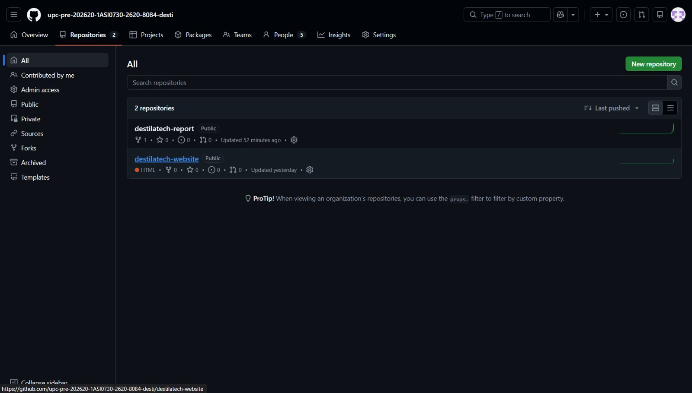
<br>

##### 5.1.4.1.2.  Nos dirigimos al apartado de settings


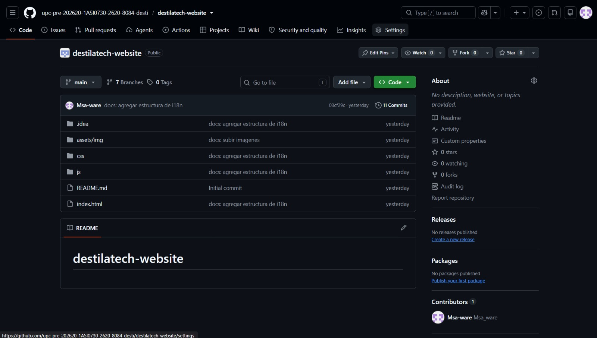
<br>

##### 5.1.4.1.3.  Vamos a la sección de Github Pages


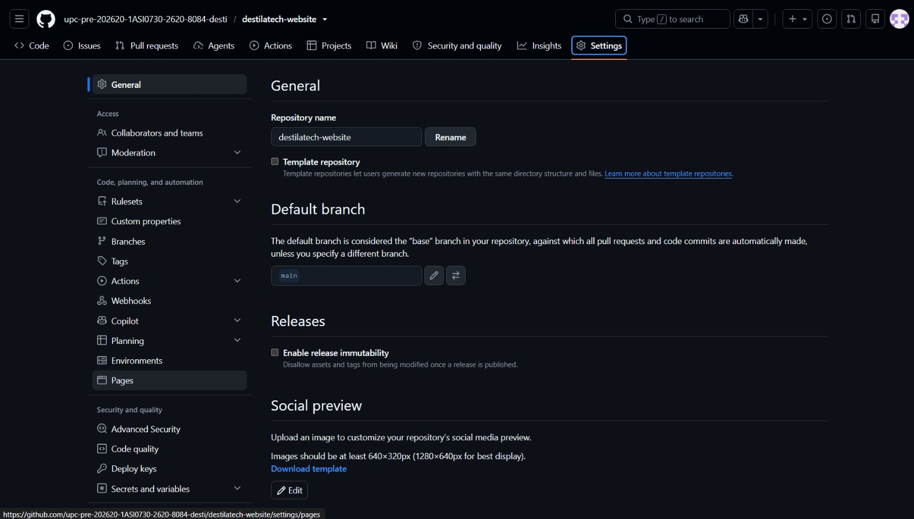
<br>

##### 5.1.4.1.4.  Seleccionamos la rama main de github-pages en el apartado de source y damos click en save para desplegar.


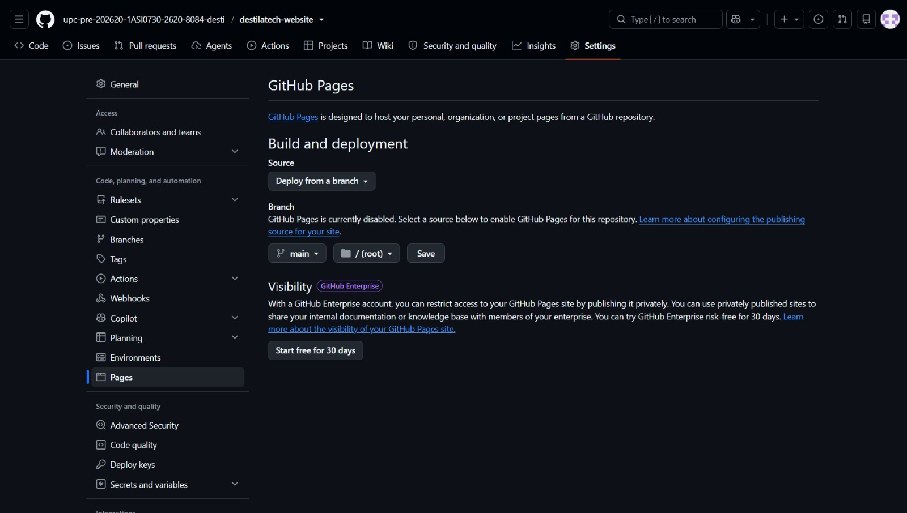
<br>

##### 5.1.4.1.5.  Finalmente estaría todo listo.

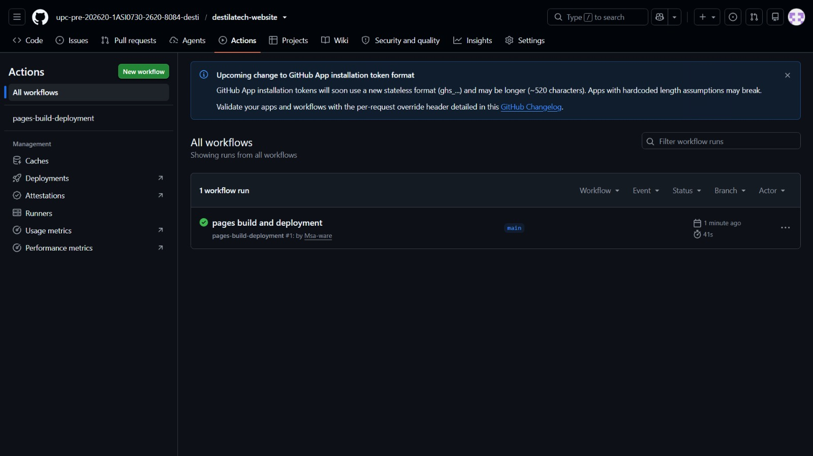
<br>

En resumen, Github Pages usa la rama main como origen de producción. Paralelamente, se configuró un flujo con GitHub actions que reacciona a los commits de la rama develop que compila con el código estático. Es así que, cuando las modificaciones son revisadas y aprobadas por el equipo en su fase de producción, la plataforma actualiza el sitio en una nueva versión.
