<div align="center">

</img><br>

Universidad Peruana de Ciencias Aplicadas<br>
Carrera de Ingeniería de Software<br><br>

<strong>1ASI0730</strong><br>
<strong>Aplicaciones Web</strong><br>
NRC<br>
<strong>8084</strong><br>
<strong>Informe del Trabajo Final</strong><br>
Docente<br>
<strong>Velasquez Nuñez, Angel Augusto</strong><br>
Equipo<br>
<strong>FuturosSeniors</strong><br><br>

Proyecto<br>
<strong>Destilatech</strong><br><br>

<strong>Integrantes</strong>

<table>
  <thead>
    <tr>
      <th>Código</th>
      <th>Apellidos y Nombres</th>
    </tr>
  </thead>
  <tbody>
    <tr>
      <td>U202317807</td>
      <td>Fernandez Seer Mario Alonso</td>
    </tr>
    <tr>
      <td>U202418755</td>
      <td>Santiago Atanacio, Jairo Mathias</td>
    </tr>
    <tr>
      <td>U202316845</td>
      <td>Almandroz Carbajal, Pierina Marysabel</td>
    </tr>
    <tr>
      <td>U202418405</td>
      <td>Condor Sandoval, Jean Pierre</td>
    </tr>
    <tr>
      <td>U202322404</td>
      <td>Domenack Angeles, Miguel</td>
    </tr>
  </tbody>
</table> 

<strong>Período 202620</strong><br><br>

<strong>Septiembre 2026</strong>
</div>
<div style="page-break-after: always;"></div>


## Registro de Versiones del Informe

| Versión | Fecha | Autor | Descripción de modificación |
| :---: | :---: | :---: | :--- |
| 0.1.0 | 12/09/2026 | Fernandez Seer, Mario Alonso | Estructura base del informe, carátula, perfil de la StartUp y definición de la propuesta de valor de Destilatech (`main`)|
| 0.2.0 | 13/09/2026 | Santiago Atanacio, Jairo Mathias | Elaboración del Lean UX Process completo: Problem Statements, Assumptions, 7 Hipótesis y Lean UX Canvas (`feat/chapter-1-introduction-and-lean-ux`) |
| 0.3.0 | 14/09/2026 | Condor Sandoval, Jean Pierre | Análisis competitivo de mercado (Solmicro, Ubidots, Defontana), diseño de guías y registro de entrevistas (`feat/chapter-2-requirements-elicitation-and-analysis`) |
| 0.4.0 | 14/09/2026 | Condor Sandoval, Jean Pierre | Desarrollo de artefactos de Needfinding: User Personas, User Task Matrix, User Journey Mapping y Empathy Mapping (`feat/chapter-2-needfinding`) |
| 0.5.0 | 15/09/2026 | Santiago Atanacio, Jairo Mathias | Taller y documentación del Big Picture Event Storming, definición del Ubiquitous Language y redacción inicial de User Stories (`feat/chapter-2-event-storming`) |
| 0.6.0 | 15/09/2026 | Almandroz Carbajal, Pierina Marysabel | Especificación de historias de usuario de inventario/catálogo (EP05) y estructuración del Impact Mapping (`feat/chapter-3-requirements-specification`) |
| 0.7.0 | 16/09/2026 | Santiago Atanacio, Jairo Mathias | Consolidación de 10 Épicas, 37 User Stories con criterios Gherkin y priorización del Product Backlog en Story Points (`feat/chapter-3-product-backlog`) |
| 0.8.0 | 16/09/2026 | Fernandez Seer, Mario Alonso | Desarrollo de Style Guidelines, arquitectura de información, Wireframes y Mock-ups de la Landing Page (`feat/chapter-4-product-design`) |
| 0.9.0 | 17/09/2026 | Domenack Angeles, Miguel | Elaboración del Design-Level Event Storming, especificación de diagramas de clases UML para los 6 Bounded Contexts y adaptabilidad móvil (`feat/chapter-4-software-architecture`) |
| 0.9.1 | 17/09/2026 | Almandroz Carbajal, Pierina Marysabel | Configuración de convenciones de código, maquetación de Platform Features y documentación del Sprint Backlog 1 (`feat/chapter-5-sprint-1`) |
| 0.9.2 | 18/09/2026 | Domenack Angeles, Miguel | Auditoría de calidad, corrección ortográfica y estructural de los Capítulos I al V, y diseño de la presentación en Canva (`feat/report-review-and-canva`) |
| 1.0.0 | 18/09/2026 | Todos los integrantes | Revisión general, unificación de ramas, verificación de despliegue en GitHub Pages y entrega final del Avance 1 (AV1 Report) (`main`) |
| 1.1.0 | 04/10/2026 | Santiago Atanacio, Jairo Mathias | Revisión integral conforme a la rúbrica del curso: reestructuración de los capítulos II a V (análisis de entrevistas con estadísticas en Excel, 65 historias de usuario con 10 historias técnicas, arquitectura de información, diagramas con descripciones y Sprint 1), figuras con formato APA 7, conclusiones, bibliografía y anexos, y corrección de ortografía y terminología |
| 1.1.1 | 05/10/2026 | Santiago Atanacio, Jairo Mathias | Sprint Planning 2 y base de la aplicación web: estructura del proyecto, Shared Kernel, Fake API, internacionalización ES / EN, módulo de pedidos y clientes, y selector de usuario que reemplaza al IAM, retirado del alcance del sprint (`main`, `feature/shared`, `feature/fake-api`, `feature/locales`, `feature/orders-replenishment`) |
| 1.1.2 | 05/10/2026 | Condor Sandoval, Jean Pierre | Módulo Billing (planes, suscripción, pago e historial) y aviso de fin de la prueba gratuita de la aplicación web, y documentación de sus historias en el Sprint Backlog 2 (`feature/billing`) |
| 1.1.3 | 05/10/2026 | Almandroz Carbajal, Pierina Marysabel | Módulos Inventory & Stock, Alerts & Notifications y Analytics & Estimations (dashboards e indicadores históricos), y su documentación en el Sprint Backlog 2 (`feature/inventory-stock`, `feature/alerts-notifications`, `feature/analytics-estimations`) |
| 1.1.4 | 05/10/2026 | Fernandez Seer, Mario Alonso | Módulo Production & Monitoring (lotes, trazabilidad y monitoreo IoT simulado) y su documentación en el Sprint Backlog 2 (`feature/production-monitoring`) |
| 1.1.5 | 05/10/2026 | Domenack Angeles, Miguel | Pruebas funcionales de la aplicación web (Billing, producción, inventario, pedidos, alertas e indicadores, e idioma ES / EN) y registro de las tareas de pruebas en el Sprint Backlog 2 (`main`) |
| 1.2.0 | 05/10/2026 | Santiago Atanacio, Jairo Mathias | Documentación del Sprint 2 (5.2.2): Sprint Planning, matriz de líderes, Sprint Backlog con 29 historias, 187 commits y 12 capturas de la aplicación web, exclusión del contexto IAM del alcance, recursos del Fake API y configuración de despliegue (`main`) |
| 1.2.1 | 05/10/2026 | Santiago Atanacio, Jairo Mathias | Ajustes por las indicaciones del docente: assumptions redactados como creencias, hypothesis statements con la plantilla del curso, eventos pivote y lenguaje ubicuo en el Big Picture EventStorming, y criterios de separación de *bounded contexts* en el Design-Level EventStorming; Sprint 2 sin el contexto IAM (`main`) |
| 1.2.2 | 05/10/2026 | Santiago Atanacio, Jairo Mathias | Ajustes por el feedback general del docente: Big Picture EventStorming rehecho como flujo *as-is* con sustento en las entrevistas, trazabilidad de las User Personas, diagramas C4 corregidos (SPA en dos contenedores, API como único contenedor y componentes de la SPA por *bounded context*), criterios de aceptación y tareas de los Sprint Backlog 1 y 2 (mínimo dos por historia), capturas de la aplicación web en inglés, orden del Product Backlog por prioridad y Sprint Goals orientados al valor para los segmentos |


<div style="page-break-after: always;"></div>

## Project Report Collaboration Insights

A continuación, se detallan los repositorios utilizados a lo largo del proyecto.

#### Link del repositorio del Reporte

- [destilatech-report](https://github.com/upc-pre-202620-1ASI0730-2620-8084-desti/destilatech-report)

#### Link del repositorio del Website

- [destilatech-website](https://github.com/upc-pre-202620-1ASI0730-2620-8084-desti/destilatech-website)

#### Link del Website

- [destilatech-website](https://upc-pre-202620-1asi0730-2620-8084-desti.github.io/destilatech-website/)

### Desarrollo de Actividades

A lo largo del ciclo de vida del proyecto, el equipo ha mantenido una comunicación constante utilizando canales de voz en Discord para las reuniones virtuales y coordinaciones generales. La carga de trabajo del informe y del desarrollo del software se distribuyó equitativamente con plazos adecuados para cada iteración, en este caso AV1. Finalmente, las sesiones presenciales fueron clave para obtener retroalimentación del docente, resolver impedimentos técnicos y optimizar el avance frente a los horarios limitados del grupo.

---

### Evidencias de Colaboración (GitHub Insights)

#### 1. Analíticas Globales del Equipo

**A. Pulse Insights (actividad general del repositorio del informe)**

**Figura 1**

*Pulse Insights del repositorio del informe (AV1)*

<p align="center">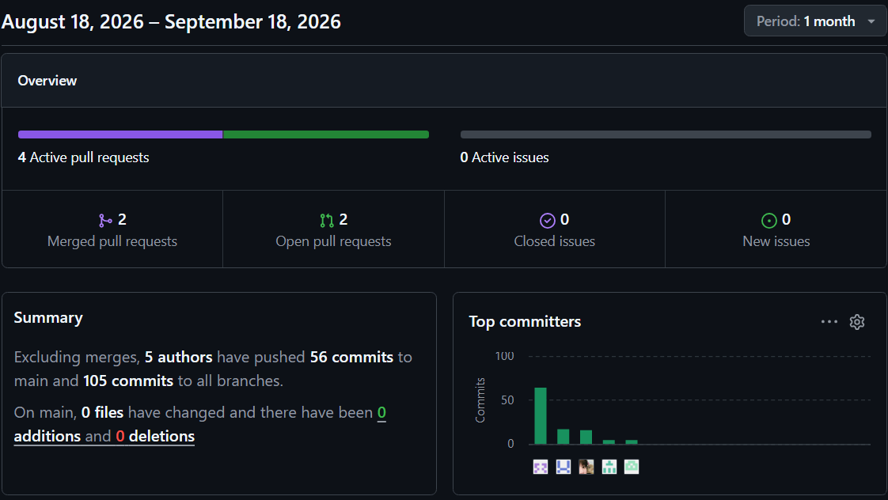</p>

*Nota.* Captura de GitHub Insights (2026).

*Descripción.* Resumen de actividad entre el 18 de agosto y el 18 de septiembre de 2026: 4 Pull Requests activas (2 integradas y 2 abiertas) y ninguna incidencia. Cinco autores enviaron 56 commits a `main` y 105 commits a todas las ramas.


**B. Contributors Insights (evolución de aportes)**

**Figura 2**

*Contributors Insights del repositorio del informe (AV1)*

<p align="center">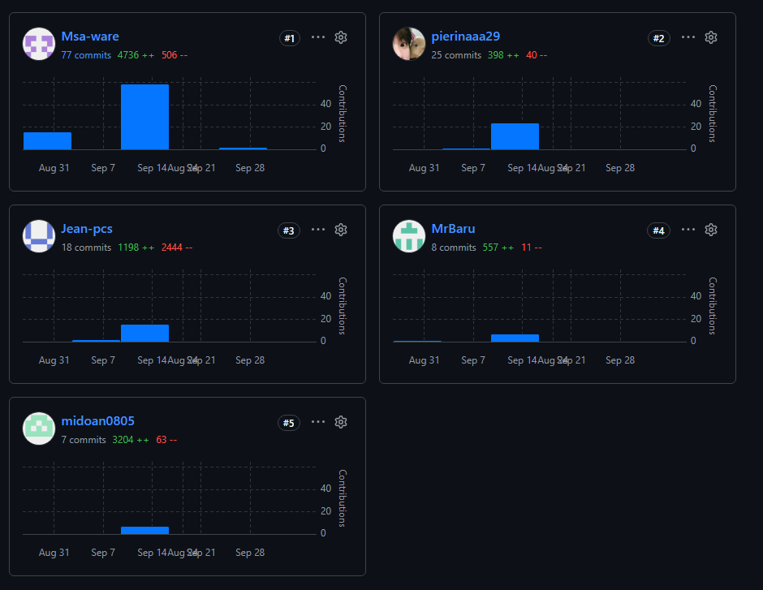</p>

*Nota.* Captura de GitHub Insights (2026).

*Descripción.* Aportes de los cinco integrantes al repositorio del informe entre el 31 de agosto y el 28 de septiembre de 2026, con pico de actividad en torno al 14 de septiembre. Msa-ware registra 77 commits (4,736 líneas añadidas y 506 eliminadas), pierinaaa29 25 (398 y 40), Jean-pcs 18 (1,198 y 2,444), MrBaru 8 (557 y 11) y midoan0805 7 (3,204 y 63).


---

#### 2. Evidencias Individuales (Commits por Integrante)

A continuación, se detalla el progreso y la constancia de los *commits* realizados por cada miembro a lo largo del ciclo.

**Fernandez Seer, Mario Alonso**

**Figura 3**

*Commits de Fernandez Seer, Mario Alonso (AV1)*

<p align="center">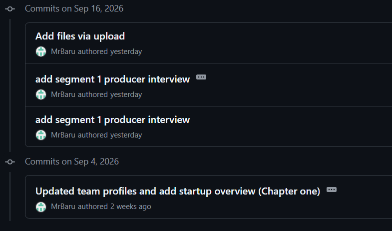</p>

*Nota.* Captura de GitHub (2026).

*Descripción.* Historial de commits del 4 y el 16 de septiembre de 2026, con los mensajes «Updated team profiles and add startup overview (Chapter one)», «add segment 1 producer interview» (dos veces) y «Add files via upload».


**Santiago Atanacio, Jairo Mathias**

**Figura 4**

*Commits de Santiago Atanacio, Jairo Mathias (AV1)*

<p align="center">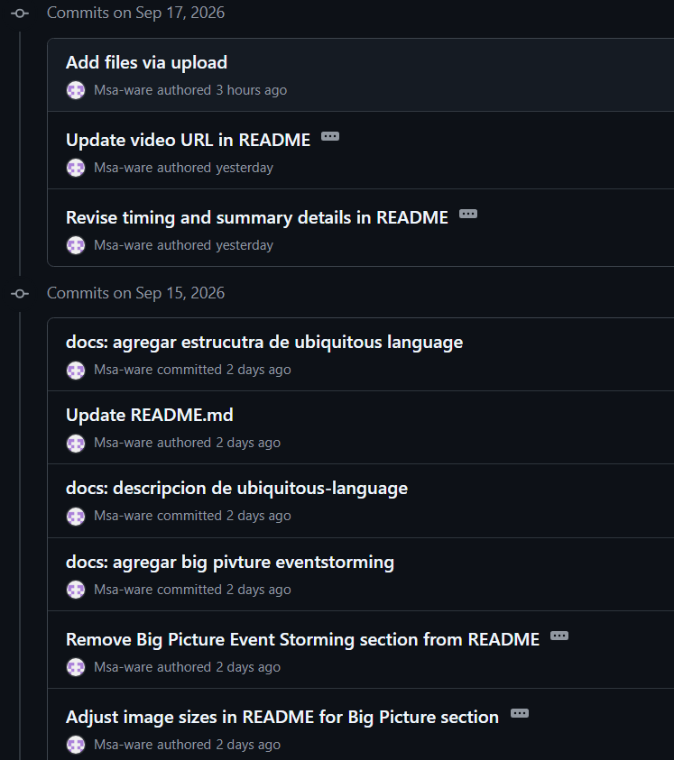</p>

*Nota.* Captura de GitHub (2026).

*Descripción.* Historial de commits del 15 y el 17 de septiembre de 2026, con mensajes sobre el Big Picture EventStorming, la descripción del Ubiquitous Language, actualizaciones del README y de la URL del video.


**Almandroz Carbajal, Pierina Marysabel**

**Figura 5**

*Commits de Almandroz Carbajal, Pierina Marysabel (AV1)*

<p align="center">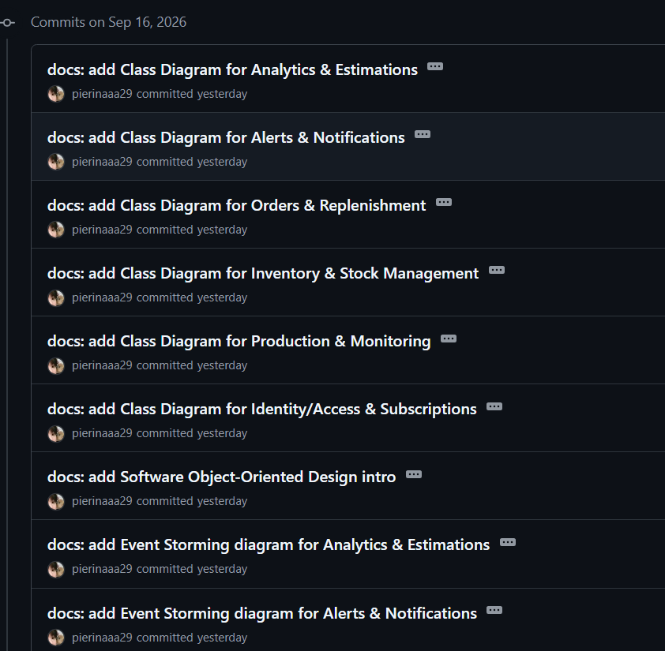</p>

*Nota.* Captura de GitHub (2026).

*Descripción.* Historial de commits del 16 de septiembre de 2026, con los diagramas de clases de seis contextos del dominio, la introducción al diseño orientado a objetos y diagramas de Event Storming.


**Condor Sandoval, Jean Pierre**

**Figura 6**

*Commits de Condor Sandoval, Jean Pierre (AV1)*

<p align="center">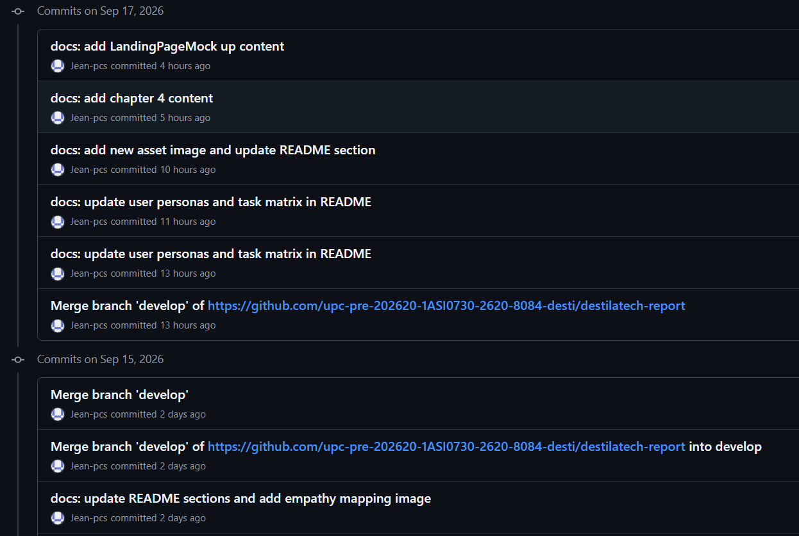</p>

*Nota.* Captura de GitHub (2026).

*Descripción.* Historial de commits del 15 y el 17 de septiembre de 2026, con mensajes sobre el contenido del capítulo 4, el mock-up de la landing page, las User Personas, la User Task Matrix y el mapa de empatía, además de integraciones de la rama `develop`.


**Domenack Angeles, Miguel**

**Figura 7**

*Commits de Domenack Angeles, Miguel (AV1)*

<p align="center">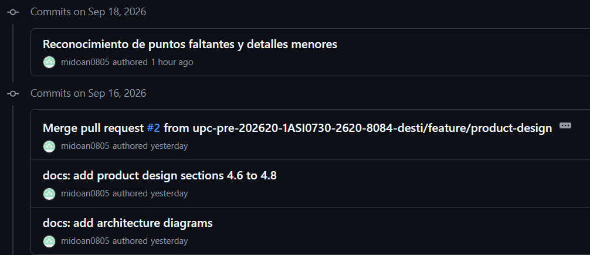</p>

*Nota.* Captura de GitHub (2026).

*Descripción.* Historial de commits del 16 y el 18 de septiembre de 2026, con la integración de la Pull Request #2 de la rama `feature/product-design`, las secciones de diseño de producto, los diagramas de arquitectura y la revisión de detalles menores.


# Contenido

## Índice

- [Registro de Versiones del Informe](#registro-de-versiones-del-informe)
- [Project Report Collaboration Insights](#project-report-collaboration-insights)
- [Student Outcome](#student-outcome)
- [Capítulo I: Introducción](#capítulo-i-introducción)
  - [1.1. StartUp Profile](#11-startup-profile)
    - [1.1.1. Descripción de la StartUp](#111-descripción-de-la-startup)
    - [1.1.2. Perfiles de Integrantes del equipo](#112-perfiles-de-integrantes-del-equipo)
  - [1.2. Solution Profile](#12-solution-profile)
    - [1.2.1. Antecedentes y Problemática](#121-antecedentes-y-problemática)
      - [1.2.1.1. Objetivos y alcance inicial](#1211-objetivos-y-alcance-inicial)
      - [1.2.1.2. Restricciones](#1212-restricciones)
    - [1.2.2. Lean UX Process](#122-lean-ux-process)
      - [1.2.2.1. Lean UX Problem Statements](#1221-lean-ux-problem-statements)
      - [1.2.2.2. Lean UX Assumptions](#1222-lean-ux-assumptions)
      - [1.2.2.3. Lean UX Hypothesis Statements](#1223-lean-ux-hypothesis-statements)
      - [1.2.2.4. Lean UX Canvas](#1224-lean-ux-canvas)
  - [1.3. Segmentos objetivo](#13-segmentos-objetivo)
    - [1.3.1. Segmento 1: Pequeños y medianos productores de pisco](#131-segmento-1-pequeños-y-medianos-productores-de-pisco)
    - [1.3.2. Segmento 2: Pequeños comercializadores de pisco](#132-segmento-2-pequeños-comercializadores-de-pisco)
    - [1.3.3. Relación entre los segmentos](#133-relación-entre-los-segmentos)
- [Capítulo II: Requirements Elicitation & Analysis](#capítulo-ii-requirements-elicitation--analysis)
  - [2.1. Competidores](#21-competidores)
    - [2.1.1. Análisis competitivo](#211-análisis-competitivo)
    - [2.1.2. Estrategias y tácticas frente a competidores](#212-estrategias-y-tácticas-frente-a-competidores)
  - [2.2. Entrevistas](#22-entrevistas)
    - [2.2.1. Diseño de entrevistas](#221-diseño-de-entrevistas)
    - [2.2.2. Registro de entrevistas](#222-registro-de-entrevistas)
    - [2.2.3. Análisis de entrevistas](#223-análisis-de-entrevistas)
  - [2.3. Needfinding](#23-needfinding)
    - [2.3.1. User Personas](#231-user-personas)
    - [2.3.2. User Task Matrix](#232-user-task-matrix)
    - [2.3.3. User Journey Mapping](#233-user-journey-mapping)
    - [2.3.4. Empathy Mapping](#234-empathy-mapping)
  - [2.4. Big Picture EventStorming](#24-big-picture-eventstorming)
    - [2.4.1. Pasos del Big Picture EventStorming](#241-pasos-del-big-picture-eventstorming)
    - [2.4.2. Actores identificados](#242-actores-identificados)
    - [2.4.3. Flujo del Productor](#243-flujo-del-productor)
    - [2.4.4. Flujo del Comercializador](#244-flujo-del-comercializador)
    - [2.4.5. Áreas candidatas identificadas](#245-áreas-candidatas-identificadas)
    - [2.4.6. Eventos pivote y lenguaje ubicuo descubierto](#246-eventos-pivote-y-lenguaje-ubicuo-descubierto)
    - [2.4.7. Conclusiones del Big Picture](#247-conclusiones-del-big-picture)
  - [2.5. Ubiquitous Language](#25-ubiquitous-language)
- [Capítulo III: Requirements Specification](#capítulo-iii-requirements-specification)
  - [3.1. User Stories](#31-user-stories)
  - [3.2. Impact Mapping](#32-impact-mapping)
  - [3.3. Product Backlog](#33-product-backlog)
- [Capítulo IV: Product Design](#capítulo-iv-product-design)
  - [4.1. Style Guidelines](#41-style-guidelines)
    - [4.1.1. General Style Guidelines](#411-general-style-guidelines)
    - [4.1.2. Web Style Guidelines](#412-web-style-guidelines)
    - [4.1.3. Mobile Style Guidelines](#413-mobile-style-guidelines)
  - [4.2. Information Architecture](#42-information-architecture)
    - [4.2.1. Organization Systems](#421-organization-systems)
    - [4.2.2. Labeling Systems](#422-labeling-systems)
    - [4.2.3. SEO Tags and Meta Tags](#423-seo-tags-and-meta-tags)
    - [4.2.4. Searching Systems](#424-searching-systems)
    - [4.2.5. Navigation Systems](#425-navigation-systems)
  - [4.3. Landing Page UI Design](#43-landing-page-ui-design)
    - [4.3.1. Landing Page Wireframe](#431-landing-page-wireframe)
    - [4.3.2. Landing Page Mock-up](#432-landing-page-mock-up)
  - [4.4. Web Applications UX/UI Design](#44-web-applications-uxui-design)
    - [4.4.1. Web Applications Wireframes](#441-web-applications-wireframes)
    - [4.4.2. Web Applications Wireflow Diagrams](#442-web-applications-wireflow-diagrams)
    - [4.4.3. Web Applications Mock-ups](#443-web-applications-mock-ups)
    - [4.4.4. Web Applications User Flow Diagrams](#444-web-applications-user-flow-diagrams)
  - [4.5. Web Applications Prototyping](#45-web-applications-prototyping)
  - [4.6. Domain-Driven Software Architecture](#46-domain-driven-software-architecture)
    - [4.6.1. Design-Level EventStorming](#461-design-level-eventstorming)
    - [4.6.2. Software Architecture Context Diagram](#462-software-architecture-context-diagram)
    - [4.6.3. Software Architecture Container Diagrams](#463-software-architecture-container-diagrams)
    - [4.6.4. Software Architecture Components Diagrams](#464-software-architecture-components-diagrams)
  - [4.7. Software Object-Oriented Design](#47-software-object-oriented-design)
    - [4.7.1. Class Diagrams](#471-class-diagrams)
  - [4.8. Database Design](#48-database-design)
    - [4.8.1. Database Diagrams](#481-database-diagrams)
- [Capítulo V: Product Implementation, Validation & Deployment](#capítulo-v-product-implementation-validation--deployment)
  - [5.1. Software Configuration Management](#51-software-configuration-management)
    - [5.1.1. Software Development Environment Configuration](#511-software-development-environment-configuration)
    - [5.1.2. Source Code Management](#512-source-code-management)
    - [5.1.3. Source Code Style Guide & Conventions](#513-source-code-style-guide--conventions)
    - [5.1.4. Software Deployment Configuration](#514-software-deployment-configuration)
      - [5.1.4.1. Landing Page](#5141-landing-page)
      - [5.1.4.2. Web Application](#5142-web-application)
  - [5.2. Landing Page, Services & Applications Implementation](#52-landing-page-services--applications-implementation)
    - [5.2.1. Sprint 1](#521-sprint-1)
      - [5.2.1.1. Sprint Planning 1](#5211-sprint-planning-1)
      - [5.2.1.2. Aspect Leaders and Collaborators](#5212-aspect-leaders-and-collaborators)
      - [5.2.1.3. Sprint Backlog 1](#5213-sprint-backlog-1)
      - [5.2.1.4. Development Evidence for Sprint Review](#5214-development-evidence-for-sprint-review)
      - [5.2.1.5. Execution Evidence for Sprint Review](#5215-execution-evidence-for-sprint-review)
      - [5.2.1.6. Services Documentation Evidence for Sprint Review](#5216-services-documentation-evidence-for-sprint-review)
      - [5.2.1.7. Software Deployment Evidence for Sprint Review](#5217-software-deployment-evidence-for-sprint-review)
      - [5.2.1.8. Team Collaboration Insights during Sprint](#5218-team-collaboration-insights-during-sprint)
    - [5.2.2. Sprint 2](#522-sprint-2)
      - [5.2.2.1. Sprint Planning 2](#5221-sprint-planning-2)
      - [5.2.2.2. Aspect Leaders and Collaborators](#5222-aspect-leaders-and-collaborators)
      - [5.2.2.3. Sprint Backlog 2](#5223-sprint-backlog-2)
      - [5.2.2.4. Development Evidence for Sprint Review](#5224-development-evidence-for-sprint-review)
      - [5.2.2.5. Execution Evidence for Sprint Review](#5225-execution-evidence-for-sprint-review)
      - [5.2.2.6. Services Documentation Evidence for Sprint Review](#5226-services-documentation-evidence-for-sprint-review)
      - [5.2.2.7. Software Deployment Evidence for Sprint Review](#5227-software-deployment-evidence-for-sprint-review)
      - [5.2.2.8. Team Collaboration Insights during Sprint](#5228-team-collaboration-insights-during-sprint)
- [Conclusiones](#conclusiones)
- [Bibliografía](#bibliografía)
- [Anexos](#anexos)
  - [Anexo A. Archivos complementarios](#anexo-a-archivos-complementarios)
  - [Anexo B. Videos de Exposiciones](#anexo-b-videos-de-exposiciones)
  - [Anexo C. Video de las entrevistas](#anexo-c-video-de-las-entrevistas)


<div style="page-break-after: always;"></div>


## Student Outcome

El curso contribuye al cumplimiento del Student Outcome ABET:<br><br>
<b>ABET – EAC - Student Outcome 5</b><br>
<b>Criterio:</b> La capacidad de funcionar efectivamente en un equipo cuyos miembros juntos proporcionan liderazgo, crean un entorno de colaboración e inclusivo, establecen objetivos, planifican tareas y cumplen objetivos.<br><br>
En el siguiente cuadro se describe las acciones realizadas y enunciados de conclusiones por parte del grupo, que permiten sustentar el haber alcanzado el logro del ABET – EAC - Student Outcome 5.<br><br>

<table>
<thead>
<tr>
<th colspan="3"><b>Criterio específico</b></th>
<th colspan="3"><b>Acciones realizadas</b></th>
<th colspan="3"><b>Conclusiones</b></th>
</tr>
</thead>
<tbody>
<tr>
<td colspan="3">Trabaja en equipo para proporcionar liderazgo en forma conjunta.</td>
<td colspan="3" align="justify">
<h3>Santiago Atanacio, Jairo Mathias</h3>
<b>AV1</b><p>Durante el desarrollo de este proyecto, gestioné la participación grupal en la elaboración de secciones como Lean UX Canvas, análisis competitivo, la implementación del Big Picture Event Storming, elaboración de user stories y product backlog, contribuyendo tanto en el diseño visual como en la estructuración lógica del sistema. Además, fomenté el trabajo en equipo durante la creación, redacción y despliegue de la Landing Page.</p>
<b>TB1</b><p>Lideré la planificación del Sprint 2 y la base técnica de la aplicación web: el Shared Kernel, el Fake API, la internacionalización y la estructura de ramas por <i>bounded context</i>, que permitió que cada integrante trabajara su módulo sin interferir con los demás. También coordiné la integración de los módulos y la documentación del Sprint 2 en el informe.</p>
  
<h3>Fernandez Seer, Mario Alonso</h3>
<b>AV1</b><p>Como líder del equipo, coordiné la definición de la propuesta de valor, los segmentos objetivo y el alcance funcional de Destilatech, procurando que las decisiones del proyecto respondieran a las necesidades identificadas en el sector pisquero. Realicé y documenté la Entrevista #2 del Segmento 1 a un productor de Pisco Don Ítalo, cuyos hallazgos permitieron validar necesidades relacionadas con el monitoreo de variables, la gestión de lotes y el control de inventario. Asimismo, lideré la elaboración de los wireframes, wireflows, mock-ups, user flows y el prototipo interactivo de la aplicación web, alineando estos artefactos con los requisitos y compartiéndolos con el equipo para su integración en el informe.</p>
<b>TB1</b><p>Lideré el módulo de producción y monitoreo: el registro de lotes, el avance de etapas, el detalle y la trazabilidad del lote, y el monitoreo de variables con el simulador de lecturas IoT y la detección de anomalías. Coordiné con el equipo las reglas que conectan producción con alertas e inventario.</p>


<h3>Almandroz Carbajal, Pierina Marysabel</h3>
<b>AV1</b><p>Lideré la definición y especificación funcional del módulo de inventario y catálogo de productos (Épica EP05), asegurando que las historias de usuario reflejaran de manera precisa las necesidades comerciales del sector. Además, coordiné activamente la estructuración y diseño de la sección de Platform Features en la Landing Page, orientando al equipo en la diferenciación de vistas y funcionalidades para productores y comercializadores.</p>
<b>TB1</b><p>Lideré los módulos de inventario, alertas y análisis: el catálogo y los movimientos de stock, el centro de alertas, los dashboards del productor y del comercializador, la estimación de reposición y los indicadores históricos. Definí con el equipo cómo se comunican estos módulos mediante eventos.</p>

<h3>Condor Sandoval, Jean Pierre</h3>
<b>AV1</b><p>Lideré y gestioné activamente la fase de investigación de usuarios y diseño de experiencia del producto. Me encargué del análisis de las entrevistas realizadas a los usuarios clave y de la definición de los User Personas, User Task Matrix, User Journey Mapping y Empathy Mapping, garantizando una comprensión clara de sus necesidades. Asimismo, participé en la definición del Impact Mapping y en el establecimiento de los lineamientos de diseño (General Style Guidelines y Web Style Guidelines), además del diseño de los Landing Page Wireframes para asegurar la consistencia del sistema.</p>
<b>TB1</b><p>Lideré el módulo de suscripciones y pagos (Billing): los planes, el flujo de contratación con la pasarela en modo de pruebas, el historial de pagos y el aviso de fin de la prueba gratuita. Colaboré en el Shared Kernel y en el módulo de pedidos y reposición.</p>

<h3>Domenack Angeles, Miguel</h3>
<b>AV1</b><p>Asumí el liderazgo en la verificación de la calidad del entregable mediante la auditoría continua y corrección de errores en la redacción y estructura del informe general. Asimismo, coordiné y estructuré el diseño de la presentación en Canva para la exposición académica del avance, y colaboré estrechamente en el modelado del Capítulo IV, aportando en la elaboración de las guías de estilo, la arquitectura de información y la especificación de los diagramas del sistema.</p>
<b>TB1</b><p>Lideré las pruebas funcionales de la aplicación web, que abarcan los módulos de Billing, producción, inventario, pedidos, alertas e indicadores, y el cambio de idioma y la navegación por perfil. Los resultados de las pruebas se comunicaron al equipo para corregir los errores antes de la revisión del sprint.</p>
</td>
<td colspan="3" align="justify">
<b>AV1</b><p>Se logró completar la primera parte del trabajo demostrando un liderazgo distribuido y eficaz. La asignación clara de roles estratégicos y técnicos permitió cumplir los objetivos de investigación, diseño conceptual y despliegue del Sprint 1 en los plazos previstos, manteniendo una comunicación constante y resolviendo impedimentos en equipo.</p>
<b>TB1</b><p>En el Sprint 2 el liderazgo se distribuyó por módulos: cada integrante lideró uno o más <i>bounded contexts</i> de la aplicación web y un integrante lideró las pruebas. Esta asignación permitió construir en paralelo seis módulos y cerrar las historias de interfaz del sprint.</p>
</td>
</tr>
<tr>
<td colspan="3">Crea un entorno colaborativo e inclusivo, establece metas, planifica tareas y cumple objetivos.</td>
<td colspan="3" align="justify">
<h3>Santiago Atanacio, Jairo Mathias</h3>
<b>AV1</b><p>Contribuí en la entrega de tareas responsablemente, logrando completar la primera parte del trabajo sin problemas mayores. Asumí un rol activo en la planificación de sprints, la redacción colaborativa de los requisitos y el despliegue del sitio web, asegurando que todos los integrantes contaran con tareas claras y plazos realistas.</p>
<b>TB1</b><p>Asumí el módulo de clientes y pedidos y el selector de usuario que sustituye al inicio de sesión. Mantuve el Sprint Backlog y el tablero del equipo al día y planifiqué las tareas de cada integrante según su módulo, con plazos acordados en el Sprint Planning 2.</p>

<h3>Fernandez Seer, Mario Alonso</h3>
<b>AV1</b><p>Organicé mis entregables de acuerdo con los objetivos asignados y trabajé mediante ramas independientes para evitar interferir con los avances de mis compañeros. Cumplí con la realización, registro y síntesis de la entrevista del Segmento 1, así como con el desarrollo de los artefactos UX/UI de la aplicación web en Figma. Además, adapté la numeración, las rutas de las imágenes y la documentación al formato existente del informe, incorporando las observaciones del equipo y manteniendo la trazabilidad de los aportes mediante commits en GitHub. De esta manera, facilité que el trabajo pudiera revisarse, integrarse y reutilizarse por los demás integrantes.</p>
<b>TB1</b><p>Trabajé en la rama independiente <code>feature/production-monitoring</code> y registré mis aportes desde mi propia cuenta, de modo que la rama se integró sin conflictos. Cumplí las tareas asignadas del módulo de producción dentro del Sprint 2.</p>


<h3>Almandroz Carbajal, Pierina Marysabel</h3>
<b>AV1</b><p>Promoví el trabajo colaborativo asegurando que los criterios de aceptación de las historias de usuario de inventario fueran comprendidos y validados por todos los miembros. Cumplí responsablemente con la maquetación de la sección de Platform Features y colaboré en la revisión de los flujos de interacción del comercializador, integrando las sugerencias del grupo en el backlog.</p>
<b>TB1</b><p>Cumplí con la entrega de mis tres módulos y revisé con mis compañeros las reglas de stock bajo y de reposición para que coincidieran con los criterios de aceptación de las historias de usuario.</p>

<h3>Condor Sandoval, Jean Pierre</h3>
<b>AV1</b><p>Asumí la responsabilidad del cumplimiento en tiempo y forma de las tareas asignadas en las fases de investigación y diseño visual. Colaboré activamente con el equipo coordinando la validación del comportamiento y flujo de los usuarios mediante la matriz de tareas y mapas de empatía, asegurando que todos los miembros tuvieran una visión clara y compartida sobre el diseño UI/UX y la estructura del proyecto en la Landing Page Wireframe.</p>
<b>TB1</b><p>Cumplí las tareas del módulo de Billing en la rama <code>feature/billing</code>. Además, inicié el módulo de IAM que luego el equipo retiró del alcance del sprint, y acepté el ajuste de alcance para mantener el foco en las historias de mayor valor.</p>

<h3>Domenack Angeles, Miguel</h3>
<b>AV1</b><p>Promoví un ambiente de trabajo transparente y colaborativo al revisar minuciosamente cada sección del informe y compartir retroalimentación oportuna con el equipo para subsanar inconsistencias antes de la entrega final. En la parte de desarrollo, cumplí cabalmente con la tarea asignada de diseño adaptativo (Responsive Design), garantizando que la Landing Page funcionara de manera óptima en dispositivos móviles y de escritorio, además de estructurar el soporte visual en Canva para el equipo.</p>
<b>TB1</b><p>Cumplí con las tareas de pruebas registradas en el Sprint Backlog 2 y apoyé la verificación de que cada módulo respondiera a los criterios de aceptación antes de cerrar el sprint.</p>
</td>
<td colspan="3" align="justify">
<b>AV1</b><p>El equipo consolidó un entorno inclusivo y de alta disciplina de trabajo, planificando tareas a través de tableros ágiles y cumpliendo el 100% de las historias asignadas para el primer hito del proyecto. Esto sienta una base sólida para afrontar las siguientes fases de desarrollo de la aplicación web y backend.</p>
<b>TB1</b><p>El equipo planificó el Sprint 2 con un Sprint Backlog descompuesto en tareas, ramas <code>feature/*</code> por módulo y commits desde la cuenta de cada integrante. Ante el ajuste de alcance que retiró el contexto IAM, el equipo reorganizó sus tareas sin perder el objetivo del sprint.</p>
</td>
</tr>
</tbody>
</table>


## Capítulo I: Introducción

### 1.1. StartUp Profile

#### 1.1.1. Descripción de la StartUp

**FuturosSeniors** es una startup tecnológica orientada al desarrollo de soluciones digitales que permitan optimizar procesos productivos y comerciales mediante el uso de tecnologías web, análisis de datos e integración con soluciones IoT.

Su producto principal, **Destilatech**, es una plataforma web orientada inicialmente al ecosistema peruano del pisco. La solución busca centralizar información relacionada con la producción, inventario y comercialización del producto, permitiendo que diferentes actores puedan consultar y gestionar información relevante desde una misma plataforma.

El principal grupo de usuarios de Destilatech está conformado por pequeños y medianos productores de pisco. Para ellos, la plataforma contempla herramientas de monitoreo de producción, gestión de lotes, inventario, alertas y análisis de información. Adicionalmente, se considera como segmento complementario a pequeños negocios encargados de la comercialización de pisco, como licorerías, bodegas comerciales y pequeños distribuidores, quienes podrán utilizar principalmente funcionalidades relacionadas con inventario, pedidos y reposición.

Destilatech contempla una futura integración con dispositivos IoT capaces de registrar variables relevantes durante los procesos de producción y almacenamiento. Dentro del alcance académico del proyecto, los dispositivos físicos no serán desarrollados; en su lugar, se utilizarán fuentes de datos simuladas que permitan representar el comportamiento de sensores y desarrollar la arquitectura de software necesaria para una futura integración con hardware real.

La propuesta de negocio se plantea bajo un modelo **Business-to-Business (B2B)** basado en **Software as a Service (SaaS)**. Los potenciales clientes podrán acceder a un **periodo de prueba gratuito de hasta 14 días**, luego del cual deberán contratar un plan de suscripción para continuar utilizando la plataforma.

Como oportunidad de crecimiento futura, Destilatech podrá complementar su modelo de suscripción mediante servicios de instalación, configuración, integración y mantenimiento de dispositivos IoT compatibles con la plataforma. De esta manera, el modelo de negocio podría generar ingresos tanto mediante la suscripción al software como por servicios tecnológicos especializados.

El mercado inicial se concentra en el sector pisquero peruano. De acuerdo con información publicada por el Ministerio de la Producción, durante 2024 la industria del pisco estuvo conformada por más de **527 empresas formales, en su mayoría MYPE**, y alcanzó una producción aproximada de **7.8 millones de litros**.

La solución se enfocará inicialmente en el pisco con la finalidad de mantener un dominio de negocio específico y un alcance viable para el desarrollo del producto. En una etapa futura, luego de validar la propuesta dentro de este mercado, Destilatech podría adaptarse a productores y comercializadores de otras bebidas alcohólicas que presenten necesidades similares.

**Propuesta de valor:**

> Destilatech centraliza el monitoreo de producción, la gestión de inventario y las operaciones comerciales relacionadas con el pisco en una plataforma web, integrando datos IoT y herramientas de análisis para facilitar una toma de decisiones más rápida, informada y eficiente.

**Principales capacidades de la solución:**

1. **Monitoreo inteligente de producción:** permite visualizar información relacionada con las condiciones del proceso productivo y almacenamiento mediante datos provenientes de fuentes IoT simuladas y, en una implementación futura, dispositivos físicos.

2. **Gestión de inventario y operaciones:** permite registrar productos, lotes, existencias, movimientos de inventario, clientes y pedidos desde una misma plataforma.

3. **Análisis y apoyo a la planificación:** utiliza información histórica de inventario y operaciones para generar alertas y estimaciones que permitan anticipar necesidades de reposición o nueva producción.

#### 1.1.2. Perfiles de Integrantes del equipo

| **Código** | **Nombre completo del integrante** | **Descripción de la carrera** | **Fotografía** | **Conocimientos y habilidades** |
| :--- | :--- | :--- | :--- | :--- |
| U202317807 | Fernandez Seer, Mario Alonso | Ingeniería de Software Universidad Peruana de Ciencias Aplicadas | <br><b>Figura 8</b><br><i>Fotografía de Fernandez Seer, Mario Alonso</i><br><i>Nota.</i> Fotografía proporcionada por el integrante.<br><i>Descripción.</i> Retrato del integrante Fernandez Seer, Mario Alonso del equipo FuturosSeniors. | Estudiante de Ingeniería de Software con conocimientos relacionados con desarrollo de software, análisis de requisitos y diseño de soluciones tecnológicas. Como líder del proyecto, participa en la definición de la propuesta de Destilatech, organización del equipo y alineamiento de las funcionalidades del producto con las necesidades identificadas dentro del dominio. |
| U202418755 | Santiago Atanacio, Jairo Mathias | Ingeniería de Software Universidad Peruana de Ciencias Aplicadas | <br><b>Figura 9</b><br><i>Fotografía de Santiago Atanacio, Jairo Mathias</i><br><i>Nota.</i> Fotografía proporcionada por el integrante.<br><i>Descripción.</i> Retrato del integrante Santiago Atanacio, Jairo Mathias del equipo FuturosSeniors. | Soy estudiante de Ingeniería de Software. Cuento con una base sólida en el desarrollo de algoritmos en C++, la creación de interfaces web interactivas mediante HTML, CSS y JavaScript, y el dominio de bases de datos relacionales (MySQL) y no relacionales (MongoDB). Me apasiona transformar problemas complejos en soluciones de software eficientes, escalables y con una gestión de datos versátil. Mi enfoque combina la rigurosidad técnica con habilidades blandas como la proactividad y la empatía, lo que me permite integrarme fácilmente en equipos colaborativos bajo enfoques ágiles. |
| U202316845 | Almandroz Carbajal, Pierina Marysabel | Ingeniería de Software Universidad Peruana de Ciencias Aplicadas | <br><b>Figura 10</b><br><i>Fotografía de Almandroz Carbajal, Pierina Marysabel</i><br><i>Nota.</i> Fotografía proporcionada por el integrante.<br><i>Descripción.</i> Retrato del integrante Almandroz Carbajal, Pierina Marysabel del equipo FuturosSeniors. | Soy estudiante de Ingeniería de Software en la Universidad Peruana de Ciencias Aplicadas. Dentro del equipo me enfoco en el diseño de la arquitectura de software del proyecto, aplicando Domain-Driven Design, Event Storming a nivel de diseño y el C4 Model para representar los niveles de Context, Container y Component, así como los Class Diagrams y el modelo de base de datos de cada Bounded Context. También coordino el flujo de trabajo en Git y GitHub del equipo, cuidando la organización de ramas, commits y Pull Requests del repositorio. |
| U202418405 | Condor Sandoval, Jean Pierre | Ingeniería de Software Universidad Peruana de Ciencias Aplicadas | <br><b>Figura 11</b><br><i>Fotografía de Condor Sandoval, Jean Pierre</i><br><i>Nota.</i> Fotografía proporcionada por el integrante.<br><i>Descripción.</i> Retrato del integrante Condor Sandoval, Jean Pierre del equipo FuturosSeniors. | Estudiante de Ingeniería de Software con conocimientos en desarrollo de software, programación, análisis de requisitos y diseño de soluciones tecnológicas. Cuenta con experiencia académica en el desarrollo de aplicaciones y gestión de proyectos de software. Se caracteriza por su capacidad para resolver problemas, trabajar en equipo y adaptarse a diferentes tecnologías y enfoques de desarrollo. |
| U202322404 | Domenack Angeles, Miguel | Ingeniería de Software Universidad Peruana de Ciencias Aplicadas | <br><b>Figura 12</b><br><i>Fotografía de Domenack Angeles, Miguel</i><br><i>Nota.</i> Fotografía proporcionada por el integrante.<br><i>Descripción.</i> Retrato del integrante Domenack Angeles, Miguel del equipo FuturosSeniors. | Soy estudiante de Ingeniería de Software y actualmente estoy cursando el 6to ciclo en la Universidad de Ciencias Aplicadas. Tengo conocimientos en lenguaje de programación de Python y experiencia con una gran cantidad de grupos de trabajo. Me presento como una persona que desea aprender todo lo relacionado a la programación, redes móviles y la tecnología del futuro, mientras me esfuerzo tanto de manera individual como con mis compañeros de grupos al realizar trabajos que pidan disciplina organización y resiliencia. |


### 1.2. Solution Profile

#### 1.2.1. Antecedentes y Problemática

La producción y comercialización de pisco involucra diferentes actividades relacionadas con elaboración, supervisión de lotes, almacenamiento, inventario, pedidos y distribución del producto. Durante estas actividades se genera información que puede ser utilizada para conocer el estado de las operaciones y apoyar la toma de decisiones.

Destilatech parte de la hipótesis de que, especialmente en pequeños y medianos negocios, parte de esta información puede encontrarse distribuida entre registros manuales, hojas de cálculo, herramientas de comunicación, instrumentos de medición y otros mecanismos independientes. Como consecuencia, los responsables de una operación pueden necesitar consultar diferentes fuentes para determinar el estado de su producción, inventario o necesidades de reposición.

En el caso de los productores, además, existen variables relacionadas con los procesos de producción y almacenamiento que pueden ser monitoreadas mediante sensores y dispositivos IoT. Integrar estos datos con la información operativa representa una oportunidad para desarrollar un sistema centralizado de supervisión y gestión.

Por otra parte, licorerías, bodegas comerciales y pequeños distribuidores necesitan controlar las existencias de los productos que comercializan y planificar su reposición. La incorporación de este segmento permite analizar otra etapa dentro de la cadena comercial del pisco y explorar necesidades relacionadas con inventario, pedidos y abastecimiento.

Destilatech propone una plataforma común para ambos tipos de usuarios, presentando funcionalidades diferentes según sus necesidades. Los productores podrán utilizar capacidades relacionadas con producción, lotes, monitoreo IoT e inventario; mientras que los comercializadores utilizarán principalmente herramientas relacionadas con inventario, pedidos, alertas y reposición.

Las problemáticas presentadas constituyen hipótesis iniciales del equipo y deberán ser contrastadas posteriormente mediante entrevistas y actividades de Requirements Elicitation & Analysis.

**Análisis 5W + 2H:**

| Elemento | Pregunta | Definición para Destilatech
| :--- | :--- | :--- |
| **Who - ¿Quién?** | ¿A quién afecta el problema / Quién es el usuario? | Pequeños y medianos productores de pisco y pequeños negocios dedicados a su comercialización, incluyendo licorerías, bodegas comerciales y distribuidores. |
| **What - ¿Qué?** | ¿Cuál es el problema / Qué se ofrece? | Existe una posible fragmentación de información relacionada con producción, lotes, inventario, pedidos y reposición, dificultando disponer de una visión centralizada de las operaciones. |
| **Where - ¿Dónde?** | ¿Dónde ocurre el problema / Dónde se usará? | Para los productores, principalmente en las zonas peruanas autorizadas para la producción de Pisco con Denominación de Origen. Para los comercializadores, en negocios peruanos dedicados a la venta o distribución de pisco. |
| **When - ¿Cuándo?** | ¿Cuándo ocurre / Cuándo se usará? | Durante actividades de producción, almacenamiento, supervisión, control de inventario, registro de pedidos y planificación de reposiciones. |
| **Why - ¿Por qué?** | ¿Por qué es importante resolverlo? | Porque disponer de información distribuida entre diferentes medios puede incrementar el esfuerzo necesario para supervisar las operaciones y dificultar la detección oportuna de situaciones que requieren atención. |
| **How - ¿Cómo?** | ¿Cómo se va a resolver? | Se plantea que parte del seguimiento puede realizarse mediante registros manuales, hojas de cálculo, instrumentos de medición, aplicaciones de mensajería u otras herramientas no integradas. Este supuesto deberá validarse mediante entrevistas. |
| **How Much - ¿Cuánto?** | ¿Cuál es el impacto? | El impacto puede manifestarse en tiempo destinado a consolidar información, dificultad para conocer el stock disponible, reposiciones tardías o demora en identificar condiciones productivas que requieren atención. Su magnitud será determinada durante la investigación con usuarios. |

##### 1.2.1.1. Objetivos y alcance inicial

**Objetivo general:**

Desarrollar una plataforma web que centralice información relacionada con la producción, inventario y comercialización de pisco, incorporando datos provenientes de soluciones IoT y herramientas de análisis para facilitar la supervisión, gestión y toma de decisiones.

**Objetivos específicos:**

- Centralizar información relevante sobre producción, inventario y operaciones.
- Permitir la visualización de variables relacionadas con los procesos de producción y almacenamiento.
- Facilitar el registro y seguimiento de lotes de producción.
- Permitir el control de productos, existencias y movimientos de inventario.
- Facilitar el registro básico de clientes y pedidos.
- Permitir a los negocios comercializadores controlar sus existencias y necesidades de reposición.
- Generar alertas ante condiciones que requieran atención.
- Utilizar información histórica para proporcionar estimaciones relacionadas con inventario y reposición.
- Diseñar la arquitectura de software considerando una futura integración con dispositivos IoT físicos.

**Alcance inicial de la solución:**

El Minimum Viable Product (MVP) de Destilatech contempla las siguientes funcionalidades:

- Autenticación de usuarios.
- Dashboard general adaptado al tipo de usuario.
- Monitoreo de variables IoT simuladas.
- Gestión de lotes de producción.
- Gestión de productos.
- Gestión de inventario.
- Registro de movimientos de stock.
- Gestión básica de clientes y pedidos.
- Sistema de alertas.
- Visualización de indicadores.
- Estimaciones básicas relacionadas con inventario y reposición.

Las funcionalidades disponibles dependerán del tipo de usuario.

**Productor:**

- Dashboard de producción.
- Monitoreo IoT.
- Gestión de lotes.
- Gestión de inventario.
- Clientes y pedidos.
- Alertas.
- Indicadores y estimaciones.

**Comercializador:**

- Dashboard comercial.
- Gestión de productos.
- Gestión de inventario.
- Registro de pedidos.
- Alertas de stock.
- Estimaciones de reposición.

##### 1.2.1.2. Restricciones


**Restricciones del alcance:**
- El proyecto académico se concentra en el desarrollo de software y no incluye la fabricación de dispositivos electrónicos.
- Los datos provenientes de dispositivos IoT serán simulados durante el desarrollo.
- La solución se enfocará inicialmente en el ecosistema peruano del pisco.
- Destilatech no busca reemplazar sistemas completos de contabilidad, facturación, recursos humanos o ERP.
- No se implementará un marketplace completo entre productores y comercializadores dentro del MVP.
- Las funcionalidades relacionadas con clientes y pedidos tendrán un alcance básico.
- La funcionalidad predictiva inicial estará enfocada principalmente en inventario y reposición.
- No se implementarán algoritmos avanzados de optimización de rutas logísticas durante el MVP.
- Las funcionalidades propuestas podrán modificarse de acuerdo con los resultados obtenidos durante las entrevistas y posteriores actividades de validación.

**Restricciones de Tiempo y Costo:**

- El desarrollo se enmarca en el calendario académico del curso 1ASI0730 (ciclo 2026-20), con entregables en las semanas 4 (AV1), 7 (TB1), 12 (AV2) y 15 (TB2), lo que limita el tiempo disponible para iterar sobre cada funcionalidad.
- El equipo no cuenta con presupuesto de inversión real, por lo que la implementación y el despliegue se realizarán utilizando planes gratuitos o de nivel educativo de las herramientas y servicios cloud seleccionados.
- La dedicación del equipo al proyecto es parcial, al compartirse con la carga académica de otros cursos del ciclo, lo cual condiciona el volumen de funcionalidades que pueden completarse por Sprint.
- No se contempla presupuesto para la adquisición de dispositivos IoT físicos ni sensores durante el desarrollo académico del proyecto.


#### 1.2.2. Lean UX Process

El Lean UX Process de Destilatech permite estructurar las hipótesis iniciales relacionadas con el problema, los usuarios, los resultados esperados y las posibles funcionalidades de la solución.

Estas hipótesis no representan hechos confirmados. Deberán ser posteriormente validadas mediante entrevistas, actividades de Needfinding y pruebas con usuarios pertenecientes a los segmentos objetivo.

La visión de negocio considera a Destilatech como una plataforma B2B bajo un modelo SaaS. Los potenciales clientes podrán probar las principales funcionalidades mediante un **periodo de prueba gratuito de hasta 14 días**. Una vez terminado este periodo, será necesaria la contratación de una suscripción para continuar utilizando la plataforma.

En una etapa posterior, el modelo de negocio podrá complementarse mediante servicios de instalación, configuración, integración y mantenimiento de dispositivos IoT físicos compatibles con Destilatech.


##### 1.2.2.1. Lean UX Problem Statements

El estado actual del dominio de producción y comercialización de pisco en el Perú se ha enfocado principalmente en pequeños y medianos productores y en pequeños comercializadores (licorerías, bodegas comerciales y pequeños distribuidores), que gestionan el monitoreo de la producción, los lotes, el inventario, los pedidos y la reposición mediante flujos de trabajo manuales o dispersos, como cuadernos, hojas de cálculo, mensajería y supervisión presencial. Los puntos de dolor que se asumen son la dificultad para detectar a tiempo condiciones anómalas del proceso, los errores en los registros y los quiebres de stock.

Lo que los productos y servicios existentes, de propósito general (sistemas de gestión empresarial y plataformas IoT genéricas), podrían no abordar adecuadamente es la centralización de información productiva, operativa y comercial dentro de una plataforma web especializada en el proceso del pisco y dimensionada para pequeñas empresas, que permita visualizar información relevante y apoyar decisiones relacionadas con producción e inventario.

Nuestro producto abordará esta oportunidad mediante una plataforma web que integre monitoreo IoT, gestión de lotes, gestión de inventario, clientes, pedidos, alertas y herramientas de análisis.

Nuestro enfoque inicial estará dirigido a pequeños y medianos productores de pisco y a pequeños negocios responsables de su comercialización, como licorerías, bodegas comerciales y pequeños distribuidores.

Sabremos que la solución genera valor cuando estos usuarios utilicen Destilatech recurrentemente para consultar y registrar información relacionada con sus operaciones, gestionar inventario y detectar situaciones que requieran atención, reduciendo su dependencia de múltiples fuentes de información independientes.


##### 1.2.2.2. Lean UX Assumptions

**Business Assumptions:**

1. Creemos que existe una oportunidad para una solución digital especializada en producción, inventario y comercialización dentro del ecosistema peruano del pisco.
2. Creemos que un modelo SaaS permite ofrecer Destilatech sin requerir una gran inversión inicial en infraestructura de software por parte del cliente.
3. Creemos que un periodo de prueba gratuito de hasta 14 días permitirá que potenciales clientes conozcan las principales funcionalidades antes de adquirir una suscripción.
4. Creemos que las funcionalidades de monitoreo, inventario, alertas y análisis pueden generar suficiente valor para justificar una suscripción.
5. Creemos que la instalación, integración y mantenimiento de dispositivos IoT puede convertirse posteriormente en una fuente complementaria de ingresos.
6. Creemos que atender tanto a productores como a pequeños comercializadores permitirá desarrollar una solución aplicable a diferentes etapas de la cadena del pisco.
7. Creemos que la solución podría adaptarse posteriormente a otros tipos de bebidas alcohólicas.

**Business Outcome Assumptions:**

1. Creemos que lograremos usuarios que completen el periodo de prueba y posteriormente contraten una suscripción.
2. Creemos que los clientes consultarán recurrentemente sus dashboards.
3. Creemos que se reducirá el esfuerzo necesario para consultar información operativa.
4. Creemos que aumentará el registro digital de lotes, productos, movimientos y pedidos.
5. Creemos que se reducirán las situaciones de inventario insuficiente que no se identifican oportunamente.
6. Creemos que las funcionalidades de monitoreo generarán interés por futuras integraciones con dispositivos IoT físicos.
7. Creemos que el monitoreo de variables productivas mediante IoT mejorará la capacidad de supervisión y respuesta de los productores ante condiciones anómalas del proceso productivo.
8. Creemos que las estimaciones basadas en información histórica mejorarán la planificación de reposición de inventario y de nuevos lotes de producción.

Estos resultados podrán medirse posteriormente mediante indicadores como usuarios activos, frecuencia de acceso, cantidad de registros de inventario, alertas atendidas, utilización de las funcionalidades principales y conversión del periodo de prueba hacia una suscripción.

**User Assumptions:**

1. Creemos que los propietarios y administradores de pequeñas productoras necesitan conocer rápidamente el estado de sus operaciones.
2. Creemos que los responsables de producción necesitan registrar y consultar información relacionada con lotes.
3. Creemos que los productores pueden beneficiarse de visualizar información proveniente de sensores desde una plataforma centralizada.
4. Creemos que licorerías, bodegas comerciales y pequeños distribuidores necesitan controlar sus existencias y reposiciones.
5. Creemos que algunos usuarios administran actualmente información mediante diferentes herramientas o registros.
6. Creemos que los usuarios valorarán una interfaz web sencilla que muestre principalmente las funcionalidades relevantes para sus actividades.
7. Creemos que los usuarios no necesitan comprender técnicamente el funcionamiento de los dispositivos IoT para obtener valor de la información generada.

**User Outcome and Benefit Assumptions:**

1. Creemos que los productores quieren tener mayor visibilidad sobre sus operaciones de producción.
2. Creemos que los responsables de producción quieren detectar oportunamente las condiciones que requieren atención.
3. Creemos que los productores quieren conservar información organizada sobre sus lotes.
4. Creemos que los usuarios quieren conocer sus existencias de manera rápida.
5. Creemos que los comercializadores quieren identificar cuándo necesitan reponer un producto.
6. Creemos que los usuarios quieren reducir la necesidad de consultar diferentes registros para obtener información.
7. Creemos que los usuarios quieren recibir alertas relevantes sobre sus operaciones.
8. Creemos que los responsables de los negocios quieren disponer de información histórica que apoye sus decisiones.

**Feature Assumptions:**

1. Creemos que un **dashboard adaptado al tipo de usuario** permitirá visualizar rápidamente la información más importante.
2. Creemos que un módulo de **monitoreo IoT** permitirá a los productores supervisar variables relevantes relacionadas con sus procesos productivos.
3. Creemos que un módulo de **gestión de lotes** permitirá organizar el historial de producción.
4. Creemos que un módulo de **inventario y movimientos de stock** permitirá a productores y comercializadores controlar sus existencias.
5. Creemos que las **alertas de stock y condiciones de producción** permitirán detectar situaciones que requieren atención.
6. Creemos que un módulo básico de **clientes y pedidos** permitirá organizar información asociada con la comercialización.
7. Creemos que las **estimaciones de inventario y reposición** permitirán anticipar posibles necesidades futuras.


##### 1.2.2.3. Lean UX Hypothesis Statements

Cada hipótesis sigue la plantilla del curso: *Creemos que lograremos* [resultado de negocio], *si* [personas] *alcanzan* [beneficio o resultado del usuario], *con* [funcionalidad o solución]. Los resultados de negocio provienen de los Business Outcome Assumptions, los beneficios de los User Outcome and Benefit Assumptions y las funcionalidades de los Feature Assumptions.

**Hypothesis Statement 1 — Dashboard**
Creemos que lograremos **que los clientes consulten recurrentemente sus dashboards y que se reduzca el esfuerzo para consultar información operativa** si **productores y comercializadores** alcanzan **conocer rápidamente el estado general de su operación desde una vista centralizada** con **dashboards personalizados según el tipo de usuario**.

**Hypothesis Statement 2 — Monitoreo IoT**
Creemos que lograremos **mejorar la supervisión y la respuesta ante condiciones anómalas del proceso productivo y generar interés en futuras integraciones con dispositivos IoT físicos** si **los productores y responsables de producción** alcanzan **acceso centralizado a las variables relevantes del proceso** con **un módulo de monitoreo conectado a fuentes de datos IoT simuladas**.

**Hypothesis Statement 3 — Gestión de lotes**
Creemos que lograremos **incrementar el registro digital de lotes de producción** si **los productores** alcanzan **conservar organizado el historial de sus procesos productivos** con **un módulo de gestión de lotes**.

**Hypothesis Statement 4 — Inventario**
Creemos que lograremos **incrementar el registro digital de productos y movimientos de stock** si **productores y comercializadores** alcanzan **conocer sus existencias de manera rápida y organizada** con **un módulo centralizado de inventario**.

**Hypothesis Statement 5 — Alertas**
Creemos que lograremos **reducir las situaciones de inventario insuficiente y de condiciones anómalas que no se identifican oportunamente** si **productores y comercializadores** alcanzan **recibir avisos cuando una condición requiere atención** con **un sistema automático de alertas de producción e inventario**.

**Hypothesis Statement 6 — Clientes y pedidos**
Creemos que lograremos **incrementar el registro digital de pedidos** si **los usuarios responsables de ventas y abastecimiento** alcanzan **registrar y consultar con facilidad sus operaciones comerciales** con **un módulo básico de clientes y pedidos**.

**Hypothesis Statement 7 — Estimaciones de inventario**
Creemos que lograremos **mejorar la planificación de la reposición de inventario y de nuevos lotes de producción** si **productores y comercializadores** alcanzan **anticipar sus necesidades futuras de inventario** con **estimaciones construidas a partir de información histórica**.

##### 1.2.2.4. Lean UX Canvas

<table>  
<tr>  
<td>  
<h2>Business Problem</h2>  
Productores y pequeños comercializadores de pisco pueden gestionar información mediante diferentes registros y herramientas, dificultando disponer de una visión centralizada de producción, inventario y operaciones.
</td>  
<td>  
<h2>Solutions</h2>  
Dashboard adaptado al tipo de usuario, monitoreo IoT (simulado), gestión de lotes, inventario y movimientos de stock, alertas de producción/inventario, módulo básico de clientes y pedidos, estimaciones de inventario y reposición.
</td>  
<td>  
<h2>Business Outcomes</h2>  
1. Conseguir clientes mediante suscripciones (conversión del trial).<br>
2. Aumentar el uso recurrente de la plataforma (consulta de dashboards).<br>
3. Reducir el esfuerzo para consultar información operativa.<br>
4. Incrementar el registro digital de lotes, productos, movimientos y pedidos.<br>
5. Reducir inventario insuficiente no detectado a tiempo.<br>
6. Generar interés en integraciones futuras de IoT físico.<br>
7. Mejorar la supervisión y respuesta ante condiciones anómalas de producción.<br>
8. Mejorar la planificación de reposición y de nueva producción.
</td>  
</tr>  
<tr>  
<td>  
<h2>Users</h2>  
Pequeños y medianos productores de pisco (Lima, Ica, Arequipa, Moquegua, Tacna) y propietarios/administradores/responsables de inventario de licorerías, bodegas comerciales, minimarkets y pequeños distribuidores de pisco.
</td>  
<td></td>  
<td>  
<h2>User Outcomes & Benefits</h2>  
Mayor visibilidad de las operaciones de producción; detección oportuna de condiciones que requieren atención; información organizada sobre lotes; conocimiento rápido de existencias; identificación oportuna de necesidades de reposición; menor dependencia de registros dispersos; información histórica que apoya decisiones.
</td>  
</tr>  
<tr>  
<td>  
<h2>Hypotheses</h2>  
Si productores y comercializadores acceden a información centralizada y a herramientas adaptadas a sus operaciones mediante Destilatech, podrán supervisar su producción, controlar su inventario y anticipar necesidades de reposición con menor dependencia de registros y herramientas independientes, lo que se reflejará en un uso recurrente de la plataforma y en la conversión de la prueba gratuita hacia una suscripción paga.
</td>  
<td>  
<h2>What’s the most important thing we need to learn first?</h2>  
Cómo administran hoy la producción, el inventario y la reposición ambos segmentos; qué herramientas usan actualmente (cuadernos, Excel, WhatsApp, instrumentos de medición); cuáles son sus principales dificultades; qué información consideran crítica; qué funcionalidades valorarían de una plataforma especializada; y si estarían dispuestos a pagar una suscripción SaaS por ella.
</td>  
<td>  
<h2>What’s the least amount of work we need to do to learn the next most important thing?</h2>  
Entrevistar de 3 a 5 representantes de cada segmento (productores y comercializadores) y, con esos hallazgos, validar las funcionalidades priorizadas mediante wireframes/prototipos de baja fidelidad antes de construir las características de mayor complejidad (monitoreo IoT y estimaciones predictivas).
</td>  
</tr>  
</table>


### 1.3. Segmentos objetivo

Destilatech se orienta inicialmente hacia actores relacionados con la producción y comercialización de pisco en el Perú.

De acuerdo con el Ministerio de la Producción, durante 2024 la industria del pisco estuvo compuesta por más de **527 empresas formales, en su mayoría MYPE**, y alcanzó aproximadamente **7.8 millones de litros de producción nacional**. Adicionalmente, las micro y pequeñas empresas representaron el **99.1 % de las empresas formales del Perú durante 2024**, mientras que los sectores de comercio y servicios concentraron el 85.8 % de las MYPE.

Para el desarrollo inicial del producto se identificaron dos segmentos objetivo.


#### 1.3.1. Segmento 1: Pequeños y medianos productores de pisco

Este segmento está compuesto por propietarios, administradores y responsables de operaciones de pequeñas y medianas empresas productoras de pisco.

La Denominación de Origen Pisco comprende zonas ubicadas en **Lima, Ica, Arequipa, Moquegua y Tacna**, por lo que estas regiones representan el principal ámbito geográfico asociado al segmento productor.

**Características iniciales:**

- Propietarios, administradores o responsables de empresas productoras de pisco.
- Principalmente vinculados con empresas de pequeña y mediana escala.
- Participan en procesos relacionados con producción, almacenamiento e inventario.
- Requieren consultar información relacionada con el estado de sus operaciones.
- Toman o apoyan decisiones relacionadas con producción, existencias y planificación.

**Necesidades asumidas a validar:**

- Supervisar información relacionada con la producción.
- Registrar y consultar lotes.
- Controlar el inventario disponible.
- Detectar condiciones que requieran atención.
- Mantener información organizada sobre productos y movimientos.
- Utilizar información histórica para apoyar decisiones.
- Reducir la dependencia de registros separados.

Este segmento representa al principal usuario de las capacidades de **producción, monitoreo IoT y gestión de lotes** de Destilatech.


#### 1.3.2. Segmento 2: Pequeños comercializadores de pisco

Este segmento está compuesto por propietarios, administradores o responsables de inventario de pequeños establecimientos y negocios dedicados a comercializar pisco y otras bebidas alcohólicas.

Dentro de este segmento se consideran principalmente:

- Licorerías.
- Bodegas comerciales.
- Minimarkets que comercialicen bebidas alcohólicas.
- Pequeños distribuidores.
- Otros pequeños comercios especializados en bebidas.

Estos usuarios no requieren acceder a las funcionalidades relacionadas directamente con el proceso de elaboración del pisco. Su interacción con Destilatech estará centrada principalmente en inventario, pedidos, alertas y reposición.

**Características iniciales:**

- Propietarios, administradores o responsables de pequeños negocios comerciales.
- Personal encargado de inventario o abastecimiento.
- Comercializan diferentes productos y presentaciones.
- Necesitan conocer las existencias disponibles.
- Realizan procesos periódicos de reposición de productos.
- Participan en decisiones relacionadas con compra y abastecimiento.

**Necesidades asumidas a validar:**

- Consultar rápidamente el stock disponible.
- Registrar entradas y salidas de productos.
- Identificar productos con niveles bajos de inventario.
- Registrar pedidos.
- Consultar información histórica de inventario.
- Anticipar posibles necesidades de abastecimiento.
- Mantener información relacionada con inventario en una ubicación centralizada.

Este segmento representa principalmente al usuario de las capacidades de **inventario, pedidos y reposición** de Destilatech.


#### 1.3.3. Relación entre los segmentos

Los dos segmentos participan en diferentes etapas relacionadas con el pisco, pero presentan necesidades que pueden ser atendidas mediante componentes compartidos de Destilatech.

El **productor** se concentra principalmente en:

- Producción.
- Monitoreo.
- Lotes.
- Almacenamiento.
- Inventario.
- Pedidos.

El **comercializador** se concentra principalmente en:

- Inventario.
- Pedidos.
- Reposición.
- Comercialización.

Destilatech utilizará una misma plataforma tecnológica, pero presentará diferentes funcionalidades y vistas de acuerdo con las necesidades del usuario.

Esta estrategia permite mantener un alcance manejable para el desarrollo, debido a que componentes como usuarios, productos, inventario, pedidos y alertas pueden ser reutilizados entre ambos segmentos, mientras que las funcionalidades de producción y monitoreo IoT estarán disponibles específicamente para los productores.

Las características y necesidades descritas constituyen hipótesis iniciales del equipo. Las entrevistas con representantes de ambos segmentos permiten validar, modificar o descartar los problemas, comportamientos y necesidades identificados.


## Capítulo II: Requirements Elicitation & Analysis

### 2.1. Competidores

En esta sección, examinamos el ecosistema de soluciones existentes en el mercado peruano que ofrecen servicios de producción, gestión de lotes/inventario y comercialización específicamente para pisco.

#### 2.1.1. Análisis competitivo

**¿Por qué llevar a cabo este análisis?** Determinar si existe una solución digital que ya resuelva de forma integrada el monitoreo de producción, la gestión de inventario/lotes y la comercialización del pisco, y con ello confirmar el espacio de diferenciación de Destilatech frente a otras soluciones.
<table border="1" cellpadding="5" cellspacing="0">
  <tr>
    <th colspan="6"><b>Competitive Analysis Landscape</b></th>
  </tr>
  <tr>
    <td>¿Por qué llevar a cabo este análisis?</td>
    <td colspan="5">Queremos saber cómo está posicionado cada posible competidor con nuestro producto, así podemos detectar ventajas competitivas y diferenciar nuestra propuesta de valor.</td>
  </tr>
  <tr>
    <td colspan="2">Nombre y logo de competidor</td>
    <td><b>Destilatech</b></td>
    <td><b>Solmicro–eXpertis</b></td>
    <td><b>Ubidots</b></td>
    <td><b>Defontana Perú</b></td>
  </tr>
  <tr>
    <td rowspan="2"><b>Perfil</b></td>
    <td><b>Overview</b></td>
    <td>Plataforma web B2B SaaS que centraliza monitoreo IoT de producción, gestión de lotes/inventario y comercialización básica (clientes/pedidos) para productores y comercializadores de pisco en el Perú.</td>
    <td>ERP especializado para bodegas vitivinícolas y de pisco (viñedo–elaboración–embotellado–venta), del grupo español Solmicro, con distribución activa en Perú (Agraria.pe, 2011).</td>
    <td>Plataforma de IoT industrial "AI-native" para monitoreo, alertas y mantenimiento predictivo de variables de proceso, con enfoque regional en Latinoamérica.</td>
    <td>ERP peruano en la nube con IA agéntica, orientado a facturación, inventario, ventas/CRM y punto de venta para pymes y medianas empresas.</td>
  </tr>
  <tr>
    <td><b>Ventaja competitiva ¿Qué valor ofrece a los clientes?</b></td>
    <td>- Única solución (identificada) que integra IoT de producción + inventario/lotes + comercialización en un mismo producto, especializada en el dominio del pisco.<br>- Visión centralizada de producción e inventario, alertas oportunas y estimaciones de reposición, reduciendo la dependencia de registros dispersos.</td>
    <td>- Cobertura completa del ciclo productivo vitivinícola (incluida trazabilidad y costos), con experiencia previa en el sector vino/pisco.<br>- Control administrativo y de costos de la producción vitivinícola, con trazabilidad end-to-end para cumplimiento y calidad.</td>
    <td>- Motor de IoT maduro, flexible y multi-industria, con capacidades de IA/mantenimiento predictivo ya probadas a escala.<br>- Visibilidad en tiempo real de variables físicas de cualquier proceso, con automatización de alertas y acciones.</td>
    <td>- Marca establecida y confianza en el mercado peruano ("N.º 1 en Perú"), con integración nativa a SUNAT y soporte local.<br>- Cumplimiento tributario automatizado, control de inventario y ventas omnicanal para el día a día del negocio.</td>
  </tr>
  <tr>
    <td rowspan="2"><b>Perfil de Marketing</b></td>
    <td><b>Mercado objetivo</b></td>
    <td>Pequeños y medianos productores de pisco (Lima, Ica, Arequipa, Moquegua, Tacna) y pequeños comercializadores de pisco (licorerías, bodegas, minimarkets, distribuidores).</td>
    <td>Bodegas productoras de vino y pisco de mediana escala en el Perú (ej. Arequipa/Ica).</td>
    <td>Empresas industriales, agroindustria, energía y ciudades inteligentes en LatAm/EE. UU. — sin foco específico en bebidas alcohólicas.</td>
    <td>Pymes y medianas empresas peruanas de cualquier rubro comercial.</td>
  </tr>
  <tr>
    <td><b>Estrategias de marketing</b></td>
    <td>Modelo B2B SaaS con prueba gratuita de hasta 14 días, marketing directo a gremios y asociaciones de productores de pisco.</td>
    <td>Venta consultiva vía distribuidor local, referencias de clientes existentes (casos de éxito) en el sector.</td>
    <td>Marketing de producto (documentación técnica, comunidad de desarrolladores), prueba gratuita de 30 días.</td>
    <td>Marketing digital masivo (SEO/SEM), cotización y demo gratuita en línea, equipo comercial local.</td>
  </tr>
  <tr>
    <td rowspan="3"><b>Perfil de Producto</b></td>
    <td><b>Productos y Servicios</b></td>
    <td>Monitoreo IoT simulado, gestión de lotes, inventario, alertas, clientes/pedidos, estimaciones predictivas; futuro: instalación y mantenimiento de sensores físicos.</td>
    <td>Gestión de viñedo/vendimia, elaboración, guarda/embotellado, trazabilidad, costos, logística, CRM comercial.</td>
    <td>Dashboards, reglas de automatización, gestión de dispositivos, agentes de IA, analítica predictiva.</td>
    <td>Facturación electrónica, inventario, ventas/CRM, contabilidad, RR. HH., punto de venta.</td>
  </tr>
  <tr>
    <td><b>Precios y Costos</b></td>
    <td>SaaS por suscripción (planes Básico S/ 60, Profesional S/ 110 y Empresarial S/ 200 al mes), prueba gratuita de 14 días; ingresos complementarios por instalación y mantenimiento de IoT físico.</td>
    <td>No publica precios; modelo de cotización personalizada por distribuidor.</td>
    <td>Plan Profesional desde USD 99/mes; planes Industrial y Enterprise con precio personalizado; prueba gratuita de 30 días sin tarjeta (Ubidots, 2026).</td>
    <td>No publica precios; modelo de cotización y demo personalizada.</td>
  </tr>
  <tr>
    <td><b>Canales de distribución (Web y/o móvil)</b></td>
    <td>Plataforma web responsive; app móvil no contemplada en el MVP.</td>
    <td>Software de escritorio/web distribuido a través de partner local; sin app móvil evidenciada.</td>
    <td>Plataforma web + app móvil, con SDKs para integración de dispositivos.</td>
    <td>Plataforma web + POS móvil para ventas en punto de venta y e-commerce.</td>
  </tr>
  <tr>
    <td rowspan="5"><b>Análisis SWOT</b></td>
    <td colspan="5">Realice esto para su startup y sus competidores. Sus fortalezas deberían apoyar sus oportunidades y contribuir a lo que ustedes definen como su posible ventaja competitiva.</td>
  </tr>
  <tr>
    <td><b>Fortalezas</b></td>
    <td>Propuesta única de integración (IoT + inventario + comercialización) enfocada en el nicho del pisco; modelo SaaS de bajo costo de entrada (trial de 14 días).</td>
    <td>Producto maduro con trazabilidad y control de costos ya probados en bodegas reales.</td>
    <td>Plataforma de IoT robusta, probada y multi-industria, con capacidades de IA.</td>
    <td>Marca reconocida en Perú, integración nativa con SUNAT y soporte local.</td>
  </tr>
  <tr>
    <td><b>Debilidades</b></td>
    <td>Producto nuevo, sin base de clientes ni casos de éxito; dispositivos IoT físicos aún no desarrollados (datos simulados).</td>
    <td>Sin módulo de monitoreo IoT ni de comercialización minorista; orientado a bodegas medianas/grandes, con curva de adopción más compleja para MYPE.</td>
    <td>No ofrece gestión de inventario, lotes, clientes ni pedidos; requiere conocimiento técnico para configurar el monitoreo de un proceso específico como la destilación de pisco.</td>
    <td>Sin ninguna funcionalidad de producción o monitoreo IoT; es un ERP genérico no especializado en pisco.</td>
  </tr>
  <tr>
    <td><b>Oportunidades</b></td>
    <td>Mercado con más de 527 empresas formales (mayoritariamente MYPE); posible adopción de un ERP genérico sin experiencia previa en el sector.</td>
    <td>Bajo conocimiento de ERPs en el mercado vitivinícola peruano (mencionado por su propio distribuidor; Agraria.pe, 2011), lo que deja espacio para alternativas más simples.</td>
    <td>Demanda creciente de monitoreo remoto en agroindustria latinoamericana.</td>
    <td>Amplia base instalada de pymes peruanas que ya usan o conocen Defontana.</td>
  </tr>
  <tr>
    <td><b>Amenazas</b></td>
    <td>Entrada de ERPs vitivinícolas ya consolidados (como Solmicro) hacia el mercado peruano; posibilidad de que los productores armen soluciones "caseras" combinando Ubidots + un ERP genérico a menor costo percibido.</td>
    <td>Que soluciones locales y más económicas (como Destilatech) capturen primero a las MYPE antes de que Solmicro escale su distribución en el país.</td>
    <td>Que plataformas verticales especializadas (como Destilatech) empaqueten IoT + gestión para el usuario final sin que este necesite configurar nada.</td>
    <td>Que comercializadores que ya usan Defontana no vean necesidad de migrar o integrarse con una solución adicional especializada.</td>
  </tr>
</table>

#### 2.1.2. Estrategias y tácticas frente a competidores

Frente a Solmicro–eXpertis, Destilatech no competirá en profundidad de control de costos ni en trazabilidad contable, sino en simplicidad y en el módulo que Solmicro no ofrece: el monitoreo IoT de variables productivas. La táctica preliminar es priorizar en el MVP una experiencia de configuración simple (datos simulados primero, sensores físicos después) y un precio de entrada accesible para MYPE, buscando posicionar a Destilatech como la opción "más simple y más barata de empezar" frente a un ERP vitivinícola que exige mayor inversión y curva de adopción.

Frente a Ubidots, la estrategia es no competir como plataforma de IoT genérica, sino ofrecer una solución "lista para usar" en el dominio del pisco: variables y alertas preconfiguradas para el proceso de destilación/almacenamiento, sin que el productor tenga que programar reglas ni dashboards desde cero. Esto aprovecha la debilidad de Ubidots (requiere configuración técnica) y evita competir directamente en la robustez de su motor de IoT, donde Destilatech no tiene ventaja.

Frente a Defontana Perú (y ERPs genéricos similares), la táctica es capturar al segmento comercializador ofreciendo, dentro del mismo producto que ya usan sus proveedores productores, un módulo de inventario/pedidos/alertas de stock enfocado específicamente en bebidas alcohólicas (presentaciones, lotes, vencimientos si aplica), de forma que un comercializador que trabaja con varios productores encuentre valor en compartir una misma plataforma con ellos, en lugar de mantener un ERP genérico desconectado de sus proveedores.

Como táctica transversal, dado que ninguno de los tres competidores identificados atiende el dominio combinado (producción + inventario + comercialización del pisco) desde una sola plataforma, la estrategia central de Destilatech durante el MVP es validar rápidamente con productores y comercializadores reales (mediante las entrevistas descritas en la sección 2.2) si esta integración es realmente valorada, antes de invertir en profundizar cualquiera de los tres módulos por separado.

---

---

### 2.2. Entrevistas

#### 2.2.1. Diseño de entrevistas

**Estructura común a ambas guías**

1. Apertura: presentación del equipo, propósito de la investigación (sin mencionar aún la solución para no sesgar respuestas), consentimiento para grabar en video, duración estimada (20–30 min).
2. Datos demográficos y de contexto (para el User Persona).
3. Bloque de comportamiento actual (core de la indagación del problema).
4. Bloque de herramientas y tecnología.
5. Bloque de necesidades, frustraciones y priorización.
6. Cierre: agradecimiento y pregunta abierta final ("¿hay algo importante que no te haya preguntado?").

##### A. Guía de entrevista — Segmento Productor de pisco

**1. Datos demográficos y de contexto (complementaria — para el arquetipo)**
- Nombre, edad, distrito/región donde opera la bodega, estado civil y composición familiar (¿la empresa es un negocio familiar?).
- Rol/cargo dentro de la empresa (propietario, administrador, jefe de producción) y años de experiencia en el rubro.
- Tamaño aproximado de la producción (litros/año) y número de colaboradores.

**2. Producción y almacenamiento (principal)**
- Cuéntame cómo es, paso a paso, tu proceso desde que empieza la producción de un lote hasta que el pisco queda embotellado. *(complementaria: ¿qué variables monitoreas durante ese proceso — temperatura, grados alcohólicos, tiempos —, y cómo las mides hoy?)*
- ¿Cómo registras y consultas la información de cada lote de producción? *(complementaria: ¿en qué medio — cuaderno, Excel, memoria —, y quién más accede a esa información?)*
- Cuéntame de alguna vez en que algo salió mal durante la producción o el almacenamiento (una condición fuera de lo normal). ¿Cómo te enteraste y qué hiciste? *(complementaria: ¿cuánto tiempo pasó entre que ocurrió el problema y que lo detectaste?)*

**3. Inventario y comercialización (principal)**
- ¿Cómo sabes hoy cuánto stock de producto terminado tienes disponible para vender? *(complementaria: ¿con qué frecuencia actualizas o revisas esa información?)*
- ¿Cómo gestionas la información de tus clientes y de los pedidos que te hacen? *(complementaria: ¿qué información de un cliente consideras importante guardar?)*

**4. Herramientas y tecnología (complementaria)**
- ¿Qué aplicaciones o herramientas digitales usas actualmente para tu negocio (mensajería, hojas de cálculo, redes sociales, algún software)? *(complementaria: ¿en qué dispositivo las usas más — celular, computadora —, y qué tan cómodo te sientes usándolas?)*
- ¿Has usado o escuchado de algún sensor o dispositivo que mida variables de tu proceso automáticamente? ¿Qué opinas de esa idea?

**5. Necesidades y frustraciones (principal)**
- ¿Qué es lo que más tiempo o esfuerzo te quita hoy en la gestión de tu producción o inventario?
- Si pudieras resolver un solo problema de los que me has contado hoy mismo, ¿cuál sería y por qué?
- ¿Pagarías por un servicio que te ayude a resolver esto? *(complementaria: ¿cuánto estarías dispuesto a invertir al mes, aproximadamente, y por qué esa cifra?)*

##### B. Guía de entrevista — Segmento Comercializador (licorerías, bodegas, distribuidores)

**1. Datos demográficos y de contexto (complementaria — para el arquetipo)**
- Nombre, edad, distrito donde está ubicado el negocio, estado civil/familia.
- Rol dentro del negocio (propietario, administrador, encargado de inventario) y tipo de establecimiento (licorería, bodega, minimarket, distribuidor).
- Cuántos productos/marcas de pisco y otras bebidas comercializa aproximadamente.

**2. Control de inventario (principal)**
- Cuéntame cómo haces hoy para saber qué productos y cuánta cantidad tienes en tu local en un momento dado. *(complementaria: ¿en qué medio llevas ese registro?)*
- Cuéntame de alguna vez en que te quedaste sin stock de un producto que un cliente pedía. ¿Cómo te diste cuenta y qué pasó después? *(complementaria: ¿con qué frecuencia te pasa esto?)*

**3. Reposición y proveedores (principal)**
- ¿Cómo decides hoy cuándo y cuánto pedir de reposición a tus proveedores? *(complementaria: ¿qué información usas para tomar esa decisión?)*
- ¿Cómo te comunicas y coordinas los pedidos con tus proveedores (productores/distribuidores)?

**4. Herramientas y tecnología (complementaria)**
- ¿Qué herramientas digitales usas hoy para llevar tu negocio (punto de venta, hojas de cálculo, mensajería)? *(complementaria: ¿en qué dispositivo las usas más?)*
- ¿Has usado antes algún sistema de inventario o punto de venta? ¿Qué te gustó o no te gustó de esa experiencia?

**5. Necesidades y frustraciones (principal)**
- ¿Qué es lo que más te complica hoy del control de tu inventario o de tus pedidos?
- Si pudieras resolver un solo problema de los que me has contado hoy, ¿cuál sería y por qué?
- ¿Pagarías por un servicio que te ayude con esto? *(complementaria: ¿cuánto estarías dispuesto a invertir al mes, aproximadamente?)*

#### 2.2.2. Registro de entrevistas

Se realizaron siete entrevistas en video, previo consentimiento de los participantes: tres al segmento de productores de pisco y cuatro al segmento de comercializadores. Cada registro presenta los datos del entrevistado, la evidencia, la duración, el minuto del video donde inicia la entrevista y un resumen organizado según los bloques de las guías de la sección 2.2.1. Los resúmenes solo recogen lo que cada entrevistado expresó; cuando un tema no fue tratado en una entrevista, no se completa con suposiciones.

URL del video: [Entrevistas (OneDrive UPC)](https://upcedupe-my.sharepoint.com/personal/u202418755_upc_edu_pe/_layouts/15/stream.aspx?id=%2Fpersonal%2Fu202418755%5Fupc%5Fedu%5Fpe%2FDocuments%2Fentrevistas%2Emp4&referrer=StreamWebApp%2EWeb&referrerScenario=AddressBarCopied%2Eview%2E8a859f76%2D82ca%2D49cb%2D84d8%2D934b1dd892e3)

<br>

**Segmento #1: Productor de pisco**

<table>
  <thead>
    <tr>
      <th colspan="2">Entrevista #1</th>
    </tr>
  </thead>
  <tbody>
    <tr>
      <td width="30%"><b>Nombre</b></td>
      <td>Luciana</td>
    </tr>
    <tr>
      <td><b>Apellidos</b></td>
      <td>Cueva</td>
    </tr>
    <tr>
      <td><b>Edad</b></td>
      <td>20 años</td>
    </tr>
    <tr>
      <td><b>Distrito</b></td>
      <td>Lima</td>
    </tr>
    <tr>
      <td><b>Rol</b></td>
      <td>Área administrativa de un negocio familiar de pisco</td>
    </tr>
    <tr>
      <td><b>Evidencia</b></td>
      <td>
<br><b>Figura 13</b><br><i>Captura de la entrevista #1 (Luciana Cueva, productora)</i><br><i>Nota.</i> Captura de la grabación de la entrevista (2026).<br><i>Descripción.</i> Fotograma de la grabación de la entrevista a Luciana Cueva, que evidencia su participación y el consentimiento para registrar la sesión en video.
      </td>
    </tr>
    <tr>
      <td><b>Duración / Timing</b></td>
      <td>11:27 min / 00:00 (duración de la entrevista / minuto de inicio en el video)</td>
    </tr>
    <tr>
      <td><b>Resumen</b></td>
      <td><b>Perfil y contexto</b><br>Luciana Cueva tiene 20 años y vive en Lima. Trabaja en el área administrativa de un negocio familiar dedicado a la producción de pisco. La empresa lleva 10 años en el mercado y, según lo que indicó, su producción anual se ubica entre 8,000 y 100,000 litros.<br><br><b>Proceso de producción</b><br>Describió el proceso como una secuencia que inicia con la recepción de la uva y la molienda, continúa con la fermentación y la destilación, y termina con el reposo, los controles de calidad y el embotellado.<br><br><b>Registro de lotes e inventario</b><br>Cada lote se anota primero en cuadernos y luego se traslada a una hoja de Excel. El stock de producto terminado se verifica mediante un conteo físico semanal. Señaló que este procedimiento genera errores y demoras, sobre todo cuando se reciben varios pedidos al mismo tiempo.<br><br><b>Clientes, pedidos y promoción</b><br>Los pedidos se coordinan por WhatsApp y la promoción del negocio se realiza en Instagram y Facebook.<br><br><b>Incidentes durante la producción</b><br>Relató un problema de temperatura durante la fermentación que malogró un lote. Ese problema solo se detectó de forma manual, es decir, después de que la condición anómala ya había afectado el producto.<br><br><b>Necesidades y expectativas</b><br>Su principal necesidad es contar con un sistema centralizado, accesible desde el celular, que emita alertas automáticas cuando el proceso se desvíe de las condiciones esperadas.<br><br><b>Disposición de pago</b><br>Indicó que pagaría entre S/50 y S/100 mensuales por una solución sencilla.<br><br></td>
    </tr>
  </tbody>
</table>

<br>

<table>
  <thead>
    <tr>
      <th colspan="2">Entrevista #2</th>
    </tr>
  </thead>
  <tbody>
    <tr>
      <td width="30%"><b>Nombre</b></td>
      <td>Mario</td>
    </tr>
    <tr>
      <td><b>Apellidos</b></td>
      <td>Fernández</td>
    </tr>
    <tr>
      <td><b>Edad</b></td>
      <td>59 años</td>
    </tr>
    <tr>
      <td><b>Distrito</b></td>
      <td>Santiago de Surco (Chacarilla)</td>
    </tr>
    <tr>
      <td><b>Ubicación de la bodega</b></td>
      <td>Mala, Cañete</td>
    </tr>
    <tr>
      <td><b>Estado civil y familia</b></td>
      <td>Divorciado. Participa en una empresa familiar dedicada a la producción y comercialización de pisco.</td>
    </tr>
    <tr>
      <td><b>Rol</b></td>
      <td>Propietario y productor de Pisco Don Ítalo</td>
    </tr>
    <tr>
      <td><b>Evidencia</b></td>
      <td>
<br><b>Figura 14</b><br><i>Captura de la entrevista #2 (Mario Fernández, productor)</i><br><i>Nota.</i> Captura de la grabación de la entrevista (2026).<br><i>Descripción.</i> Fotograma de la grabación de la entrevista a Mario Fernández, que evidencia su participación y el consentimiento para registrar la sesión en video.
      </td>
    </tr>
    <tr>
      <td><b>Duración / Timing</b></td>
      <td>14:23 min / 11:28 (duración de la entrevista / minuto de inicio en el video)</td>
    </tr>
    <tr>
      <td><b>Resumen</b></td>
      <td><b>Perfil y contexto</b><br>Mario Fernández tiene 59 años y reside en Chacarilla, distrito de Santiago de Surco. Es propietario de Pisco Don Ítalo, una empresa familiar cuya bodega de producción se encuentra en Mala, Cañete. Cuenta con varios años de experiencia en la elaboración de pisco y aproximadamente tres años de presencia formal en el mercado.<br><br><b>Productos y escala</b><br>La empresa produce pisco puro quebranta, pisco puro Italia, mosto verde quebranta y mosto verde Italia, y tiene previsto incorporar variedades acholadas elaboradas con una mezcla de las cepas quebranta e Italia. La producción aproximada es de 22,000 litros anuales. En la bodega trabajan tres colaboradores: un responsable general y dos operarios encargados de actividades como el pesaje de la uva, el despalillado, el prensado y el manejo del alambique.<br><br><b>Proceso de producción y control de variables</b><br>El proceso comprende la poda y cosecha de la uva, la recepción y pesaje, el despalillado, el prensado, la fermentación, la destilación, la separación de cabeza y cola, el reposo en tanques, el filtrado, el embotellado, el etiquetado y la distribución. Durante el proceso se controlan manualmente variables como el peso, el tiempo, la temperatura, el grado de azúcar y el grado alcohólico, utilizando principalmente termómetros y la supervisión directa del personal.<br><br><b>Registro de lotes e inventario</b><br>La información de producción, lotes, inventario, clientes y pedidos se registra principalmente en hojas de cálculo de Excel, porque la empresa no cuenta con una aplicación especializada. Al momento de la entrevista disponían de aproximadamente 5,500 litros de la producción de 2024 pendientes de envasar, 10,000 litros de 2025 en proceso y cerca de 1,000 litros de producto terminado almacenados en Lima.<br><br><b>Clientes, pedidos y comercialización</b><br>La información de clientes y pedidos también se administra en Excel. Un vendedor visita a los clientes aproximadamente cada quince días para revisar sus necesidades, ofrecer degustaciones y coordinar actividades comerciales. La empresa mantiene presencia en Instagram y Facebook, aunque su estrategia comercial depende principalmente de las degustaciones y del contacto presencial, debido al carácter sensorial del producto.<br><br><b>Herramientas y tecnología</b><br>Usa principalmente el celular para la comunicación y la gestión directa con los clientes, y una computadora con el navegador Google Chrome para administrar el inventario y otros registros. Actualmente no utiliza sensores, dispositivos IoT ni sistemas automatizados durante la producción.<br><br><b>Retos y necesidades</b><br>Considera que uno de los principales retos es controlar adecuadamente variables críticas como el grado de azúcar de la uva, la temperatura y el grado alcohólico del producto final. También señaló que los traslados hacia la bodega ubicada en Mala requieren tiempo y coordinación.<br><br><b>Actitud frente a la tecnología</b><br>Su comportamiento refleja experiencia práctica, conocimiento técnico del proceso artesanal y una actitud cautelosa, pero abierta a incorporar nuevas tecnologías cuando estas demuestren beneficios concretos.<br><br><b>Disposición de pago</b><br>Estaría dispuesto a evaluar una suscripción de entre S/80 y S/100 mensuales, siempre que la solución permita optimizar los procesos, reducir errores y generar un beneficio proporcional a su costo.<br><br></td>
    </tr>
  </tbody>
</table>

<br>

<table>
  <thead>
    <tr>
      <th colspan="2">Entrevista #3</th>
    </tr>
  </thead>
  <tbody>
    <tr>
      <td width="30%"><b>Nombre</b></td>
      <td>Stacy</td>
    </tr>
    <tr>
      <td><b>Apellidos</b></td>
      <td>Guerra</td>
    </tr>
    <tr>
      <td><b>Edad</b></td>
      <td>19 años</td>
    </tr>
    <tr>
      <td><b>Distrito</b></td>
      <td>La Victoria</td>
    </tr>
    <tr>
      <td><b>Rol</b></td>
      <td>Administradora de la bodega familiar</td>
    </tr>
    <tr>
      <td><b>Evidencia</b></td>
      <td>
<br><b>Figura 15</b><br><i>Captura de la entrevista #3 (Stacy Guerra, productora)</i><br><i>Nota.</i> Captura de la grabación de la entrevista (2026).<br><i>Descripción.</i> Fotograma de la grabación de la entrevista a Stacy Guerra, que evidencia su participación y el consentimiento para registrar la sesión en video.
      </td>
    </tr>
    <tr>
      <td><b>Duración / Timing</b></td>
      <td>25:51 min / 00:00 (duración de la entrevista / minuto de inicio en el video)</td>
    </tr>
    <tr>
      <td><b>Resumen</b></td>
      <td><b>Perfil y contexto</b><br>Stacy Guerra tiene 19 años y es la administradora de una bodega familiar de pisco. La sede comercial opera en el distrito de La Victoria, Lima, mientras que el centro de producción se encuentra en Ica. Aunque su rol principal es administrativo, también participa en las labores productivas cuando se requiere. La producción anual aproximada es de entre 6,000 y 8,000 litros, cifra que varía según el rendimiento de cada cosecha.<br><br><b>Proceso de producción</b><br>El proceso inicia con la cosecha de la uva en Ica, seguida del pesaje y el prensado para extraer el mosto, que se deja fermentar en tanques de acero durante un periodo de 10 a 15 días, según las condiciones del clima. Luego se realiza la destilación en un alambique de cobre, etapa que su padre supervisa de forma muy estricta para asegurar la calidad, y finalmente se deja reposar el pisco antes del embotellado.<br><br><b>Registro de lotes e inventario</b><br>La información de producción, el registro de lotes y el inventario de botellas producidas y vendidas se gestiona combinando apuntes en cuadros manuales y hojas de cálculo de Excel. Esta información se revisa y actualiza de forma quincenal o mensual, y ocasionalmente aparecen pequeñas discrepancias porque algunas ventas no se registran de inmediato.<br><br><b>Clientes y pedidos</b><br>La administración de clientes y la coordinación de pedidos se realizan casi en su totalidad por WhatsApp, donde coordinan los datos del comprador y el volumen solicitado.<br><br><b>Herramientas y tecnología</b><br>Usa principalmente su teléfono celular: WhatsApp para la atención, Excel para el control administrativo e Instagram para promocionar la bodega y exhibir el producto. La empresa no utiliza sensores, dispositivos IoT ni sistemas automatizados en sus instalaciones.<br><br><b>Problemas y necesidades</b><br>Reconoce que el mayor esfuerzo y tiempo de la gestión productiva se destina al monitoreo continuo de los tanques de fermentación, que exige visitas presenciales varias veces al día para controlar la temperatura y evitar la pérdida de lotes completos. Su principal necesidad es poder monitorear la fermentación de forma remota, sin estar físicamente en la bodega todo el tiempo.<br><br><b>Disposición de pago</b><br>Muestra una disposición favorable a adoptar tecnología. Estaría dispuesta a pagar entre S/60 y S/80 mensuales por un servicio que resuelva este problema, porque lo considera una inversión menor frente a las pérdidas económicas que representa un lote mal logrado.<br><br></td>
    </tr>
  </tbody>
</table>

<br>

**Segmento #2: Comercializador**

<table>
  <thead>
    <tr>
      <th colspan="2">Entrevista #4</th>
    </tr>
  </thead>
  <tbody>
    <tr>
      <td width="30%"><b>Nombre</b></td>
      <td>Marco</td>
    </tr>
    <tr>
      <td><b>Apellidos</b></td>
      <td>Vargas</td>
    </tr>
    <tr>
      <td><b>Edad</b></td>
      <td>22 años</td>
    </tr>
    <tr>
      <td><b>Distrito</b></td>
      <td>San Miguel</td>
    </tr>
    <tr>
      <td><b>Rol</b></td>
      <td>Propietario de una bodega y licorería</td>
    </tr>
    <tr>
      <td><b>Evidencia</b></td>
      <td>
<br><b>Figura 16</b><br><i>Captura de la entrevista #4 (Marco Vargas, comercializador)</i><br><i>Nota.</i> Captura de la grabación de la entrevista (2026).<br><i>Descripción.</i> Fotograma de la grabación de la entrevista a Marco Vargas, que evidencia su participación y el consentimiento para registrar la sesión en video.
      </td>
    </tr>
    <tr>
      <td><b>Duración / Timing</b></td>
      <td>8:55 min / 31:26 (duración de la entrevista / minuto de inicio en el video)</td>
    </tr>
    <tr>
      <td><b>Resumen</b></td>
      <td><b>Perfil y negocio</b><br>Marco Vargas tiene 22 años y es propietario de una bodega y licorería ubicada en San Miguel, Lima.<br><br><b>Control de inventario</b><br>Controla su inventario principalmente de memoria, con un cuaderno y Excel. Los registros no siempre están actualizados debido a la cantidad de ventas.<br><br><b>Quiebres de stock</b><br>Suele quedarse sin stock de algunos productos una o dos veces al mes, especialmente en fechas de alta demanda, lo que le ocasiona la pérdida de algunas ventas.<br><br><b>Reposición y proveedores</b><br>Para hacer pedidos revisa las existencias y se basa en su experiencia y en las promociones de sus proveedores, con quienes se comunica principalmente por WhatsApp.<br><br><b>Problemas y necesidades</b><br>Su principal dificultad es conocer rápidamente cuánto stock tiene y qué productos necesitan reposición, porque debe revisar el almacén manualmente y en ocasiones algunos productos se agotan sin que lo note. Le gustaría contar con un sistema que pueda consultar desde su celular y que le envíe alertas cuando un producto esté por terminarse.<br><br><b>Disposición de pago</b><br>Estaría dispuesto a pagar entre S/40 y S/80 mensuales por una solución sencilla que le permita ahorrar tiempo y evitar pérdidas.<br><br></td>
    </tr>
  </tbody>
</table>

<br>

<table>
  <thead>
    <tr>
      <th colspan="2">Entrevista #5</th>
    </tr>
  </thead>
  <tbody>
    <tr>
      <td width="30%"><b>Nombre</b></td>
      <td>Carlos</td>
    </tr>
    <tr>
      <td><b>Apellidos</b></td>
      <td>Moreno</td>
    </tr>
    <tr>
      <td><b>Edad</b></td>
      <td>29 años</td>
    </tr>
    <tr>
      <td><b>Distrito</b></td>
      <td>Magdalena</td>
    </tr>
    <tr>
      <td><b>Rol</b></td>
      <td>Administrador de una licorería, junto con su hermano</td>
    </tr>
    <tr>
      <td><b>Evidencia</b></td>
      <td>
<br><b>Figura 17</b><br><i>Captura de la entrevista #5 (Carlos Moreno, comercializador)</i><br><i>Nota.</i> Captura de la grabación de la entrevista (2026).<br><i>Descripción.</i> Fotograma de la grabación de la entrevista a Carlos Moreno, que evidencia su participación y el consentimiento para registrar la sesión en video.
      </td>
    </tr>
    <tr>
      <td><b>Duración / Timing</b></td>
      <td>12:24 min / 40:22 (duración de la entrevista / minuto de inicio en el video)</td>
    </tr>
    <tr>
      <td><b>Resumen</b></td>
      <td><b>Perfil y negocio</b><br>Carlos Moreno tiene 29 años y es administrador de una licorería ubicada en Magdalena, que gestiona junto con su hermano. Comercializa entre 120 y 150 productos, entre ellos aproximadamente 8 a 10 marcas de pisco.<br><br><b>Control de inventario</b><br>Controla el inventario de forma principalmente manual, con un cuaderno y un Excel básico. En las horas de mayor demanda no siempre registra las ventas.<br><br><b>Quiebres de stock</b><br>Por esa razón, en algunas ocasiones se queda sin productos importantes y se da cuenta recién cuando un cliente los solicita. Indicó que esto ocurre una o dos veces al mes, especialmente durante fines de semana largos y fechas de alta demanda.<br><br><b>Reposición y proveedores</b><br>Decide cuánto comprar basándose principalmente en su experiencia, revisando las existencias y considerando las promociones de los proveedores. La comunicación con ellos se realiza principalmente por WhatsApp.<br><br><b>Herramientas y experiencia previa</b><br>Usa su celular para gestionar proveedores, pagos y otras actividades del negocio, y Excel en una laptop para algunos registros. Anteriormente probó un sistema de inventario, pero dejó de usarlo porque era complicado registrar y actualizar los productos y el inventario terminó descuadrándose.<br><br><b>Problemas y necesidades</b><br>Necesita conocer en tiempo real qué productos tiene disponibles y recibir una alerta antes de que alguno se agote. Considera que una herramienta sencilla que funcione desde el celular le ayudaría a evitar pérdidas de ventas y a ahorrar tiempo.<br><br><b>Disposición de pago</b><br>Estaría dispuesto a pagar entre S/50 y S/80 mensuales, siempre que el sistema sea fácil de utilizar y realmente le ayude a mejorar el control de su inventario.<br><br></td>
    </tr>
  </tbody>
</table>

<br>

<table>
  <thead>
    <tr>
      <th colspan="2">Entrevista #6</th>
    </tr>
  </thead>
  <tbody>
    <tr>
      <td width="30%"><b>Nombre</b></td>
      <td>Rubens</td>
    </tr>
    <tr>
      <td><b>Apellidos</b></td>
      <td>Moreno</td>
    </tr>
    <tr>
      <td><b>Edad</b></td>
      <td>24 años</td>
    </tr>
    <tr>
      <td><b>Distrito</b></td>
      <td>Comas</td>
    </tr>
    <tr>
      <td><b>Rol</b></td>
      <td>Administrador de una licorería (compras, pedidos e inventario)</td>
    </tr>
    <tr>
      <td><b>Evidencia</b></td>
      <td>
<br><b>Figura 18</b><br><i>Captura de la entrevista #6 (Rubens Moreno, comercializador)</i><br><i>Nota.</i> Captura de la grabación de la entrevista (2026).<br><i>Descripción.</i> Fotograma de la grabación de la entrevista a Rubens Moreno, que evidencia su participación y el consentimiento para registrar la sesión en video.
      </td>
    </tr>
    <tr>
      <td><b>Duración / Timing</b></td>
      <td>3:36 min / 52:46 (duración de la entrevista / minuto de inicio en el video)</td>
    </tr>
    <tr>
      <td><b>Resumen</b></td>
      <td><b>Perfil y negocio</b><br>Rubens Moreno tiene 24 años, vive con su familia y administra una licorería ubicada en Comas. Se encarga de las compras, los pedidos y el inventario. En el negocio se comercializan aproximadamente 10 marcas de pisco y alrededor de 80 productos entre bebidas y otros artículos.<br><br><b>Control de inventario</b><br>Controla el inventario revisando directamente el almacén y utilizando un cuaderno y Excel.<br><br><b>Quiebres de stock</b><br>Comentó que en algunas ocasiones se queda sin productos solicitados por los clientes, especialmente los fines de semana, lo que puede ocasionar la pérdida de ventas.<br><br><b>Reposición y proveedores</b><br>Para los pedidos de reposición se basa principalmente en su experiencia, revisando las existencias y sus registros. Se comunica con sus proveedores principalmente por WhatsApp.<br><br><b>Herramientas y experiencia previa</b><br>Su principal herramienta digital es el celular. Anteriormente probó un sistema de inventario, pero lo consideró complicado por la cantidad de información que debía registrar y actualizar.<br><br><b>Problemas y necesidades</b><br>Su principal necesidad es saber con anticipación cuándo un producto está por agotarse para poder reponerlo a tiempo.<br><br><b>Disposición de pago</b><br>Estaría dispuesto a pagar entre S/30 y S/80 mensuales por un servicio sencillo que realmente le ayude a controlar su inventario y a evitar pérdidas de ventas.<br><br></td>
    </tr>
  </tbody>
</table>

<br>

<table>
  <thead>
    <tr>
      <th colspan="2">Entrevista #7</th>
    </tr>
  </thead>
  <tbody>
    <tr>
      <td width="30%"><b>Nombre</b></td>
      <td>Andrea</td>
    </tr>
    <tr>
      <td><b>Apellidos</b></td>
      <td>Mendoza</td>
    </tr>
    <tr>
      <td><b>Edad</b></td>
      <td>41 años</td>
    </tr>
    <tr>
      <td><b>Distrito</b></td>
      <td>Surquillo</td>
    </tr>
    <tr>
      <td><b>Estado civil y familia</b></td>
      <td>Casada, con dos hijos</td>
    </tr>
    <tr>
      <td><b>Rol</b></td>
      <td>Administradora, junto con su familia, de una licorería de barrio</td>
    </tr>
    <tr>
      <td><b>Evidencia</b></td>
      <td>
<br><b>Figura 19</b><br><i>Captura de la entrevista #7 (Andrea Mendoza, comercializadora)</i><br><i>Nota.</i> Captura de la grabación de la entrevista (2026).<br><i>Descripción.</i> Fotograma de la grabación de la entrevista a Andrea Mendoza, que evidencia su participación y el consentimiento para registrar la sesión en video.
      </td>
    </tr>
    <tr>
      <td><b>Duración / Timing</b></td>
      <td>6:11 min / 56:23 (duración de la entrevista / minuto de inicio en el video)</td>
    </tr>
    <tr>
      <td><b>Resumen</b></td>
      <td><b>Perfil y negocio</b><br>Andrea Mendoza tiene 41 años, está casada y tiene dos hijos. Administra junto con su familia una licorería de barrio en Surquillo, donde ofrece unas 15 marcas de pisco y alrededor de 80 variedades de otras bebidas.<br><br><b>Control de inventario</b><br>Para llevar el inventario se apoya en la revisión visual directa y en anotaciones en un cuaderno. La carga diaria le impide registrar cada venta en tiempo real.<br><br><b>Quiebres de stock</b><br>Se ha quedado sin stock frente a los clientes en fechas clave, como Fiestas Patrias, y perdió ingresos importantes. Se da cuenta de la falta de producto al menos dos o tres veces al mes.<br><br><b>Reposición y proveedores</b><br>Calcula la reposición a ojo, según el espacio libre en los estantes. Coordina los pedidos directamente por WhatsApp con distribuidores y productores artesanales, y con frecuencia enfrenta demoras en sus respuestas o faltantes imprevistos de mercadería.<br><br><b>Herramientas y experiencia previa</b><br>Intentó usar una hoja de cálculo en laptop, pero la descartó porque le quitaba agilidad en el mostrador. Actualmente resuelve todo desde el celular con WhatsApp, Yape, Plin y banca móvil.<br><br><b>Problemas y necesidades</b><br>Su principal frustración es la incertidumbre de no saber con exactitud cuánto stock le queda sin revisar físicamente el almacén, junto con el riesgo constante de perder ventas. Una alerta sencilla en el teléfono que le avise cuándo pedir reposición resolvería su mayor dificultad.<br><br><b>Disposición de pago</b><br>Estaría dispuesta a pagar entre S/40 y S/50 mensuales por una herramienta práctica, manejable enteramente desde el móvil y sin pasos complejos.<br><br></td>
    </tr>
  </tbody>
</table>

<br>


#### 2.2.3. Análisis de entrevistas

El análisis se realizó sobre las siete entrevistas registradas en la sección 2.2.2 (tres del segmento Productor y cuatro del segmento Comercializador). Las estadísticas se calcularon en Microsoft Excel con fórmulas (`COUNTIFS`, `AVERAGEIFS`, `MINIFS`, `MAXIFS`, `MEDIAN`) y están disponibles en el libro de trabajo [analisis_entrevistas_destilatech.xlsx](assets/analisis_entrevistas_destilatech.xlsx), que contiene las hojas *Datos*, *Segmento 1 Productor*, *Segmento 2 Comercializador*, *Comparativo* y *Disposición de pago*.

**Metodología de codificación.** Cada resumen se tradujo a variables con tres valores posibles: **Sí** (el entrevistado lo afirmó), **No** (lo negó de forma explícita) y **No registrado** (el tema no aparece en el resumen de esa entrevista). Un «No registrado» no se interpreta como «No»: por eso se informa el porcentaje sobre el total de entrevistados del segmento (menciones) y, en el libro de Excel, también sobre los entrevistados con dato.

**Alcance y limitaciones.** La muestra es pequeña (n = 7) y por conveniencia, de modo que los porcentajes describen a los entrevistados y no permiten inferencia estadística sobre toda la industria del pisco. Con n = 3 en el segmento Productor, cada entrevistado equivale a 33 puntos porcentuales; con n = 4 en el segmento Comercializador, a 25 puntos porcentuales. Las cifras se usan para identificar patrones y orientar decisiones de diseño, no para estimar proporciones poblacionales.

##### Perfil demográfico de los entrevistados

| Medida | Segmento 1: Productor (n = 3) | Segmento 2: Comercializador (n = 4) |
| :--- | :---: | :---: |
| Rango de edad | 19–59 años | 22–41 años |
| Edad promedio | 32.7 años | 29.0 años |
| Distritos de residencia o sede comercial | Lima, Santiago de Surco, La Victoria | San Miguel, Magdalena, Comas, Surquillo |
| Roles declarados | Administradora de negocio familiar (2), propietario y productor (1) | Propietario (1), administradores (3) |
| Duración promedio de la entrevista | 17.2 min | 7.8 min |

**Figura 20**

*Edad de los entrevistados por segmento*

<p align="center">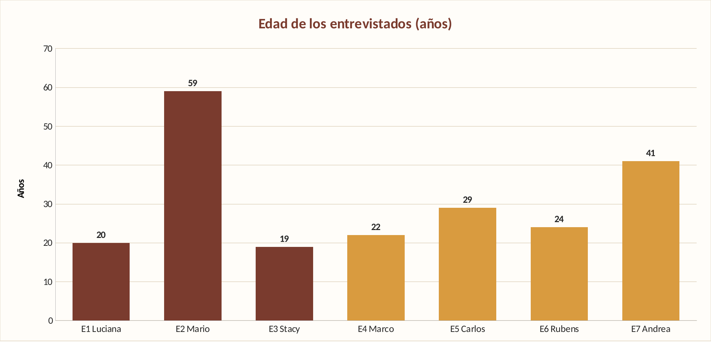</p>

*Nota.* Elaboración propia a partir de los datos de las entrevistas (2026), en Microsoft Excel (hoja «Gráficos» del archivo `assets/analisis_entrevistas_destilatech.xlsx`).

*Descripción.* El gráfico de barras muestra la edad de cada entrevistado (E1 a E7), con color marrón para productores (E1 a E3) y dorado para comercializadores (E4 a E7). Los productores incluyen a los entrevistados más joven (19 años) y de mayor edad (59 años), por lo que su promedio (32,7 años) esconde una dispersión alta, mientras que los comercializadores se concentran entre 22 y 41 años, con promedio de 29 años.


##### Segmento 1: Productor de pisco

**Características objetivas.** Los tres productores trabajan en negocios familiares de pisco: dos de ellos en funciones administrativas (Luciana y Stacy, de 20 y 19 años) y uno como propietario y productor (Mario, de 59 años). La producción anual declarada va de aproximadamente 6,000 a 22,000 litros en dos casos (Stacy y Mario) y de 8,000 a 100,000 litros en el tercero (Luciana). Las bodegas de producción de Mario y Stacy se encuentran fuera de Lima (Mala, en Cañete, e Ica, respectivamente), mientras que su residencia o sede comercial está en Lima.

**Características subjetivas** (herramientas, canales y actitud hacia la tecnología):

| Aspecto analizado | Sí | No | No registrado | % de menciones (sobre n = 3) |
| :--- | :---: | :---: | :---: | :---: |
| Usa cuaderno/papel | 2 | 0 | 1 | 67% |
| Usa Excel/hoja de cálculo | 3 | 0 | 0 | 100% |
| Usa WhatsApp para pedidos/proveedores | 2 | 0 | 1 | 67% |
| Usa smartphone como dispositivo principal | 3 | 0 | 0 | 100% |
| Usa laptop/PC | 1 | 2 | 0 | 33% |
| Usa redes sociales (Instagram/Facebook) | 3 | 0 | 0 | 100% |
| Usa sensores/IoT | 0 | 3 | 0 | 0% |
| Dificultad en monitoreo de variables del proceso | 3 | 0 | 0 | 100% |
| Errores/desfases en registros de stock o lotes | 2 | 0 | 1 | 67% |
| Supervisión presencial frecuente en bodega | 2 | 0 | 1 | 67% |
| Desea alertas automáticas en el celular | 2 | 0 | 1 | 67% |
| Dispuesto a pagar suscripción | 3 | 0 | 0 | 100% |

**Interpretación.** Los tres productores usan Excel y redes sociales, y los tres tienen el celular como dispositivo principal; solo uno (33 %) menciona la laptop. Ninguno usa sensores ni IoT (3 de 3) y los tres describen dificultad para monitorear variables del proceso (temperatura, grado de azúcar, grado alcohólico), un problema que dos de ellos (67 %) resuelven con supervisión presencial frecuente y que, según dos entrevistados, produce errores o desfases en los registros. Los tres estarían dispuestos a pagar una suscripción: el pago mínimo propuesto promedia S/ 63.3, el máximo S/ 93.3 y el punto medio del rango S/ 78.3 al mes.

**Figura 21**

*Hallazgos del segmento Productor (porcentaje sobre n = 3)*

<p align="center">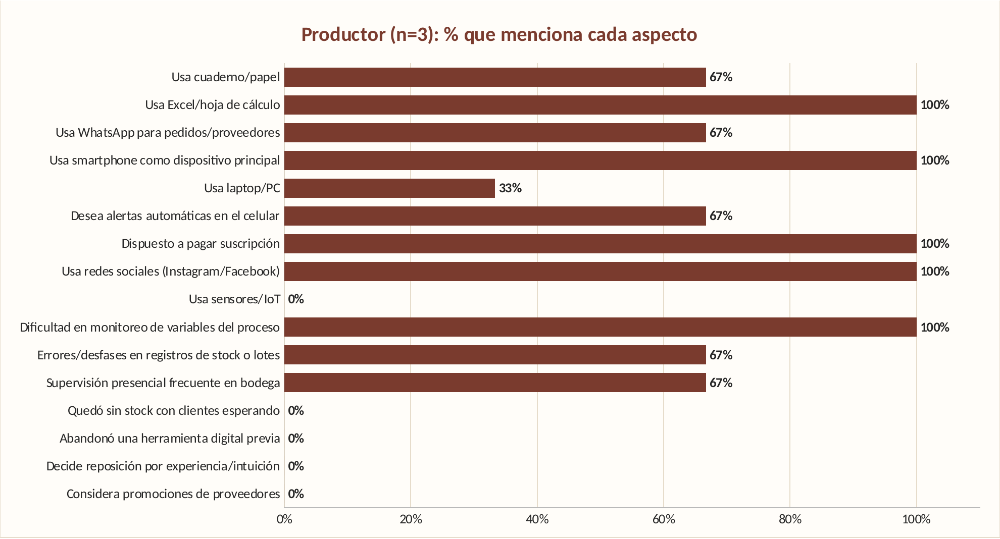</p>

*Nota.* Elaboración propia a partir de los datos de las entrevistas (2026), en Microsoft Excel (hoja «Gráficos» del archivo `assets/analisis_entrevistas_destilatech.xlsx`).

*Descripción.* Las barras horizontales indican qué porcentaje de los tres productores mencionó cada aspecto. El uso de Excel, el uso del smartphone, la disposición a pagar una suscripción, el uso de redes sociales y la dificultad para monitorear las variables del proceso alcanzan el 100 % (3 de 3); el uso de cuaderno, WhatsApp, el deseo de alertas en el celular, los errores en los registros y la supervisión presencial frecuente llegan al 67 % (2 de 3), y el uso de laptop al 33 %. Ningún productor usa sensores o IoT (0 %).


##### Segmento 2: Comercializador

**Características objetivas.** Los cuatro comercializadores administran licorerías o bodegas en distritos de Lima (San Miguel, Magdalena, Comas y Surquillo). Tres son propietarios o administradores de 22 a 29 años y una es administradora de 41 años. Tres de ellos precisaron el tamaño de su oferta: entre 80 y 150 productos aproximadamente y entre 8 y 15 marcas de pisco (Carlos, Rubens y Andrea).

**Características subjetivas** (herramientas, canales y actitud hacia la tecnología):

| Aspecto analizado | Sí | No | No registrado | % de menciones (sobre n = 4) |
| :--- | :---: | :---: | :---: | :---: |
| Usa cuaderno/papel | 4 | 0 | 0 | 100% |
| Usa Excel/hoja de cálculo | 3 | 1 | 0 | 75% |
| Usa WhatsApp para pedidos/proveedores | 4 | 0 | 0 | 100% |
| Usa smartphone como dispositivo principal | 4 | 0 | 0 | 100% |
| Usa laptop/PC | 1 | 3 | 0 | 25% |
| Quedó sin stock con clientes esperando | 4 | 0 | 0 | 100% |
| Decide reposición por experiencia/intuición | 4 | 0 | 0 | 100% |
| Considera promociones de proveedores | 2 | 1 | 1 | 50% |
| Abandonó una herramienta digital previa | 3 | 0 | 1 | 75% |
| Desea alertas automáticas en el celular | 4 | 0 | 0 | 100% |
| Dispuesto a pagar suscripción | 4 | 0 | 0 | 100% |

**Interpretación.** Los cuatro comercializadores usan cuaderno, WhatsApp y celular, se han quedado sin stock con clientes esperando y deciden la reposición según su experiencia o intuición; los cuatro desean alertas de stock en el celular y estarían dispuestos a pagar. Tres de cuatro (75 %) abandonaron una herramienta digital previa (un sistema de inventario en dos casos y una hoja de cálculo en el tercero) por considerarla complicada o poco ágil, lo que indica que la facilidad de uso es un requisito crítico. El quiebre de stock se da, en promedio, 1.83 veces al mes entre los tres entrevistados que dieron una frecuencia. El pago mínimo propuesto promedia S/ 40.0, el máximo S/ 72.5 y el punto medio del rango S/ 56.2 al mes.

**Figura 22**

*Hallazgos del segmento Comercializador (porcentaje sobre n = 4)*

<p align="center">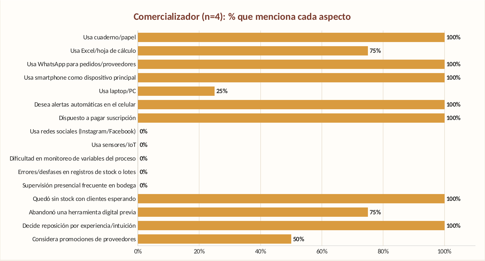</p>

*Nota.* Elaboración propia a partir de los datos de las entrevistas (2026), en Microsoft Excel (hoja «Gráficos» del archivo `assets/analisis_entrevistas_destilatech.xlsx`).

*Descripción.* Las barras horizontales muestran el porcentaje de los cuatro comercializadores que mencionó cada aspecto. El uso de cuaderno, WhatsApp y smartphone, el deseo de alertas en el celular, la disposición a pagar, haberse quedado sin stock con clientes esperando y decidir la reposición por experiencia alcanzan el 100 %; usar Excel y haber abandonado una herramienta digital previa llegan al 75 %, considerar las promociones de proveedores al 50 % y usar laptop al 25 %.


##### Comparativa entre segmentos

La siguiente tabla compara los aspectos que se indagaron en ambos segmentos. Los aspectos que solo se preguntaron a un segmento se muestran como «s/d» (sin dato) y no se comparan.

| Aspecto | Productor (n = 3) | Comercializador (n = 4) | Diferencia (puntos porcentuales) |
| :--- | :---: | :---: | :---: |
| Usa cuaderno/papel | 67% | 100% | -33 |
| Usa Excel/hoja de cálculo | 100% | 75% | +25 |
| Usa WhatsApp para pedidos/proveedores | 67% | 100% | -33 |
| Usa smartphone como dispositivo principal | 100% | 100% | +0 |
| Usa laptop/PC | 33% | 25% | +8 |
| Desea alertas automáticas en el celular | 67% | 100% | -33 |
| Dispuesto a pagar suscripción | 100% | 100% | +0 |
| Usa redes sociales (Instagram/Facebook) | 100% | s/d | s/d |
| Usa sensores/IoT | 0% | s/d | s/d |
| Dificultad en monitoreo de variables del proceso | 100% | s/d | s/d |
| Errores/desfases en registros de stock o lotes | 67% | s/d | s/d |
| Supervisión presencial frecuente en bodega | 67% | s/d | s/d |
| Quedó sin stock con clientes esperando | s/d | 100% | s/d |
| Decide reposición por experiencia/intuición | s/d | 100% | s/d |
| Considera promociones de proveedores | s/d | 50% | s/d |
| Abandonó una herramienta digital previa | s/d | 75% | s/d |

**Figura 23**

*Herramientas y dispositivos usados por segmento*

<p align="center">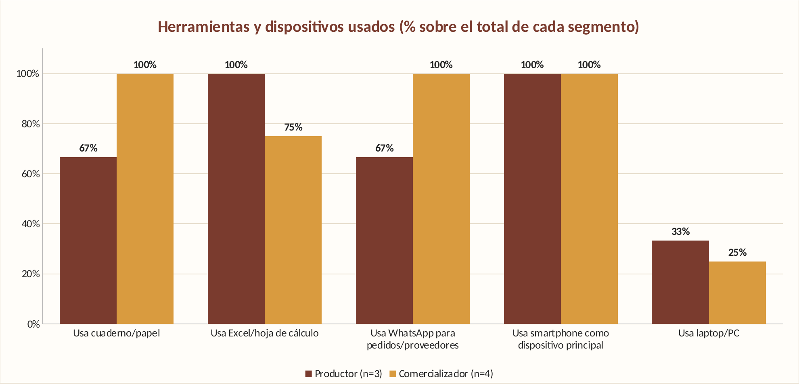</p>

*Nota.* Elaboración propia a partir de los datos de las entrevistas (2026), en Microsoft Excel (hoja «Gráficos» del archivo `assets/analisis_entrevistas_destilatech.xlsx`).

*Descripción.* Barras agrupadas que comparan, para productores (marrón) y comercializadores (dorado), el porcentaje que usa cuaderno, Excel, WhatsApp, smartphone y laptop. El smartphone es el dispositivo principal del 100 % de ambos segmentos; el cuaderno y WhatsApp son más frecuentes entre comercializadores (100 %) que entre productores (67 %), y la laptop es minoritaria en los dos (33 % y 25 %).


**Figura 24**

*Rango de pago mensual propuesto por entrevistado*

<p align="center">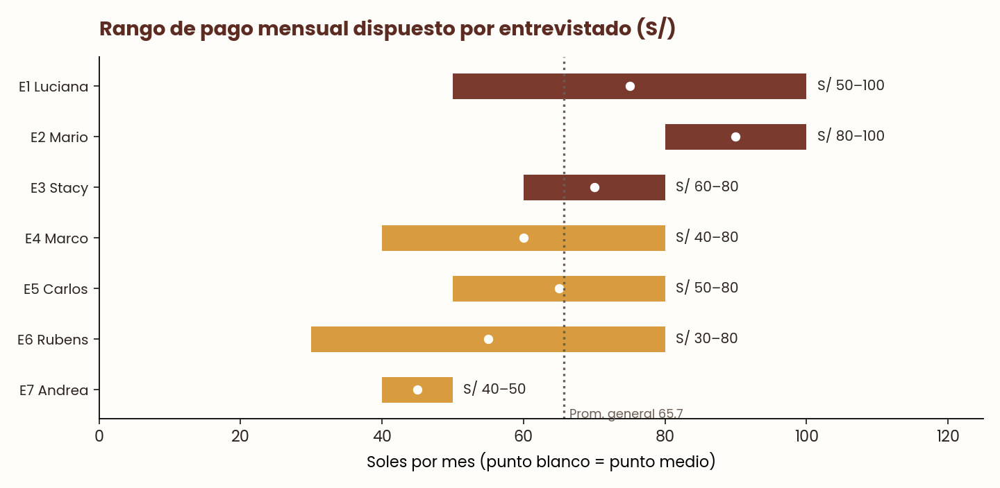</p>

*Nota.* Elaboración propia a partir de los datos de las entrevistas (2026), en Microsoft Excel (hoja «Gráficos» del archivo `assets/analisis_entrevistas_destilatech.xlsx`).

*Descripción.* Cada barra va del pago mínimo al pago máximo mensual, en soles, que cada entrevistado estaría dispuesto a pagar (marrón: productores; dorado: comercializadores). Los productores proponen rangos más altos (entre S/ 50 y S/ 100) que los comercializadores (entre S/ 30 y S/ 80).


**Disposición de pago.** El punto medio promedio de los rangos propuestos es S/ 78.3 mensuales en productores y S/ 56.2 en comercializadores; considerando los siete entrevistados, el promedio es S/ 65.7 y la mediana S/ 65.0. Los siete expresaron disposición a pagar, siempre que la herramienta sea sencilla, ahorre tiempo y evite pérdidas.

##### Conclusiones del análisis

- **Dolor principal por segmento.** En productores, la dificultad de monitorear variables del proceso sin sensores (100 %) y la necesidad de supervisión presencial; en comercializadores, los quiebres de stock (100 %) por no saber cuánto inventario hay en tiempo real.
- **Dispositivo y canal.** El celular es el dispositivo principal en ambos segmentos (100 %) y WhatsApp es el canal habitual de pedidos, por lo que la solución debe funcionar bien en pantallas móviles y complementar, no reemplazar, a WhatsApp.
- **Barrera de adopción.** El 75 % de los comercializadores abandonó una herramienta previa por complejidad, de modo que el registro de movimientos debe requerir pocos pasos.
- **Modelo de suscripción.** Los rangos propuestos (S/ 30 a S/ 100 mensuales) sirven de referencia inicial para definir planes por segmento; el segmento Productor muestra mayor disposición de pago que el Comercializador.
- **Alertas.** Todos los comercializadores y dos de los tres productores (que respondieron sobre el tema) desean alertas automáticas en el celular.

Estos hallazgos sustentan la construcción de los User Personas de la sección 2.3.1.


### 2.3. Needfinding

El proceso de Needfinding transformó los hallazgos de las entrevistas en herramientas de diseño centradas en el usuario. A partir del análisis de las características demográficas, comportamentales y subjetivas de cada segmento (sección 2.2.3), se construyeron los siguientes artefactos sobre Destilatech.

#### 2.3.1. User Personas

Las fichas de User Persona se elaboraron en UXPressia, una para cada segmento objetivo. Cada ficha integra los hallazgos de las entrevistas: datos demográficos, objetivos, motivaciones, frustraciones, habilidades, dispositivos, navegadores, canales y marcas o influencias.

**Segmento 1: Productor de pisco**

**Figura 25**

*User Persona del segmento Productor: Ricardo Donayre*

<p align="center">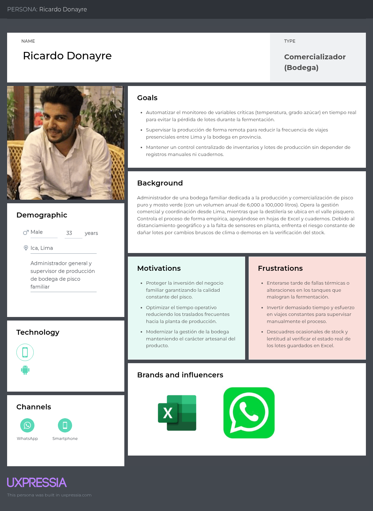</p>

*Nota.* Elaboración propia en UXPressia (2026).

*Descripción.* La ficha presenta a Ricardo Donayre como arquetipo del segmento Productor: administrador de una bodega familiar de pisco, de 33 años (promedio de edad de los tres productores entrevistados), que gestiona el negocio desde su sede comercial en Lima mientras la producción se realiza en un valle pisquero. Sus objetivos son monitorear a distancia las variables críticas del proceso y centralizar el control de lotes e inventario; sus frustraciones son enterarse tarde de una temperatura anómala, los viajes a la bodega y los descuadres entre el stock real y Excel. Usa el smartphone como dispositivo principal, Excel, WhatsApp, Instagram y Facebook. Cada atributo se respalda en las entrevistas según la tabla de trazabilidad siguiente. [CONFIRMAR: actualizar la ficha de UXPressia para que coincida con esta descripción y la tabla de trazabilidad, y reemplazar la captura].


**Segmento 2: Comercializador**

**Figura 26**

*User Persona del segmento Comercializador: Carlos Mendoza*

<p align="center">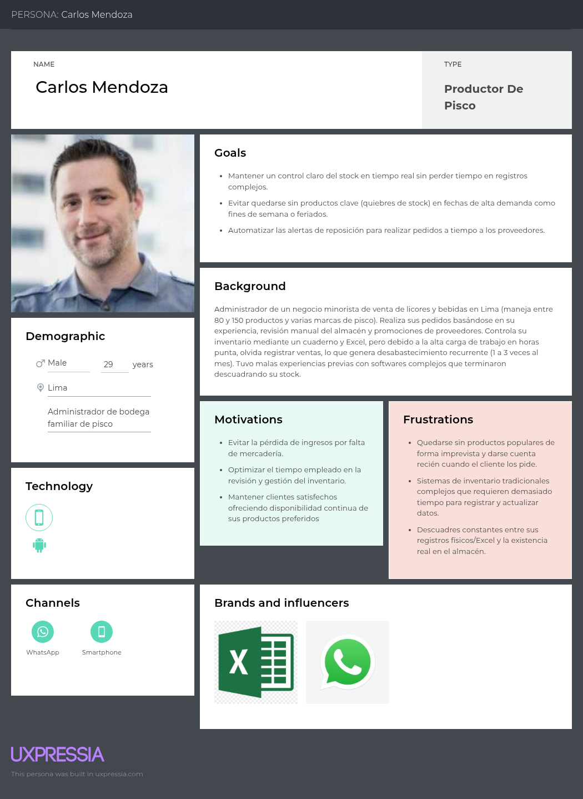</p>

*Nota.* Elaboración propia en UXPressia (2026).

*Descripción.* La ficha presenta a Carlos Mendoza como arquetipo del segmento Comercializador: administrador de una licorería o bodega de Lima, de 29 años (promedio de edad de los cuatro comercializadores entrevistados), que maneja entre 80 y 150 productos y controla su inventario con cuaderno y Excel. Sus objetivos son saber cuánto stock tiene sin revisar el almacén, evitar quiebres de stock y recibir una alerta para reponer a tiempo; sus frustraciones son quedarse sin productos cuando el cliente los pide, los sistemas complejos que abandonó y la reposición decidida por intuición. Usa el smartphone como dispositivo principal, WhatsApp y Excel. Cada atributo se respalda en las entrevistas según la tabla de trazabilidad siguiente. [CONFIRMAR: actualizar la ficha de UXPressia para que coincida con esta descripción y la tabla de trazabilidad, y reemplazar la captura].

**Trazabilidad de las User Personas con las entrevistas.** La User Persona es un arquetipo: solo incluye los atributos que comparte la mayoría de los entrevistados de su segmento, tal como se registró en la sección 2.2.2 y se cuantificó en la sección 2.2.3. Los atributos que solo mencionó una persona, o que no se preguntaron, no se incluyen en la ficha; en particular, no se asignan estado civil, marca de dispositivo, sistema operativo, navegador ni tamaño de mercado, porque las entrevistas no los registran para la mayoría de los entrevistados.

| Atributo de la ficha de Ricardo Donayre (Productor) | Respaldo en las entrevistas (n = 3) | Fuente |
| :--- | :--- | :--- |
| Edad de 33 años | Promedio de 32.7 años (edades 19, 20 y 59) | E1, E2, E3 |
| Administrador de una bodega familiar | 2 de 3 son administradoras de negocio familiar; 1 es propietario y productor | E1, E3 (E2) |
| Sede comercial en Lima y producción en un valle pisquero | 2 de 3 tienen la bodega fuera de Lima (Mala e Ica) y la sede en Lima | E2, E3 |
| Smartphone como dispositivo principal | 3 de 3 | E1, E2, E3 |
| Usa Excel | 3 de 3 | E1, E2, E3 |
| Usa Instagram y Facebook | 3 de 3 | E1, E2, E3 |
| Usa WhatsApp para pedidos y clientes | 2 de 3 (1 no registrado) | E1, E3 |
| Objetivo: monitorear a distancia las variables críticas | 3 de 3 reportan dificultad para monitorear variables; 2 de 3 piden alertas en el celular o monitoreo remoto | E1, E2, E3 |
| Objetivo: centralizar lotes e inventario | 2 de 3 reportan errores o desfases en registros de lotes o stock | E1, E3 |
| Frustración: enterarse tarde de una temperatura anómala | 3 de 3 monitorean de forma manual; 1 perdió un lote | E1, E2, E3 |
| Frustración: viajes y visitas a la bodega | 2 de 3 supervisan de forma presencial con frecuencia | E2, E3 |
| Frustración: descuadres entre el stock real y Excel | 2 de 3 | E1, E3 |
| Disposición de pago: S/ 50 a S/ 100 mensuales | 3 de 3; punto medio promedio S/ 78.3 | E1, E2, E3 |

| Atributo de la ficha de Carlos Mendoza (Comercializador) | Respaldo en las entrevistas (n = 4) | Fuente |
| :--- | :--- | :--- |
| Edad de 29 años | Promedio de 29.0 años (edades 22, 24, 29 y 41) | E4, E5, E6, E7 |
| Administrador de una licorería o bodega en Lima | 3 de 4 son administradores; 1 es propietario | E5, E6, E7 (E4) |
| Maneja entre 80 y 150 productos | 3 de 4 precisaron su oferta: entre 80 y 150 productos | E5, E6, E7 |
| Smartphone como dispositivo principal | 4 de 4 | E4, E5, E6, E7 |
| Usa cuaderno para el inventario | 4 de 4 | E4, E5, E6, E7 |
| Usa Excel | 3 de 4 | E4, E5, E6 |
| Usa WhatsApp con proveedores | 4 de 4 | E4, E5, E6, E7 |
| Objetivo: saber cuánto stock tiene sin revisar el almacén | 4 de 4 | E4, E5, E6, E7 |
| Objetivo: recibir una alerta para reponer a tiempo | 4 de 4 desean alertas automáticas en el celular | E4, E5, E6, E7 |
| Frustración: quedarse sin stock con clientes esperando | 4 de 4; promedio de 1.83 veces al mes (3 con dato) | E4, E5, E6, E7 |
| Frustración: sistemas complejos que abandonó | 3 de 4 abandonaron una herramienta previa | E5, E6, E7 |
| Frustración: reposición decidida por intuición | 4 de 4 | E4, E5, E6, E7 |
| Disposición de pago: S/ 30 a S/ 80 mensuales | 4 de 4; punto medio promedio S/ 56.2 | E4, E5, E6, E7 |

La laptop (1 de 3 productores y 1 de 4 comercializadores) no alcanza mayoría y por eso no figura como dispositivo del arquetipo. Tampoco hay un navegador mayoritario: solo un productor (E2) mencionó Google Chrome.


#### 2.3.2. User Task Matrix

La User Task Matrix compara las tareas que cada segmento realiza para cumplir sus objetivos, junto con su frecuencia e importancia. Las tareas se identificaron a partir de las entrevistas de la sección 2.2.2.

| Tarea | **Productor de pisco** (Frecuencia / Importancia) | **Comercializador** (Frecuencia / Importancia) |
| :--- | :---: | :---: |
| **Monitorear variables IoT (temperatura, pH, nivel)** | Horaria / Alta | N/A / N/A |
| **Atender alertas críticas de producción / stock** | Horaria / Alta | Diaria / Alta |
| **Consultar dashboard general del estado del negocio** | Diaria / Alta | Diaria / Alta |
| **Registrar y actualizar lotes de producción** | Mensual / Alta | N/A / N/A |
| **Consultar stock disponible en almacén/tienda** | Diaria / Alta | Diaria / Alta |
| **Registrar entradas y salidas de inventario (kardex)** | Diaria / Alta | Diaria / Alta |
| **Registrar clientes y pedidos de venta** | Diaria / Media | N/A / N/A |
| **Generar y emitir pedidos de reposición de stock** | N/A / N/A | Semanal / Alta |
| **Revisar estimaciones de agotamiento de stock** | Semanal / Media | Semanal / Media |
| **Analizar indicadores históricos de producción y venta** | Mensual / Media | Mensual / Media |
| **Configurar parámetros de alertas y umbrales IoT** | Ocasional / Media | N/A / N/A |
| **Gestionar suscripción y usuarios del sistema** | Ocasional / Baja | Ocasional / Baja |

**Tareas de alta frecuencia y alta importancia.**

- Para el productor, el monitoreo de las variables de fermentación y destilación (con datos IoT) y el control de inventario y lotes son operaciones críticas y frecuentes. La plataforma debe permitir llegar a estos módulos de forma inmediata desde el dashboard principal.
- Para el comercializador, la consulta diaria de existencias, el registro de movimientos y la recepción de alertas de bajo stock constituyen el núcleo de su interacción diaria.

**Diferenciación de la experiencia por rol.**

- Las tareas de seguimiento de variables físicas de producción y de gestión por lotes son exclusivas del productor, lo que justifica vistas y paneles de navegación segmentados.
- El comercializador centra su interacción en el flujo de reabastecimiento (pedidos de reposición y control rápido de stock), que demanda un flujo con pocos pasos para operaciones frecuentes.

#### 2.3.3. User Journey Mapping

Los User Journey Maps representan el recorrido de cada User Persona en su situación actual (*as-is*), sin la plataforma Destilatech. Permiten identificar los puntos de dolor y las oportunidades que la solución debe abordar. Ambos mapas se organizan en cinco etapas (Aware, Use, Join, Develop y Leave) e incluyen objetivos, canales, proceso, problemas, experiencia emocional e ideas u oportunidades.

**Segmento 1: Productor de pisco**

**Figura 27**

*User Journey Map del segmento Productor: Ricardo Donayre*

<p align="center">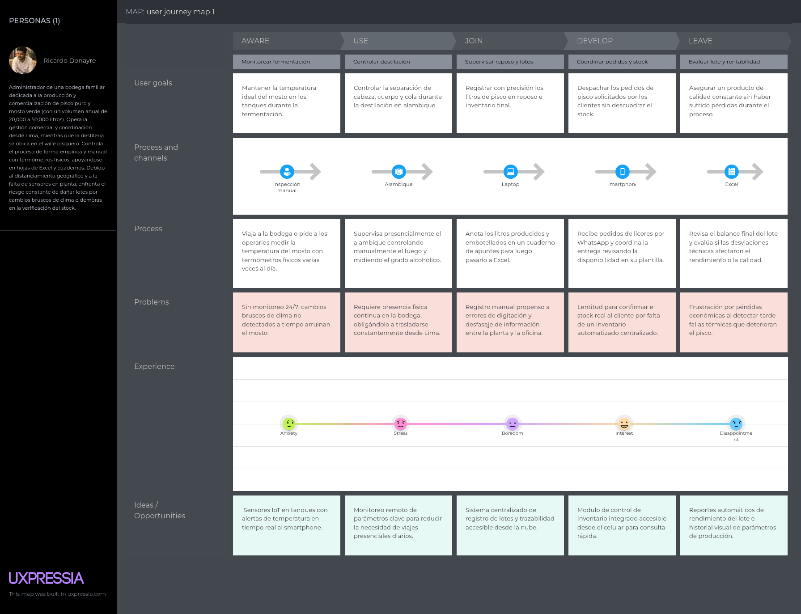</p>

*Nota.* Elaboración propia en UXPressia (2026).

*Descripción.* El mapa recorre cinco etapas del productor: monitorear fermentación, controlar destilación, supervisar reposo y lotes, coordinar pedidos y stock, y evaluar lote y rentabilidad. En cada etapa Ricardo usa canales como inspección manual, alambique, laptop, smartphone y Excel, y enfrenta problemas como la falta de monitoreo 24/7, la necesidad de presencia física continua, el registro manual propenso a errores y la lentitud para confirmar el stock real. Su experiencia pasa de ansiedad y estrés a aburrimiento, interés y decepción. Las oportunidades incluyen sensores IoT con alertas de temperatura, monitoreo remoto, un sistema centralizado de lotes, un módulo de inventario accesible desde el celular y reportes automáticos de rendimiento.


**Segmento 2: Comercializador**

**Figura 28**

*User Journey Map del segmento Comercializador: Carlos Mendoza*

<p align="center">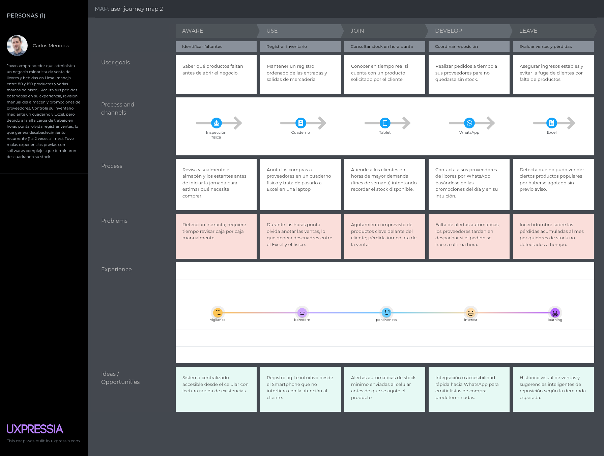</p>

*Nota.* Elaboración propia en UXPressia (2026).

*Descripción.* El mapa recorre cinco etapas del comercializador: identificar faltantes, registrar inventario, consultar stock en hora punta, coordinar reposición y evaluar ventas y pérdidas. Carlos usa inspección física, cuaderno, tablet, WhatsApp y Excel, y enfrenta problemas como la detección inexacta de faltantes, los olvidos al anotar ventas en horas punta, el agotamiento imprevisto de productos y la falta de alertas automáticas. Su experiencia va de la vigilancia y el aburrimiento a la inquietud, el interés y el rechazo. Las oportunidades son un sistema centralizado accesible desde el celular, un registro ágil, alertas automáticas de stock mínimo, integración rápida con WhatsApp para listas de compra y un histórico de ventas con sugerencias de reposición.


#### 2.3.4. Empathy Mapping

Los Empathy Maps profundizan en lo que cada User Persona piensa, siente, ve, oye, dice y hace en su contexto diario, a partir de las observaciones de las entrevistas. Permiten identificar los *pains* y *gains* de cada segmento.

**Segmento 1: Productor de pisco**

**Figura 29**

*Empathy Map del segmento Productor: Ricardo Donayre*

<p align="center">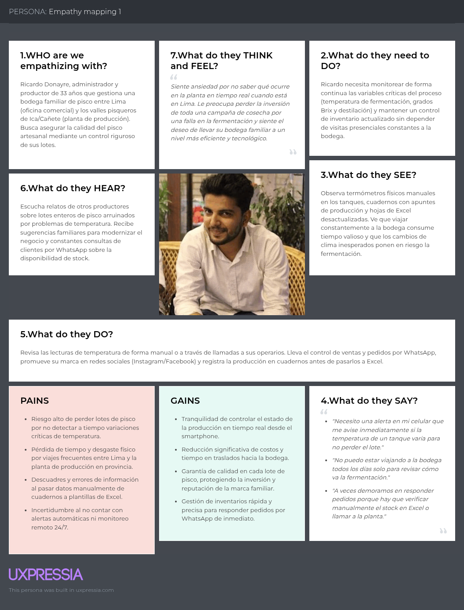</p>

*Nota.* Elaboración propia en UXPressia (2026).

*Descripción.* El mapa describe a Ricardo Donayre, administrador y productor que gestiona una bodega entre Lima (oficina comercial) y los valles de Ica y Cañete (planta). Necesita monitorear de forma continua temperatura, grados Brix y destilación; ve termómetros manuales, cuadernos y hojas de Excel desactualizadas; escucha relatos de lotes arruinados por temperatura; y siente ansiedad por no saber qué ocurre en la planta. Sus pains son el riesgo de perder lotes, el desgaste por viajes y los errores al pasar datos de cuadernos a Excel; sus gains son la tranquilidad de controlar la producción desde el smartphone, la reducción de costos de traslado, la garantía de calidad y una gestión de inventario rápida.


**Segmento 2: Comercializador**

**Figura 30**

*Empathy Map del segmento Comercializador: Carlos Mendoza*

<p align="center">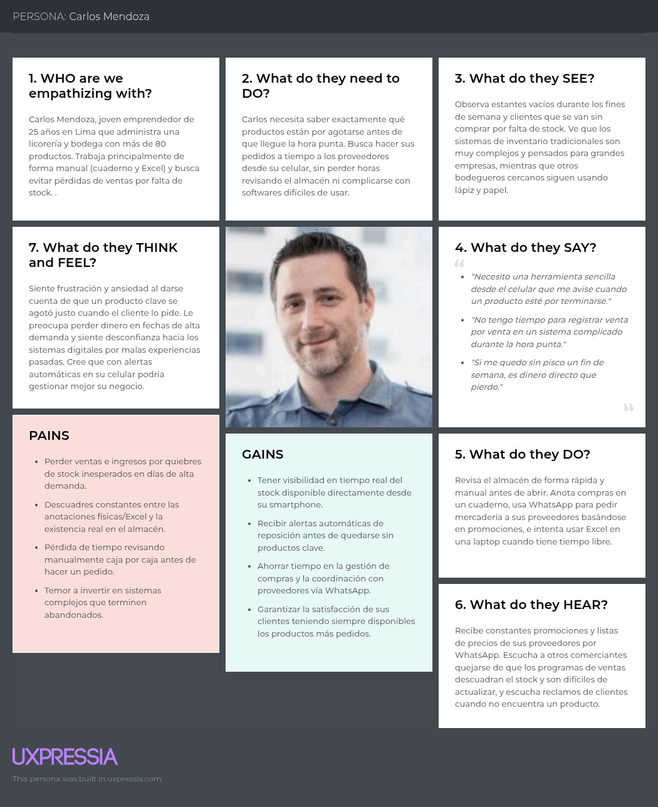</p>

*Nota.* Elaboración propia en UXPressia (2026).

*Descripción.* El mapa describe a Carlos Mendoza, joven emprendedor que administra una licorería y bodega en Lima con más de 80 productos. Necesita saber qué productos están por agotarse antes de la hora punta; ve estantes vacíos y clientes que se van sin comprar; escucha promociones de proveedores por WhatsApp y quejas de otros comerciantes sobre programas de ventas difíciles de actualizar; y siente frustración y desconfianza hacia los sistemas digitales por malas experiencias pasadas. Sus pains son perder ventas por quiebres de stock, los descuadres entre anotaciones y existencias, y el temor a invertir en sistemas complejos; sus gains son tener visibilidad del stock en tiempo real, recibir alertas de reposición y ahorrar tiempo en compras.


### 2.4. Big Picture EventStorming

EventStorming es una técnica de modelado colaborativo creada por Alberto Brandolini en la que personas de negocio y de tecnología construyen, sobre una superficie compartida y con notas adhesivas, una línea de tiempo de los eventos relevantes de un dominio (Brandolini, 2021). Su variante *Big Picture* se utiliza al inicio de un proyecto para explorar toda la línea de negocio **tal como funciona hoy**, descubrir el vocabulario común y detectar los puntos de dolor antes de pensar en software.

Por esta razón, los tableros de Destilatech modelan el negocio **as-is**: los eventos corresponden a lo que los productores y comercializadores entrevistados hacen actualmente con su cuaderno, su hoja de Excel y WhatsApp. Los eventos que existirían solo gracias a la plataforma (por ejemplo, «usuario registrado», «alerta generada» o «suscripción contratada») no pertenecen al Big Picture; aparecen recién en el Design-Level EventStorming (sección 4.6.1), donde se analiza cómo la solución modifica este flujo. Cada evento de los tableros se sustenta en las entrevistas de la sección 2.2.2, identificadas como E1 a E7: E1 Luciana Cueva, E2 Mario Fernández y E3 Stacy Guerra (productores); E4 Marco Vargas, E5 Carlos Moreno, E6 Rubens Moreno y E7 Andrea Mendoza (comercializadores).

#### 2.4.1. Pasos del Big Picture EventStorming

El ejercicio sigue los pasos del Big Picture EventStorming descritos por Brandolini (2021) y por la guía de Baas-Schwegler y Richardson (s. f.). La siguiente tabla indica cada paso, el elemento que se produce y cómo se refleja en los tableros de Destilatech.

| Paso | Qué se hace | Resultado en los tableros de Destilatech |
| :---: | :--- | :--- |
| 1. Definir el objetivo | Acordar el alcance del dominio que se va a explorar. | Alcance: cómo se producen, registran, venden y reponen hoy el pisco de los entrevistados, sin considerar la plataforma. Se modelan dos flujos: productor y comercializador. |
| 2. Exploración caótica | Escribir sin orden la mayor cantidad posible de eventos de dominio en notas naranjas, redactados en pasado. | Eventos extraídos de los resúmenes de las siete entrevistas (por ejemplo, «Mosto puesto a fermentar», «Venta perdida por producto agotado»). |
| 3. Línea de tiempo | Ordenar los eventos cronológicamente, eliminar duplicados y ajustar la redacción. | Línea de tiempo de izquierda a derecha: 16 eventos en el flujo del productor y 10 en el del comercializador. |
| 4. Eventos pivote | Reconocer los eventos que cierran una fase del proceso y abren otra. | Se identifican sobre las líneas de tiempo de cada flujo (sección 2.4.6). |
| 5. Actores y sistemas | Identificar quién actúa en cada evento y qué herramientas externas usa (notas rosa). | Cuaderno, Excel, WhatsApp, Yape/Plin, termómetros y redes sociales como herramientas actuales; notas amarillas con los objetos (Lote, Mosto, Existencias, Pedido, entre otros). |
| 6. Recorrido explícito | Leer la línea de tiempo en orden y verificar que cada evento tenga sentido y no falten pasos. | Cada flujo se recorre desde la recepción de la uva (productor) o de la mercadería (comercializador) hasta el punto donde el negocio vuelve a empezar su ciclo. |
| 7. Problemas y oportunidades | Marcar con notas rojas (hotspots) los problemas reales que describieron los entrevistados y reconocer oportunidades. | 5 hotspots en el flujo del productor y 5 en el del comercializador (secciones 2.4.3 y 2.4.4). |
| 8. Agrupación | Reunir los eventos y objetos relacionados para reconocer áreas candidatas del dominio. | Cuatro áreas candidatas del negocio actual (sección 2.4.5). |

**Leyenda de notas.** Se usó la convención de colores de EventStorming (Baas-Schwegler & Richardson, s. f.), adaptada al alcance del Big Picture:

| Nota | Elemento | Descripción | Ejemplo en Destilatech |
| :--- | :--- | :--- | :--- |
| Naranja | Evento de dominio | Hecho relevante ocurrido hoy en el negocio, redactado en pasado. | «Mosto puesto a fermentar» |
| Amarillo pequeño | Actor | Persona o rol que provoca o recibe un evento. | Productor, Operario, Comercializador, Proveedor |
| Amarillo claro (grande) | Objeto del dominio | Concepto sobre el que ocurre el evento. | «Lote», «Existencias» |
| Rosa (ancha) | Sistema o herramienta externa | Herramienta ajena a Destilatech que se usa hoy en el proceso. | Cuaderno, Excel, WhatsApp |
| Rojo / rosa intenso | Hotspot | Problema, duda o riesgo que los entrevistados vivieron o describieron. | «Lote malogrado por temperatura detectada tarde» |
| Verde | Oportunidad | Mejora posible identificada a partir de un hotspot (no es un evento). | Conocer el stock sin revisar el almacén |

#### 2.4.2. Actores identificados

| Actor | Rol en el dominio actual | Eventos que provoca o recibe | Fuente |
| :--- | :--- | :--- | :--- |
| Productor de pisco (propietario o administrador) | Dirige la bodega, supervisa el proceso y administra lotes, inventario y pedidos. | Recibe la uva, supervisa la fermentación y la destilación, anota lotes y ventas, cuenta el producto terminado y atiende pedidos. | E1, E2, E3 |
| Operario de bodega | Ejecuta tareas de producción: pesaje, despalillado, prensado y manejo del alambique. | Participa en los eventos de preparación de la uva y de destilación. | E2 |
| Vendedor del productor | Visita periódicamente a los clientes para ofrecer degustaciones y recoger necesidades. | Provoca la recepción de pedidos de clientes. | E2 |
| Comercializador (propietario o administrador) | Administra una licorería o bodega: ventas, revisión de existencias, compras e inventario. | Registra (o no) las ventas, revisa el almacén, decide la reposición y pide mercadería. | E4, E5, E6, E7 |
| Cliente | Persona o negocio que compra pisco al productor o al comercializador. | Hace pedidos por WhatsApp o en mostrador; se va sin comprar si el producto está agotado. | E1 a E7 |
| Proveedor o distribuidor | Abastece de pisco y otras bebidas al comercializador (distribuidores y productores artesanales). | Recibe el pedido por WhatsApp, responde (a veces con demora) y entrega la mercadería. | E4 a E7 |

#### 2.4.3. Flujo del Productor

**Figura 31**

*Big Picture EventStorming: flujo del productor (as-is)*

<p align="center">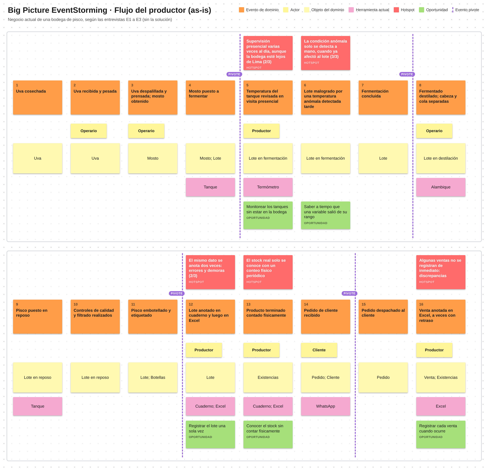</p>

*Nota.* Elaboración propia en Miro (2026).

*Descripción.* El tablero muestra, de izquierda a derecha, dieciséis notas naranja con los eventos que hoy ocurren en una bodega de pisco, desde «Uva cosechada» hasta «Venta anotada en Excel». Debajo de los eventos aparecen los actores (notas amarillas pequeñas), los objetos del dominio (amarillo claro) y, en rosa, las herramientas que se usan hoy (termómetro, alambique, cuaderno, Excel y WhatsApp); debajo de cada hotspot hay una oportunidad en verde y los eventos pivote se marcan con una línea vertical morada. Encima de cinco eventos se ubican notas rojas con los problemas descritos por los entrevistados: la detección tardía de la temperatura anómala, la supervisión presencial en bodegas lejanas, el registro doble en cuaderno y Excel, el conteo físico periódico y las ventas anotadas con retraso.

| N.° | Evento de dominio (as-is) | Objetos del dominio | Herramienta o sistema actual | Fuente |
| :---: | :--- | :--- | :--- | :--- |
| 1 | Uva cosechada | Uva | — | E2, E3 |
| 2 | Uva recibida y pesada | Uva | — | E1, E2, E3 |
| 3 | Uva despalillada y prensada; mosto obtenido | Mosto | — | E1, E2, E3 |
| 4 | Mosto puesto a fermentar | Mosto; Lote | Tanque | E1, E2, E3 |
| 5 | Temperatura del tanque revisada en visita presencial | Lote en fermentación | Termómetro | E2, E3 |
| 6 | Lote malogrado por una temperatura anómala detectada tarde | Lote en fermentación | — | E1 |
| 7 | Fermentación concluida | Lote | — | E1, E2, E3 |
| 8 | Fermentado destilado; cabeza y cola separadas | Lote en destilación | Alambique | E1, E2, E3 |
| 9 | Pisco puesto en reposo | Lote en reposo | Tanque | E1, E2, E3 |
| 10 | Controles de calidad y filtrado realizados | Lote en reposo | — | E1, E2 |
| 11 | Pisco embotellado y etiquetado | Lote; Botellas | — | E1, E2, E3 |
| 12 | Lote anotado en cuaderno y luego en Excel | Lote | Cuaderno; Excel | E1, E2, E3 |
| 13 | Producto terminado contado físicamente | Existencias | Cuaderno; Excel | E1, E3 |
| 14 | Pedido de cliente recibido | Pedido; Cliente | WhatsApp | E1, E3 |
| 15 | Pedido despachado al cliente | Pedido | — | E2 |
| 16 | Venta anotada en Excel, a veces con retraso | Venta; Existencias | Excel | E1, E3 |

**Hotspots del flujo del productor**

| Evento asociado | Hotspot (nota roja) | Evidencia en las entrevistas | Oportunidad identificada |
| :--- | :--- | :--- | :--- |
| 5 y 6. Temperatura revisada en visita presencial; lote malogrado | La condición anómala solo se detecta de forma manual, cuando ya afectó al lote. | Los 3 productores (3/3) describen dificultad para monitorear variables; E1 perdió un lote por la temperatura de la fermentación. | Enterarse de que una variable salió de su rango mientras todavía se puede corregir. |
| 5. Temperatura del tanque revisada | La supervisión exige visitar la bodega varias veces al día, aunque la bodega esté lejos de la sede comercial. | E3 visita los tanques varias veces al día; las bodegas de E2 y E3 están en Mala (Cañete) e Ica, fuera de Lima (2/3). | Monitorear los tanques sin estar físicamente en la bodega. |
| 12. Lote anotado en cuaderno y luego en Excel | El mismo dato se anota dos veces, lo que genera errores y demoras. | E1 describe errores y demoras sobre todo cuando entran varios pedidos a la vez (2/3 reportan errores o desfases). | Registrar el lote una sola vez. |
| 13. Producto terminado contado físicamente | El stock real solo se conoce con un conteo físico periódico. | E1 lo hace cada semana; E3 revisa y actualiza el inventario de forma quincenal o mensual. | Conocer el stock sin contar físicamente. |
| 16. Venta anotada en Excel, a veces con retraso | Algunas ventas no se registran de inmediato y aparecen discrepancias. | E3 reconoce pequeñas discrepancias por ventas no registradas a tiempo. | Registrar cada venta al momento en que ocurre. |

#### 2.4.4. Flujo del Comercializador

**Figura 32**

*Big Picture EventStorming: flujo del comercializador (as-is)*

<p align="center">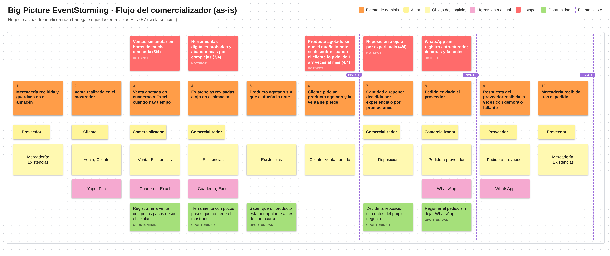</p>

*Nota.* Elaboración propia en Miro (2026).

*Descripción.* El tablero presenta diez eventos naranja del flujo de una licorería o bodega, desde «Mercadería recibida y guardada» hasta «Mercadería recibida tras el pedido», con los actores y objetos de dominio en amarillo y las herramientas actuales (cuaderno, Excel, WhatsApp, Yape y Plin) en rosa. Cinco notas rojas señalan los problemas descritos por los cuatro comercializadores: las ventas sin registrar en horas de mucha demanda, el producto agotado que se descubre cuando el cliente lo pide, la reposición decidida por intuición, la coordinación por WhatsApp con demoras y las herramientas digitales abandonadas; cada hotspot tiene su oportunidad en verde.

| N.° | Evento de dominio (as-is) | Objetos del dominio | Herramienta o sistema actual | Fuente |
| :---: | :--- | :--- | :--- | :--- |
| 1 | Mercadería recibida y guardada en el almacén | Mercadería; Existencias | — | E7 (y reposición en E4 a E6) |
| 2 | Venta realizada en el mostrador | Venta; Cliente | Yape; Plin | E7 |
| 3 | Venta anotada en cuaderno o Excel, cuando hay tiempo | Venta; Existencias | Cuaderno; Excel | E4, E5, E7 |
| 4 | Existencias revisadas a ojo en el almacén | Existencias | Cuaderno; Excel | E4, E5, E6, E7 |
| 5 | Producto agotado sin que el dueño lo note | Existencias | — | E4, E5, E6, E7 |
| 6 | Cliente pide un producto agotado y la venta se pierde | Cliente; Venta perdida | — | E4, E5, E6, E7 |
| 7 | Cantidad a reponer decidida por experiencia o por promociones | Reposición | — | E4, E5, E6, E7 |
| 8 | Pedido enviado al proveedor | Pedido a proveedor | WhatsApp | E4, E5, E6, E7 |
| 9 | Respuesta del proveedor recibida, a veces con demora o faltante | Pedido a proveedor | WhatsApp | E7 |
| 10 | Mercadería recibida tras el pedido | Mercadería; Existencias | — | E7 (y reposición en E4 a E6) |

**Hotspots del flujo del comercializador**

| Evento asociado | Hotspot (nota roja) | Evidencia en las entrevistas | Oportunidad identificada |
| :--- | :--- | :--- | :--- |
| 3. Venta anotada en cuaderno o Excel | Las ventas no siempre se registran, sobre todo en horas de mayor demanda. | E4, E5 y E7 no registran todas las ventas por la carga de trabajo (3/4). | Registrar una venta con pocos pasos, desde el celular. |
| 5 y 6. Producto agotado; venta perdida | El producto se agota sin que el dueño lo note y se descubre cuando el cliente lo pide. | Los 4 comercializadores (4/4) se quedaron sin stock con clientes esperando, entre 1 y 3 veces al mes; se agrava en fechas de alta demanda. | Saber que un producto está por agotarse antes de que ocurra. |
| 7. Cantidad a reponer decidida por experiencia | La reposición se decide por experiencia, a ojo o según el espacio libre en los estantes. | 4/4 deciden por experiencia; E7 calcula a ojo según el espacio de los estantes. | Decidir la reposición con datos del propio negocio. |
| 8 y 9. Pedido enviado y respuesta del proveedor | La coordinación por WhatsApp no deja un registro estructurado y hay demoras o faltantes. | 4/4 usan WhatsApp con sus proveedores; E7 enfrenta demoras y faltantes imprevistos. | Llevar el registro del pedido sin dejar de usar WhatsApp. |
| General (herramientas actuales) | Las herramientas digitales probadas se abandonaron por complicadas o poco ágiles. | E5 y E6 dejaron un sistema de inventario y E7 una hoja de cálculo (3/4). | Una herramienta con pocos pasos que no frene la atención en el mostrador. |

#### 2.4.5. Áreas candidatas identificadas

Al agrupar los eventos y objetos de ambos tableros por afinidad, se reconocen cuatro áreas candidatas del negocio actual:

| Área candidata | Eventos y objetos que agrupa |
| :--- | :--- |
| Producción del pisco | Productor, eventos 1 a 11: cosecha, recepción, prensado, fermentación, destilación, reposo, controles y embotellado; objetos Uva, Mosto, Lote, Botellas; herramientas termómetro y alambique. |
| Registro de lotes y existencias | Productor, eventos 12, 13 y 16; comercializador, eventos 1, 3, 4 y 5: anotación de lotes y ventas, conteo físico y revisión del almacén; objetos Lote, Existencias; cuaderno y Excel. |
| Ventas y atención al cliente | Productor, eventos 14 y 15; comercializador, eventos 2 y 6: pedidos de clientes, ventas en mostrador, venta perdida; objetos Pedido, Venta, Cliente; WhatsApp, Yape y Plin. |
| Reposición y abastecimiento | Comercializador, eventos 7 a 10: decisión de cuánto reponer, pedido al proveedor, respuesta y recepción de la mercadería; objetos Reposición, Pedido a proveedor, Mercadería; WhatsApp. |

Estas áreas describen cómo se organiza hoy el negocio, no cómo se organizará el software. La relación entre ellas y los *bounded contexts* de la solución se explica en la sección 4.6.1.

#### 2.4.6. Eventos pivote y lenguaje ubicuo descubierto

**Secuencia de los eventos.** En el flujo del productor los eventos siguen el orden del proceso productivo (de la uva al pisco embotellado) y luego el de la comercialización (del pedido a la venta anotada). En el flujo del comercializador el orden es el de un ciclo: se vende, se revisa lo que queda, se descubre lo que falta, se decide qué reponer, se pide, se recibe y se vuelve a vender. Los eventos pivote son los que cierran una fase de ese recorrido y abren otra; marcan dónde cambian el actor, el objeto del dominio o el significado de los términos y, por eso, son candidatos a frontera entre áreas.

| Flujo | Evento pivote | Fase que cierra → fase que abre | Áreas candidatas que separa |
| :--- | :--- | :--- | :--- |
| Productor | 4. Mosto puesto a fermentar | Preparación de la uva → proceso en tanque | Producción del pisco (dos fases) |
| Productor | 7. Fermentación concluida | Fermentación → destilación | Producción del pisco (dos fases) |
| Productor | 11. Pisco embotellado y etiquetado | Producción → producto terminado en existencias | Producción del pisco / Registro de lotes y existencias |
| Productor | 14. Pedido de cliente recibido | Producto terminado disponible → venta | Registro de lotes y existencias / Ventas y atención al cliente |
| Comercializador | 6. Cliente pide un producto agotado | Venta y revisión del almacén → necesidad de reposición | Ventas y atención al cliente / Reposición y abastecimiento |
| Comercializador | 8. Pedido enviado al proveedor | Decisión de reposición → abastecimiento | Reposición y abastecimiento (dos fases) |
| Comercializador | 10. Mercadería recibida tras el pedido | Abastecimiento → existencias en el almacén | Reposición y abastecimiento / Registro de lotes y existencias |

Los pivotes más relevantes para el diseño son los cuatro que cruzan de un área a otra: «Pisco embotellado y etiquetado», «Pedido de cliente recibido», «Cliente pide un producto agotado» y «Mercadería recibida tras el pedido». Sirven de punto de partida para definir los *bounded contexts* en el Design-Level EventStorming (sección 4.6.1).

**Lenguaje ubicuo descubierto.** Los términos de la tabla son los que usan los entrevistados para nombrar su negocio; el equipo los recogió tal como los dicen. La tabla los relaciona con las entradas del glosario de la sección 2.5, donde se definen sin ambigüedad.

| Término usado por los entrevistados | Quién lo usa | Término del glosario (sección 2.5) |
| :--- | :--- | :--- |
| Lote | E1, E2, E3 | Batch (Lote) |
| Mosto, mosto verde | E2 (productos), E3 | Must (Mosto) |
| Fermentación (tanques, temperatura) | E1, E2, E3 | Fermentation (Fermentación) |
| Destilación; separación de cabeza y cola | E1, E2, E3 | Distillation (Destilación) y Heads and Tails (Cabeza y cola) |
| Reposo | E1, E2, E3 | Resting Period (Reposo) |
| Embotellado, etiquetado | E1, E2, E3 | Bottling (Embotellado) |
| Existencias, stock | E1 a E7 | Inventory Item (Existencia) |
| Conteo físico, revisar el almacén | E1, E3, E4 a E7 | Physical Count (Conteo físico) |
| Quedarse sin stock, quiebre de stock | E4 a E7 | Stockout (Quiebre de stock) |
| Reposición, reponer | E4 a E7 | Replenishment (Reposición) |
| Pedido (de cliente o al proveedor) | E1 a E7 | Order (Pedido) |
| Proveedor, distribuidor | E4 a E7 | Supplier (Proveedor) |
| Cliente | E1 a E7 | Customer (Cliente) |
| Productor, comercializador | E1 a E7 | Producer (Productor) y Retailer (Comercializador) |

#### 2.4.7. Conclusiones del Big Picture

En el negocio actual los dos flujos están conectados por el producto: lo que el productor embotella y vende al cliente es lo que el comercializador pide a su proveedor. Los diez hotspots señalan los mismos tres problemas de fondo: el **monitoreo manual del proceso** (la temperatura solo se detecta tarde y obliga a visitar la bodega), el **registro manual y tardío** de lotes, ventas y existencias en cuaderno y Excel, y la **reposición decidida a ojo**, que termina en productos agotados y ventas perdidas. Las cuatro áreas candidatas muestran que el negocio actual puede separarse en producción, registro de lotes y existencias, ventas y reposición, con la información de las existencias como punto de contacto entre todas. Estos hallazgos coinciden con las necesidades de los User Personas (sección 2.3.1) y son el punto de partida del Design-Level EventStorming, donde se define qué cambia la solución en este flujo.


### 2.5. Ubiquitous Language

El siguiente glosario recoge los términos del dominio de negocio de Destilatech (producción, almacenamiento y comercialización de pisco).

| Term | Definición |
| :--- | :--- |
| **Batch** (Lote) | Cantidad específica de pisco producida en conjunto bajo condiciones uniformes, que se rastrea como una unidad trazable desde la recepción de la materia prima hasta el embotellado. |
| **Must** (Mosto) | Jugo de uva obtenido antes de la fermentación, materia prima base del proceso productivo. |
| **Fermentation** (Fermentación) | Proceso bioquímico mediante el cual el mosto se transforma en un líquido alcohólico base, previo a la destilación. |
| **Distillation** (Destilación) | Proceso de separación y concentración del alcohol a partir del fermentado, mediante el cual se obtiene el pisco. |
| **Resting Period** (Reposo) | Periodo posterior a la destilación durante el cual el pisco reposa en recipientes de material neutro antes de su envasado, según el Reglamento de la Denominación de Origen Pisco. |
| **Bottling** (Embotellado) | Proceso de envasado del pisco terminado en botellas listas para su comercialización. |
| **Denomination of Origin** (Denominación de Origen) | Designación oficial que restringe el uso del término "Pisco" al producto elaborado en las zonas peruanas autorizadas, bajo un reglamento específico. |
| **Producer** (Productor) | Segmento principal de usuario: pequeño o mediano negocio que elabora pisco, desde la recepción de uva hasta el embotellado. |
| **Retailer** (Comercializador) | Segmento complementario de usuario: negocio (licorería, bodega, minimarket, distribuidor) que compra pisco y otras bebidas para revenderlas al consumidor final. |
| **Inventory Item** (Ítem de inventario / Existencia) | Producto o presentación específica que se controla dentro del inventario de un productor o comercializador. |
| **Stock Movement** (Movimiento de inventario) | Registro de una entrada o salida de cantidad de un ítem de inventario. |
| **Stockout** (Quiebre de stock) | Situación en la que un producto se agota y no puede venderse cuando un cliente lo solicita. |
| **Physical Count** (Conteo físico) | Revisión directa de las existencias en el almacén para verificar la cantidad real de cada producto. |
| **Heads and Tails** (Cabeza y cola) | Fracciones inicial y final de la destilación que se separan del cuerpo del destilado que continúa hacia el reposo. |
| **Replenishment** (Reposición) | Acción de reabastecer un ítem de inventario cuando su cantidad disponible cae por debajo de lo necesario. |
| **Low-Stock Alert** (Alerta de stock bajo) | Notificación automática generada cuando el stock de un producto alcanza o cae por debajo del umbral configurado. |
| **Anomaly Alert** (Alerta de anomalía) | Notificación automática generada cuando una variable monitoreada del proceso productivo se sale del rango configurado como normal. |
| **Sensor Reading** (Lectura de sensor) | Valor capturado de una variable de proceso monitoreada, proveniente de un dispositivo IoT (simulado en el MVP). |
| **Trial Period** (Periodo de prueba) | Periodo gratuito de hasta 14 días durante el cual un nuevo cliente puede usar Destilatech antes de requerir una suscripción paga. |
| **Subscription** (Suscripción) | Plan de pago recurrente que un cliente debe contratar para continuar usando Destilatech al finalizar el periodo de prueba. |
| **Order** (Pedido) | Solicitud de productos realizada por un cliente a un productor o a un comercializador, que el negocio registra en Destilatech. |
| **Customer** (Cliente) | Parte que adquiere pisco u otro producto de un productor o comercializador. |
| **Supplier** (Proveedor) | Parte a la que un comercializador (o un productor, para insumos) solicita el abastecimiento de un producto. |


## Capítulo III: Requirements Specification

### 3.1. User Stories

Las historias de usuario describen una funcionalidad desde el punto de vista de quien la usa y del valor que obtiene; se redactan con la estructura «Como [rol] quiero [necesidad] para [beneficio]» (Cohn, 2004). Sus criterios de aceptación se escriben en lenguaje Gherkin (*Given*, *When*, *Then*), en tercera persona y en presente, con al menos tres escenarios por historia. Los escenarios no se limitan al éxito y al fallo: cubren el flujo principal, las validaciones y excepciones, y otras condiciones de aceptación como estados vacíos, permisos por tipo de usuario, persistencia de los datos o comportamiento en distintos dispositivos.

Las Épicas agrupan historias relacionadas. Además de las historias orientadas a visitantes, productores y comercializadores, se incluyen las **Technical Stories** (rol *Developer*), que especifican los endpoints del API REST necesarios para soportar las funcionalidades anteriores mediante solicitud y respuesta HTTP. Todas se presentan en una única tabla: 10 Épicas, 51 historias de usuario y 14 Technical Stories.

| Epic/Story ID | Título | Descripción | Criterios de Aceptación | Relacionado con (Epic ID) |
| :--- | :--- | :--- | :--- | :--- |
| **EP01** | **Autenticación y cuentas** | Registro, inicio de sesión, periodo de prueba gratuito y suscripción. | **Escenario 1**<br>Given que un visitante completa el registro con datos válidos,<br>When confirma el formulario,<br>Then el sistema crea la cuenta y activa el periodo de prueba de 14 días.<br><br>**Escenario 2**<br>Given que un usuario sin sesión iniciada intenta acceder a una función restringida,<br>When realiza la acción,<br>Then el sistema lo redirige a la pantalla de inicio de sesión. | — |
| US01 | Registrarme como productor o comercializador | Como visitante quiero registrar una cuenta indicando mi tipo de negocio para comenzar mi periodo de prueba gratuito. | **Escenario 1: Registro exitoso**<br>Given que el visitante no está registrado,<br>When completa el formulario con datos válidos y selecciona su tipo de negocio,<br>Then el sistema crea la cuenta y activa un periodo de prueba de 14 días.<br><br>**Escenario 2: Correo duplicado**<br>Given que el correo ingresado ya está en uso,<br>When el visitante envía el formulario,<br>Then el sistema muestra un error y no crea una cuenta duplicada.<br><br>**Escenario 3: Tipo de negocio obligatorio**<br>Given que el visitante completa el formulario sin elegir su tipo de negocio,<br>When intenta enviarlo,<br>Then el sistema indica que el tipo de negocio es obligatorio y no crea la cuenta. | EP01 |
| US02 | Iniciar sesión | Como usuario registrado quiero iniciar sesión para acceder a las funcionalidades de mi tipo de usuario. | **Escenario 1: Inicio de sesión correcto**<br>Given que el usuario tiene una cuenta activa,<br>When ingresa credenciales correctas,<br>Then el sistema lo redirige al dashboard de su tipo de usuario.<br><br>**Escenario 2: Contraseña incorrecta**<br>Given que el usuario ingresa una contraseña incorrecta,<br>When intenta iniciar sesión,<br>Then el sistema muestra un error sin indicar cuál dato es incorrecto.<br><br>**Escenario 3: Perfil según tipo de usuario**<br>Given que un productor y un comercializador tienen cuenta activa,<br>When cada uno inicia sesión,<br>Then el sistema muestra a cada uno el menú y el dashboard de su tipo de usuario. | EP01 |
| US03 | Recibir aviso de fin de periodo de prueba | Como usuario en prueba quiero recibir un aviso antes de que finalice mi periodo gratuito para decidir si me suscribo. | **Escenario 1: Aviso previo**<br>Given que la prueba del usuario finaliza en 3 días,<br>When el usuario inicia sesión,<br>Then el sistema muestra un aviso con los días restantes y la opción de suscribirse.<br><br>**Escenario 2: Prueba vencida**<br>Given que la prueba finalizó sin suscripción,<br>When el usuario intenta acceder a una función restringida,<br>Then el sistema lo redirige a los planes de suscripción.<br><br>**Escenario 3: Sin aviso con prueba vigente**<br>Given que a la prueba del usuario le quedan más de 3 días,<br>When el usuario inicia sesión,<br>Then el sistema no muestra el aviso de fin de prueba. | EP01 |
| US38 | Cerrar sesión | Como usuario autenticado quiero cerrar mi sesión para proteger la información de mi negocio en dispositivos compartidos. | **Escenario 1: Cierre de sesión**<br>Given que el usuario tiene una sesión iniciada,<br>When selecciona la opción de cerrar sesión,<br>Then el sistema invalida la sesión y muestra la pantalla de inicio de sesión.<br><br>**Escenario 2: Acceso posterior bloqueado**<br>Given que el usuario cerró su sesión,<br>When intenta volver a una página interna con el botón de retroceso,<br>Then el sistema lo redirige al inicio de sesión.<br><br>**Escenario 3: Sesión cerrada en todas las vistas**<br>Given que el usuario cerró su sesión,<br>When intenta abrir una URL interna directamente,<br>Then el sistema lo redirige al inicio de sesión. | EP01 |
| US39 | Recuperar contraseña | Como usuario registrado quiero restablecer mi contraseña mediante mi correo para recuperar el acceso a mi cuenta si la olvido. | **Escenario 1: Solicitud de restablecimiento**<br>Given que el usuario registrado indica su correo,<br>When solicita restablecer la contraseña,<br>Then el sistema envía un enlace de restablecimiento con vigencia limitada.<br><br>**Escenario 2: Correo no registrado**<br>Given que el correo ingresado no pertenece a ninguna cuenta,<br>When el usuario solicita el restablecimiento,<br>Then el sistema muestra un mensaje neutro que no revela si la cuenta existe.<br><br>**Escenario 3: Enlace vencido**<br>Given que el enlace de restablecimiento ya venció,<br>When el usuario lo abre,<br>Then el sistema indica que expiró y ofrece solicitar uno nuevo. | EP01 |
| US40 | Contratar un plan de suscripción | Como usuario en prueba o con prueba vencida quiero contratar un plan de suscripción para continuar usando Destilatech al terminar el periodo de prueba. | **Escenario 1: Contratación exitosa**<br>Given que el usuario selecciona un plan y completa el pago,<br>When la pasarela de pago confirma la transacción,<br>Then el sistema activa la suscripción y habilita todas las funciones del plan.<br><br>**Escenario 2: Pago rechazado**<br>Given que la pasarela de pago rechaza la transacción,<br>When el usuario intenta contratar el plan,<br>Then el sistema muestra el motivo del rechazo y mantiene el estado anterior de la cuenta.<br><br>**Escenario 3: Plan activo reflejado**<br>Given que el usuario contrató un plan,<br>When vuelve a la sección de suscripción,<br>Then el sistema muestra el plan activo, la fecha de renovación y el pago en el historial.<br><br>**Escenario 4: Pago cancelado**<br>Given que el usuario cancela el pago en la pasarela,<br>When regresa a Destilatech,<br>Then el sistema muestra un mensaje de cancelación y lo devuelve a los planes. | EP01 |
| US41 | Actualizar los datos de mi negocio | Como productor o comercializador quiero actualizar el nombre, la ubicación y el tipo de mi negocio para mantener correcta la información de mi cuenta. | **Escenario 1: Actualización válida**<br>Given que el usuario autenticado edita los datos de su negocio con valores válidos,<br>When guarda los cambios,<br>Then el sistema actualiza los datos y muestra una confirmación.<br><br>**Escenario 2: Campo obligatorio vacío**<br>Given que el usuario deja vacío el nombre del negocio,<br>When intenta guardar,<br>Then el sistema muestra un error y no modifica los datos.<br><br>**Escenario 3: Cambio de tipo de negocio**<br>Given que el usuario cambia el tipo de su negocio,<br>When guarda los cambios,<br>Then el sistema actualiza el menú y el dashboard según el nuevo tipo. | EP01 |
| US54 | Consultar mi plan y estado de suscripción | Como productor o comercializador quiero consultar mi plan actual, el estado de mi suscripción y mi fecha de renovación o fin de prueba para planificar mi contratación. | **Escenario 1: Cuenta en prueba**<br>Given que la cuenta del usuario está en periodo de prueba,<br>When el usuario abre la sección de suscripción,<br>Then el sistema muestra los días restantes de prueba y los planes disponibles.<br><br>**Escenario 2: Cuenta suscrita**<br>Given que la cuenta del usuario tiene una suscripción activa,<br>When el usuario abre la sección de suscripción,<br>Then el sistema muestra el plan contratado y la fecha de renovación.<br><br>**Escenario 3: Prueba vencida**<br>Given que la prueba terminó sin suscripción,<br>When el usuario abre la sección de suscripción,<br>Then el sistema muestra el estado vencido y los planes para contratar. | EP01 |
| **EP02** | **Dashboard** | Vistas principales adaptadas por tipo de usuario. | **Escenario 1**<br>Given que un usuario autenticado ingresa a la plataforma,<br>When accede a su cuenta,<br>Then el sistema muestra el dashboard correspondiente a su tipo de usuario.<br><br>**Escenario 2**<br>Given que un usuario aún no tiene datos registrados,<br>When accede a su dashboard,<br>Then el sistema muestra un estado vacío que lo guía a registrar su primera información. | — |
| US04 | Ver dashboard de producción | Como productor quiero ver un dashboard con el estado general de mi producción e inventario para tomar decisiones sin revisar cada módulo por separado. | **Escenario 1: Dashboard con datos**<br>Given que el productor autenticado tiene lotes e inventario registrados,<br>When accede al dashboard,<br>Then el sistema muestra los lotes activos, las alertas pendientes y los niveles de inventario.<br><br>**Escenario 2: Dashboard vacío**<br>Given que el productor no tiene lotes ni inventario,<br>When accede al dashboard,<br>Then el sistema muestra un estado vacío con una guía para registrar el primer lote.<br><br>**Escenario 3: Alertas pendientes visibles**<br>Given que el productor tiene alertas sin atender,<br>When accede al dashboard,<br>Then el sistema muestra las alertas pendientes con acceso al centro de alertas.<br><br>**Escenario 4: Indicadores en el idioma elegido**<br>Given que el productor eligió el idioma inglés,<br>When accede al dashboard,<br>Then el sistema muestra los indicadores y los textos en inglés. | EP02 |
| US05 | Ver dashboard comercial | Como comercializador quiero ver un dashboard con el estado de mi inventario y pedidos para identificar rápidamente qué productos necesito reponer. | **Escenario 1: Dashboard con datos**<br>Given que el comercializador autenticado tiene productos y pedidos registrados,<br>When accede al dashboard,<br>Then el sistema muestra los productos con stock bajo, las alertas pendientes y los pedidos recientes.<br><br>**Escenario 2: Dashboard vacío**<br>Given que el comercializador aún no registró productos,<br>When accede al dashboard,<br>Then el sistema muestra un estado vacío con una guía para registrar el primer producto.<br><br>**Escenario 3: Reposición prioritaria**<br>Given que el comercializador tiene productos con stock bajo,<br>When accede al dashboard,<br>Then el sistema lista los productos a reponer con la cantidad sugerida.<br><br>**Escenario 4: Acceso restringido al perfil**<br>Given que un usuario con perfil de productor intenta abrir el dashboard comercial,<br>When accede a su dashboard,<br>Then el sistema muestra solo el dashboard de su tipo de usuario. | EP02 |
| **EP03** | **Gestión de lotes de producción** | Registro y seguimiento de lotes de producción. | **Escenario 1**<br>Given que un productor registra y actualiza un lote,<br>When guarda los cambios,<br>Then el sistema mantiene un historial trazable del lote.<br><br>**Escenario 2**<br>Given que un productor consulta un lote existente,<br>When lo selecciona,<br>Then el sistema muestra su historial completo de cambios. | — |
| US06 | Registrar lote de producción | Como productor quiero registrar un nuevo lote para llevar un historial organizado de mis procesos. | **Escenario 1: Registro válido**<br>Given que el productor autenticado ingresa fecha de inicio, producto y cantidad estimada,<br>When guarda el lote,<br>Then el sistema registra el lote y lo muestra entre los lotes activos.<br><br>**Escenario 2: Fecha de inicio ausente**<br>Given que el productor no indica la fecha de inicio,<br>When envía el formulario,<br>Then el sistema muestra un error y no guarda el lote.<br><br>**Escenario 3: Cantidad estimada inválida**<br>Given que el productor ingresa una cantidad estimada menor o igual a cero,<br>When envía el formulario,<br>Then el sistema muestra un error de validación y no guarda el lote. | EP03 |
| US07 | Actualizar estado de un lote | Como productor quiero actualizar el estado de un lote para reflejar el avance real del proceso. | **Escenario 1: Avance de etapa**<br>Given que el productor tiene un lote registrado,<br>When cambia su estado a la siguiente etapa,<br>Then el sistema registra la fecha del cambio y actualiza el historial del lote.<br><br>**Escenario 2: Etapa no permitida**<br>Given que el lote está en la etapa de fermentación,<br>When el productor intenta pasarlo directamente a embotellado,<br>Then el sistema rechaza el cambio y muestra las etapas permitidas.<br><br>**Escenario 3: Lote embotellado cerrado**<br>Given que el lote ya está en la última etapa,<br>When el productor abre el lote,<br>Then el sistema no ofrece avanzar de etapa. | EP03 |
| US08 | Consultar historial de un lote | Como productor quiero consultar el historial completo de un lote para revisar su trazabilidad. | **Escenario 1: Historial disponible**<br>Given que el productor tiene lotes con cambios registrados,<br>When selecciona un lote,<br>Then el sistema muestra todos sus cambios de estado y las variables monitoreadas.<br><br>**Escenario 2: Lote sin cambios**<br>Given que el lote fue recién registrado,<br>When el productor consulta su historial,<br>Then el sistema muestra solo el registro inicial del lote.<br><br>**Escenario 3: Orden cronológico**<br>Given que el lote tiene varios cambios de estado,<br>When el productor consulta su historial,<br>Then el sistema los muestra en orden cronológico con la fecha de cada etapa. | EP03 |
| US42 | Editar los datos de un lote | Como productor quiero corregir los datos de un lote registrado para mantener información exacta de mi producción. | **Escenario 1: Edición válida**<br>Given que el productor tiene un lote en proceso,<br>When modifica la cantidad estimada y guarda,<br>Then el sistema actualiza el lote y registra el cambio en su historial.<br><br>**Escenario 2: Cantidad inválida**<br>Given que el productor ingresa una cantidad menor o igual a cero,<br>When intenta guardar,<br>Then el sistema muestra un error de validación y conserva el valor anterior.<br><br>**Escenario 3: Lote cerrado no editable**<br>Given que el lote ya fue embotellado,<br>When el productor intenta editarlo,<br>Then el sistema no permite modificar la cantidad estimada. | EP03 |
| US43 | Registrar el embotellado de un lote | Como productor quiero registrar la cantidad embotellada de un lote para incorporar las botellas producidas a mi inventario. | **Escenario 1: Embotellado registrado**<br>Given que el lote está en la etapa de reposo,<br>When el productor registra la cantidad embotellada y el producto,<br>Then el sistema cierra el lote y suma la cantidad al stock del producto.<br><br>**Escenario 2: Producto no indicado**<br>Given que el productor no selecciona el producto terminado,<br>When intenta confirmar el embotellado,<br>Then el sistema muestra un error y no modifica el inventario.<br><br>**Escenario 3: Cantidad mayor a la producida**<br>Given que la cantidad embotellada supera la cantidad estimada del lote,<br>When el productor intenta confirmar,<br>Then el sistema muestra una advertencia y solicita confirmar la cantidad. | EP03 |
| **EP04** | **Monitoreo IoT** | Visualización y configuración de variables de proceso (simuladas). | **Escenario 1**<br>Given que un productor tiene un lote activo con variables configuradas,<br>When el sistema recibe una lectura simulada fuera de rango,<br>Then el sistema genera una alerta de condición anómala.<br><br>**Escenario 2**<br>Given que un productor consulta el monitoreo de un lote,<br>When accede al módulo,<br>Then el sistema muestra las lecturas simuladas más recientes. | — |
| US09 | Visualizar variables de proceso | Como productor quiero visualizar las variables de un lote (simuladas) para supervisar el proceso a distancia. | **Escenario 1: Lecturas recientes**<br>Given que el productor tiene un lote en fermentación o destilación,<br>When accede al monitoreo,<br>Then el sistema muestra las lecturas simuladas más recientes de ese lote.<br><br>**Escenario 2: Lote sin lecturas**<br>Given que el lote aún no recibió lecturas,<br>When el productor accede al monitoreo,<br>Then el sistema indica que todavía no hay lecturas disponibles.<br><br>**Escenario 3: Anomalía señalada**<br>Given que una lectura simulada está fuera del rango normal,<br>When el productor visualiza la variable,<br>Then el sistema destaca la variable como fuera de rango.<br><br>**Escenario 4: Cambio de lote**<br>Given que el productor tiene más de un lote activo,<br>When selecciona otro lote en el monitoreo,<br>Then el sistema actualiza las variables y el gráfico con las lecturas del lote elegido. | EP04 |
| US10 | Configurar rango normal de una variable | Como productor quiero definir el rango normal de una variable para que el sistema detecte anomalías automáticamente. | **Escenario 1: Rango válido**<br>Given que el productor tiene un lote activo,<br>When configura un valor mínimo y uno máximo,<br>Then el sistema guarda la configuración y la aplica a las siguientes lecturas.<br><br>**Escenario 2: Rango inválido**<br>Given que el valor mínimo es mayor que el máximo,<br>When el productor intenta guardar,<br>Then el sistema muestra un error y no guarda la configuración.<br><br>**Escenario 3: Rango aplicado a nuevas lecturas**<br>Given que el productor guardó un nuevo rango para una variable,<br>When el sistema recibe una nueva lectura,<br>Then el sistema la evalúa con el rango actualizado y no con el anterior. | EP04 |
| US11 | Recibir notificación de condición anómala | Como productor quiero ser notificado cuando una variable salga del rango normal para actuar a tiempo y evitar la pérdida del lote. | **Escenario 1: Lectura fuera de rango**<br>Given que el productor configuró un rango normal,<br>When una lectura simulada excede ese rango,<br>Then el sistema genera una alerta visible en el dashboard y en el módulo de alertas.<br><br>**Escenario 2: Lectura dentro de rango**<br>Given que una lectura simulada se encuentra dentro del rango,<br>When el sistema la procesa,<br>Then el sistema la almacena sin generar alerta.<br><br>**Escenario 3: Alerta sin duplicados**<br>Given que una variable permanece fuera de rango durante varias lecturas seguidas,<br>When el sistema procesa cada lectura,<br>Then el sistema mantiene una sola alerta pendiente para ese episodio. | EP04 |
| US44 | Ver la tendencia de una variable | Como productor quiero ver en un gráfico la evolución de una variable de un lote en un rango de fechas para identificar desviaciones antes de que afecten al lote. | **Escenario 1: Gráfico disponible**<br>Given que el lote tiene lecturas en el rango de fechas elegido,<br>When el productor selecciona la variable y el rango,<br>Then el sistema muestra un gráfico de evolución con los valores mínimo y máximo configurados.<br><br>**Escenario 2: Rango sin lecturas**<br>Given que no existen lecturas en el rango seleccionado,<br>When el productor aplica el filtro,<br>Then el sistema informa que no hay datos para ese periodo.<br><br>**Escenario 3: Valores mínimo y máximo visibles**<br>Given que la variable tiene un rango configurado,<br>When el productor abre el gráfico,<br>Then el sistema dibuja las líneas del mínimo y del máximo junto con las lecturas. | EP04 |
| US55 | Elegir las variables que se monitorean en un lote | Como productor quiero elegir qué variables monitorear (temperatura, grado de azúcar o grado alcohólico) en cada lote para ver solo la información relevante para mi proceso. | **Escenario 1: Selección de variables**<br>Given que el productor registra o edita un lote,<br>When marca las variables a monitorear,<br>Then el sistema muestra solo esas variables en el monitoreo del lote.<br><br>**Escenario 2: Sin variables seleccionadas**<br>Given que el productor no marca ninguna variable,<br>When guarda la configuración,<br>Then el sistema permite guardar el lote e indica que no se mostrarán lecturas.<br><br>**Escenario 3: Variables por defecto**<br>Given que el productor registra un lote sin cambiar la selección,<br>When abre el monitoreo,<br>Then el sistema muestra las variables configuradas por defecto. | EP04 |
| **EP05** | **Gestión de inventario** | Catálogo de productos, movimientos y consulta de stock. | **Escenario 1**<br>Given que un usuario registra productos y movimientos,<br>When consulta su inventario,<br>Then el sistema refleja el stock actualizado.<br><br>**Escenario 2**<br>Given que un movimiento dejaría el stock en negativo,<br>When el usuario intenta registrarlo,<br>Then el sistema lo rechaza con una advertencia. | — |
| US12 | Registrar producto | Como productor o comercializador quiero registrar mis productos para tener un catálogo organizado. | **Escenario 1: Producto válido**<br>Given que el usuario autenticado ingresa nombre, presentación y unidad,<br>When guarda el producto,<br>Then el sistema lo agrega a su catálogo.<br><br>**Escenario 2: Producto duplicado**<br>Given que ya existe un producto con el mismo nombre y presentación,<br>When el usuario intenta registrarlo de nuevo,<br>Then el sistema muestra un aviso y no crea el duplicado.<br><br>**Escenario 3: Datos obligatorios**<br>Given que el usuario deja vacío el nombre del producto,<br>When intenta guardarlo,<br>Then el sistema marca el campo como obligatorio y no registra el producto. | EP05 |
| US13 | Registrar movimiento de inventario | Como productor o comercializador quiero registrar entradas y salidas de un producto para mantener mi stock actualizado. | **Escenario 1: Movimiento válido**<br>Given que el usuario tiene un producto registrado,<br>When registra una entrada o salida con una cantidad válida,<br>Then el sistema actualiza el stock disponible.<br><br>**Escenario 2: Salida mayor al stock**<br>Given que la salida supera el stock disponible,<br>When el usuario envía el movimiento,<br>Then el sistema muestra una advertencia y no aplica el movimiento.<br><br>**Escenario 3: Cantidad inválida**<br>Given que el usuario ingresa una cantidad igual a cero o negativa,<br>When envía el movimiento,<br>Then el sistema muestra un error de validación y no modifica el stock. | EP05 |
| US14 | Consultar stock disponible | Como productor o comercializador quiero consultar el stock disponible para no tener que revisar físicamente el almacén. | **Escenario 1: Stock consultado**<br>Given que el usuario tiene productos con movimientos registrados,<br>When accede al inventario,<br>Then el sistema muestra el stock actual ordenado por nivel de existencias.<br><br>**Escenario 2: Inventario vacío**<br>Given que el usuario aún no tiene productos,<br>When accede al inventario,<br>Then el sistema muestra un estado vacío con acceso al registro de productos.<br><br>**Escenario 3: Estado del stock**<br>Given que un producto tiene stock igual o menor a su umbral,<br>When el usuario consulta el inventario,<br>Then el sistema marca el producto con el estado bajo o crítico según corresponda. | EP05 |
| US45 | Editar o desactivar un producto | Como productor o comercializador quiero editar los datos de un producto o desactivarlo para mantener actualizado mi catálogo. | **Escenario 1: Edición de producto**<br>Given que el usuario tiene un producto registrado,<br>When modifica su presentación y guarda,<br>Then el sistema actualiza el producto sin alterar su stock.<br><br>**Escenario 2: Desactivación**<br>Given que el usuario desactiva un producto,<br>When consulta su catálogo,<br>Then el sistema oculta el producto de los listados activos y conserva su historial.<br><br>**Escenario 3: Producto desactivado en pedidos**<br>Given que el usuario desactivó un producto,<br>When registra un pedido nuevo,<br>Then el sistema no ofrece ese producto entre las opciones. | EP05 |
| US46 | Consultar el historial de movimientos de un producto | Como productor o comercializador quiero consultar el kardex de un producto para revisar de dónde proviene la diferencia de stock. | **Escenario 1: Kardex disponible**<br>Given que el producto tiene movimientos registrados,<br>When el usuario abre su historial,<br>Then el sistema muestra fecha, tipo, cantidad y saldo de cada movimiento.<br><br>**Escenario 2: Filtro por fechas**<br>Given que el usuario indica un rango de fechas,<br>When aplica el filtro,<br>Then el sistema muestra solo los movimientos de ese rango.<br><br>**Escenario 3: Saldo coherente**<br>Given que el producto tiene entradas y salidas,<br>When el usuario abre su historial,<br>Then el sistema muestra un saldo que coincide con el stock actual. | EP05 |
| US47 | Ajustar el stock tras un conteo físico | Como productor o comercializador quiero registrar un ajuste de stock con el resultado de mi conteo físico para corregir diferencias entre el sistema y el almacén. | **Escenario 1: Ajuste registrado**<br>Given que el conteo físico difiere del stock registrado,<br>When el usuario ingresa la cantidad contada y un motivo,<br>Then el sistema registra un movimiento de ajuste y actualiza el stock.<br><br>**Escenario 2: Motivo ausente**<br>Given que el usuario no indica el motivo del ajuste,<br>When intenta confirmar,<br>Then el sistema solicita el motivo antes de aplicar el ajuste.<br><br>**Escenario 3: Ajuste visible en el historial**<br>Given que el usuario registró un ajuste de stock,<br>When abre el historial del producto,<br>Then el sistema muestra el ajuste como un movimiento de tipo ajuste con su motivo. | EP05 |
| **EP06** | **Sistema de alertas** | Umbrales de stock y gestión de alertas. | **Escenario 1**<br>Given que el stock de un producto llega a su umbral mínimo,<br>When el sistema actualiza el inventario,<br>Then el sistema genera una alerta automática de stock bajo.<br><br>**Escenario 2**<br>Given que un usuario atiende una alerta,<br>When la marca como atendida,<br>Then el sistema actualiza su estado. | — |
| US15 | Configurar umbral de stock bajo | Como productor o comercializador quiero definir un umbral mínimo por producto para recibir alertas antes de quedarme sin stock. | **Escenario 1: Alerta por umbral**<br>Given que el usuario configuró un umbral mínimo para un producto,<br>When el stock llega o cae por debajo de ese umbral,<br>Then el sistema genera una alerta automática de stock bajo.<br><br>**Escenario 2: Umbral inválido**<br>Given que el usuario ingresa un umbral negativo,<br>When intenta guardar,<br>Then el sistema muestra un error y no guarda el umbral.<br><br>**Escenario 3: Umbral modificado**<br>Given que el usuario cambia el umbral de un producto,<br>When guarda el nuevo valor,<br>Then el sistema evalúa el stock con el nuevo umbral y actualiza el estado del producto. | EP06 |
| US16 | Visualizar y atender alertas | Como productor o comercializador quiero visualizar mis alertas pendientes y marcarlas como atendidas para llevar control de lo que ya resolví. | **Escenario 1: Lista de alertas**<br>Given que el usuario tiene alertas generadas,<br>When accede al módulo de alertas,<br>Then el sistema muestra la lista ordenada por fecha, con pendientes y atendidas.<br><br>**Escenario 2: Alerta atendida**<br>Given que el usuario revisa una alerta pendiente,<br>When la marca como atendida,<br>Then el sistema actualiza su estado y la mueve a las atendidas.<br><br>**Escenario 3: Alerta atendida**<br>Given que el usuario marca una alerta como atendida,<br>When consulta sus alertas,<br>Then el sistema la retira de las pendientes y la conserva en las atendidas. | EP06 |
| US48 | Filtrar alertas por tipo y estado | Como productor o comercializador quiero filtrar mis alertas por tipo (stock bajo o condición anómala) y por estado para encontrar rápidamente las que requieren atención. | **Escenario 1: Filtro por tipo**<br>Given que el usuario tiene alertas de distintos tipos,<br>When selecciona el tipo stock bajo,<br>Then el sistema muestra solo las alertas de stock bajo.<br><br>**Escenario 2: Sin resultados**<br>Given que ninguna alerta cumple con el filtro,<br>When el usuario aplica el filtro,<br>Then el sistema muestra un mensaje indicando que no hay alertas con esos criterios.<br><br>**Escenario 3: Combinación de filtros**<br>Given que el usuario tiene alertas de ambos tipos y estados,<br>When aplica un filtro de tipo y otro de estado,<br>Then el sistema muestra solo las alertas que cumplen ambos. | EP06 |
| **EP07** | **Clientes, pedidos y reposición** | Gestión comercial básica de clientes y pedidos de venta, y apoyo a la reposición con listas de compra. | **Escenario 1**<br>Given que un usuario registra un pedido de un cliente,<br>When lo confirma,<br>Then el sistema descuenta el stock correspondiente y agrega el pedido al historial.<br><br>**Escenario 2**<br>Given que un comercializador tiene productos por reponer,<br>When genera la lista de compra,<br>Then el sistema produce un texto listo para compartir con su proveedor. | — |
| US17 | Registrar cliente | Como productor o comercializador quiero registrar información básica de mis clientes para tener sus datos disponibles al registrar pedidos. | **Escenario 1: Cliente válido**<br>Given que el usuario autenticado ingresa nombre y contacto,<br>When guarda el cliente,<br>Then el sistema lo agrega a su lista de clientes.<br><br>**Escenario 2: Nombre ausente**<br>Given que el usuario no ingresa el nombre del cliente,<br>When intenta guardar,<br>Then el sistema muestra un error y no registra al cliente.<br><br>**Escenario 3: Nombre obligatorio**<br>Given que el usuario deja vacío el nombre del cliente,<br>When intenta guardarlo,<br>Then el sistema marca el campo como obligatorio y no registra al cliente. | EP07 |
| US18 | Registrar pedido | Como productor o comercializador quiero registrar un pedido de un cliente para llevar control de mis ventas. | **Escenario 1: Pedido confirmado**<br>Given que el usuario tiene clientes y productos registrados,<br>When registra un pedido con cliente, productos y cantidades y lo confirma,<br>Then el sistema confirma el pedido y descuenta el stock correspondiente.<br><br>**Escenario 2: Pedido sobre el stock**<br>Given que el pedido excede el stock disponible,<br>When el usuario intenta confirmarlo,<br>Then el sistema muestra una advertencia antes de continuar.<br><br>**Escenario 3: Pedido sin productos**<br>Given que el usuario no agrega ninguna línea de producto,<br>When intenta registrar el pedido,<br>Then el sistema muestra un error y no registra el pedido.<br><br>**Escenario 4: Stock descontado**<br>Given que el pedido se registra con productos disponibles,<br>When el sistema lo guarda,<br>Then el sistema descuenta del inventario las unidades de cada línea. | EP07 |
| US19 | Consultar historial de pedidos | Como productor o comercializador quiero consultar mis pedidos anteriores para revisar qué vendí y a quién. | **Escenario 1: Listado de pedidos**<br>Given que el usuario tiene pedidos registrados,<br>When accede al módulo de pedidos,<br>Then el sistema muestra fecha, cliente, productos y estado de cada pedido.<br><br>**Escenario 2: Filtro por estado**<br>Given que el usuario selecciona el estado borrador o confirmado,<br>When aplica el filtro,<br>Then el sistema muestra solo los pedidos con ese estado.<br><br>**Escenario 3: Búsqueda por cliente**<br>Given que el usuario tiene pedidos de varios clientes,<br>When busca por código o nombre del cliente,<br>Then el sistema muestra solo los pedidos que coinciden. | EP07 |
| US49 | Editar los datos de un cliente | Como productor o comercializador quiero editar los datos de un cliente registrado para mantener actualizada mi información de contacto. | **Escenario 1: Edición válida**<br>Given que el usuario tiene un cliente registrado,<br>When modifica su contacto y guarda,<br>Then el sistema actualiza los datos del cliente.<br><br>**Escenario 2: Contacto inválido**<br>Given que el usuario ingresa un contacto con formato incorrecto,<br>When intenta guardar,<br>Then el sistema muestra un error y conserva los datos anteriores.<br><br>**Escenario 3: Cambios reflejados en pedidos**<br>Given que el usuario editó el nombre de un cliente,<br>When consulta el historial de pedidos,<br>Then el sistema muestra el nombre actualizado en los pedidos de ese cliente. | EP07 |
| US50 | Generar lista de compra para reposición | Como comercializador quiero generar una lista de compra con los productos por reponer y compartirla como texto para agilizar mis pedidos de reposición por WhatsApp. | **Escenario 1: Lista generada**<br>Given que existen productos con alerta de stock bajo o con estimación de reposición,<br>When el comercializador selecciona los productos y las cantidades,<br>Then el sistema genera una lista de compra en texto lista para copiar o compartir por WhatsApp.<br><br>**Escenario 2: Sin productos por reponer**<br>Given que ningún producto tiene alerta de stock bajo ni estimación de reposición,<br>When el comercializador intenta generar la lista,<br>Then el sistema muestra un mensaje indicando que no hay productos por reponer.<br><br>**Escenario 3: Sin productos por reponer**<br>Given que ningún producto está bajo su umbral,<br>When el usuario abre la reposición,<br>Then el sistema indica que no hay productos por reponer.<br><br>**Escenario 4: Lista compartible**<br>Given que el usuario genera la lista de compra,<br>When la copia para compartirla,<br>Then el sistema entrega la lista como texto con producto y cantidad. | EP07 |
| **EP08** | **Estimaciones y reposición** | Analítica básica sobre inventario y reposición. | **Escenario 1**<br>Given que un producto cuenta con historial suficiente de movimientos,<br>When un usuario consulta su ficha,<br>Then el sistema muestra una estimación de reposición.<br><br>**Escenario 2**<br>Given que un usuario consulta indicadores históricos,<br>When accede al módulo,<br>Then el sistema muestra la evolución de su inventario o producción. | — |
| US20 | Ver estimación de reposición | Como productor o comercializador quiero ver una estimación de cuándo reponer un producto según mi historial para anticipar mis compras o mi producción. | **Escenario 1: Estimación disponible**<br>Given que el producto tiene historial suficiente,<br>When el usuario accede a su ficha,<br>Then el sistema muestra una estimación de fecha o cantidad de reposición.<br><br>**Escenario 2: Historial insuficiente**<br>Given que el producto no tiene historial suficiente,<br>When el usuario accede a su ficha,<br>Then el sistema indica que aún no hay datos suficientes.<br><br>**Escenario 3: Poco historial**<br>Given que el producto tiene pocas salidas registradas,<br>When el usuario consulta la estimación,<br>Then el sistema muestra la estimación con un nivel de confianza bajo o indica que faltan datos.<br><br>**Escenario 4: Fecha y cantidad sugerida**<br>Given que el producto tiene historial suficiente,<br>When el usuario abre su ficha,<br>Then el sistema muestra la fecha estimada de reposición y la cantidad sugerida. | EP08 |
| US21 | Ver indicadores históricos | Como productor o comercializador quiero visualizar indicadores históricos de inventario y producción para evaluar la evolución de mi negocio. | **Escenario 1: Indicadores disponibles**<br>Given que el usuario tiene historial registrado,<br>When accede a los indicadores,<br>Then el sistema muestra gráficos de evolución en el periodo seleccionado.<br><br>**Escenario 2: Sin historial**<br>Given que el usuario no tiene historial registrado,<br>When accede a los indicadores,<br>Then el sistema muestra un estado vacío que explica qué registrar.<br><br>**Escenario 3: Cambio de periodo**<br>Given que el usuario elige otro periodo de análisis,<br>When selecciona 7 días, 30 días, 90 días o 12 meses,<br>Then el sistema recalcula los indicadores y los gráficos para ese periodo.<br><br>**Escenario 4: Periodo sin registros**<br>Given que no existen registros en el periodo elegido,<br>When el usuario abre los indicadores,<br>Then el sistema muestra los valores en cero y un mensaje de que no hay datos. | EP08 |
| US51 | Ver productos con riesgo de agotamiento | Como productor o comercializador quiero ver una lista de los productos con riesgo de agotarse pronto para priorizar qué reponer primero. | **Escenario 1: Lista de riesgo**<br>Given que existen productos cuya estimación indica agotamiento próximo,<br>When el usuario abre la lista,<br>Then el sistema muestra los productos ordenados por menor tiempo estimado de agotamiento.<br><br>**Escenario 2: Sin riesgos**<br>Given que ningún producto presenta riesgo de agotamiento,<br>When el usuario abre la lista,<br>Then el sistema muestra un mensaje indicando que no hay productos en riesgo.<br><br>**Escenario 3: Orden por urgencia**<br>Given que varios productos tienen riesgo de agotarse,<br>When el usuario consulta la lista,<br>Then el sistema los ordena desde el que se agota primero. | EP08 |
| **EP09** | **Landing Page (visitante)** | Sitio web público de Destilatech. | **Escenario 1**<br>Given que un visitante ingresa al sitio web,<br>When navega por sus secciones,<br>Then el sitio muestra la propuesta de valor, los planes, las funcionalidades y un call-to-action hacia el registro.<br><br>**Escenario 2**<br>Given que un visitante accede desde un dispositivo móvil,<br>When navega el sitio,<br>Then la interfaz se adapta a su pantalla. | — |
| US22 | Conocer la propuesta de valor | Como visitante quiero conocer qué ofrece Destilatech para decidir si me interesa registrarme. | **Escenario 1: Propuesta visible**<br>Given que el visitante ingresa a la página de inicio,<br>When visualiza la sección principal,<br>Then el sitio muestra la propuesta de valor y las capacidades principales.<br><br>**Escenario 2: Acceso desde móvil**<br>Given que el visitante ingresa desde un smartphone,<br>When la página termina de cargar,<br>Then el sitio muestra la propuesta de valor sin elementos desbordados.<br><br>**Escenario 3: Lectura rápida**<br>Given que el visitante llega a la página de inicio,<br>When revisa la primera sección,<br>Then el sistema le muestra qué es Destilatech y a quién se dirige sin necesidad de desplazarse mucho. | EP09 |
| US23 | Conocer planes y periodo de prueba | Como visitante quiero conocer los planes y el periodo de prueba gratuito para evaluar el costo antes de registrarme. | **Escenario 1: Planes visibles**<br>Given que el visitante accede a la sección de planes,<br>When la visualiza,<br>Then el sitio muestra los planes, los precios y la duración del periodo de prueba.<br><br>**Escenario 2: Plan seleccionado**<br>Given que el visitante hace clic en el call-to-action de un plan,<br>When la página responde,<br>Then el sitio lo lleva al formulario de registro.<br><br>**Escenario 3: Duración de la prueba visible**<br>Given que el visitante revisa la sección de planes,<br>When busca información sobre la prueba gratuita,<br>Then el sistema indica que la prueba dura 14 días y que no requiere tarjeta de crédito. | EP09 |
| US24 | Registrarme desde la landing page | Como visitante quiero acceder al registro desde la página de inicio para crear mi cuenta sin buscar el formulario. | **Escenario 1: Call-to-action principal**<br>Given que el visitante está en la página de inicio,<br>When hace clic en el call-to-action principal,<br>Then el sitio lo redirige al formulario de registro.<br><br>**Escenario 2: Call-to-action del pie de página**<br>Given que el visitante llegó al final de la página,<br>When hace clic en el call-to-action del footer,<br>Then el sitio lo redirige al formulario de registro.<br><br>**Escenario 3: Acceso desde móvil**<br>Given que el visitante usa un teléfono,<br>When pulsa el botón de prueba gratuita,<br>Then el sistema lo lleva al registro con el botón visible sin desplazamientos horizontales. | EP09 |
| US25 | Conocer casos de uso por segmento | Como visitante de un segmento quiero ver contenido específico sobre cómo Destilatech resuelve mis necesidades para confirmar que la plataforma sirve para mi tipo de negocio. | **Escenario 1: Contenido para productores**<br>Given que el visitante navega a la sección de productores,<br>When la visualiza,<br>Then el sitio muestra contenido sobre monitoreo IoT, lotes e inventario.<br><br>**Escenario 2: Contenido para comercializadores**<br>Given que el visitante navega a la sección de comercializadores,<br>When la visualiza,<br>Then el sitio muestra contenido sobre inventario, pedidos y alertas de reposición.<br><br>**Escenario 3: Contenido por segmento**<br>Given que el visitante elige el segmento productor o comercializador,<br>When abre sus casos de uso,<br>Then el sistema muestra solo el contenido de ese segmento. | EP09 |
| US30 | Navegar desde el encabezado (Header) | Como visitante quiero ver el logo y los enlaces de navegación en el encabezado para identificar la marca y llegar rápido a cada sección. | **Escenario 1: Encabezado visible**<br>Given que el visitante carga la landing page,<br>When la página termina de renderizar,<br>Then el encabezado muestra el logo de Destilatech y los enlaces a las secciones principales.<br><br>**Escenario 2: Navegación por enlace**<br>Given que el visitante hace clic en un enlace del encabezado,<br>When la página responde,<br>Then el sitio se desplaza a la sección correspondiente sin recargar la página.<br><br>**Escenario 3: Navegación en móvil**<br>Given que el visitante usa un teléfono,<br>When abre el encabezado,<br>Then el sistema muestra un menú compacto con los mismos enlaces. | EP09 |
| US31 | Entender qué es Destilatech (sección Description) | Como visitante quiero leer una descripción breve del producto y de sus usuarios para comprender a quién está dirigido. | **Escenario 1: Descripción del producto**<br>Given que el visitante llega a la sección Description,<br>When la visualiza,<br>Then el sitio muestra el nombre del producto, su propuesta de valor y los segmentos objetivo.<br><br>**Escenario 2: Lectura en móvil**<br>Given que el visitante accede desde un smartphone,<br>When visualiza la sección,<br>Then el texto se muestra legible y sin desplazamiento horizontal.<br><br>**Escenario 3: Descripción por tipo de usuario**<br>Given que el visitante lee la sección de descripción,<br>When revisa a quién se dirige el producto,<br>Then el sistema menciona a los productores y a los comercializadores de pisco. | EP09 |
| US32 | Conocer los beneficios principales (sección Goals) | Como visitante quiero ver los principales beneficios de la plataforma para valorar qué problemas resuelve. | **Escenario 1: Beneficios visibles**<br>Given que el visitante llega a la sección Goals,<br>When la visualiza,<br>Then el sitio muestra los beneficios de monitoreo, inventario, alertas y estimaciones de forma clara.<br><br>**Escenario 2: Lectura en móvil**<br>Given que el visitante accede desde un smartphone,<br>When visualiza la sección,<br>Then los beneficios se apilan en una sola columna sin elementos cortados.<br><br>**Escenario 3: Beneficios claros**<br>Given que el visitante llega a la sección de beneficios,<br>When la lee,<br>Then el sistema presenta cada beneficio con un título y una descripción breve. | EP09 |
| US33 | Comparar planes de suscripción (sección Pricing) | Como visitante quiero comparar los planes y conocer la duración del periodo de prueba para elegir el plan que se ajusta a mi negocio. | **Escenario 1: Planes visibles**<br>Given que el visitante llega a la sección Pricing,<br>When la visualiza,<br>Then el sitio muestra los planes, sus precios y la duración del periodo de prueba gratuito.<br><br>**Escenario 2: Plan preseleccionado**<br>Given que el visitante hace clic en el call-to-action de un plan,<br>When la página responde,<br>Then el sitio lo lleva al formulario de registro con el plan preseleccionado.<br><br>**Escenario 3: Llamado a la acción del plan**<br>Given que el visitante compara los planes,<br>When selecciona un plan,<br>Then el sistema lo lleva al registro de la prueba gratuita. | EP09 |
| US34 | Ver cifras del sector (sección Impact) | Como visitante quiero ver cifras del sector pisquero peruano para confirmar la relevancia de la solución. | **Escenario 1: Cifras visibles**<br>Given que el visitante llega a la sección Impact,<br>When la visualiza,<br>Then el sitio muestra cifras del sector (empresas formales y producción anual) con su fuente.<br><br>**Escenario 2: Lectura en móvil**<br>Given que el visitante accede desde un smartphone,<br>When visualiza la sección,<br>Then las cifras se muestran en una disposición legible sin desbordes.<br><br>**Escenario 3: Fuente de las cifras**<br>Given que el visitante revisa las cifras del sector,<br>When busca su origen,<br>Then el sistema indica la fuente de cada cifra. | EP09 |
| US35 | Conocer las funcionalidades por segmento (sección Platform Features) | Como visitante quiero ver las funcionalidades agrupadas para productor y para comercializador para saber qué módulos usaría mi negocio. | **Escenario 1: Funcionalidades por segmento**<br>Given que el visitante llega a la sección Platform Features,<br>When la visualiza,<br>Then el sitio muestra las funcionalidades agrupadas para productor y para comercializador.<br><br>**Escenario 2: Cambio de segmento**<br>Given que el visitante selecciona el segmento comercializador,<br>When la página responde,<br>Then el sitio muestra solo las funcionalidades de ese segmento.<br><br>**Escenario 3: Cambio de segmento**<br>Given que el visitante está viendo las funcionalidades del productor,<br>When selecciona la pestaña del comercializador,<br>Then el sistema muestra las funcionalidades de ese segmento sin recargar la página. | EP09 |
| US36 | Encontrar contacto y enlaces en el pie de página (Footer) | Como visitante quiero ver la información de contacto y los enlaces adicionales al final de la página para comunicarme con el equipo o consultar información legal. | **Escenario 1: Footer completo**<br>Given que el visitante llega al final de la landing page,<br>When visualiza el footer,<br>Then el sitio muestra la información de contacto, los enlaces legales, las redes sociales y el call-to-action de registro.<br><br>**Escenario 2: Enlace legal**<br>Given que el visitante hace clic en los términos y condiciones,<br>When la página responde,<br>Then el sitio muestra el documento correspondiente.<br><br>**Escenario 3: Enlaces del pie de página**<br>Given que el visitante llega al final de la página,<br>When revisa el pie de página,<br>Then el sistema muestra el contacto, las redes y el enlace a los términos y condiciones. | EP09 |
| US37 | Usar la landing page en cualquier dispositivo (adaptabilidad móvil) | Como visitante quiero navegar la landing page desde mi teléfono, tablet o computadora para tener una experiencia consistente en cualquier pantalla. | **Escenario 1: Smartphone**<br>Given que el visitante accede desde un smartphone,<br>When la página carga,<br>Then todas las secciones se adaptan sin elementos cortados ni desbordados.<br><br>**Escenario 2: Tablet o escritorio**<br>Given que el visitante accede desde una tablet o computadora,<br>When la página carga,<br>Then el diseño aprovecha el espacio disponible y mantiene la misma jerarquía de contenido.<br><br>**Escenario 3: Sin desplazamiento horizontal**<br>Given que el visitante abre la página en un teléfono,<br>When recorre todas las secciones,<br>Then el sistema adapta el contenido al ancho de la pantalla sin desplazamiento horizontal. | EP09 |
| US52 | Cambiar el idioma de la landing page | Como visitante quiero cambiar entre inglés y español para leer el contenido en el idioma que prefiero. | **Escenario 1: Cambio a español**<br>Given que la landing page se muestra en inglés,<br>When el visitante selecciona español,<br>Then el sitio muestra todos los textos en español (es_419).<br><br>**Escenario 2: Idioma por defecto**<br>Given que el visitante ingresa por primera vez,<br>When la página carga,<br>Then el sitio se muestra en inglés (en_US), idioma predeterminado.<br><br>**Escenario 3: Idioma recordado**<br>Given que el visitante cambió el idioma,<br>When recarga la página,<br>Then el sistema conserva el idioma elegido. | EP09 |
| US53 | Consultar los términos y condiciones | Como visitante quiero consultar los términos y condiciones desde el pie de página para conocer las condiciones de uso antes de registrarme. | **Escenario 1: Enlace disponible**<br>Given que el visitante está en cualquier sección del sitio,<br>When revisa el footer,<br>Then el sitio muestra el enlace a los términos y condiciones.<br><br>**Escenario 2: Documento visible**<br>Given que el visitante hace clic en el enlace,<br>When la página responde,<br>Then el sitio muestra el contenido de los términos y condiciones.<br><br>**Escenario 3: Acceso desde el pie de página**<br>Given que el visitante está en cualquier sección,<br>When pulsa el enlace de términos y condiciones,<br>Then el sistema muestra el documento completo. | EP09 |
| **EP10** | **Technical Stories (RESTful API)** | Endpoints necesarios para soportar las funcionalidades anteriores. | **Escenario 1**<br>Given que la Web Application consume los endpoints del API,<br>When envía una solicitud válida,<br>Then el API responde con el código HTTP y los datos esperados.<br><br>**Escenario 2**<br>Given que el API recibe una lectura simulada fuera de rango,<br>When la procesa,<br>Then el API almacena la lectura y genera la alerta correspondiente. | — |
| US26 | Endpoint de autenticación | Como Developer quiero un endpoint de autenticación que devuelva un token para que la Web Application autentique usuarios. | **Escenario 1: Credenciales válidas**<br>Given un POST /auth/login con credenciales válidas,<br>When el servicio las valida,<br>Then responde 200 con un token y los datos básicos del usuario.<br><br>**Escenario 2: Credenciales inválidas**<br>Given un POST /auth/login con credenciales inválidas,<br>When el servicio las valida,<br>Then responde 401 sin indicar cuál dato es incorrecto.<br><br>**Escenario 3: Solicitud sin credenciales**<br>Given que la solicitud no incluye correo o contraseña,<br>When el cliente llama al endpoint,<br>Then el sistema responde con un error 400 y no emite ningún token. | EP10 |
| US27 | Endpoint de movimientos de inventario | Como Developer quiero un endpoint que registre movimientos de inventario de forma consistente para que el stock refleje todas las entradas y salidas. | **Escenario 1: Movimiento válido**<br>Given un POST /inventory/movements válido,<br>When el servicio lo procesa,<br>Then responde 201 con el movimiento y el nuevo stock.<br><br>**Escenario 2: Stock negativo**<br>Given un POST /inventory/movements que dejaría el stock negativo,<br>When el servicio lo valida,<br>Then responde 409 y no aplica el movimiento.<br><br>**Escenario 3: Solicitud sin autenticación**<br>Given que la solicitud no incluye un token válido,<br>When el cliente llama al endpoint de movimientos,<br>Then el sistema responde 401 y no registra el movimiento.<br><br>**Escenario 4: Reintento idempotente**<br>Given que el cliente reenvía un movimiento con la misma clave de idempotencia,<br>When el sistema lo recibe de nuevo,<br>Then el sistema devuelve el movimiento ya registrado sin duplicarlo. | EP10 |
| US28 | Endpoint de lecturas IoT simuladas | Como Developer quiero un endpoint que reciba lecturas simuladas y las evalúe contra los rangos configurados para detectar condiciones anómalas durante la producción. | **Escenario 1: Lectura dentro de rango**<br>Given un POST /batches/{id}/readings dentro de rango,<br>When el servicio lo procesa,<br>Then responde 201 y almacena la lectura sin generar alerta.<br><br>**Escenario 2: Lectura fuera de rango**<br>Given un POST /batches/{id}/readings fuera de rango,<br>When el servicio lo procesa,<br>Then responde 201, almacena la lectura y genera una alerta asociada al lote.<br><br>**Escenario 3: Fuente no reconocida**<br>Given que la lectura llega con un source_id que no existe,<br>When el sistema la recibe,<br>Then el sistema responde con un error y no almacena la lectura.<br><br>**Escenario 4: Lectura duplicada**<br>Given que la lectura llega con una clave de origen ya registrada,<br>When el sistema la recibe de nuevo,<br>Then el sistema la ignora para evitar duplicados. | EP10 |
| US29 | Endpoint de estimaciones de reposición | Como Developer quiero un endpoint que devuelva la estimación de reposición de un producto para que la Web Application muestre cuándo reponer. | **Escenario 1: Historial suficiente**<br>Given un GET /products/{id}/replenishment-estimate con historial suficiente,<br>When el servicio lo calcula,<br>Then responde 200 con la estimación.<br><br>**Escenario 2: Historial insuficiente**<br>Given un GET /products/{id}/replenishment-estimate con historial insuficiente,<br>When el servicio lo evalúa,<br>Then responde 200 indicando que no hay datos suficientes.<br><br>**Escenario 3: Producto inexistente**<br>Given que el identificador del producto no existe,<br>When el cliente consulta la estimación,<br>Then el sistema responde 404 sin datos de estimación. | EP10 |
| US56 | Endpoint de registro de cuenta | Como Developer quiero un endpoint que registre cuentas de productor o comercializador para que la Web Application cree cuentas e inicie el periodo de prueba. | **Escenario 1: Registro válido**<br>Given un POST /auth/register con correo, contraseña y tipo de negocio válidos,<br>When el servicio lo procesa,<br>Then responde 201 con la cuenta creada y la fecha de fin del periodo de prueba.<br><br>**Escenario 2: Correo en uso**<br>Given un POST /auth/register con un correo ya registrado,<br>When el servicio lo valida,<br>Then responde 409 y no crea la cuenta.<br><br>**Escenario 3: Datos incompletos**<br>Given que la solicitud no incluye el tipo de negocio,<br>When el cliente llama al endpoint,<br>Then el sistema responde con un error 400 que indica el campo faltante. | EP10 |
| US57 | Endpoints de suscripción | Como Developer quiero endpoints para consultar y contratar la suscripción para que la Web Application gestione el plan de cada cuenta. | **Escenario 1: Consulta de estado**<br>Given un GET /subscriptions/current de un usuario autenticado,<br>When el servicio lo procesa,<br>Then responde 200 con el plan, el estado y las fechas relevantes.<br><br>**Escenario 2: Contratación**<br>Given un POST /subscriptions con un plan válido y un pago confirmado,<br>When el servicio lo procesa,<br>Then responde 201 y activa la suscripción; si el pago fue rechazado, responde 402 y no cambia el estado.<br><br>**Escenario 3: Plan inexistente**<br>Given que el identificador del plan no existe,<br>When el cliente intenta contratarlo,<br>Then el sistema responde 404 y no crea la suscripción.<br><br>**Escenario 4: Pago idempotente**<br>Given que el cliente reintenta el pago con la misma clave de idempotencia,<br>When el sistema recibe la solicitud,<br>Then el sistema devuelve el resultado anterior sin generar un cobro nuevo. | EP10 |
| US58 | Endpoints de productos | Como Developer quiero endpoints para crear y listar productos para que la Web Application administre el catálogo. | **Escenario 1: Creación válida**<br>Given un POST /products con nombre, presentación y unidad válidos,<br>When el servicio lo procesa,<br>Then responde 201 con el producto creado.<br><br>**Escenario 2: Listado paginado**<br>Given un GET /products de un usuario autenticado,<br>When el servicio lo procesa,<br>Then responde 200 con los productos de esa cuenta, paginados.<br><br>**Escenario 3: Solicitud sin autenticación**<br>Given que la solicitud no incluye un token válido,<br>When el cliente crea o lista productos,<br>Then el sistema responde 401 sin devolver datos. | EP10 |
| US59 | Endpoint de registro de lotes | Como Developer quiero un endpoint que registre lotes de producción para que la Web Application guarde el historial de producción. | **Escenario 1: Lote válido**<br>Given un POST /batches con fecha de inicio, producto y cantidad estimada,<br>When el servicio lo procesa,<br>Then responde 201 con el lote en estado inicial.<br><br>**Escenario 2: Datos incompletos**<br>Given un POST /batches sin fecha de inicio,<br>When el servicio lo valida,<br>Then responde 400 con el detalle de los campos faltantes.<br><br>**Escenario 3: Solicitud sin autenticación**<br>Given que la solicitud no incluye un token válido,<br>When el cliente registra un lote,<br>Then el sistema responde 401 y no crea el lote. | EP10 |
| US60 | Endpoint de cambio de estado de un lote | Como Developer quiero un endpoint que cambie el estado de un lote validando la secuencia de etapas para que el historial de cada lote sea consistente. | **Escenario 1: Transición válida**<br>Given un PATCH /batches/{id}/status con la siguiente etapa permitida,<br>When el servicio lo procesa,<br>Then responde 200 con el nuevo estado y registra el cambio en el historial.<br><br>**Escenario 2: Transición inválida**<br>Given un PATCH /batches/{id}/status con una etapa no permitida,<br>When el servicio lo valida,<br>Then responde 422 y no modifica el lote.<br><br>**Escenario 3: Lote inexistente**<br>Given que el identificador del lote no existe,<br>When el cliente solicita el cambio de estado,<br>Then el sistema responde 404 sin modificar datos. | EP10 |
| US61 | Endpoint de consulta de lecturas | Como Developer quiero un endpoint que devuelva las lecturas de un lote filtradas por variable y rango de fechas para que la Web Application grafique la evolución del proceso. | **Escenario 1: Consulta con filtros**<br>Given un GET /batches/{id}/readings?variable=temperatura&from=...&to=...,<br>When el servicio lo procesa,<br>Then responde 200 con las lecturas del periodo ordenadas por fecha.<br><br>**Escenario 2: Lote inexistente**<br>Given un GET /batches/{id}/readings con un identificador inexistente,<br>When el servicio lo procesa,<br>Then responde 404.<br><br>**Escenario 3: Filtro por variable y fechas**<br>Given que el cliente indica una variable y un rango de fechas,<br>When consulta las lecturas,<br>Then el sistema devuelve solo las lecturas de esa variable dentro del rango. | EP10 |
| US62 | Endpoints de alertas | Como Developer quiero endpoints para listar alertas y cambiar su estado para que la Web Application muestre y gestione las alertas. | **Escenario 1: Listado con filtros**<br>Given un GET /alerts?type=stock_bajo&status=pendiente,<br>When el servicio lo procesa,<br>Then responde 200 con las alertas que cumplen el filtro.<br><br>**Escenario 2: Marcar como atendida**<br>Given un PATCH /alerts/{id} con el estado atendida,<br>When el servicio lo procesa,<br>Then responde 200 con la alerta actualizada.<br><br>**Escenario 3: Alerta inexistente**<br>Given que el identificador de la alerta no existe,<br>When el cliente intenta cambiar su estado,<br>Then el sistema responde 404 sin modificar datos. | EP10 |
| US63 | Endpoint de pedidos | Como Developer quiero un endpoint que registre pedidos y descuente el stock para que las ventas queden reflejadas en el inventario. | **Escenario 1: Pedido válido**<br>Given un POST /orders con cliente, productos y cantidades dentro del stock,<br>When el servicio lo procesa,<br>Then responde 201 con el pedido y descuenta el stock.<br><br>**Escenario 2: Stock insuficiente**<br>Given un POST /orders con cantidades mayores al stock,<br>When el servicio lo valida,<br>Then responde 409 con el detalle de los productos sin stock suficiente.<br><br>**Escenario 3: Stock insuficiente**<br>Given que una línea del pedido supera el stock disponible,<br>When el cliente registra el pedido,<br>Then el sistema rechaza el pedido y no descuenta stock.<br><br>**Escenario 4: Pedido idempotente**<br>Given que el cliente reenvía el pedido con la misma clave de idempotencia,<br>When el sistema lo recibe de nuevo,<br>Then el sistema devuelve el pedido ya registrado sin duplicarlo. | EP10 |
| US64 | Servicio simulador de lecturas IoT | Como Developer quiero un servicio simulador que envíe lecturas sintéticas identificadas por un source_id a POST /batches/{id}/readings para probar el monitoreo sin sensores físicos. | **Escenario 1: Envío periódico**<br>Given un escenario configurado con lote, métrica y frecuencia,<br>When transcurre el intervalo configurado,<br>Then el simulador envía un POST /batches/{id}/readings con un source_id y recibe 201.<br><br>**Escenario 2: Reintento tras error**<br>Given que la API no responde o devuelve un error temporal,<br>When el simulador reintenta,<br>Then el simulador reenvía el mismo payload con el mismo source_id y la API no registra la lectura duplicada.<br><br>**Escenario 3: Identificación de la fuente**<br>Given que el simulador envía una lectura,<br>When el endpoint la recibe,<br>Then el sistema la asocia a la variable del lote mediante su source_id. | EP10 |
| US65 | Endpoint de resumen del dashboard | Como Developer quiero un endpoint que devuelva el resumen del dashboard según el tipo de usuario para que la Web Application cargue el dashboard con una sola solicitud. | **Escenario 1: Resumen de productor**<br>Given un GET /dashboard/summary de un usuario productor,<br>When el servicio lo procesa,<br>Then responde 200 con lotes activos, alertas pendientes y niveles de inventario.<br><br>**Escenario 2: Resumen de comercializador**<br>Given un GET /dashboard/summary de un usuario comercializador,<br>When el servicio lo procesa,<br>Then responde 200 con productos con stock bajo, alertas pendientes y pedidos recientes.<br><br>**Escenario 3: Resumen por tipo de usuario**<br>Given que el cliente consulta el resumen como productor o como comercializador,<br>When recibe la respuesta,<br>Then el sistema devuelve solo los indicadores propios de ese tipo de usuario. | EP10 |

**Resumen de historias por Épica**

| Épica | Historias de usuario | Technical Stories | Total |
| :--- | :---: | :---: | :---: |
| EP01 Autenticación y cuentas | 8 | 0 | 8 |
| EP02 Dashboard | 2 | 0 | 2 |
| EP03 Gestión de lotes de producción | 5 | 0 | 5 |
| EP04 Monitoreo IoT | 5 | 0 | 5 |
| EP05 Gestión de inventario | 6 | 0 | 6 |
| EP06 Sistema de alertas | 3 | 0 | 3 |
| EP07 Clientes, pedidos y reposición | 5 | 0 | 5 |
| EP08 Estimaciones y reposición | 3 | 0 | 3 |
| EP09 Landing Page (visitante) | 14 | 0 | 14 |
| EP10 Technical Stories (RESTful API) | 0 | 14 | 14 |
| **Total** | **51** | **14** | **65** |

### 3.2. Impact Mapping

**Figura 33**

*Impact Mapping de Destilatech*

<p align="center">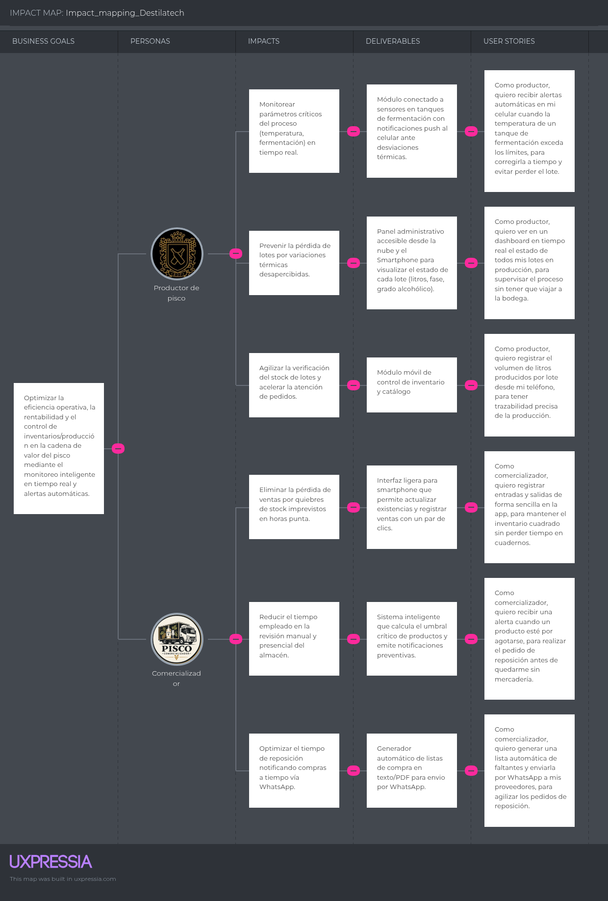</p>

*Nota.* Elaboración propia en UXPressia (2026).

*Descripción.* El mapa parte de un objetivo de negocio (optimizar la eficiencia operativa, la rentabilidad y el control de inventarios y producción en la cadena de valor del pisco) y lo descompone en dos personas: el productor de pisco y el comercializador. Para cada persona se señalan tres impactos que se desea provocar, los entregables que los habilitan (módulo de monitoreo con notificaciones, panel accesible desde el celular, módulo móvil de inventario, interfaz ligera para smartphone, sistema de umbrales y generador de listas de compra) y las historias de usuario que los concretan.


El Impact Mapping conecta el objetivo de negocio con las funcionalidades que se construirán, a través de cuatro preguntas: *¿por qué?* (objetivo), *¿quién?* (personas), *¿cómo cambia su comportamiento?* (impactos) y *¿qué se entrega?* (entregables e historias).

**Objetivo de negocio (Why).** Optimizar la eficiencia operativa, la rentabilidad y el control de inventarios y producción en la cadena de valor del pisco, mediante monitoreo inteligente y alertas automáticas. Para que el objetivo sea SMART, se propone la siguiente formulación, que el equipo validará con los usuarios:

| Criterio SMART | Formulación para Destilatech |
| :--- | :--- |
| Específico | Reducir los quiebres de stock de los comercializadores y la pérdida de lotes por condiciones anómalas de los productores mediante alertas automáticas. |
| Medible | Frecuencia mensual de quiebres de stock declarada por los comercializadores (línea base: 1.83 veces al mes, según las entrevistas de la sección 2.2.3) y número de alertas de condición anómala atendidas por lote. |
| Alcanzable | Se apoya en funcionalidades del MVP: umbrales de stock, rangos de variables simuladas y alertas en la plataforma. |
| Relevante | Responde a los dolores más repetidos en las entrevistas: quiebres de stock (4 de 4 comercializadores) y dificultad para monitorear variables del proceso (3 de 3 productores). |
| Temporal | Medir la mejora durante los tres primeros meses de uso de cada cuenta piloto, dentro del periodo de prueba y el primer ciclo de suscripción. |

**Relación entre el mapa y el backlog.** Cada rama del mapa se concreta en las siguientes historias del backlog:

| Persona | Impacto esperado | Entregable | Historias relacionadas |
| :--- | :--- | :--- | :--- |
| Productor de pisco | Monitorear parámetros críticos del proceso en tiempo real. | Módulo conectado a sensores simulados en tanques de fermentación, con notificaciones ante desviaciones. | US09, US10, US11, US28, US61 |
| Productor de pisco | Prevenir la pérdida de lotes por variaciones térmicas desapercibidas. | Panel administrativo accesible desde la nube y el smartphone con el estado de cada lote. | US04, US44, US65 |
| Productor de pisco | Agilizar la verificación del stock de lotes y la atención de pedidos. | Módulo móvil de control de inventario y catálogo. | US06, US43, US14, US18 |
| Comercializador | Eliminar la pérdida de ventas por quiebres de stock imprevistos en horas punta. | Interfaz ligera para smartphone que permite actualizar existencias y registrar ventas con pocos clics. | US05, US13, US14 |
| Comercializador | Reducir el tiempo empleado en la revisión manual del almacén. | Sistema que calcula el umbral crítico de productos y emite notificaciones preventivas. | US15, US16, US20, US51 |
| Comercializador | Optimizar el tiempo de reposición notificando compras a tiempo vía WhatsApp. | Generador de listas de compra en texto para enviar por WhatsApp. | US50 |

### 3.3. Product Backlog

El Product Backlog lista las 65 historias (51 historias de usuario y 14 historias técnicas) ordenadas por **prioridad de negocio**. La prioridad la determina el Product Owner según el valor que cada historia aporta a los segmentos y al negocio, y no depende de los Story Points. El orden es: primero la landing page, que es el primer punto de contacto con los clientes potenciales; luego el núcleo de valor para ambos segmentos (dashboards, inventario, alertas, producción, monitoreo, pedidos y estimaciones de reposición); después la gestión de la suscripción, que sostiene el modelo de negocio; el registro y la autenticación (IAM), que se incorporan cuando el curso aborde la autenticación; y, al final, las mejoras de gestión de datos. Cada historia técnica del *backend* aparece justo antes de la historia de interfaz que la consume.

Los Story Points los asigna el equipo de desarrollo, no el Product Owner, y expresan el esfuerzo relativo de cada historia a partir de tres factores: la complejidad, la frecuencia de uso y el riesgo. Se usa la escala 1, 2, 3, 5 y 8, donde 1 corresponde a un cambio muy pequeño y 8 a una historia con dependencias externas (como la pasarela de pago).

Las ocho primeras historias (US30 a US37) corresponden al Sprint 1 (landing page) y suman 18 Story Points.

**Herramienta de gestión del backlog:** [URL pública del tablero del Product Backlog: por completar]

**Figura 34**

*Product Backlog de Destilatech en la herramienta de gestión*

> **[CONFIRMAR: imagen pendiente]** Captura del tablero con las historias ordenadas por prioridad y sus Story Points.

*Nota.* Elaboración propia en la herramienta de gestión del backlog (2026).


| # Orden | User Story ID | Título | Descripción | Story Points |
| :---: | :--- | :--- | :--- | :---: |
| 1 | US30 | Navegar desde el encabezado (Header) | Como visitante deseo ver el logo y los enlaces de navegación en el encabezado para identificar la marca y llegar rápido a cada sección. | 2 |
| 2 | US31 | Entender qué es Destilatech (sección Description) | Como visitante deseo leer una descripción breve del producto y de sus usuarios para comprender a quién está dirigido. | 2 |
| 3 | US32 | Conocer los beneficios principales (sección Goals) | Como visitante deseo ver los principales beneficios de la plataforma para valorar qué problemas resuelve. | 2 |
| 4 | US33 | Comparar planes de suscripción (sección Pricing) | Como visitante deseo comparar los planes y conocer la duración del periodo de prueba para elegir el plan que se ajusta a mi negocio. | 3 |
| 5 | US34 | Ver cifras del sector (sección Impact) | Como visitante deseo ver cifras del sector pisquero peruano para confirmar la relevancia de la solución. | 2 |
| 6 | US35 | Conocer las funcionalidades por segmento (sección Platform Features) | Como visitante deseo ver las funcionalidades agrupadas para productor y para comercializador para saber qué módulos usaría mi negocio. | 3 |
| 7 | US36 | Encontrar contacto y enlaces en el pie de página (Footer) | Como visitante deseo ver la información de contacto y los enlaces adicionales al final de la página para comunicarme con el equipo o consultar información legal. | 1 |
| 8 | US37 | Usar la landing page en cualquier dispositivo (adaptabilidad móvil) | Como visitante deseo navegar la landing page desde mi teléfono, tablet o computadora para tener una experiencia consistente en cualquier pantalla. | 3 |
| 9 | US22 | Conocer la propuesta de valor | Como visitante deseo conocer qué ofrece Destilatech para decidir si me interesa registrarme. | 2 |
| 10 | US23 | Conocer planes y periodo de prueba | Como visitante deseo conocer los planes y el periodo de prueba gratuito para evaluar el costo antes de registrarme. | 2 |
| 11 | US25 | Conocer casos de uso por segmento | Como visitante de un segmento deseo ver contenido específico sobre cómo Destilatech resuelve mis necesidades para confirmar que la plataforma sirve para mi tipo de negocio. | 3 |
| 12 | US24 | Registrarme desde la landing page | Como visitante deseo acceder al registro desde la página de inicio para crear mi cuenta sin buscar el formulario. | 1 |
| 13 | US52 | Cambiar el idioma de la landing page | Como visitante deseo cambiar entre inglés y español para leer el contenido en el idioma que prefiero. | 2 |
| 14 | US53 | Consultar los términos y condiciones | Como visitante deseo consultar los términos y condiciones desde el pie de página para conocer las condiciones de uso antes de registrarme. | 1 |
| 15 | US65 | Endpoint de resumen del dashboard | Como Developer deseo un endpoint que devuelva el resumen del dashboard según el tipo de usuario para que la Web Application cargue el dashboard con una sola solicitud. | 3 |
| 16 | US04 | Ver dashboard de producción | Como productor deseo ver un dashboard con el estado general de mi producción e inventario para tomar decisiones sin revisar cada módulo por separado. | 5 |
| 17 | US05 | Ver dashboard comercial | Como comercializador deseo ver un dashboard con el estado de mi inventario y pedidos para identificar rápidamente qué productos necesito reponer. | 5 |
| 18 | US58 | Endpoints de productos | Como Developer deseo endpoints para crear y listar productos para que la Web Application administre el catálogo. | 2 |
| 19 | US12 | Registrar producto | Como productor o comercializador deseo registrar mis productos para tener un catálogo organizado. | 2 |
| 20 | US27 | Endpoint de movimientos de inventario | Como Developer deseo un endpoint que registre movimientos de inventario de forma consistente para que el stock refleje todas las entradas y salidas. | 3 |
| 21 | US13 | Registrar movimiento de inventario | Como productor o comercializador deseo registrar entradas y salidas de un producto para mantener mi stock actualizado. | 3 |
| 22 | US14 | Consultar stock disponible | Como productor o comercializador deseo consultar el stock disponible para no tener que revisar físicamente el almacén. | 2 |
| 23 | US15 | Configurar umbral de stock bajo | Como productor o comercializador deseo definir un umbral mínimo por producto para recibir alertas antes de quedarme sin stock. | 2 |
| 24 | US62 | Endpoints de alertas | Como Developer deseo endpoints para listar alertas y cambiar su estado para que la Web Application muestre y gestione las alertas. | 3 |
| 25 | US16 | Visualizar y atender alertas | Como productor o comercializador deseo visualizar mis alertas pendientes y marcarlas como atendidas para llevar control de lo que ya resolví. | 3 |
| 26 | US59 | Endpoint de registro de lotes | Como Developer deseo un endpoint que registre lotes de producción para que la Web Application guarde el historial de producción. | 2 |
| 27 | US06 | Registrar lote de producción | Como productor deseo registrar un nuevo lote para llevar un historial organizado de mis procesos. | 3 |
| 28 | US60 | Endpoint de cambio de estado de un lote | Como Developer deseo un endpoint que cambie el estado de un lote validando la secuencia de etapas para que el historial de cada lote sea consistente. | 2 |
| 29 | US07 | Actualizar estado de un lote | Como productor deseo actualizar el estado de un lote para reflejar el avance real del proceso. | 2 |
| 30 | US08 | Consultar historial de un lote | Como productor deseo consultar el historial completo de un lote para revisar su trazabilidad. | 2 |
| 31 | US43 | Registrar el embotellado de un lote | Como productor deseo registrar la cantidad embotellada de un lote para incorporar las botellas producidas a mi inventario. | 3 |
| 32 | US63 | Endpoint de pedidos | Como Developer deseo un endpoint que registre pedidos y descuente el stock para que las ventas queden reflejadas en el inventario. | 3 |
| 33 | US17 | Registrar cliente | Como productor o comercializador deseo registrar información básica de mis clientes para tener sus datos disponibles al registrar pedidos. | 2 |
| 34 | US18 | Registrar pedido | Como productor o comercializador deseo registrar un pedido de un cliente para llevar control de mis ventas. | 5 |
| 35 | US19 | Consultar historial de pedidos | Como productor o comercializador deseo consultar mis pedidos anteriores para revisar qué vendí y a quién. | 2 |
| 36 | US28 | Endpoint de lecturas IoT simuladas | Como Developer deseo un endpoint que reciba lecturas simuladas y las evalúe contra los rangos configurados para detectar condiciones anómalas durante la producción. | 3 |
| 37 | US09 | Visualizar variables de proceso | Como productor deseo visualizar las variables de un lote (simuladas) para supervisar el proceso a distancia. | 5 |
| 38 | US10 | Configurar rango normal de una variable | Como productor deseo definir el rango normal de una variable para que el sistema detecte anomalías automáticamente. | 3 |
| 39 | US11 | Recibir notificación de condición anómala | Como productor deseo ser notificado cuando una variable salga del rango normal para actuar a tiempo y evitar la pérdida del lote. | 3 |
| 40 | US55 | Elegir las variables que se monitorean en un lote | Como productor deseo elegir qué variables monitorear (temperatura, grado de azúcar o grado alcohólico) en cada lote para ver solo la información relevante para mi proceso. | 3 |
| 41 | US61 | Endpoint de consulta de lecturas | Como Developer deseo un endpoint que devuelva las lecturas de un lote filtradas por variable y rango de fechas para que la Web Application grafique la evolución del proceso. | 2 |
| 42 | US44 | Ver la tendencia de una variable | Como productor deseo ver en un gráfico la evolución de una variable de un lote en un rango de fechas para identificar desviaciones antes de que afecten al lote. | 3 |
| 43 | US50 | Generar lista de compra para reposición | Como comercializador deseo generar una lista de compra con los productos por reponer y compartirla como texto para agilizar mis pedidos de reposición por WhatsApp. | 3 |
| 44 | US64 | Servicio simulador de lecturas IoT | Como Developer deseo un servicio simulador que envíe lecturas sintéticas identificadas por un source_id a POST /batches/{id}/readings para probar el monitoreo sin sensores físicos. | 3 |
| 45 | US29 | Endpoint de estimaciones de reposición | Como Developer deseo un endpoint que devuelva la estimación de reposición de un producto para que la Web Application muestre cuándo reponer. | 3 |
| 46 | US20 | Ver estimación de reposición | Como productor o comercializador deseo ver una estimación de cuándo reponer un producto según mi historial para anticipar mis compras o mi producción. | 5 |
| 47 | US51 | Ver productos con riesgo de agotamiento | Como productor o comercializador deseo ver una lista de los productos con riesgo de agotarse pronto para priorizar qué reponer primero. | 3 |
| 48 | US21 | Ver indicadores históricos | Como productor o comercializador deseo visualizar indicadores históricos de inventario y producción para evaluar la evolución de mi negocio. | 5 |
| 49 | US57 | Endpoints de suscripción | Como Developer deseo endpoints para consultar y contratar la suscripción para que la Web Application gestione el plan de cada cuenta. | 5 |
| 50 | US03 | Recibir aviso de fin de periodo de prueba | Como usuario en prueba deseo recibir un aviso antes de que finalice mi periodo gratuito para decidir si me suscribo. | 2 |
| 51 | US54 | Consultar mi plan y estado de suscripción | Como productor o comercializador deseo consultar mi plan actual, el estado de mi suscripción y mi fecha de renovación o fin de prueba para planificar mi contratación. | 2 |
| 52 | US40 | Contratar un plan de suscripción | Como usuario en prueba o con prueba vencida deseo contratar un plan de suscripción para continuar usando Destilatech al terminar el periodo de prueba. | 8 |
| 53 | US56 | Endpoint de registro de cuenta | Como Developer deseo un endpoint que registre cuentas de productor o comercializador para que la Web Application cree cuentas e inicie el periodo de prueba. | 3 |
| 54 | US01 | Registrarme como productor o comercializador | Como visitante deseo registrar una cuenta indicando mi tipo de negocio para comenzar mi periodo de prueba gratuito. | 3 |
| 55 | US26 | Endpoint de autenticación | Como Developer deseo un endpoint de autenticación que devuelva un token para que la Web Application autentique usuarios. | 3 |
| 56 | US02 | Iniciar sesión | Como usuario registrado deseo iniciar sesión para acceder a las funcionalidades de mi tipo de usuario. | 2 |
| 57 | US38 | Cerrar sesión | Como usuario autenticado deseo cerrar mi sesión para proteger la información de mi negocio en dispositivos compartidos. | 1 |
| 58 | US39 | Recuperar contraseña | Como usuario registrado deseo restablecer mi contraseña mediante mi correo para recuperar el acceso a mi cuenta si la olvido. | 3 |
| 59 | US41 | Actualizar los datos de mi negocio | Como productor o comercializador deseo actualizar el nombre, la ubicación y el tipo de mi negocio para mantener correcta la información de mi cuenta. | 2 |
| 60 | US46 | Consultar el historial de movimientos de un producto | Como productor o comercializador deseo consultar el kardex de un producto para revisar de dónde proviene la diferencia de stock. | 3 |
| 61 | US47 | Ajustar el stock tras un conteo físico | Como productor o comercializador deseo registrar un ajuste de stock con el resultado de mi conteo físico para corregir diferencias entre el sistema y el almacén. | 3 |
| 62 | US48 | Filtrar alertas por tipo y estado | Como productor o comercializador deseo filtrar mis alertas por tipo (stock bajo o condición anómala) y por estado para encontrar rápidamente las que requieren atención. | 2 |
| 63 | US49 | Editar los datos de un cliente | Como productor o comercializador deseo editar los datos de un cliente registrado para mantener actualizada mi información de contacto. | 1 |
| 64 | US42 | Editar los datos de un lote | Como productor deseo corregir los datos de un lote registrado para mantener información exacta de mi producción. | 2 |
| 65 | US45 | Editar o desactivar un producto | Como productor o comercializador deseo editar los datos de un producto o desactivarlo para mantener actualizado mi catálogo. | 2 |

**Total del backlog: 179 Story Points.**


## Capítulo IV: Product Design

Este capítulo documenta las decisiones de diseño de Destilatech: la guía de estilo visual, la arquitectura de información, el diseño de la landing page y de la aplicación web, y la arquitectura de software derivada del análisis del dominio. Todas las figuras incluyen su nota de autoría y una descripción de su contenido.

### 4.1. Style Guidelines

Una guía de estilo (*style guideline*) reúne las normas de diseño que se aplican de forma coherente en todos los puntos de contacto del producto. Las especificaciones de esta sección se aplican a la landing page, a la aplicación web y a los prototipos de Destilatech.

#### 4.1.1. General Style Guidelines

**Branding**

La identidad visual de Destilatech busca combinar la tradición artesanal del pisco con la precisión del monitoreo digital. El logotipo está formado por el nombre de la marca en tipografía sans-serif de trazo grueso y un ícono lineal de copa de destilado, con un punto ámbar en el borde que representa el dato o la medición. Los colores del logotipo —cobre oscuro sobre fondo crema— transmiten calidez y confianza, y el trazo simple facilita su uso en tamaños pequeños, como el favicon o el encabezado de la aplicación.

**Figura 35**

*Logotipo de Destilatech*

<p align="center"></p>

*Nota.* Elaboración propia (2026).

*Descripción.* El logotipo muestra, sobre un fondo crema, una copa de destilado dibujada con trazo lineal cobre oscuro, con un pequeño círculo ámbar en el borde superior derecho. Debajo se lee el nombre «Destilatech» en tipografía sans-serif de peso alto, en el mismo cobre oscuro. La composición es vertical y centrada.


**Typography**

Se utilizan dos familias de la biblioteca Google Fonts. **Poppins** se emplea en títulos y encabezados por sus formas geométricas y su fuerte presencia visual; **Inter** se emplea en párrafos, tablas e indicadores numéricos porque fue diseñada para pantallas y mantiene la legibilidad en tamaños pequeños, un aspecto relevante para los productores y comercializadores que consultan la aplicación desde un teléfono.

La siguiente tabla resume las especificaciones tipográficas para escritorio. Las especificaciones para móvil se detallan en la sección 4.1.3.

**Tabla 1**

*Especificaciones tipográficas de Destilatech para escritorio*

| Elemento | Color del texto | Fondo | Fuente | Peso | Tamaño | Interlineado | Alineación |
| :--- | :--- | :--- | :--- | :--- | :--- | :--- | :--- |
| **H1** | #5c2b21 | Ninguno | Poppins | Bold (700) | 48 px | 1.2 | Izquierda |
| **H2** | #5c2b21 | Ninguno | Poppins | SemiBold (600) | 36 px | 1.3 | Izquierda |
| **H3** | #5c2b21 | Ninguno | Poppins | SemiBold (600) | 24 px | 1.4 | Izquierda |
| **H4** | #7a3b2e | Ninguno | Poppins | Medium (500) | 20 px | 1.4 | Izquierda |
| **Párrafo** | #2c2320 | Ninguno | Inter | Regular (400) | 16 px | 1.5 | Izquierda |
| **Texto pequeño** | #6b5d55 | Ninguno | Inter | Light (300) | 12 px | 1.5 | Izquierda |
| **Datos e indicadores** | #5c2b21 | Ninguno | Inter | SemiBold (600) | 28 px | 1.2 | Izquierda |

**Colors**

La paleta se definió a partir de los materiales y procesos del pisco: el cobre del alambique, el ámbar del destilado y el crema del fondo de barrica. Los verdes y dorados de estado se reservan para comunicar el estado operativo (normal, advertencia). La siguiente tabla lista cada color con su variable CSS.

**Tabla 2**

*Paleta de colores de Destilatech*

| Nombre | Hexadecimal | Variable CSS | Uso principal |
| :--- | :--- | :--- | :--- |
| Deep Copper | #7a3b2e | `--color-primary` | Color primario de marca, botones y énfasis. |
| Dark Copper | #5c2b21 | `--color-primary-dark` | Encabezados, barra lateral y secciones de contraste. |
| Warm Terracotta | #a85c3f | `--color-primary-light` | Bordes activos e interacciones (hover). |
| Amber Gold | #d99b3f | `--color-accent` | Insignias, destacados y gráficos. |
| Cask Cream | #fffdf9 | `--color-bg` | Fondo principal. |
| Warm Sand | #f7efe4 | `--color-bg-alt` | Fondo alterno de secciones y tarjetas. |
| Earth Dark | #2c2320 | `--color-text` | Texto principal. |
| Muted Clay | #6b5d55 | `--color-text-muted` | Párrafos descriptivos y subtítulos. |
| Success Green | #2f7a4f | `--color-success` | Estados normales o correctos. |
| Warning Gold | #b8781f | `--color-warn` | Advertencias, como niveles bajos de stock. |

**Figura 36**

*Paleta de colores de Destilatech*

<p align="center">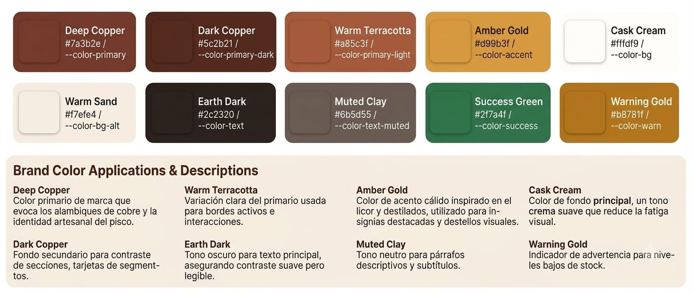</p>

*Nota.* Elaboración propia (2026).

*Descripción.* La imagen presenta diez muestras de color con su nombre, su código hexadecimal y su variable CSS: Deep Copper, Dark Copper, Warm Terracotta, Amber Gold, Cask Cream, Warm Sand, Earth Dark, Muted Clay, Success Green y Warning Gold. Debajo se incluye un recuadro con la descripción de uso de cada color de marca, por ejemplo Deep Copper como color primario que evoca los alambiques de cobre y Warning Gold como indicador de advertencia para niveles bajos de stock.


**Spacing**

El espaciado sigue una escala de cinco valores que mantiene el orden visual y asegura áreas táctiles adecuadas en dispositivos móviles.

**Tabla 3**

*Escala de espaciado*

| Token | Valor | Uso principal |
| :--- | :--- | :--- |
| Spacing 01 | 8 px | Botones compactos, insignias e íconos pequeños. |
| Spacing 02 | 16 px | Tarjetas pequeñas, menús y separación entre ícono y texto. |
| Spacing 03 | 24 px | Tarjetas de planes, contenedores y elementos de cuadrícula. |
| Spacing 04 | 36 px | Bloques de contenido, columnas y títulos de sección. |
| Spacing 05 | 64 px a 88 px | Relleno vertical de secciones completas. |

#### 4.1.2. Web Style Guidelines

Destilatech se diseña como un sitio adaptable (*responsive*), de modo que la misma interfaz sirva a quien administra desde una oficina y a quien consulta desde la bodega o el punto de venta.

**Landing page en escritorio.** El encabezado fijo contiene, de izquierda a derecha, el logotipo, el menú de secciones (Descripción, Objetivos, Precios, Impacto, Funcionalidades), el selector de idioma ES / EN y el botón principal «Prueba gratis 14 días». La sección inicial (*hero*) sigue un recorrido en Z: el título y el resumen a la izquierda, la imagen con tarjetas de datos a la derecha y, debajo, los botones de acción. Las secciones siguientes usan cuadrículas de dos, tres y cuatro columnas según el tipo de contenido (segmentos, planes y beneficios). Los desplazamientos hacia cada sección usan *smooth scroll*.

**Aplicación web en escritorio.** Se utiliza una barra lateral de color Dark Copper con el logotipo y los módulos disponibles según el perfil, un encabezado de página con el título y la etiqueta del rol (Productor o Comercializador), y un área de contenido con tarjetas de indicadores en la parte superior y tablas o gráficos debajo.

**Idioma.** El idioma por defecto del producto es el inglés (`en_US`), con español (`es_419`) disponible desde el selector de idioma del encabezado. Todos los textos de la interfaz se gestionan mediante archivos de traducción.

**Accesibilidad.** Se usan etiquetas semánticas HTML y atributos ARIA (`aria-label` en botones de ícono, `aria-current` en el elemento activo del menú), contraste de color suficiente entre texto y fondo, navegación completa por teclado y texto alternativo en las imágenes.

**Términos y condiciones.** Los enlaces a «Términos y condiciones» y «Política de privacidad» se ubican en el pie de página de la landing page y de la aplicación web.

#### 4.1.3. Mobile Style Guidelines

Esta sección establece las reglas para pantallas menores a 768 px. Los valores son decisiones de diseño del equipo orientadas a uso con una mano y a lectura en exteriores.

**Tabla 4**

*Especificaciones tipográficas para móvil*

| Elemento | Fuente | Peso | Tamaño | Interlineado |
| :--- | :--- | :--- | :--- | :--- |
| H1 | Poppins | Bold (700) | 32 px | 1.2 |
| H2 | Poppins | SemiBold (600) | 24 px | 1.3 |
| H3 | Poppins | SemiBold (600) | 20 px | 1.4 |
| Párrafo | Inter | Regular (400) | 16 px | 1.5 |
| Texto pequeño | Inter | Light (300) | 12 px | 1.5 |

**Tabla 5**

*Reglas de diseño para móvil*

| Aspecto | Regla |
| :--- | :--- |
| Navegación | El menú del encabezado se reduce a un botón de menú tipo hamburguesa; el botón «Prueba gratis 14 días» permanece visible. En la aplicación, la barra lateral se convierte en un menú desplegable. |
| Áreas táctiles | Tamaño mínimo de 44 × 44 px con separación de 8 px entre elementos interactivos. |
| Diseño de contenido | Una sola columna; las tarjetas de planes y de indicadores se apilan verticalmente. |
| Tablas | Se muestran como lista de tarjetas o con desplazamiento horizontal contenido. |
| Espaciado | Márgenes laterales de 16 px y relleno vertical de sección de 40 px. |
| Formularios | Campos de ancho completo con etiqueta visible y teclado adecuado al tipo de dato (correo, número). |

### 4.2. Information Architecture

La arquitectura de información define cómo se organizan, nombran, buscan y recorren los contenidos de Destilatech. Se basa en los principios de Rosenfeld et al. (2015): sistemas de organización, de etiquetado, de búsqueda y de navegación. Las historias de usuario citadas corresponden a las de la sección 3.1.

#### 4.2.1. Organization Systems

Un sistema de organización agrupa el contenido bajo **esquemas** (criterios para agrupar) y **estructuras** (relaciones entre grupos). Los esquemas pueden ser exactos (el criterio no admite duda, como el orden alfabético o cronológico) o ambiguos (dependen de la interpretación, como la agrupación por tema, por tarea o por tipo de usuario).

**Esquemas de organización**

| Esquema | Tipo | Dónde se aplica en Destilatech |
| :--- | :--- | :--- |
| Cronológico | Exacto | Historial de un lote y sus cambios de estado (US08); historial de movimientos de inventario (US46) y de pedidos (US19); lecturas de variables ordenadas por fecha y hora (US09). |
| Alfabético | Exacto | Listas de productos (US12) y de clientes (US17) ordenadas por nombre; selector de lotes por código. |
| Por tema | Ambiguo | Secciones de la landing page agrupadas por tema: descripción, beneficios, planes, impacto y funcionalidades (US31 a US35). |
| Por tarea | Ambiguo | Menú de la aplicación: Dashboard, Monitoreo, Lotes, Inventario, Pedidos y Alertas, agrupados por la tarea que el usuario quiere realizar. |
| Por tipo de usuario | Ambiguo | Menú y dashboards diferenciados para Productor (US04) y Comercializador (US05); pestañas de funcionalidades por segmento (US35). |

**Estructuras de organización**

- *Estructura jerárquica.* La landing page se organiza como árbol: la página principal contiene secciones, y cada sección, sus elementos (por ejemplo, Precios contiene tres planes). La aplicación se organiza por módulos: Lotes contiene el listado y el detalle de cada lote, con su historial (US06, US08).
- *Estructura secuencial.* Los procesos que requieren pasos ordenados se guían por pasos sucesivos: registro de cuenta y prueba gratuita (US01), registro de un lote (US06) y registro de un pedido con sus líneas de producto (US18).
- *Estructura matricial.* Las tablas permiten al usuario ordenar y filtrar el mismo conjunto de datos por distintos ejes: el stock por producto y estado (US14), los lotes por variedad y etapa (US08) y las alertas por tipo y estado (US16).

**Organización visual.** Para reducir la carga cognitiva se aplica jerarquía visual: la información crítica (alertas de condición anómala y productos con stock bajo) se ubica en la parte superior con los colores de advertencia y el mayor peso tipográfico; la información secundaria (configuración de cuenta) mantiene menor protagonismo.

#### 4.2.2. Labeling Systems

El etiquetado usa un lenguaje coherente con el Ubiquitous Language (sección 2.5) y adaptado a cada perfil. Cada etiqueta indica la acción o el contenido de forma directa y, cuando corresponde, incluye su unidad de medida.

| Perfil | Criterio de etiquetado | Ejemplos |
| :--- | :--- | :--- |
| Visitante | Llamadas a la acción claras y campos de formulario breves. | «Prueba gratis 14 días», «Ver funcionalidades», «Nombre», «Nombre del negocio», «Correo electrónico». |
| Productor | Términos técnicos del proceso con unidades explícitas. | «Temperatura (°C)», «Densidad», «pH», «Humedad (%)», «Lote», «Etapa», «+ Nuevo lote». |
| Comercializador | Términos de gestión de stock y ventas. | «Stock», «Stock bajo», «Umbral de stock bajo», «+ Nuevo pedido», «Clientes», «Lista de compra». |

**Etiquetado en móvil.** En pantallas pequeñas las etiquetas de los botones de acción se acortan («+ Lote», «+ Pedido») y se acompañan de un ícono; el texto completo se conserva en el atributo `aria-label` para lectores de pantalla.

#### 4.2.3. SEO Tags and Meta Tags

Las etiquetas SEO ayudan a los buscadores a interpretar y posicionar una página; las metaetiquetas aportan información sobre ella, como su descripción, palabras clave y autor. A continuación se presentan las etiquetas definidas para la **landing page** (pública e indexable) y para la **aplicación web** (de uso privado, no indexable). El idioma por defecto del producto es el inglés; el contenido en español se activa con el selector de idioma.

**Landing page**

***Title.*** Título único de la página, con la palabra clave principal.

```html
<title>Destilatech | Production and inventory management for pisco producers</title>
```

***Description.*** Resumen de la página que se muestra en los resultados de búsqueda.

```html
<meta name="description" content="Destilatech is a SaaS platform that centralizes production monitoring with simulated IoT data, inventory and orders for pisco producers and retailers in Peru. Try it free for 14 days.">
```

***Keywords.*** Términos de búsqueda relacionados con el producto.

```html
<meta name="keywords" content="pisco, pisco production, inventory management, IoT monitoring, SaaS, Peru, batch traceability">
```

***Author.*** Autor del contenido.

```html
<meta name="author" content="FuturosSeniors">
```

***Idioma.*** Se declara el idioma por defecto en el elemento raíz y, para el contenido alterno, en cada bloque traducido.

```html
<html lang="en">
<meta http-equiv="Content-Language" content="en">
```

***Robots.*** La landing page se indexa.

```html
<meta name="robots" content="index, follow">
```

***Viewport.*** Necesaria para la adaptación a pantallas móviles.

```html
<meta name="viewport" content="width=device-width, initial-scale=1.0">
```

***Canonical.*** URL canónica publicada del sitio.

```html
<link rel="canonical" href="https://upc-pre-202620-1asi0730-2620-8084-desti.github.io/destilatech-website/">
```

**Aplicación web**

La aplicación web requiere inicio de sesión, por lo que no debe aparecer en los buscadores; aun así, mantiene título, descripción, palabras clave y autor para el uso compartido de enlaces y la accesibilidad.

```html
<title>Destilatech App | Production, inventory and orders</title>
<meta name="description" content="Destilatech web application: batch tracking, simulated IoT monitoring, inventory, orders and alerts for pisco producers and retailers.">
<meta name="keywords" content="pisco, batches, inventory, orders, alerts, IoT simulator">
<meta name="author" content="FuturosSeniors">
<meta name="robots" content="noindex, nofollow">
<meta name="viewport" content="width=device-width, initial-scale=1.0">
```

#### 4.2.4. Searching Systems

Los sistemas de búsqueda permiten al usuario encontrar información sin recorrer toda la navegación. Destilatech ofrece filtros y búsqueda por texto en los listados principales:

- **Lotes de producción:** búsqueda por código de lote y filtros por variedad (Quebranta, Italia, Acholado, Torontel) y por etapa (registrado, fermentación, destilación, embotellado, finalizado).
- **Lecturas de variables:** selección del lote y de la variable (temperatura, pH, humedad, densidad) y filtro por rango de fechas para ver su tendencia.
- **Productos e inventario:** búsqueda por nombre o SKU y filtro por estado de stock (óptimo, bajo, crítico).
- **Pedidos y clientes:** búsqueda por cliente y filtro por estado del pedido.
- **Alertas:** filtros por tipo (stock bajo o anomalía de sensor) y por estado (pendiente o atendida).

En móvil, el campo de búsqueda se muestra en la parte superior de cada listado y los filtros se agrupan en un panel desplegable.

#### 4.2.5. Navigation Systems

Los sistemas de navegación definen cómo se desplaza el usuario por el producto.

- **Navegación global.** En la landing page, el menú del encabezado lleva a cada sección. En la aplicación, la barra lateral permite pasar entre Dashboard, Monitoreo, Lotes, Inventario, Pedidos y Alertas; el Comercializador ve una versión reducida (Dashboard, Inventario, Pedidos y Alertas).
- **Registro e inicio de sesión.** Al registrarse, el usuario elige si su negocio es productor o comercializador; esa elección determina el menú y el dashboard que verá (US01, US02).
- **Dashboard.** Es la pantalla de inicio de la aplicación; resume los indicadores y da acceso directo a las alertas pendientes (US04, US05).
- **Monitoreo y lotes.** Permiten recorrer el ciclo de vida de cada lote y consultar las lecturas de sus variables, que provienen del simulador de datos IoT (US08, US09).
- **Inventario y pedidos.** Permiten consultar el stock, registrar movimientos y registrar pedidos de clientes (US13, US14, US18).
- **Mi cuenta.** Reúne los datos del negocio, el plan y el estado de la suscripción.
- **Migas de pan y retorno.** Las pantallas de detalle muestran su ubicación (por ejemplo, Lotes > LT-2026-018) y un enlace para volver al listado.
- **Navegación en móvil.** El menú lateral se reemplaza por un menú desplegable abierto desde el botón de menú del encabezado; las acciones principales permanecen al alcance del pulgar.

### 4.3. Landing Page UI Design

El diseño de la landing page busca causar una primera impresión clara y confiable, y llevar al visitante —productor o comercializador de pisco— a iniciar su prueba gratuita de 14 días. Se diseñó primero en baja fidelidad (wireframes) y luego en alta fidelidad (mock-ups).

#### 4.3.1. Landing Page Wireframe

**Wireframes para escritorio**

**Figura 37**

*Wireframe de la landing page: encabezado y sección inicial*

<p align="center">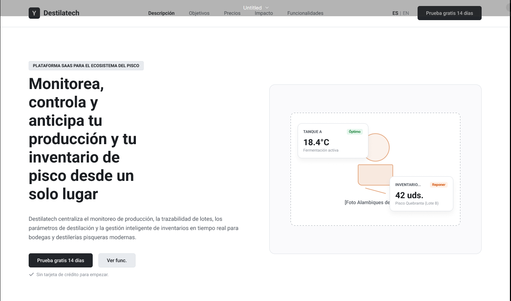</p>

*Nota.* Elaboración propia en Figma (2026).

*Descripción.* En el encabezado se ubican el logotipo, el menú de secciones, el selector ES / EN y el botón «Prueba gratis 14 días». La sección inicial usa dos columnas: a la izquierda, el título, el resumen, los botones de acción y la nota «Sin tarjeta de crédito para empezar»; a la derecha, un marcador de imagen con dos tarjetas flotantes, una de temperatura de tanque (18.4 °C, Óptimo) y otra de inventario (42 uds., Reponer).


**Figura 38**

*Wireframe de la landing page: sección de segmentos*

<p align="center">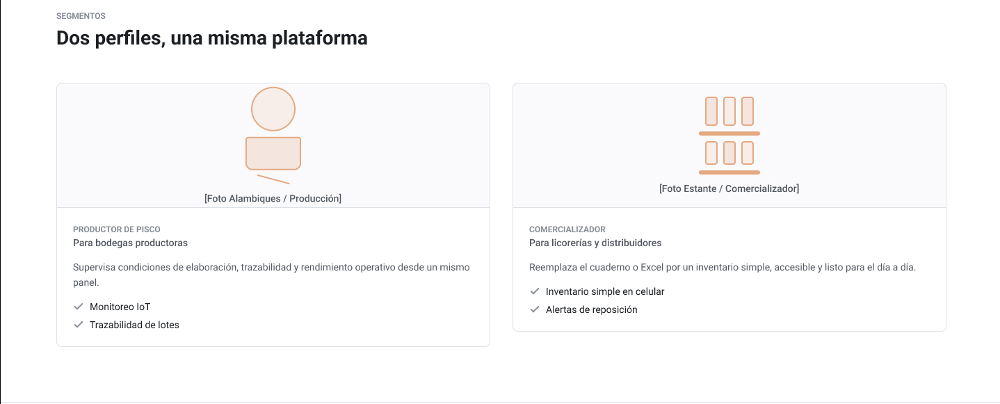</p>

*Nota.* Elaboración propia en Figma (2026).

*Descripción.* La sección «Dos perfiles, una misma plataforma» presenta dos tarjetas lado a lado, una para el Productor de pisco y otra para el Comercializador. Cada tarjeta tiene un marcador de fotografía, un texto breve y una lista de verificación con las funciones principales de su segmento.


**Figura 39**

*Wireframe de la landing page: sección de beneficios*

<p align="center">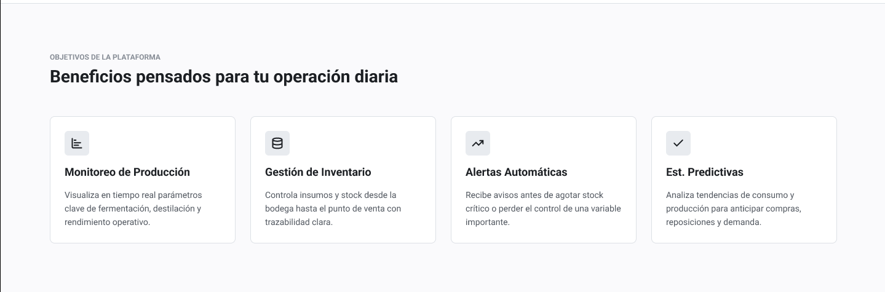</p>

*Nota.* Elaboración propia en Figma (2026).

*Descripción.* La sección «Beneficios pensados para tu operación diaria» organiza cuatro tarjetas en una fila: Monitoreo de Producción, Gestión de Inventario, Alertas Automáticas y Estimaciones Predictivas. Cada tarjeta incluye un ícono, un título y una descripción corta.


**Figura 40**

*Wireframe de la landing page: planes de suscripción e impacto*

<p align="center">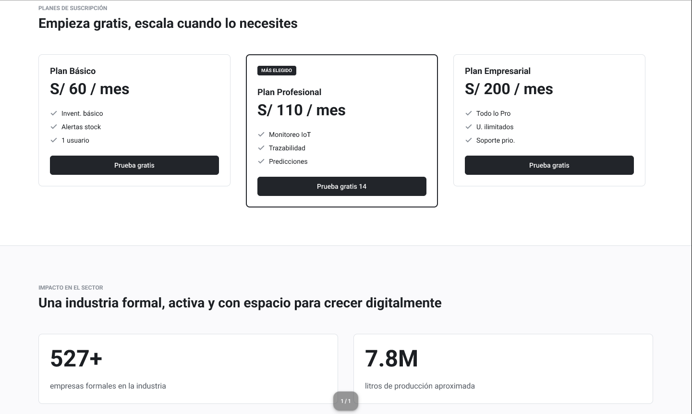</p>

*Nota.* Elaboración propia en Figma (2026).

*Descripción.* La sección de planes muestra tres tarjetas —Plan Básico (S/ 60 al mes), Plan Profesional (S/ 110 al mes, destacado con la insignia «Más elegido») y Plan Empresarial (S/ 200 al mes)— con sus características y un botón de prueba gratuita. Debajo, un bloque de dos columnas presenta las cifras del sector: más de 527 empresas formales y 7.8 millones de litros de producción aproximada.


**Figura 41**

*Wireframe de la landing page: funcionalidades por segmento y llamada a la acción*

<p align="center">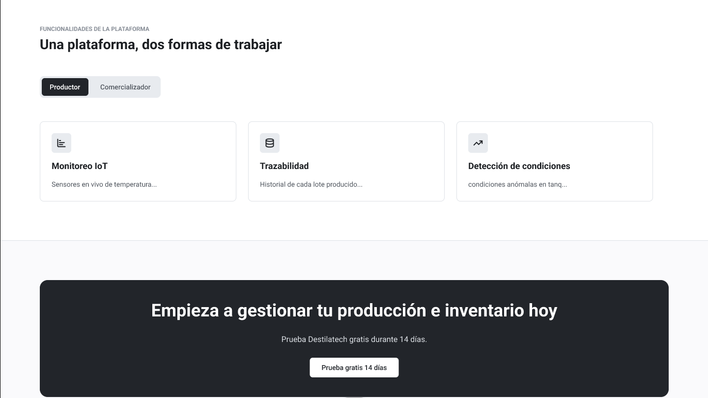</p>

*Nota.* Elaboración propia en Figma (2026).

*Descripción.* La sección «Una plataforma, dos formas de trabajar» incluye pestañas para alternar entre Productor y Comercializador y tres tarjetas de funcionalidades por pestaña (Monitoreo IoT, Trazabilidad y Detección de condiciones anómalas). Debajo aparece un bloque oscuro con la llamada a la acción «Empieza a gestionar tu producción e inventario hoy» y el botón de prueba gratuita.


**Figura 42**

*Wireframe de la landing page: llamada a la acción final y pie de página*

<p align="center">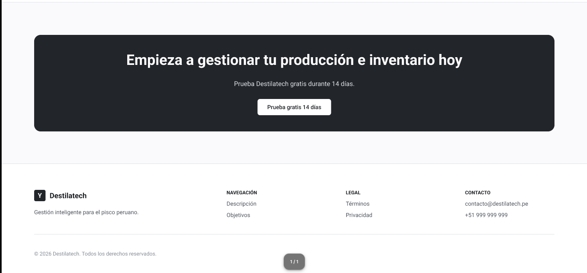</p>

*Nota.* Elaboración propia en Figma (2026).

*Descripción.* El bloque final repite la llamada a la acción y, debajo, el pie de página se organiza en cuatro columnas: marca con eslogan, Navegación (Descripción, Objetivos), Legal (Términos, Privacidad) y Contacto (correo y teléfono), seguidas de la línea de derechos reservados.


**Wireframes para móvil**

En la versión móvil el contenido se apila en una sola columna y el menú se reduce a un botón tipo hamburguesa. Los wireframes siguientes muestran la secuencia de pantallas que ve el visitante al desplazarse.

**Figura 43**

*Wireframes de la landing page para móvil*

<p align="center">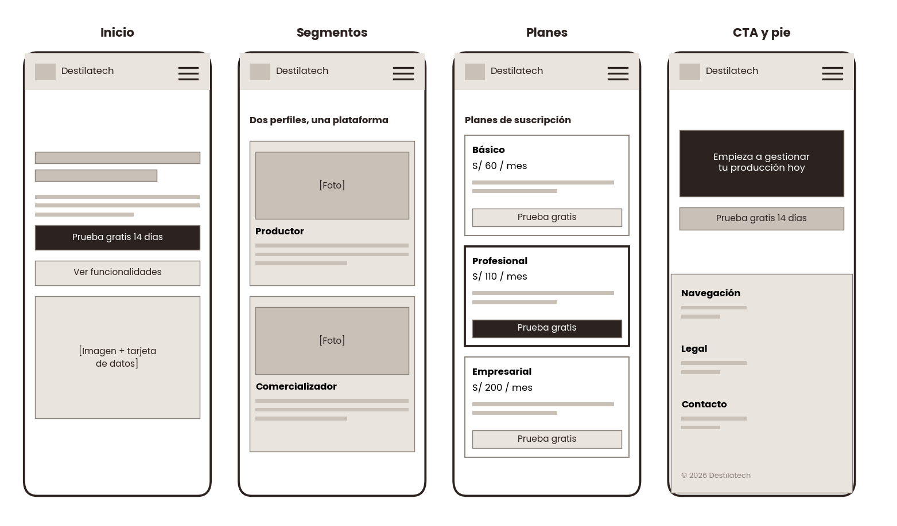</p>

*Nota.* Elaboración propia (2026).

*Descripción.* Cuatro pantallas de teléfono dibujadas en baja fidelidad. La primera muestra el encabezado con el logotipo y el botón de menú, el título principal, el texto de apoyo, el botón «Prueba gratis 14 días» y la imagen con una tarjeta de datos. La segunda presenta las dos tarjetas de segmento apiladas una sobre otra. La tercera muestra los tres planes de suscripción en columna con el plan central destacado. La cuarta incluye la llamada a la acción final y el pie de página con sus enlaces apilados.


#### 4.3.2. Landing Page Mock-up

Los mock-ups aplican la guía de estilo de la sección 4.1 sobre los wireframes anteriores: paleta de cobre, ámbar y crema, tipografías Poppins e Inter, fotografías de bodegas y estantes de licorería, y tarjetas con ícono y lista de verificación.

**Figura 44**

*Mock-up de la landing page: encabezado y sección inicial*

<p align="center">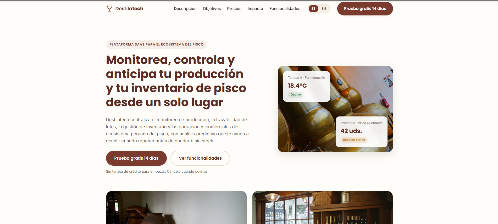</p>

*Nota.* Elaboración propia a partir de la landing page publicada (2026).

*Descripción.* El encabezado fijo contiene el logotipo, el menú de secciones, el selector ES / EN y el botón «Prueba gratis 14 días» en color cobre. La sección inicial muestra el título «Monitorea, controla y anticipa tu producción y tu inventario de pisco desde un solo lugar», dos botones de acción y, a la derecha, una fotografía de botellas de pisco con dos tarjetas flotantes: temperatura de tanque (18.4 °C, Óptimo) e inventario (42 uds., Reponer pronto).


**Figura 45**

*Mock-up de la landing page: segmentos*

<p align="center">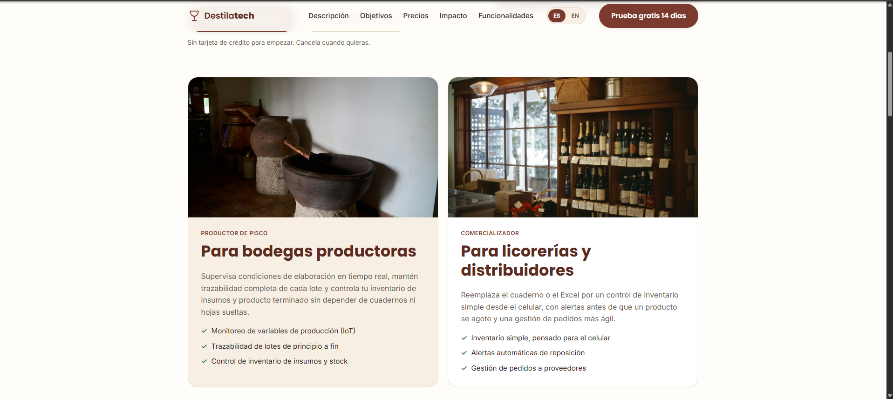</p>

*Nota.* Elaboración propia a partir de la landing page publicada (2026).

*Descripción.* Dos tarjetas con fotografía presentan los segmentos. «Para bodegas productoras» (fondo arena) lista el monitoreo de variables, la trazabilidad de lotes y el control de inventario de insumos. «Para licorerías y distribuidores» lista el inventario simple desde el celular, las alertas de reposición y la gestión de pedidos a proveedores.


**Figura 46**

*Mock-up de la landing page: beneficios*

<p align="center">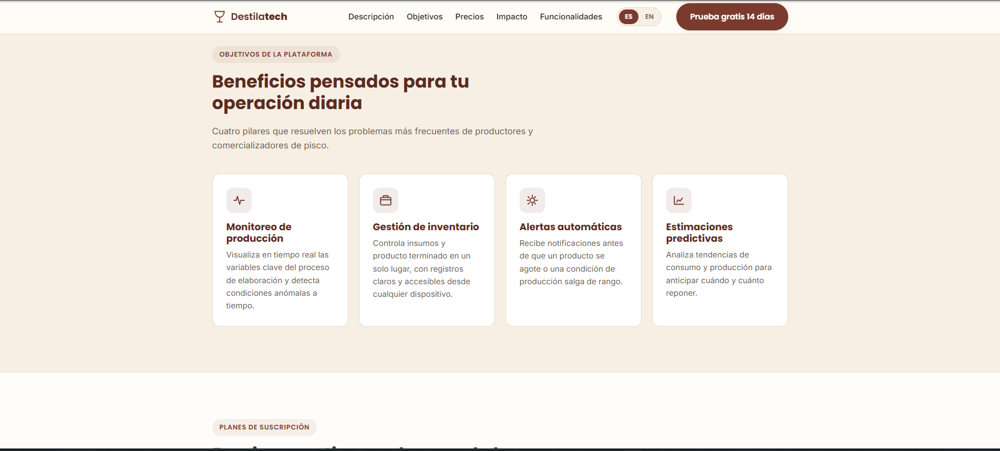</p>

*Nota.* Elaboración propia a partir de la landing page publicada (2026).

*Descripción.* Cuatro tarjetas blancas sobre fondo arena, cada una con un ícono, un título y una descripción: Monitoreo de producción, Gestión de inventario, Alertas automáticas y Estimaciones predictivas.


**Figura 47**

*Mock-up de la landing page: planes de suscripción*

<p align="center">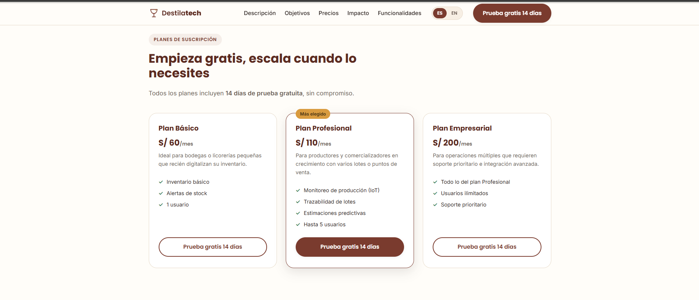</p>

*Nota.* Elaboración propia a partir de la landing page publicada (2026).

*Descripción.* Tres tarjetas de planes: Básico (S/ 60 al mes), Profesional (S/ 110 al mes, con la insignia «Más elegido» y borde resaltado) y Empresarial (S/ 200 al mes). Cada plan lista sus características y un botón «Prueba gratis 14 días». Sobre las tarjetas se indica que todos los planes incluyen 14 días de prueba sin compromiso.


**Figura 48**

*Mock-up de la landing page: impacto en el sector*

<p align="center">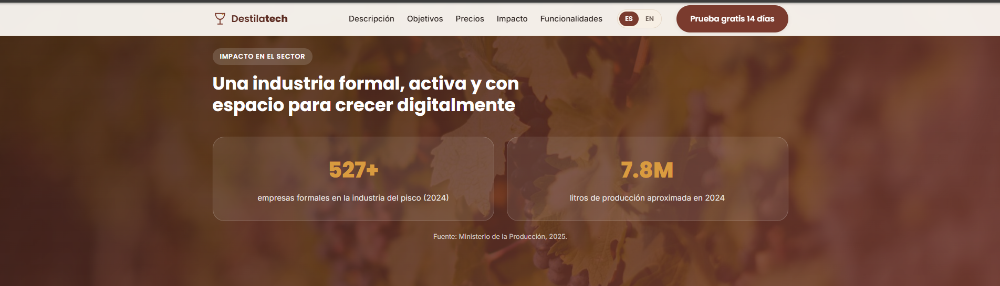</p>

*Nota.* Elaboración propia a partir de la landing page publicada (2026).

*Descripción.* Sobre un fondo fotográfico oscuro de tonos cobre se muestran dos cifras destacadas en dorado: más de 527 empresas formales en la industria del pisco (2024) y 7.8 millones de litros de producción aproximada en 2024, con la fuente indicada al pie.


**Figura 49**

*Mock-up de la landing page: funcionalidades por segmento*

<p align="center">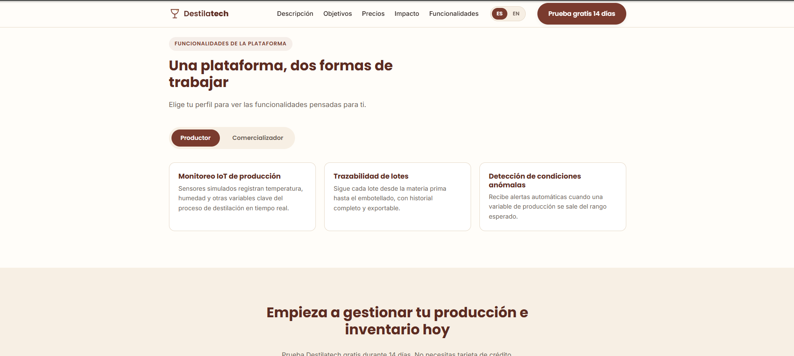</p>

*Nota.* Elaboración propia a partir de la landing page publicada (2026).

*Descripción.* Las pestañas «Productor» y «Comercializador» permiten alternar el contenido. Con la pestaña Productor activa se ven tres tarjetas: Monitoreo IoT de producción, Trazabilidad de lotes y Detección de condiciones anómalas. Debajo comienza el bloque de la llamada a la acción sobre fondo arena.


**Figura 50**

*Mock-up de la landing page: llamada a la acción y pie de página*

<p align="center">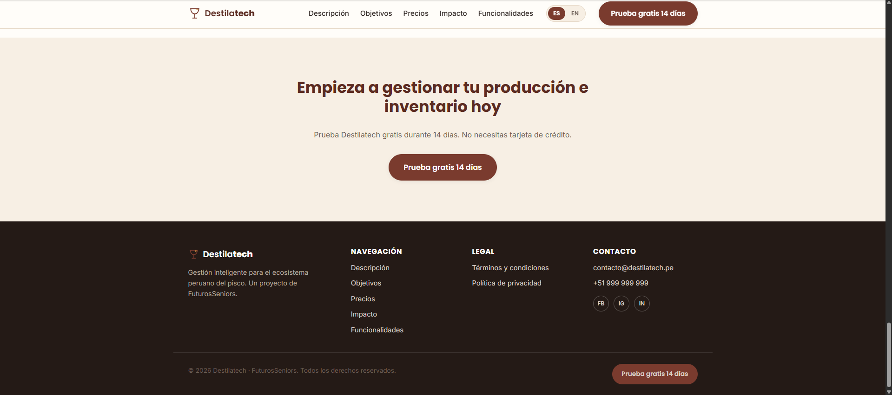</p>

*Nota.* Elaboración propia a partir de la landing page publicada (2026).

*Descripción.* La llamada a la acción final invita a probar Destilatech durante 14 días sin tarjeta de crédito. El pie de página, en tono oscuro, se organiza en columnas de marca, Navegación, Legal (términos y condiciones y política de privacidad) y Contacto, con íconos de redes sociales y un botón de prueba gratuita.


**Mock-up para móvil**

**Figura 51**

*Mock-up de la landing page para móvil: inicio, menú desplegado y objetivos*

<p align="center">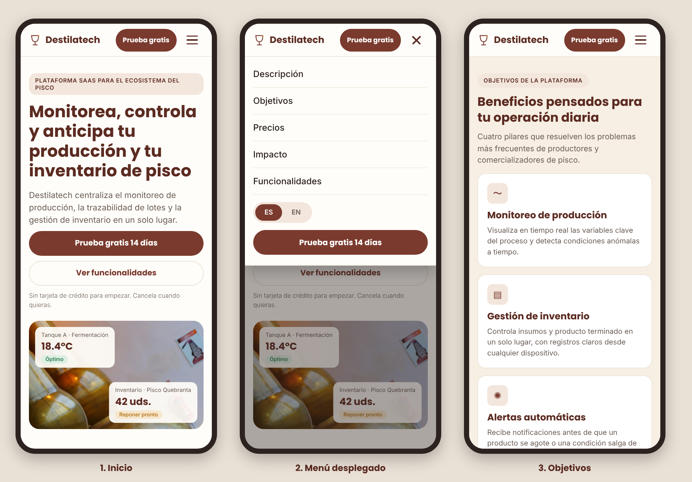</p>

*Nota.* Elaboración propia (2026), a partir de la guía de estilo (secciones 4.1.1 y 4.1.3) y de los mock-ups de escritorio.

*Descripción.* Tres pantallas de teléfono de 390 px de ancho. La pantalla 1 muestra el encabezado con el logotipo, el botón «Prueba gratis» siempre visible y el botón de menú; debajo, la etiqueta de la plataforma, el título principal, el texto de apoyo, los botones «Prueba gratis 14 días» y «Ver funcionalidades» a ancho completo, la nota «Sin tarjeta de crédito» y la fotografía de alambiques con las tarjetas de temperatura (18.4 °C, Óptimo) e inventario (42 uds., Reponer pronto). La pantalla 2 muestra el menú desplegado (Descripción, Objetivos, Precios, Impacto y Funcionalidades), el selector de idioma ES / EN y el botón de prueba gratuita, con el contenido restante atenuado. La pantalla 3 apila en una sola columna las cuatro tarjetas de beneficios: Monitoreo de producción, Gestión de inventario, Alertas automáticas y Estimaciones predictivas.

**Figura 52**

*Mock-up de la landing page para móvil: planes, funcionalidades, impacto y pie de página*

<p align="center">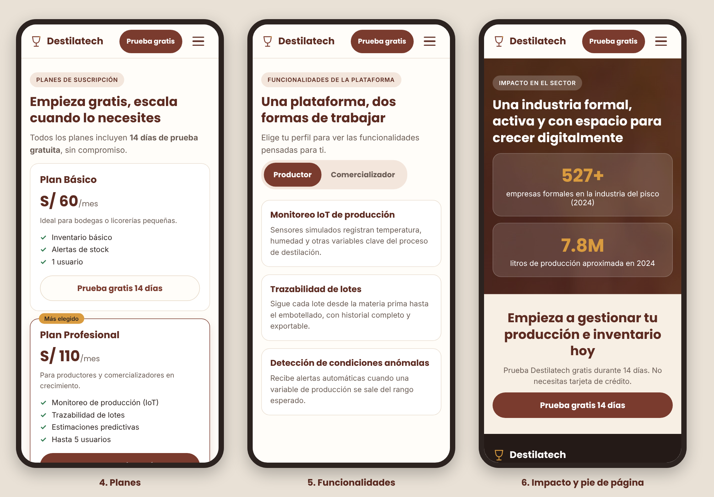</p>

*Nota.* Elaboración propia (2026), a partir de la guía de estilo (secciones 4.1.1 y 4.1.3) y de los mock-ups de escritorio.

*Descripción.* La pantalla 4 apila las tarjetas de planes (Plan Básico a S/ 60 al mes y Plan Profesional a S/ 110 al mes, con la insignia «Más elegido»), cada una con su botón de prueba gratuita. La pantalla 5 muestra el selector de perfil (Productor y Comercializador) y las tarjetas de funcionalidades en una columna. La pantalla 6 muestra la sección de impacto sobre fondo de viñedo con las cifras 527+ y 7.8M, la llamada a la acción final y el inicio del pie de página en tono oscuro.


**Enlaces de la landing page**

- Sitio publicado: https://upc-pre-202620-1asi0730-2620-8084-desti.github.io/destilatech-website/
- Repositorio: https://github.com/upc-pre-202620-1ASI0730-2620-8084-desti/destilatech-website

### 4.4. Web Applications UX/UI Design

El diseño de la aplicación web atiende a los dos segmentos del producto con una estructura visual común y una navegación adaptada a cada perfil. El Productor accede a monitoreo, lotes, inventario, pedidos y alertas; el Comercializador usa una navegación reducida centrada en inventario, pedidos y alertas.

El archivo de diseño se encuentra en Figma: [Archivo completo de Destilatech](https://www.figma.com/design/l1g2fiZCTh5QYzOwzvGh9n/Untitled--Copy-?node-id=2007-2).

#### 4.4.1. Web Applications Wireframes

Los wireframes definen la estructura de las pantallas antes de aplicar la identidad visual. Permiten validar la jerarquía de la información y las diferencias entre perfiles.

**Figura 53**

*Wireframes de la aplicación web*

<p align="center">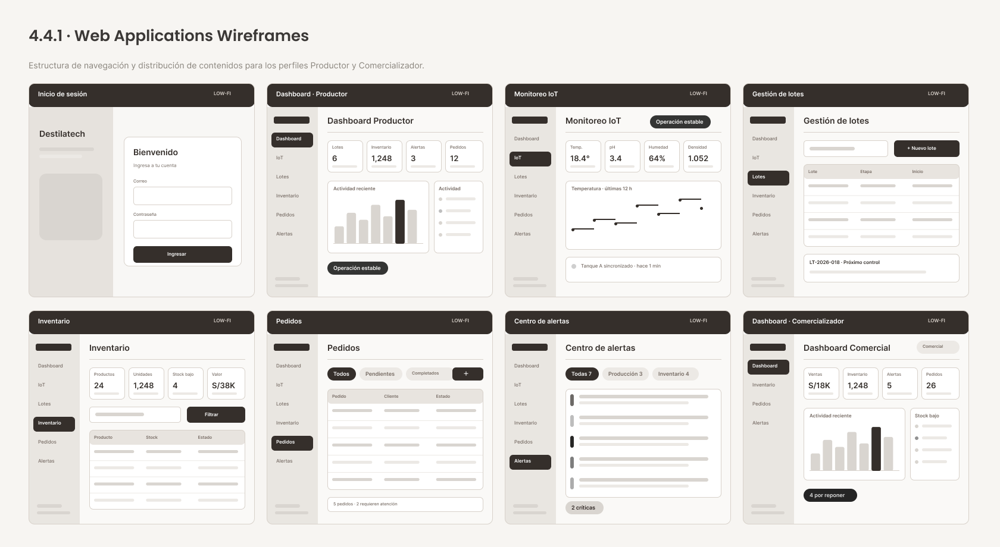</p>

*Nota.* Elaboración propia en Figma (2026).

*Descripción.* Ocho vistas en baja fidelidad organizadas en una cuadrícula: inicio de sesión, dashboard del productor, monitoreo IoT, gestión de lotes, inventario, pedidos, centro de alertas y dashboard del comercializador. Todas las vistas internas comparten una barra lateral de navegación a la izquierda y un área de contenido con tarjetas de indicadores, tablas o gráficos.


**Wireframes para móvil**

**Figura 54**

*Wireframes de la aplicación web para móvil*

<p align="center">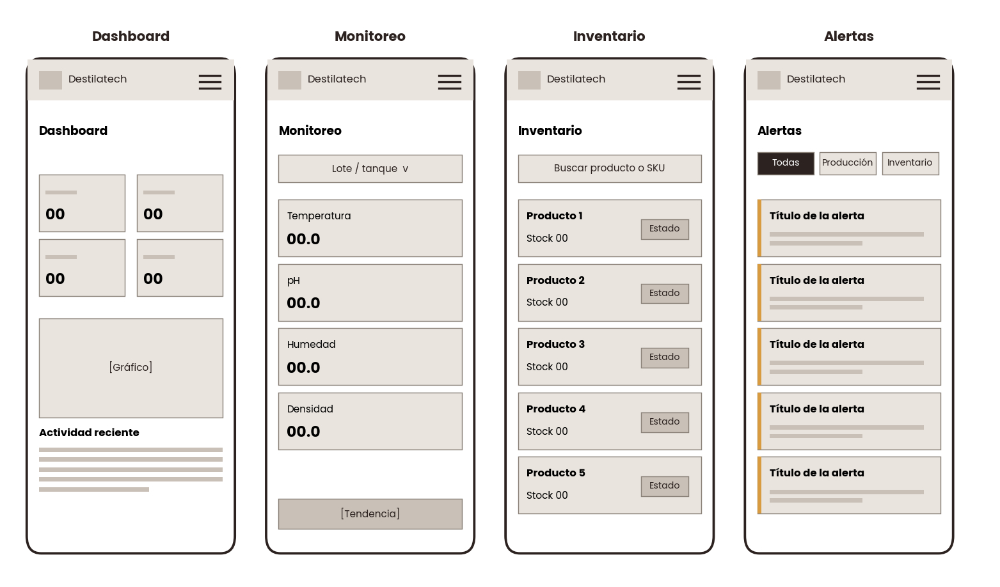</p>

*Nota.* Elaboración propia (2026).

*Descripción.* Cuatro pantallas de teléfono en baja fidelidad: el dashboard con cuatro tarjetas de indicadores en dos columnas y la lista de actividad reciente; el monitoreo con el selector de lote y las tarjetas de variables apiladas; el inventario como lista de tarjetas con estado de stock; y el centro de alertas con filtros por tipo. En cada una, la navegación se reduce a un botón de menú en el encabezado.


#### 4.4.2. Web Applications Wireflow Diagrams

Los wireflows combinan wireframes con flechas que muestran cómo el usuario pasa de una pantalla a otra para completar una tarea. El Productor inicia sesión, consulta su dashboard, supervisa las variables, revisa las alertas, consulta los lotes y actualiza el inventario. El Comercializador consulta su dashboard e inventario, identifica los productos con stock bajo y registra pedidos.

**Figura 55**

*Wireflows de la aplicación web*

<p align="center">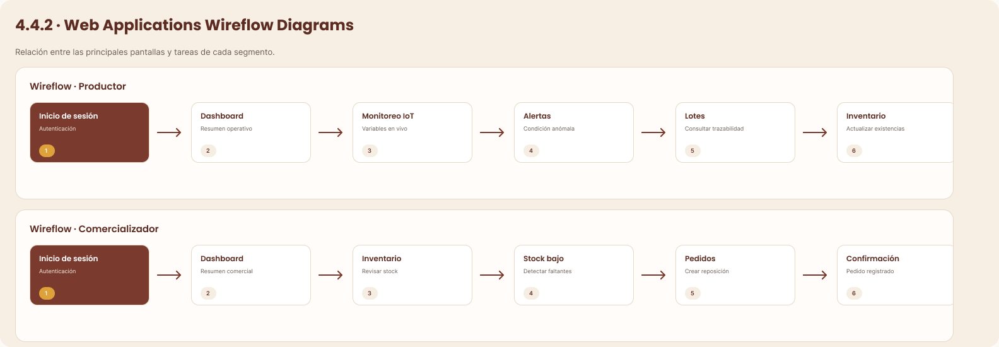</p>

*Nota.* Elaboración propia en Figma (2026).

*Descripción.* Dos recorridos con las pantallas conectadas por flechas. En el recorrido del Productor se encadenan inicio de sesión, dashboard, monitoreo IoT, alertas, lotes e inventario. En el recorrido del Comercializador se encadenan dashboard comercial, inventario, pedidos y alertas. Las flechas indican el sentido normal de navegación entre pantallas.


#### 4.4.3. Web Applications Mock-ups

Los mock-ups presentan la propuesta visual de alta fidelidad. Mantienen la paleta y la tipografía de la landing page y usan datos de ejemplo coherentes con el dominio (lotes, temperatura, pH, humedad, densidad, niveles de stock, pedidos y alertas). La etiqueta de rol en el encabezado y el contenido del menú lateral diferencian las funciones de cada perfil.

**Figura 56**

*Mock-ups de la aplicación web*

<p align="center">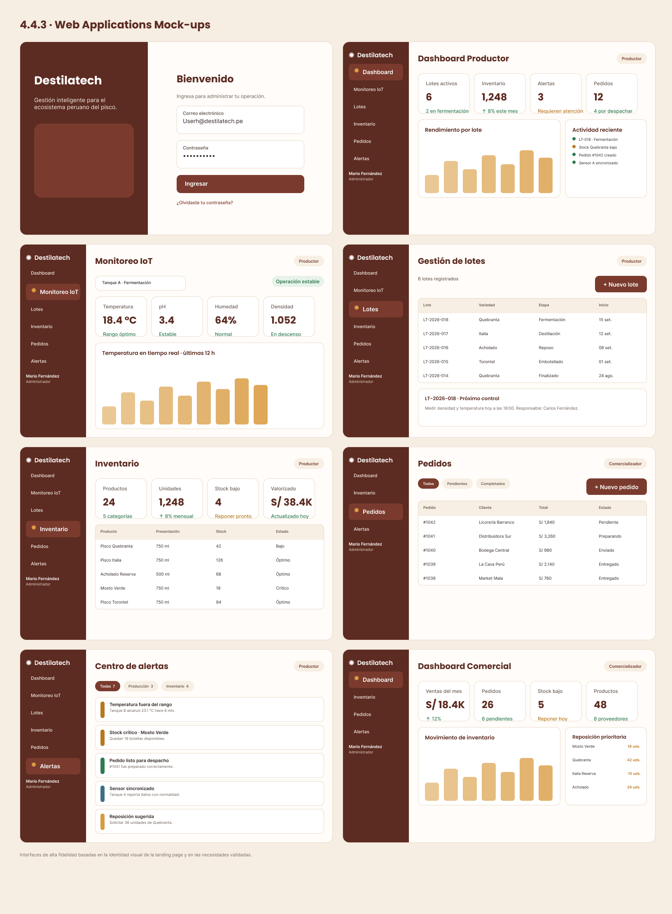</p>

*Nota.* Elaboración propia en Figma (2026).

*Descripción.* Ocho pantallas de alta fidelidad con barra lateral de color cobre oscuro. Inicio de sesión con campos de correo y contraseña. Dashboard del productor con cuatro indicadores (6 lotes activos, 1,248 unidades de inventario, 3 alertas y 12 pedidos), un gráfico de rendimiento por lote y la actividad reciente. Monitoreo IoT del tanque A con temperatura (18.4 °C), pH, humedad y densidad, y un gráfico de las últimas 12 horas. Gestión de lotes con tabla de lotes por variedad, etapa y fecha de inicio. Inventario con indicadores y tabla de productos por presentación, stock y estado. Pedidos con filtros por estado y tabla de pedidos. Centro de alertas con tarjetas por severidad. Dashboard comercial con ventas del mes, pedidos, stock bajo y reposición prioritaria.


**Consideraciones sobre los mock-ups.** Algunos elementos de los mock-ups, como el estado «Preparando» o «Enviado» de un pedido, los gráficos de ventas del mes y el dato «8 proveedores», representan funciones que el alcance vigente (sección 3.3) no incluye (el pedido de venta tiene los estados Borrador y Confirmado y el proveedor no se gestiona como entidad). Estos elementos se ajustarán en la versión implementada.

#### 4.4.4. Web Applications User Flow Diagrams

Los diagramas de flujo de usuario describen las decisiones que toma el usuario en dos tareas prioritarias. En el flujo del Productor, el usuario inicia sesión y el sistema evalúa si las variables están dentro del rango esperado; si no lo están, genera una alerta; luego el usuario revisa el lote y registra una acción correctiva. En el flujo del Comercializador, el usuario abre el inventario y el sistema compara cada producto con su umbral; si el stock está bajo, el usuario genera una lista de compra y, al recibir los productos, registra la entrada para actualizar el stock.

**Rutas alternativas (unhappy paths).**

| Flujo | Situación | Respuesta del sistema |
| :--- | :--- | :--- |
| Inicio de sesión | Credenciales incorrectas o prueba gratuita vencida. | Muestra un mensaje de error genérico y no revela cuál campo falló; si la prueba venció, ofrece contratar un plan. |
| Monitoreo | No hay lecturas recientes del lote. | Indica que no hay datos y no muestra el estado «Operación estable». |
| Alerta | La condición anómala persiste. | Mantiene una sola alerta abierta por episodio y evita duplicados. |
| Reposición | El producto no tiene umbral configurado. | No genera alerta de stock bajo y sugiere configurar el umbral. |
| Pedido | El stock disponible es menor que la cantidad pedida. | Rechaza la confirmación e indica qué producto no alcanza; no modifica el stock. |

**Figura 57**

*Diagramas de flujo de usuario de la aplicación web*

<p align="center">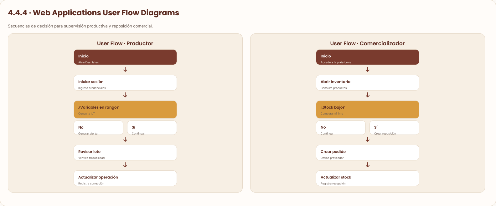</p>

*Nota.* Elaboración propia en Figma (2026).

*Descripción.* Dos diagramas verticales. El flujo del Productor va de «Inicio» a «Iniciar sesión», una decisión «¿Variables en rango?» con las ramas «No: generar alerta» y «Sí: continuar», «Revisar lote» y «Actualizar operación». El flujo del Comercializador va de «Inicio» a «Abrir inventario», una decisión «¿Stock bajo?» con las ramas «No: continuar» y «Sí: crear reposición», «Crear pedido» y «Actualizar stock». Los rectángulos oscuros marcan el inicio, los dorados las decisiones y los blancos las acciones.


*Nota sobre el flujo del Comercializador:* en el diagrama, el paso «Crear pedido» indica «Define proveedor». En el alcance vigente (sección 3.3), la reposición se resuelve generando una lista de compra que el usuario envía por WhatsApp; el pedido a proveedor como registro dentro de la plataforma queda fuera de alcance.

### 4.5. Web Applications Prototyping

El prototipo interactivo se construyó en Figma a partir de los mock-ups. Contiene doce pantallas y cuarenta y dos interacciones configuradas con eventos *On Click* y transiciones *Smart Animate* de 250 ms. Se definieron dos puntos de inicio, uno por perfil: el recorrido del Productor recorre inicio de sesión, dashboard, monitoreo IoT, alertas, lotes e inventario; el recorrido del Comercializador recorre dashboard comercial, inventario, pedidos y alertas.

**Figura 58**

*Recorridos del prototipo interactivo*

<p align="center">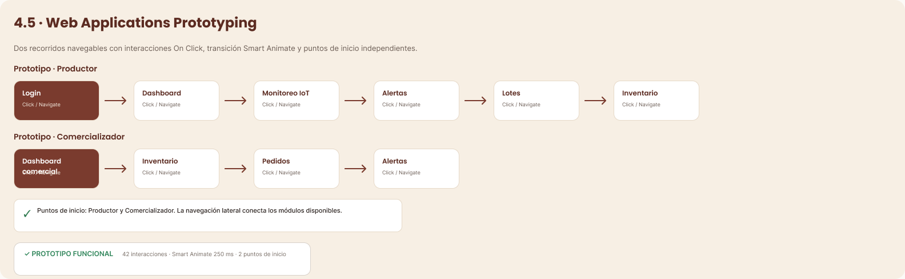</p>

*Nota.* Elaboración propia en Figma (2026).

*Descripción.* Dos filas de pantallas conectadas por flechas. La fila «Prototipo · Productor» inicia en Login y continúa con Dashboard, Monitoreo IoT, Alertas, Lotes e Inventario. La fila «Prototipo · Comercializador» inicia en Dashboard comercial y continúa con Inventario, Pedidos y Alertas. Cada transición indica «Click / Navigate». Un recuadro inferior resume que el prototipo es funcional, con 42 interacciones, transición Smart Animate de 250 ms y dos puntos de inicio.


**Enlaces del prototipo interactivo**

- [Flujo del Productor](https://www.figma.com/design/l1g2fiZCTh5QYzOwzvGh9n/Untitled--Copy-?node-id=2031-525)
- [Flujo del Comercializador](https://www.figma.com/design/l1g2fiZCTh5QYzOwzvGh9n/Untitled--Copy-?node-id=2031-874)

### 4.6. Domain-Driven Software Architecture

A partir del Big Picture EventStorming (sección 2.4) y del Ubiquitous Language (sección 2.5), el equipo profundizó el análisis del dominio con Domain-Driven Design (Evans, 2003) y derivó la arquitectura de software con el modelo C4 (Brown, 2018). Durante el Design-Level EventStorming se identificó que el área Identity / Subscriptions del Big Picture reunía dos responsabilidades con ciclos de cambio distintos: la identidad y el acceso de la cuenta, y la gestión comercial de planes, suscripciones y pagos. Por ello se dividió en dos *bounded contexts* independientes, **IAM (Identity & Access Management)** y **Billing**, que coinciden con los subdominios «Identity and Access Management» y «Subscriptions and Payment Management» que el enunciado del curso señala para las plataformas SaaS. El dominio queda compuesto por siete *bounded contexts*: IAM, Billing, Production & Monitoring, Inventory & Stock Management, Orders & Replenishment, Alerts & Notifications y Analytics & Estimations. Para cada uno se identificaron los *commands*, *aggregates*, eventos de dominio, políticas y consultas (*read models*).

Los diagramas se elaboraron como código: el Design-Level EventStorming, los diagramas de clases y los de base de datos están escritos en Mermaid y embebidos en este documento, por lo que GitHub los renderiza y permite acercarlos y desplazarlos; los diagramas C4 están escritos en Structurizr DSL (`diagramas/structurizr/workspace.dsl`) y los diagramas de clases también se entregan en PlantUML (`diagramas/plantuml/`).

**Decisiones de diseño que organizan toda la sección**

| Decisión | Motivo |
| :--- | :--- |
| Siete *bounded contexts* implementados como módulos de una sola API (monolito modular). | El equipo es pequeño y el alcance es acotado; se evita la complejidad operativa de los microservicios sin renunciar a los límites entre contextos. |
| Comunicación entre contextos mediante eventos de dominio y commands, no compartiendo agregados. | Mantiene los contextos desacoplados y permite evolucionar cada uno por separado. |
| Base de datos relacional MySQL, con prefijo de módulo en cada tabla. | Los datos son estructurados y relacionales; el prefijo deja visible a qué contexto pertenece cada tabla. |
| Referencias entre contextos como identificadores lógicos, sin llaves foráneas físicas. | Preserva el desacoplamiento de los módulos y facilita separarlos en el futuro. |
| Claves de idempotencia en pagos y pedidos, y `source_id` y `source_key` en lecturas y movimientos. | Evitan registros duplicados cuando una solicitud se reintenta. |
| Fuente de datos IoT simulada que envía lecturas a la API con la misma interfaz que usaría un sensor real. | El alcance académico no incluye hardware físico. |
| Pasarela de pago externa en modo de pruebas (*sandbox*), detrás de la interfaz `IPaymentGateway`. | Permite cambiar de proveedor sin modificar el dominio. |

#### 4.6.1. Design-Level EventStorming

El equipo organizó una sesión de Design-Level EventStorming de 1 hora con 45 minutos, siguiendo la guía de referencia del curso (https://bit.ly/dles-guide). Partió de las cuatro áreas candidatas del negocio actual identificadas en el Big Picture EventStorming (sección 2.4.5) y de lo que la solución añade, y llegó a siete *bounded contexts*. En cada uno se identificaron los *commands* (acciones que un actor o un sistema externo dispara), el *aggregate* que procesa el command y garantiza sus invariantes, los eventos de dominio resultantes, las políticas (reacciones automáticas del sistema ante un evento, que pueden disparar commands en el mismo contexto o en otro) y los *read models* (vistas de consulta que el sistema expone a partir de los eventos).

**Qué incluye la solución y cómo modifica el flujo de eventos.** El Big Picture mostró cómo funciona hoy el negocio, con cuaderno, Excel y WhatsApp, y sus hotspots. La solución de Destilatech incorpora commands, eventos y vistas de consulta que cambian esos puntos del flujo de la siguiente manera:

| Punto del flujo actual (Big Picture) | Cómo lo modifica Destilatech | Eventos de dominio que aparecen | Bounded context |
| :--- | :--- | :--- | :--- |
| La temperatura anómala se detecta tarde y obliga a visitar la bodega (eventos 5 y 6 del productor) | Las lecturas de los sensores (simulados) se comparan con el rango configurado de cada variable y se avisa al productor | `SensorReadingRecorded`, `AnomalyDetected`, `AlertRaised` | Production & Monitoring → Alerts & Notifications |
| El lote se anota dos veces y el producto terminado se cuenta físicamente (eventos 12 y 13 del productor) | El lote se registra una vez y cada entrada, salida o ajuste se guarda como movimiento que actualiza el stock | `BatchRegistered`, `StockMovementRegistered`, `StockLevelUpdated` | Production & Monitoring, Inventory & Stock Management |
| Las ventas se anotan con retraso o no se anotan (evento 16 del productor; evento 3 del comercializador) | Registrar el pedido descuenta el stock automáticamente | `OrderRegistered`, `StockLevelUpdated` | Orders & Replenishment → Inventory & Stock Management |
| El producto se agota sin que el dueño lo note (eventos 5 y 6 del comercializador) | Un umbral por producto genera una alerta antes del quiebre | `LowStockDetected`, `AlertRaised` | Inventory & Stock Management → Alerts & Notifications |
| La reposición se decide a ojo (evento 7 del comercializador) | La estimación se calcula con el historial de movimientos y se indica su nivel de confianza | `ReplenishmentEstimateCalculated` | Analytics & Estimations |
| El pedido al proveedor se coordina por WhatsApp sin registro (eventos 8 y 9 del comercializador) | La lista de compra se genera dentro de la plataforma y el pedido queda registrado; WhatsApp sigue siendo el canal | `ReplenishmentListGenerated`, `OrderRegistered` | Orders & Replenishment |
| No existe en el negocio actual: el acceso a la herramienta y su cobro | La plataforma identifica al usuario y, al terminar la prueba, cobra la suscripción mediante una pasarela externa en modo de pruebas | `CheckoutStarted`, `PaymentConfirmed`, `SubscriptionActivated` | IAM, Billing |

**Criterios para separar los *bounded contexts*.** Las fronteras no se trazaron por módulos de pantalla, sino con cuatro criterios aplicados a las áreas candidatas del Big Picture y a las capacidades nuevas de la solución:

| Criterio | Cómo se aplicó | Ejemplo |
| :--- | :--- | :--- |
| Eventos pivote | Una frontera se ubica donde un evento cierra una fase y abre otra (sección 2.4.6). | «Pisco embotellado y etiquetado» separa Production & Monitoring de Inventory & Stock Management. |
| Lenguaje ubicuo | Un término tiene un solo significado dentro de un contexto; si cambia de significado, hay otro contexto. | «Lote» es una unidad en proceso en Production & Monitoring y «Existencia» es una cantidad disponible en Inventory; «Alerta» agrupa anomalías y stock bajo en Alerts & Notifications. |
| Ciclo de cambio y responsabilidad | Las responsabilidades que cambian por razones distintas se separan. | El acceso del usuario (IAM) y el cobro de la suscripción (Billing) cambian por razones distintas y no existen en el negocio actual; por eso se separan de los contextos operativos. |
| Datos propios | Cada contexto es dueño de sus agregados; los demás solo los consultan mediante eventos o commands. | Orders & Replenishment descuenta stock con el command `DiscountStock`, sin modificar los agregados de Inventory. |

**Relación entre las áreas del Big Picture y los *bounded contexts*.** «Producción del pisco» origina Production & Monitoring; «Registro de lotes y existencias» origina Inventory & Stock Management; «Ventas y atención al cliente» y «Reposición y abastecimiento» se reúnen en Orders & Replenishment porque comparten el concepto de pedido. Alerts & Notifications y Analytics & Estimations no existen en el negocio actual: nacen de la solución para atender los hotspots de detección tardía y de reposición a ojo. IAM y Billing completan la plataforma como producto SaaS.

**Leyenda utilizada en los diagramas**

| Elemento | Forma y color | Descripción |
| :--- | :--- | :--- |
| Command | Rectángulo azul | Acción o intención disparada por un actor o un sistema externo. |
| Aggregate | Hexágono amarillo | Objeto del dominio que procesa el command y mantiene su consistencia. |
| Domain Event | Óvalo naranja | Hecho relevante ya ocurrido en el dominio, resultado de procesar un command. |
| Policy | Rombo morado | Reacción automática del sistema ante un evento, que puede disparar otro command. |
| Read Model | Paralelogramo verde | Vista de consulta construida a partir de los eventos. |
| Sistema externo | Óvalo rosa | Sistema ajeno a Destilatech que dispara o recibe eventos. |

**a. IAM (Identity & Access Management)**

Gestiona la identidad de la cuenta del usuario (productor o comercializador), su autenticación, la recuperación de contraseña y el periodo de prueba de 14 días. Responde al Epic EP01.

**Figura 59**

*Design-Level EventStorming del Bounded Context IAM*

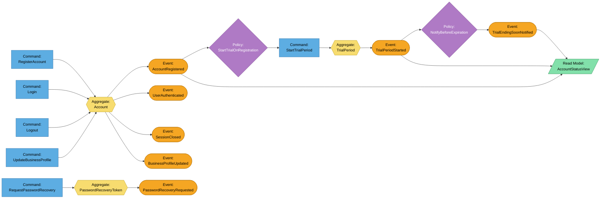
```mermaid
flowchart LR
    classDef command fill:#5DADE2,stroke:#2E6DA4,color:#000
    classDef aggregate fill:#F7DC6F,stroke:#B7950B,color:#000
    classDef event fill:#F5A623,stroke:#B9770E,color:#000
    classDef policy fill:#AF7AC5,stroke:#6C3483,color:#fff
    classDef readmodel fill:#82E0AA,stroke:#1E8449,color:#000
    classDef external fill:#F1948A,stroke:#943126,color:#000

    C1["Command:\nRegisterAccount"]:::command --> A1{{"Aggregate:\nAccount"}}:::aggregate --> E1(["Event:\nAccountRegistered"]):::event
    C1b["Command:\nLogin"]:::command --> A1 --> E1b(["Event:\nUserAuthenticated"]):::event
    C1c["Command:\nLogout"]:::command --> A1 --> E1c(["Event:\nSessionClosed"]):::event
    C1d["Command:\nRequestPasswordRecovery"]:::command --> A3{{"Aggregate:\nPasswordRecoveryToken"}}:::aggregate --> E1d(["Event:\nPasswordRecoveryRequested"]):::event
    C1e["Command:\nUpdateBusinessProfile"]:::command --> A1 --> E1e(["Event:\nBusinessProfileUpdated"]):::event
    E1 --> P1{"Policy:\nStartTrialOnRegistration"}:::policy --> C2["Command:\nStartTrialPeriod"]:::command --> A2{{"Aggregate:\nTrialPeriod"}}:::aggregate --> E2(["Event:\nTrialPeriodStarted"]):::event
    E2 --> P2{"Policy:\nNotifyBeforeExpiration"}:::policy --> E3(["Event:\nTrialEndingSoonNotified"]):::event
    E1 --> RM1[/"Read Model:\nAccountStatusView"/]:::readmodel
    E2 --> RM1
    E3 --> RM1
```

*Nota.* Elaboración propia en Mermaid (2026).

*Descripción.* Diagrama de flujo de izquierda a derecha que ordena los commands, aggregates, eventos, políticas y read models del contexto IAM (Identity & Access Management); las flechas punteadas indican interacciones con otros contextos o con sistemas externos.


El evento `AccountRegistered` dispara la política `StartTrialOnRegistration`, que activa automáticamente el periodo de prueba de 14 días (US01, US56). El comando `Login` autentica al usuario y emite el token de sesión (US02, US26), mientras que `Logout` lo cierra (US38) y `RequestPasswordRecovery` genera un token temporal de recuperación (US39). `UpdateBusinessProfile` permite al usuario corregir los datos de su negocio (US41). La política `NotifyBeforeExpiration` observa el paso del tiempo sobre `TrialPeriod` y avisa cuando quedan 3 días (US03). IAM expone `AccountStatusView` para que otros Bounded Contexts, como Billing, consulten si la cuenta está activa sin acoplarse a su modelo interno.

**b. Billing**

Gestiona los planes, la suscripción de pago y los intentos de pago asociados a la cuenta. Responde al Epic EP01.

**Figura 60**

*Design-Level EventStorming del Bounded Context Billing*

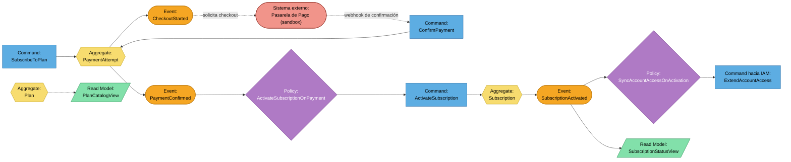
```mermaid
flowchart LR
    classDef command fill:#5DADE2,stroke:#2E6DA4,color:#000
    classDef aggregate fill:#F7DC6F,stroke:#B7950B,color:#000
    classDef event fill:#F5A623,stroke:#B9770E,color:#000
    classDef policy fill:#AF7AC5,stroke:#6C3483,color:#fff
    classDef readmodel fill:#82E0AA,stroke:#1E8449,color:#000
    classDef external fill:#F1948A,stroke:#943126,color:#000

    C1["Command:\nSubscribeToPlan"]:::command --> A1{{"Aggregate:\nPaymentAttempt"}}:::aggregate --> E1(["Event:\nCheckoutStarted"]):::event
    EXT1(["Sistema externo:\nPasarela de Pago (sandbox)"]):::external -.->|"webhook de confirmación"| C2["Command:\nConfirmPayment"]:::command
    C2 --> A1 --> E2(["Event:\nPaymentConfirmed"]):::event
    E1 -.->|"solicita checkout"| EXT1
    E2 --> P1{"Policy:\nActivateSubscriptionOnPayment"}:::policy --> C3["Command:\nActivateSubscription"]:::command --> A2{{"Aggregate:\nSubscription"}}:::aggregate --> E3(["Event:\nSubscriptionActivated"]):::event
    E3 --> P2{"Policy:\nSyncAccountAccessOnActivation"}:::policy --> XC1["Command hacia IAM:\nExtendAccountAccess"]:::command
    E3 --> RM1[/"Read Model:\nSubscriptionStatusView"/]:::readmodel
    A3{{"Aggregate:\nPlan"}}:::aggregate -.-> RM2[/"Read Model:\nPlanCatalogView"/]:::readmodel
```

*Nota.* Elaboración propia en Mermaid (2026).

*Descripción.* Diagrama de flujo de izquierda a derecha que ordena los commands, aggregates, eventos, políticas y read models del contexto Billing; las flechas punteadas indican interacciones con otros contextos o con sistemas externos.


El comando `SubscribeToPlan` (US40) crea un `PaymentAttempt` con una clave de idempotencia y solicita el checkout a la Pasarela de Pago, sistema externo que aparece con la solución, ya que el negocio actual no cobra suscripciones. Cuando la pasarela confirma el cobro, el comando `ConfirmPayment` marca el intento como pagado; la política `ActivateSubscriptionOnPayment` activa entonces la suscripción, y `SyncAccountAccessOnActivation` envía un Command hacia IAM para extender el acceso de la cuenta más allá del periodo de prueba. El acoplamiento entre ambos contextos es delgado: se comunican con eventos y commands, no con consultas directas a su modelo interno. `SubscriptionStatusView` alimenta la consulta del plan y del estado de la suscripción (US54) y `PlanCatalogView` los planes que se muestran al contratar.

**c. Production & Monitoring**

Gestiona los lotes de producción y el monitoreo de las variables del proceso. Responde a los Epics EP03 y EP04.

**Figura 61**

*Design-Level EventStorming del Bounded Context Production & Monitoring*

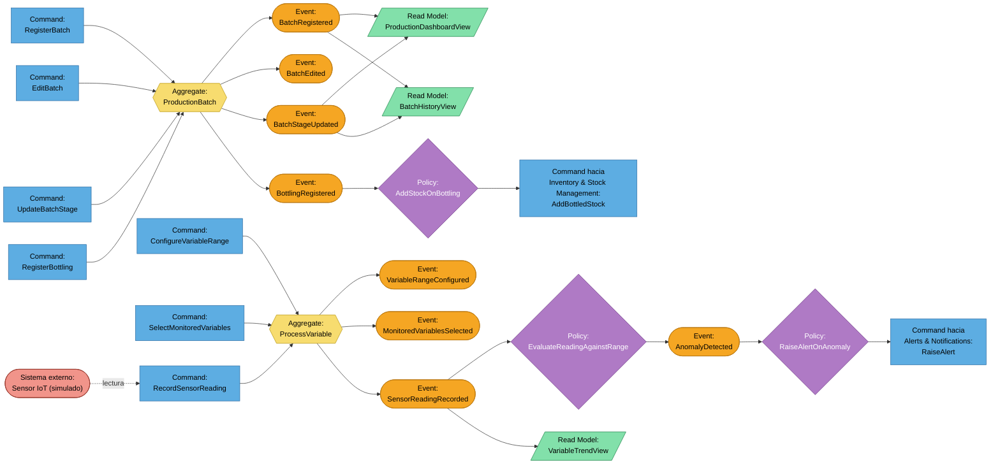
```mermaid
flowchart LR
    classDef command fill:#5DADE2,stroke:#2E6DA4,color:#000
    classDef aggregate fill:#F7DC6F,stroke:#B7950B,color:#000
    classDef event fill:#F5A623,stroke:#B9770E,color:#000
    classDef policy fill:#AF7AC5,stroke:#6C3483,color:#fff
    classDef readmodel fill:#82E0AA,stroke:#1E8449,color:#000
    classDef external fill:#F1948A,stroke:#943126,color:#000

    C1["Command:\nRegisterBatch"]:::command --> A1{{"Aggregate:\nProductionBatch"}}:::aggregate --> E1(["Event:\nBatchRegistered"]):::event
    C1b["Command:\nEditBatch"]:::command --> A1 --> E1b(["Event:\nBatchEdited"]):::event
    C2["Command:\nUpdateBatchStage"]:::command --> A1
    A1 --> E2(["Event:\nBatchStageUpdated"]):::event
    C2b["Command:\nRegisterBottling"]:::command --> A1 --> E2b(["Event:\nBottlingRegistered"]):::event
    E2b --> P0{"Policy:\nAddStockOnBottling"}:::policy --> XC0["Command hacia\nInventory & Stock Management:\nAddBottledStock"]:::command
    C3["Command:\nConfigureVariableRange"]:::command --> A2{{"Aggregate:\nProcessVariable"}}:::aggregate --> E3(["Event:\nVariableRangeConfigured"]):::event
    C3b["Command:\nSelectMonitoredVariables"]:::command --> A2 --> E3b(["Event:\nMonitoredVariablesSelected"]):::event
    EXT1(["Sistema externo:\nSensor IoT (simulado)"]):::external -.->|"lectura"| C4["Command:\nRecordSensorReading"]:::command --> A2 --> E4(["Event:\nSensorReadingRecorded"]):::event
    E4 --> P1{"Policy:\nEvaluateReadingAgainstRange"}:::policy --> E5(["Event:\nAnomalyDetected"]):::event
    E5 --> P2{"Policy:\nRaiseAlertOnAnomaly"}:::policy --> XC1["Command hacia\nAlerts & Notifications:\nRaiseAlert"]:::command
    E1 --> RM1[/"Read Model:\nProductionDashboardView"/]:::readmodel
    E2 --> RM1
    E1 --> RM3[/"Read Model:\nBatchHistoryView"/]:::readmodel
    E2 --> RM3
    E4 --> RM2[/"Read Model:\nVariableTrendView"/]:::readmodel
```

*Nota.* Elaboración propia en Mermaid (2026).

*Descripción.* Diagrama de flujo de izquierda a derecha que ordena los commands, aggregates, eventos, políticas y read models del contexto Production & Monitoring; las flechas punteadas indican interacciones con otros contextos o con sistemas externos.


`RegisterBatch` (US06, US59) y `UpdateBatchStage` (US07, US60) mantienen el ciclo de vida del lote y alimentan `BatchHistoryView` (US08) y `ProductionDashboardView` (US04); `EditBatch` corrige los datos del lote (US42) y `RegisterBottling` (US43) dispara, mediante la política `AddStockOnBottling`, el Command `AddBottledStock` hacia Inventory & Stock Management. La política `EvaluateReadingAgainstRange` es el corazón del monitoreo: compara cada `SensorReadingRecorded` (US09, US28, US64) contra el rango definido con `ConfigureVariableRange` (US10) y, de estar fuera de rango, genera `AnomalyDetected` (US11), que a su vez dispara un Command hacia Alerts & Notifications. `SelectMonitoredVariables` define qué variables se vigilan en cada lote (US55) y `VariableTrendView` muestra su tendencia (US44, US61). El Sensor IoT se mantiene simulado dentro del alcance académico, tal como se identificó en el Big Picture EventStorming.

**d. Inventory & Stock Management**

Gestiona el catálogo de productos y el control de stock. Responde a los Epics EP05 y EP06.

**Figura 62**

*Design-Level EventStorming del Bounded Context Inventory & Stock Management*

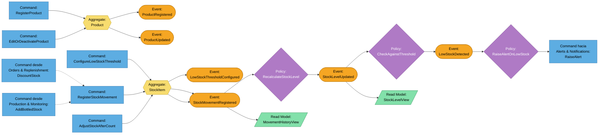
```mermaid
flowchart LR
    classDef command fill:#5DADE2,stroke:#2E6DA4,color:#000
    classDef aggregate fill:#F7DC6F,stroke:#B7950B,color:#000
    classDef event fill:#F5A623,stroke:#B9770E,color:#000
    classDef policy fill:#AF7AC5,stroke:#6C3483,color:#fff
    classDef readmodel fill:#82E0AA,stroke:#1E8449,color:#000
    classDef external fill:#F1948A,stroke:#943126,color:#000

    C1["Command:\nRegisterProduct"]:::command --> A1{{"Aggregate:\nProduct"}}:::aggregate --> E1(["Event:\nProductRegistered"]):::event
    C1b["Command:\nEditOrDeactivateProduct"]:::command --> A1 --> E1b(["Event:\nProductUpdated"]):::event
    C2["Command:\nConfigureLowStockThreshold"]:::command --> A2{{"Aggregate:\nStockItem"}}:::aggregate --> E2(["Event:\nLowStockThresholdConfigured"]):::event
    C3["Command:\nRegisterStockMovement"]:::command --> A2 --> E3(["Event:\nStockMovementRegistered"]):::event
    C3b["Command:\nAdjustStockAfterCount"]:::command --> A2 --> E3
    E3 --> P1{"Policy:\nRecalculateStockLevel"}:::policy --> E4(["Event:\nStockLevelUpdated"]):::event
    E4 --> P2{"Policy:\nCheckAgainstThreshold"}:::policy --> E5(["Event:\nLowStockDetected"]):::event
    E5 --> P3{"Policy:\nRaiseAlertOnLowStock"}:::policy --> XC1["Command hacia\nAlerts & Notifications:\nRaiseAlert"]:::command
    XC2["Command desde\nOrders & Replenishment:\nDiscountStock"]:::command -.-> C3
    XC3["Command desde\nProduction & Monitoring:\nAddBottledStock"]:::command -.-> C3
    E4 --> RM1[/"Read Model:\nStockLevelView"/]:::readmodel
    E3 --> RM2[/"Read Model:\nMovementHistoryView"/]:::readmodel
```

*Nota.* Elaboración propia en Mermaid (2026).

*Descripción.* Diagrama de flujo de izquierda a derecha que ordena los commands, aggregates, eventos, políticas y read models del contexto Inventory & Stock Management; las flechas punteadas indican interacciones con otros contextos o con sistemas externos.


`RegisterStockMovement` puede originarse directamente en la interfaz del usuario (US13, US27) o ser disparado por Commands cruzados desde otros Bounded Contexts: `DiscountStock` (cuando Orders & Replenishment confirma un pedido, US18) y `AddBottledStock` (cuando Production & Monitoring registra un embotellado, US43). `AdjustStockAfterCount` corrige el saldo tras un conteo físico (US47). La política `CheckAgainstThreshold` compara el nuevo nivel contra el umbral configurado (US15) para decidir si dispara `LowStockDetected`, que se envía a Alerts & Notifications. `StockLevelView` responde a la consulta de stock disponible (US14) y `MovementHistoryView` al historial de movimientos de un producto (US46); la edición o desactivación de productos corresponde a US12 y US45.

**e. Orders & Replenishment**

Gestiona clientes, pedidos de venta y las listas de compra para la reposición. Responde al Epic EP07.

**Figura 63**

*Design-Level EventStorming del Bounded Context Orders & Replenishment*

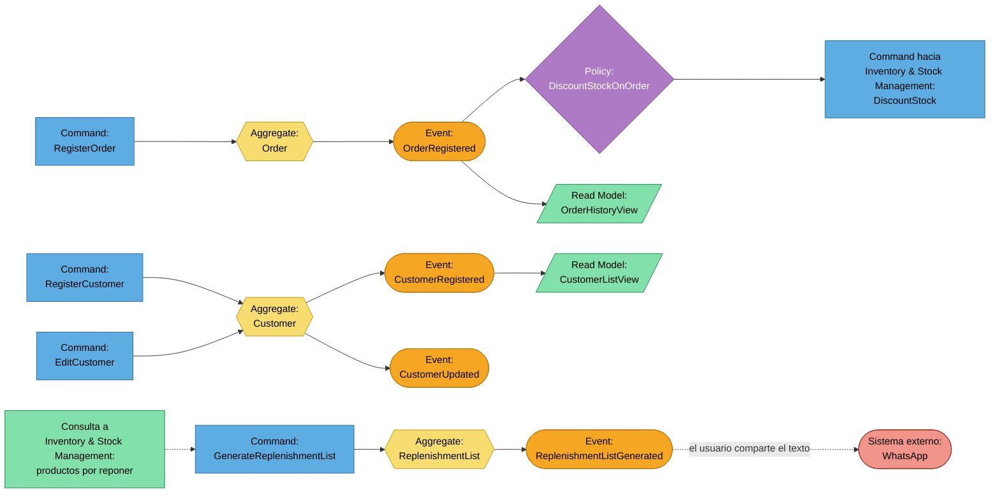
```mermaid
flowchart LR
    classDef command fill:#5DADE2,stroke:#2E6DA4,color:#000
    classDef aggregate fill:#F7DC6F,stroke:#B7950B,color:#000
    classDef event fill:#F5A623,stroke:#B9770E,color:#000
    classDef policy fill:#AF7AC5,stroke:#6C3483,color:#fff
    classDef readmodel fill:#82E0AA,stroke:#1E8449,color:#000
    classDef external fill:#F1948A,stroke:#943126,color:#000

    C1["Command:\nRegisterCustomer"]:::command --> A1{{"Aggregate:\nCustomer"}}:::aggregate --> E1(["Event:\nCustomerRegistered"]):::event
    C1b["Command:\nEditCustomer"]:::command --> A1 --> E1b(["Event:\nCustomerUpdated"]):::event
    C2["Command:\nRegisterOrder"]:::command --> A2{{"Aggregate:\nOrder"}}:::aggregate --> E2(["Event:\nOrderRegistered"]):::event
    E2 --> P1{"Policy:\nDiscountStockOnOrder"}:::policy --> XC1["Command hacia\nInventory & Stock Management:\nDiscountStock"]:::command
    C3["Command:\nGenerateReplenishmentList"]:::command --> A3{{"Aggregate:\nReplenishmentList"}}:::aggregate --> E3(["Event:\nReplenishmentListGenerated"]):::event
    XQ1["Consulta a\nInventory & Stock Management:\nproductos por reponer"]:::readmodel -.-> C3
    E3 -.->|"el usuario comparte el texto"| EXT1(["Sistema externo:\nWhatsApp"]):::external
    E2 --> RM1[/"Read Model:\nOrderHistoryView"/]:::readmodel
    E1 --> RM2[/"Read Model:\nCustomerListView"/]:::readmodel
```

*Nota.* Elaboración propia en Mermaid (2026).

*Descripción.* Diagrama de flujo de izquierda a derecha que ordena los commands, aggregates, eventos, políticas y read models del contexto Orders & Replenishment; las flechas punteadas indican interacciones con otros contextos o con sistemas externos.


`RegisterOrder` (US18, US63) dispara la política `DiscountStockOnOrder`, que emite un Command hacia Inventory & Stock Management para descontar el stock vendido, evitando que Orders & Replenishment conozca o manipule directamente el Aggregate `StockItem`: los Bounded Contexts se comunican por eventos y commands, no compartiendo agregados. `OrderHistoryView` responde a la consulta del historial de pedidos (US19) y `CustomerListView` a la gestión de clientes (US17, US49). `GenerateReplenishmentList` (US50) consulta los productos que están por agotarse y produce un texto listo para compartir; WhatsApp se mantiene como canal informal y externo de coordinación con el proveedor, tal como se identificó en el Big Picture EventStorming, y Destilatech no envía el mensaje por su cuenta.

**f. Alerts & Notifications**

Actúa como un Bounded Context transversal que centraliza las alertas generadas por Production & Monitoring e Inventory & Stock Management. Responde a los Epics EP04 y EP06.

**Figura 64**

*Design-Level EventStorming del Bounded Context Alerts & Notifications*

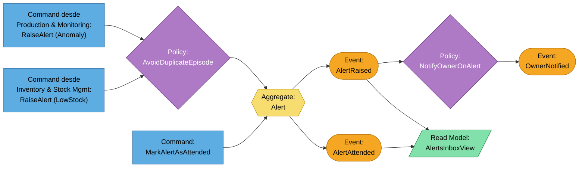
```mermaid
flowchart LR
    classDef command fill:#5DADE2,stroke:#2E6DA4,color:#000
    classDef aggregate fill:#F7DC6F,stroke:#B7950B,color:#000
    classDef event fill:#F5A623,stroke:#B9770E,color:#000
    classDef policy fill:#AF7AC5,stroke:#6C3483,color:#fff
    classDef readmodel fill:#82E0AA,stroke:#1E8449,color:#000
    classDef external fill:#F1948A,stroke:#943126,color:#000

    XC1["Command desde\nProduction & Monitoring:\nRaiseAlert (Anomaly)"]:::command --> P0{"Policy:\nAvoidDuplicateEpisode"}:::policy --> A1{{"Aggregate:\nAlert"}}:::aggregate
    XC2["Command desde\nInventory & Stock Mgmt:\nRaiseAlert (LowStock)"]:::command --> P0
    A1 --> E1(["Event:\nAlertRaised"]):::event
    E1 --> P1{"Policy:\nNotifyOwnerOnAlert"}:::policy --> E3(["Event:\nOwnerNotified"]):::event
    C1["Command:\nMarkAlertAsAttended"]:::command --> A1 --> E2(["Event:\nAlertAttended"]):::event
    E1 --> RM1[/"Read Model:\nAlertsInboxView"/]:::readmodel
    E2 --> RM1
```

*Nota.* Elaboración propia en Mermaid (2026).

*Descripción.* Diagrama de flujo de izquierda a derecha que ordena los commands, aggregates, eventos, políticas y read models del contexto Alerts & Notifications; las flechas punteadas indican interacciones con otros contextos o con sistemas externos.


Este Bounded Context no origina Commands desde el usuario salvo `MarkAlertAsAttended` (US16); su Aggregate `Alert` se crea a partir de los Commands cruzados que le envían Production & Monitoring e Inventory & Stock Management, manteniendo el desacoplamiento entre contextos. La política `AvoidDuplicateEpisode` impide abrir una segunda alerta mientras el mismo episodio sigue pendiente, y `NotifyOwnerOnAlert` informa al usuario dentro de la plataforma (US11). `AlertsInboxView` es la bandeja que se consulta y se filtra por tipo y estado (US16, US48, US62).

**g. Analytics & Estimations**

Calcula estimaciones de reposición e indicadores históricos a partir del historial de otros Bounded Contexts. Responde al Epic EP08 y al resumen del dashboard (EP02).

**Figura 65**

*Design-Level EventStorming del Bounded Context Analytics & Estimations*

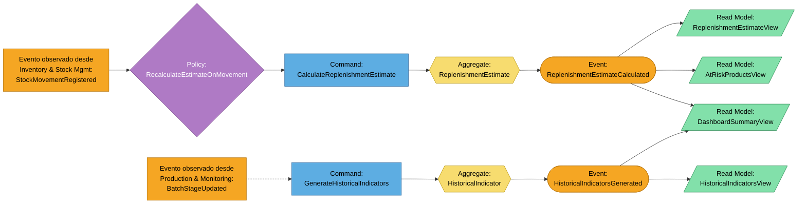
```mermaid
flowchart LR
    classDef command fill:#5DADE2,stroke:#2E6DA4,color:#000
    classDef aggregate fill:#F7DC6F,stroke:#B7950B,color:#000
    classDef event fill:#F5A623,stroke:#B9770E,color:#000
    classDef policy fill:#AF7AC5,stroke:#6C3483,color:#fff
    classDef readmodel fill:#82E0AA,stroke:#1E8449,color:#000
    classDef external fill:#F1948A,stroke:#943126,color:#000

    XC1["Evento observado desde\nInventory & Stock Mgmt:\nStockMovementRegistered"]:::event --> P1{"Policy:\nRecalculateEstimateOnMovement"}:::policy --> C1["Command:\nCalculateReplenishmentEstimate"]:::command --> A1{{"Aggregate:\nReplenishmentEstimate"}}:::aggregate --> E1(["Event:\nReplenishmentEstimateCalculated"]):::event
    C2["Command:\nGenerateHistoricalIndicators"]:::command --> A2{{"Aggregate:\nHistoricalIndicator"}}:::aggregate --> E2(["Event:\nHistoricalIndicatorsGenerated"]):::event
    XC2["Evento observado desde\nProduction & Monitoring:\nBatchStageUpdated"]:::event -.-> C2
    E1 --> RM1[/"Read Model:\nReplenishmentEstimateView"/]:::readmodel
    E1 --> RM3[/"Read Model:\nAtRiskProductsView"/]:::readmodel
    E2 --> RM2[/"Read Model:\nHistoricalIndicatorsView"/]:::readmodel
    E1 --> RM4[/"Read Model:\nDashboardSummaryView"/]:::readmodel
    E2 --> RM4
```

*Nota.* Elaboración propia en Mermaid (2026).

*Descripción.* Diagrama de flujo de izquierda a derecha que ordena los commands, aggregates, eventos, políticas y read models del contexto Analytics & Estimations; las flechas punteadas indican interacciones con otros contextos o con sistemas externos.


Este contexto se suscribe al evento `StockMovementRegistered`, publicado por Inventory & Stock Management, para recalcular la estimación de reposición (US20, US29) sin acoplarse a su modelo interno; `AtRiskProductsView` muestra los productos con riesgo de agotamiento (US51). `GenerateHistoricalIndicators` se ejecuta de forma periódica o bajo demanda para alimentar los gráficos de evolución de inventario y producción (US21), consumiendo el historial de Production & Monitoring e Inventory & Stock Management. `DashboardSummaryView` combina ambos resultados para los dashboards de producción y comercial (US04, US05, US65).

**Resumen del Design-Level EventStorming**

| Bounded Context | Commands | Aggregates | Eventos de dominio | Consultas (*read models*) | Políticas |
| :--- | :--- | :--- | :--- | :--- | :--- |
| IAM | `RegisterAccount`, `Login`, `Logout`, `RequestPasswordRecovery`, `UpdateBusinessProfile`, `StartTrialPeriod` | `Account`, `TrialPeriod`, `PasswordRecoveryToken` | `AccountRegistered`, `UserAuthenticated`, `SessionClosed`, `PasswordRecoveryRequested`, `BusinessProfileUpdated`, `TrialPeriodStarted`, `TrialEndingSoonNotified` | `AccountStatusView` | `StartTrialOnRegistration`, `NotifyBeforeExpiration` |
| Billing | `SubscribeToPlan`, `ConfirmPayment`, `ActivateSubscription` | `PaymentAttempt`, `Subscription`, `Plan` | `CheckoutStarted`, `PaymentConfirmed`, `SubscriptionActivated` | `SubscriptionStatusView`, `PlanCatalogView` | `ActivateSubscriptionOnPayment`, `SyncAccountAccessOnActivation` |
| Production & Monitoring | `RegisterBatch`, `EditBatch`, `UpdateBatchStage`, `RegisterBottling`, `ConfigureVariableRange`, `SelectMonitoredVariables`, `RecordSensorReading` | `ProductionBatch`, `ProcessVariable` | `BatchRegistered`, `BatchEdited`, `BatchStageUpdated`, `BottlingRegistered`, `VariableRangeConfigured`, `MonitoredVariablesSelected`, `SensorReadingRecorded`, `AnomalyDetected` | `ProductionDashboardView`, `BatchHistoryView`, `VariableTrendView` | `AddStockOnBottling`, `EvaluateReadingAgainstRange`, `RaiseAlertOnAnomaly` |
| Inventory & Stock Management | `RegisterProduct`, `EditOrDeactivateProduct`, `ConfigureLowStockThreshold`, `RegisterStockMovement`, `AdjustStockAfterCount` | `Product`, `StockItem` | `ProductRegistered`, `ProductUpdated`, `LowStockThresholdConfigured`, `StockMovementRegistered`, `StockLevelUpdated`, `LowStockDetected` | `StockLevelView`, `MovementHistoryView` | `RecalculateStockLevel`, `CheckAgainstThreshold`, `RaiseAlertOnLowStock` |
| Orders & Replenishment | `RegisterCustomer`, `EditCustomer`, `RegisterOrder`, `GenerateReplenishmentList` | `Customer`, `Order`, `ReplenishmentList` | `CustomerRegistered`, `CustomerUpdated`, `OrderRegistered`, `ReplenishmentListGenerated` | `OrderHistoryView`, `CustomerListView` | `DiscountStockOnOrder` |
| Alerts & Notifications | `RaiseAlert`, `MarkAlertAsAttended` | `Alert` | `AlertRaised`, `OwnerNotified`, `AlertAttended` | `AlertsInboxView` | `AvoidDuplicateEpisode`, `NotifyOwnerOnAlert` |
| Analytics & Estimations | `CalculateReplenishmentEstimate`, `GenerateHistoricalIndicators` | `ReplenishmentEstimate`, `HistoricalIndicator` | `ReplenishmentEstimateCalculated`, `HistoricalIndicatorsGenerated` | `ReplenishmentEstimateView`, `AtRiskProductsView`, `HistoricalIndicatorsView`, `DashboardSummaryView` | `RecalculateEstimateOnMovement` |

**Tabla 6**

*Resumen de commands, aggregates, eventos, consultas y políticas por *bounded context*.*

Los commands que cruzan contextos (`ExtendAccountAccess`, `RaiseAlert`, `DiscountStock` y `AddBottledStock`) son los puntos de integración de la arquitectura; en el nivel de componentes (sección 4.6.4) aparecen como relaciones entre módulos de la API.

#### 4.6.2. Software Architecture Context Diagram

El diagrama de contexto presenta a Destilatech como un único recuadro al centro, rodeado por sus usuarios y por los sistemas externos con los que interactúa. Se elaboró con Structurizr y su código fuente (Structurizr DSL) se incluye al final de esta sección.

**Figura 66**

*Diagrama de contexto C4 de Destilatech*

<p align="center">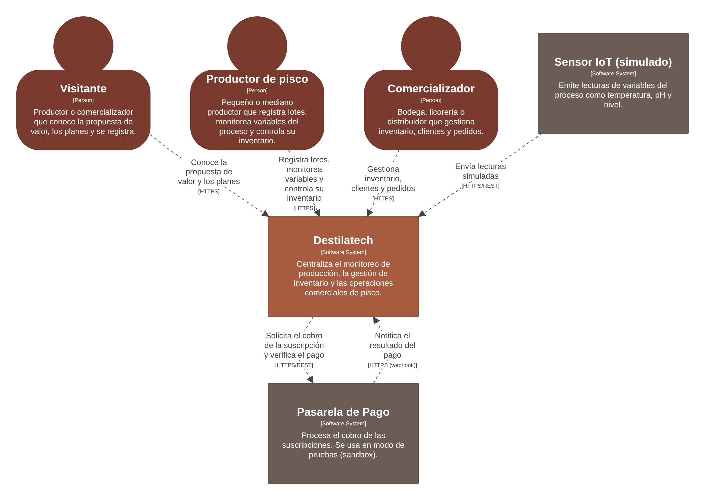</p>

*Nota.* Elaboración propia en Structurizr (2026).

*Descripción.* Destilatech aparece como un sistema central. Tres personas lo usan: el visitante, que conoce la propuesta y se registra; el productor de pisco, que gestiona lotes, monitoreo e inventario; y el comercializador, que gestiona inventario, clientes y pedidos. Dos sistemas externos se conectan con él: la pasarela de pago, a la que se solicitan cobros y de la que se recibe la notificación del resultado, y el sensor IoT simulado, que envía lecturas.


Los tres actores acceden a Destilatech como un único sistema, sin necesidad de conocer su composición interna ni la división en contextos. La pasarela de pago y el sensor IoT simulado son los dos sistemas externos con los que Destilatech se comunica; ambos aparecen con la solución y no existían en el negocio actual descrito en el Big Picture EventStorming. WhatsApp, el canal que hoy usan los entrevistados para coordinar pedidos, no se integra con Destilatech: el usuario comparte por su cuenta el texto de la lista de compra.

| Origen | Destino | Descripción de la relación | Protocolo |
| :--- | :--- | :--- | :--- |
| Visitante | Destilatech | Conoce la propuesta de valor y los planes, y se registra. | HTTPS |
| Productor de pisco | Destilatech | Registra lotes, monitorea variables del proceso y controla su inventario. | HTTPS |
| Comercializador | Destilatech | Gestiona inventario, clientes y pedidos. | HTTPS |
| Destilatech | Pasarela de Pago | Solicita el cobro de la suscripción y verifica el pago. | HTTPS/REST |
| Pasarela de Pago | Destilatech | Notifica el resultado del pago. | HTTPS (webhook) |
| Sensor IoT (simulado) | Destilatech | Envía lecturas simuladas de las variables del proceso. | HTTPS/REST |

**Tabla 7**

*Relaciones del diagrama de contexto.*

<details>
<summary>Código Structurizr DSL del espacio de trabajo (contexto, contenedores y componentes)</summary>

```
workspace "Destilatech" "Arquitectura de software de Destilatech, plataforma SaaS para el monitoreo de producción, el control de inventario y la gestión comercial de pisco." {

    !identifiers hierarchical

    model {

        # Personas
        visitor = person "Visitante" "Productor o comercializador que conoce la propuesta de valor, los planes y se registra."
        producer = person "Productor de pisco" "Pequeño o mediano productor que registra lotes, monitorea variables del proceso y controla su inventario."
        retailer = person "Comercializador" "Bodega, licorería o distribuidor que gestiona inventario, clientes y pedidos."

        # Sistemas externos
        paymentGateway = softwareSystem "Pasarela de Pago" "Procesa el cobro de las suscripciones. Se usa en modo de pruebas (sandbox)." "External"
        iotSensor = softwareSystem "Sensor IoT (simulado)" "Emite lecturas de variables del proceso como temperatura, pH y nivel." "External"

        # Sistema de software
        destilatech = softwareSystem "Destilatech" "Centraliza el monitoreo de producción, la gestión de inventario y las operaciones comerciales de pisco." {

            landing = container "Landing Page" "Sitio estático con la propuesta de valor, los planes y el punto de entrada al registro." "HTML5, CSS3, JavaScript" "Web Browser" {
                header = component "Header" "Logo, navegación entre secciones y selector de idioma." "HTML, CSS, JavaScript"
                description = component "Description" "Explica qué es Destilatech y su propuesta de valor." "HTML, CSS, JavaScript"
                goals = component "Goals" "Presenta los beneficios principales de la plataforma." "HTML, CSS, JavaScript"
                pricing = component "Pricing" "Muestra los planes de suscripción y la prueba gratuita de 14 días." "HTML, CSS, JavaScript"
                impact = component "Impact" "Muestra cifras del sector pisquero peruano." "HTML, CSS, JavaScript"
                features = component "Platform Features" "Describe las funcionalidades por segmento objetivo." "HTML, CSS, JavaScript"
                footer = component "Footer" "Contacto, enlaces, términos y condiciones y llamada a la acción de registro." "HTML, CSS, JavaScript"
            }

            webStatic = container "Web Application Static Content" "Sirve al navegador los archivos estáticos de la aplicación (HTML, CSS y paquetes de JavaScript) desde un servicio de hosting." "Hosting de contenido estático" "Static Content"

            spa = container "Single-Page Application" "Aplicación de una sola página que se ejecuta en el navegador del usuario; productores y comercializadores operan la plataforma desde ella." "Vue 3, PrimeVue, Pinia, Vue Router, JavaScript" "Web Browser" {
                sharedKernel = component "Shared Kernel" "Layout, cliente HTTP base, internacionalización (es/en), conmutador de usuario de demostración y componentes comunes." "Vue components, JavaScript"
                iamUi = component "IAM (planificado)" "Registro, inicio de sesión y recuperación de contraseña. No se aplica en el Sprint 2." "Vue components" "Planned"
                billingUi = component "Billing" "Plan, estado de la suscripción, periodo de prueba e historial de pagos." "Vue components, Pinia"
                productionUi = component "Production & Monitoring" "Lotes de producción, variables del proceso y lecturas simuladas." "Vue components, Pinia"
                inventoryUi = component "Inventory & Stock Management" "Productos, stock, movimientos y umbrales." "Vue components, Pinia"
                ordersUi = component "Orders & Replenishment" "Clientes, pedidos y lista de compra para reposición." "Vue components, Pinia"
                alertsUi = component "Alerts & Notifications" "Bandeja de alertas de anomalía y de stock bajo." "Vue components, Pinia"
                analyticsUi = component "Analytics & Estimations" "Dashboard, estimaciones de reposición e indicadores históricos." "Vue components, Pinia, Chart.js"
            }

            api = container "REST API" "Un único contenedor que expone los servicios de los siete bounded contexts como módulos: reglas de negocio, seguridad y acceso a datos. En el Sprint 2 se simula con una Fake API (json-server)." "ASP.NET Core, C#, Entity Framework Core" "API" {
                controllers = component "API Controllers" "Enruta, valida y autentica las peticiones HTTP y publica la documentación OpenAPI." "ASP.NET Core Controllers"
                iam = component "IAM" "Identidad de la cuenta, autenticación, recuperación de contraseña y periodo de prueba." "C# module"
                billing = component "Billing" "Planes, suscripciones e intentos de pago." "C# module"
                production = component "Production & Monitoring" "Lotes de producción, variables del proceso y lecturas." "C# module"
                inventory = component "Inventory & Stock Management" "Productos, stock, umbrales y movimientos." "C# module"
                orders = component "Orders & Replenishment" "Clientes, pedidos y listas de compra para reposición." "C# module"
                alerts = component "Alerts & Notifications" "Centraliza y gestiona las alertas." "C# module"
                analytics = component "Analytics & Estimations" "Estimaciones de reposición, indicadores históricos y resumen del dashboard." "C# module"
            }

            db = container "Database" "Persiste la información de cada bounded context en tablas con prefijo de módulo." "MySQL" "Database"
        }

        # Contexto
        visitor -> destilatech.landing "Conoce la propuesta de valor y los planes" "HTTPS"
        visitor -> destilatech.landing.header "Navega entre secciones" "HTTPS"
        producer -> destilatech.spa "Registra lotes, monitorea variables y controla su inventario" "HTTPS"
        retailer -> destilatech.spa "Gestiona inventario, clientes y pedidos" "HTTPS"
        destilatech.landing -> destilatech.webStatic "Enlaza a la aplicación" "HTTPS"
        destilatech.webStatic -> destilatech.spa "Entrega la aplicación al navegador" "HTTPS"
        destilatech.spa -> destilatech.api "Consume los servicios" "JSON/HTTPS"
        destilatech.api -> destilatech.db "Lee y escribe" "SQL/TLS (EF Core)"
        destilatech.api -> paymentGateway "Solicita el cobro de la suscripción y verifica el pago" "HTTPS/REST"
        paymentGateway -> destilatech.api "Notifica el resultado del pago" "HTTPS (webhook)"
        iotSensor -> destilatech.api "Envía lecturas simuladas" "HTTPS/REST"

        # Componentes de la Landing Page
        destilatech.landing.pricing -> destilatech.webStatic "Enlaza a la aplicación con el plan preseleccionado" "HTTPS"
        destilatech.landing.footer -> destilatech.webStatic "Enlaza a la aplicación (registro)" "HTTPS"
        destilatech.landing.header -> destilatech.landing.description "Enlaza"
        destilatech.landing.header -> destilatech.landing.goals "Enlaza"
        destilatech.landing.header -> destilatech.landing.pricing "Enlaza"
        destilatech.landing.header -> destilatech.landing.impact "Enlaza"
        destilatech.landing.header -> destilatech.landing.features "Enlaza"
        destilatech.landing.header -> destilatech.landing.footer "Enlaza"

        # Componentes de la Single-Page Application (primer nivel: bounded contexts)
        destilatech.spa.sharedKernel -> destilatech.spa.alertsUi "Muestra alertas pendientes en la barra superior"
        destilatech.spa.sharedKernel -> destilatech.spa.billingUi "Muestra el estado de la prueba gratuita"
        destilatech.spa.productionUi -> destilatech.spa.inventoryUi "Consulta productos al registrar el embotellado"
        destilatech.spa.productionUi -> destilatech.spa.alertsUi "Genera alertas de anomalía"
        destilatech.spa.inventoryUi -> destilatech.spa.alertsUi "Genera alertas de stock bajo"
        destilatech.spa.ordersUi -> destilatech.spa.inventoryUi "Consulta y descuenta stock"
        destilatech.spa.analyticsUi -> destilatech.spa.productionUi "Consulta lotes y lecturas"
        destilatech.spa.analyticsUi -> destilatech.spa.inventoryUi "Consulta stock y movimientos"
        destilatech.spa.analyticsUi -> destilatech.spa.ordersUi "Consulta pedidos"
        destilatech.spa.analyticsUi -> destilatech.spa.alertsUi "Consulta alertas"
        destilatech.spa.ordersUi -> destilatech.spa.analyticsUi "Consulta estimaciones de reposición"
        destilatech.spa.inventoryUi -> destilatech.spa.analyticsUi "Consulta la estimación de un producto"
        destilatech.spa.sharedKernel -> destilatech.api "Invoca los servicios de cada contexto" "JSON/HTTPS"
        producer -> destilatech.spa.analyticsUi "Consulta su dashboard" "HTTPS"
        retailer -> destilatech.spa.analyticsUi "Consulta su dashboard" "HTTPS"

        # Componentes de la REST API
        destilatech.api.controllers -> destilatech.api.iam "Enruta"
        destilatech.api.controllers -> destilatech.api.billing "Enruta"
        destilatech.api.controllers -> destilatech.api.production "Enruta"
        destilatech.api.controllers -> destilatech.api.inventory "Enruta"
        destilatech.api.controllers -> destilatech.api.orders "Enruta"
        destilatech.api.controllers -> destilatech.api.alerts "Enruta"
        destilatech.api.controllers -> destilatech.api.analytics "Enruta"
        destilatech.api.billing -> destilatech.api.iam "Publica SubscriptionActivated (extiende el acceso)" "Evento de dominio"
        destilatech.api.production -> destilatech.api.alerts "Publica AnomalyDetected" "Evento de dominio"
        destilatech.api.inventory -> destilatech.api.alerts "Publica LowStockDetected" "Evento de dominio"
        destilatech.api.orders -> destilatech.api.inventory "Publica OrderRegistered (descuenta stock)" "Evento de dominio"
        destilatech.api.production -> destilatech.api.inventory "Publica BottlingRegistered (agrega stock)" "Evento de dominio"
        destilatech.api.analytics -> destilatech.api.inventory "Lee el historial de movimientos" "Interfaz de lectura"
        destilatech.api.analytics -> destilatech.api.production "Lee el historial de lotes" "Interfaz de lectura"
        destilatech.api.orders -> destilatech.api.inventory "Consulta productos por reponer" "Interfaz de lectura"
        destilatech.api.iam -> destilatech.db "Lee y escribe" "SQL/TLS"
        destilatech.api.billing -> destilatech.db "Lee y escribe" "SQL/TLS"
        destilatech.api.production -> destilatech.db "Lee y escribe" "SQL/TLS"
        destilatech.api.inventory -> destilatech.db "Lee y escribe" "SQL/TLS"
        destilatech.api.orders -> destilatech.db "Lee y escribe" "SQL/TLS"
        destilatech.api.alerts -> destilatech.db "Lee y escribe" "SQL/TLS"
        destilatech.api.analytics -> destilatech.db "Lee y escribe" "SQL/TLS"
        destilatech.api.billing -> paymentGateway "Solicita el cobro y verifica el pago" "HTTPS/REST"
        paymentGateway -> destilatech.api.billing "Notifica el resultado del pago" "HTTPS (webhook)"
        iotSensor -> destilatech.api.production "Envía lecturas simuladas" "HTTPS/REST"
    }

    views {

        systemContext destilatech "C4-01-Contexto" "Diagrama de contexto de Destilatech" {
            include *
            autolayout tb 200 120
        }

        container destilatech "C4-02-Contenedores" "Diagrama de contenedores de Destilatech" {
            include *
            autolayout tb 200 150
        }

        component destilatech.landing "C4-03-Componentes-Landing" "Diagrama de componentes de la Landing Page" {
            include *
            autolayout tb 120 120
        }

        component destilatech.spa "C4-04-Componentes-SPA" "Diagrama de componentes de la Single-Page Application (bounded contexts)" {
            include *
            autolayout tb 150 200
        }

        component destilatech.api "C4-05-Componentes-API" "Diagrama de componentes de la REST API" {
            include *
            autolayout tb 150 200
        }

        branding {
            font "Arial"
        }

        styles {
            element "Person" {
                shape Person
                background #7a3b2e
                color #ffffff
            }
            element "Software System" {
                background #a85c3f
                color #ffffff
            }
            element "External" {
                background #6b5d55
                color #ffffff
            }
            element "Container" {
                background #d99b3f
                color #2c2320
            }
            element "Component" {
                background #f7efe4
                color #2c2320
                stroke #a85c3f
            }
            element "Web Browser" {
                shape WebBrowser
            }
            element "Static Content" {
                shape Folder
            }
            element "Planned" {
                background #ffffff
                stroke #a85c3f
                strokeWidth 3
                border dashed
            }
            element "API" {
                shape Hexagon
            }
            element "Database" {
                shape Cylinder
            }
        }
    }
}
```

</details>

Para visualizar los diagramas, el código se pega en https://playground.structurizr.com y cada vista se exporta como imagen (`C4-01-Contexto`, `C4-02-Contenedores`, `C4-03-Componentes-Landing`, `C4-04-Componentes-SPA` y `C4-05-Componentes-API`).

#### 4.6.3. Software Architecture Container Diagrams

El diagrama de contenedores descompone a Destilatech en sus unidades desplegables o ejecutables por separado y muestra las principales decisiones de tecnología y la forma en que se comunican. Pertenece al mismo espacio de trabajo de Structurizr de la sección 4.6.2.

**Figura 67**

*Diagrama de contenedores C4 de Destilatech*

<p align="center">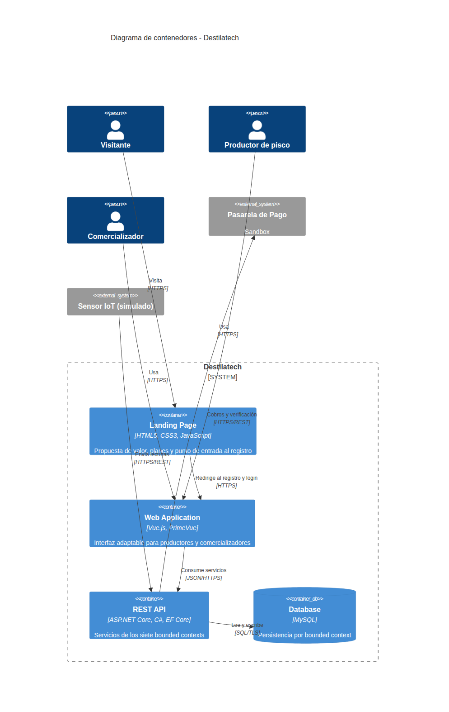</p>

*Nota.* Elaboración propia en Structurizr (2026).

*Descripción.* Dentro de Destilatech hay cinco contenedores. La Landing Page (HTML5, CSS3 y JavaScript) es contenido estático que se sirve desde un hosting. La aplicación web, al ser una aplicación Vue de una sola página, se representa con dos contenedores: *Web Application Static Content*, el hosting que entrega al navegador los archivos estáticos, y *Single-Page Application*, el código Vue que se ejecuta en el navegador del usuario. La REST API (ASP.NET Core, C# y Entity Framework Core) es un único contenedor, aunque contiene los siete *bounded contexts* como módulos, y la base de datos MySQL persiste la información. El visitante usa la Landing Page, que enlaza a la aplicación; el productor y el comercializador usan la SPA, que consume la REST API en JSON por HTTPS. La API lee y escribe en MySQL, se comunica con la pasarela de pago y recibe las lecturas del sensor IoT simulado.


| Contenedor | Tecnología | Responsabilidad |
| :--- | :--- | :--- |
| Landing Page | HTML5, CSS3, JavaScript | Contenido estático con la propuesta de valor, los planes y el punto de entrada al registro; no requiere autenticación. |
| Web Application Static Content | Hosting de contenido estático | Entrega al navegador los archivos estáticos (HTML, CSS y paquetes de JavaScript) de la aplicación. |
| Single-Page Application | Vue 3, PrimeVue, Pinia, Vue Router, JavaScript | Aplicación que se ejecuta en el navegador y en la que productores y comercializadores operan la plataforma. |
| REST API | ASP.NET Core, C#, Entity Framework Core | Un único contenedor con las reglas de negocio de los siete *bounded contexts*, la seguridad y el acceso a datos. En el Sprint 2 se simula con una Fake API (json-server). |
| Database | MySQL | Persistencia de cada *bounded context* en tablas con prefijo de módulo. |

**Tabla 8**

*Contenedores de Destilatech.*

La decisión tecnológica principal es separar la Landing Page (contenido estático y sin autenticación) de la aplicación autenticada de una sola página, de modo que los llamados a la acción de la Landing Page lleven al usuario a la vista correspondiente de la aplicación y la experiencia sea consistente entre ambas, como exige el enunciado. Una aplicación de una sola página se compone de dos contenedores porque el hosting que entrega los archivos y el código que corre en el navegador son elementos de ejecución distintos. En cambio, la REST API es un solo contenedor: los *bounded contexts* son módulos de un mismo despliegue (monolito modular) y se distinguen en el diagrama de componentes de la API, no como contenedores separados. La API es el único contenedor que accede a la base de datos y a los dos sistemas externos.

| Origen | Destino | Descripción | Protocolo |
| :--- | :--- | :--- | :--- |
| Landing Page | Web Application Static Content | Enlaza a la aplicación (registro, inicio de sesión y plan preseleccionado). | HTTPS |
| Web Application Static Content | Single-Page Application | Entrega la aplicación al navegador del usuario. | HTTPS |
| Single-Page Application | REST API | Consume los servicios de los siete contextos. | JSON/HTTPS |
| REST API | Database | Lee y escribe con Entity Framework Core. | SQL/TLS |
| REST API | Pasarela de Pago | Solicita el cobro y verifica el pago. | HTTPS/REST |
| Pasarela de Pago | REST API | Notifica el resultado del pago. | HTTPS (webhook) |
| Sensor IoT (simulado) | REST API | Envía lecturas simuladas. | HTTPS/REST |

**Tabla 9**

*Comunicación entre contenedores.*

#### 4.6.4. Software Architecture Components Diagrams

Se presentan los diagramas de componentes de los tres contenedores con lógica propia: la Landing Page, la Single-Page Application y la REST API. En la SPA y en la API, el primer nivel de componentes corresponde a los *bounded contexts* y a sus relaciones; los elementos de cada contexto (formularios, listas, servicios, entidades) se detallan en el nivel de código: en los diagramas de clases de la sección 4.7 para la API y, para la SPA, en la estructura por capas de cada contexto del repositorio del frontend. El contenedor de base de datos se detalla en la sección 4.8 (Database Design).

**a. Componentes de la Landing Page**

**Figura 68**

*Diagrama de componentes C4 de la Landing Page*

<p align="center">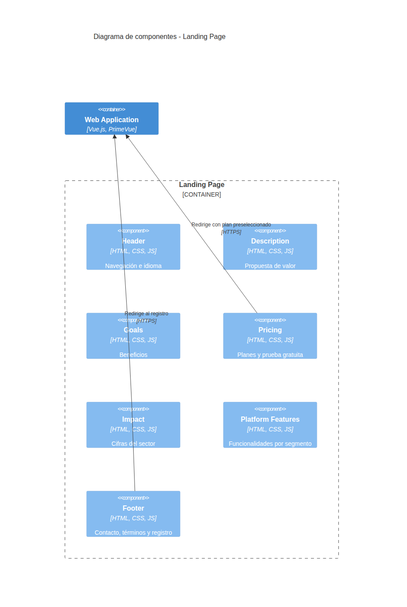</p>

*Nota.* Elaboración propia en Structurizr (2026).

*Descripción.* La Landing Page se compone de siete secciones: Header, Description, Goals, Pricing, Impact, Platform Features y Footer. El visitante navega desde el Header hacia las demás secciones; Pricing y Footer enlazan a la aplicación (Web Application Static Content), el primero con el plan preseleccionado y el segundo al formulario de registro.


| Componente | Responsabilidad | Tecnología | Historia de usuario |
| :--- | :--- | :--- | :--- |
| Header | Logo, navegación entre secciones y selector de idioma. | HTML, CSS, JavaScript | US30, US52 |
| Description | Explica qué es Destilatech y su propuesta de valor. | HTML, CSS, JavaScript | US31 |
| Goals | Presenta los beneficios principales. | HTML, CSS, JavaScript | US32 |
| Pricing | Muestra los planes y la prueba gratuita de 14 días, y redirige con el plan preseleccionado. | HTML, CSS, JavaScript | US33 |
| Impact | Muestra cifras del sector pisquero peruano. | HTML, CSS, JavaScript | US34 |
| Platform Features | Describe las funcionalidades por segmento objetivo. | HTML, CSS, JavaScript | US35 |
| Footer | Contacto, enlaces, términos y condiciones y llamada a la acción de registro. | HTML, CSS, JavaScript | US36, US53 |

**Tabla 10**

*Componentes de la Landing Page.*

**b. Componentes de la Single-Page Application**

El primer nivel de componentes de la SPA son los *bounded contexts* que implementa el frontend y un *Shared Kernel* con los elementos comunes. Cada contexto se organiza internamente en las capas de presentación, aplicación, dominio e infraestructura, que corresponden al nivel de código y se pueden verificar en las carpetas de cada contexto del repositorio del frontend.

**Figura 69**

*Diagrama de componentes C4 de la Single-Page Application*

<p align="center">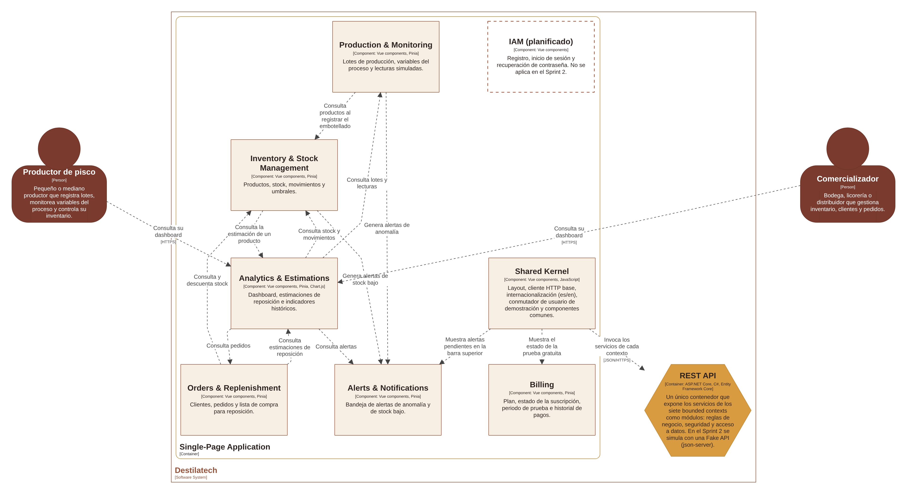</p>

*Nota.* Elaboración propia en Structurizr (2026).

*Descripción.* La SPA se compone de siete componentes que representan los *bounded contexts* (Billing, Production & Monitoring, Inventory & Stock Management, Orders & Replenishment, Alerts & Notifications, Analytics & Estimations e IAM, este último planificado y sin aplicarse en el Sprint 2) y del Shared Kernel. Las flechas muestran las relaciones reales entre contextos: Analytics & Estimations consulta a Production, Inventory, Orders y Alerts para construir el dashboard; Production y Inventory generan alertas; Orders consulta y descuenta stock en Inventory; y el Shared Kernel muestra las alertas pendientes y el estado de la prueba gratuita. Todos los contextos usan el Shared Kernel, que invoca la REST API por HTTPS.


| Componente | Responsabilidad | Tecnología | Relaciones con otros contextos |
| :--- | :--- | :--- | :--- |
| Shared Kernel | Layout, cliente HTTP base, internacionalización (es/en), conmutador de usuario de demostración y componentes comunes. | Vue components, JavaScript | Lo usan todos los contextos; muestra alertas (Alerts) y el estado de la prueba (Billing); invoca la REST API. |
| IAM (planificado) | Registro, inicio de sesión y recuperación de contraseña; no se aplica en el Sprint 2. | Vue components | Usa el Shared Kernel. |
| Billing | Plan, estado de la suscripción, periodo de prueba e historial de pagos. | Vue components, Pinia | Lo consulta el Shared Kernel. |
| Production & Monitoring | Lotes de producción, variables del proceso y lecturas simuladas. | Vue components, Pinia | Consulta productos en Inventory al registrar el embotellado; genera alertas en Alerts. |
| Inventory & Stock Management | Productos, stock, movimientos y umbrales. | Vue components, Pinia | Genera alertas de stock bajo en Alerts; consulta la estimación de un producto en Analytics. |
| Orders & Replenishment | Clientes, pedidos y lista de compra para reposición. | Vue components, Pinia | Consulta y descuenta stock en Inventory; consulta estimaciones en Analytics. |
| Alerts & Notifications | Bandeja de alertas de anomalía y de stock bajo. | Vue components, Pinia | Recibe las alertas de Production e Inventory. |
| Analytics & Estimations | Dashboard, estimaciones de reposición e indicadores históricos. | Vue components, Pinia, Chart.js | Consulta Production, Inventory, Orders y Alerts. |

**Tabla 11**

*Componentes de la Single-Page Application.*

**c. Componentes de la REST API**

La REST API es un único contenedor y cada uno de sus módulos corresponde exactamente a uno de los siete *bounded contexts* del Design-Level EventStorming (sección 4.6.1), lo que evidencia la trazabilidad entre el modelo de dominio y la arquitectura de software.

**Figura 70**

*Diagrama de componentes C4 de la REST API*

<p align="center">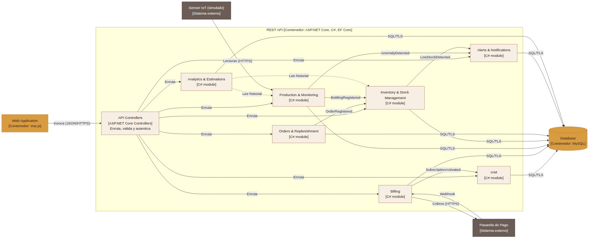</p>

*Nota.* Elaboración propia en Structurizr (2026).

*Descripción.* Los controladores reciben las peticiones de la Single-Page Application y las enrutan a los siete módulos: IAM, Billing, Production & Monitoring, Inventory & Stock Management, Orders & Replenishment, Alerts & Notifications y Analytics & Estimations. Entre módulos hay seis eventos de dominio (SubscriptionActivated, AnomalyDetected, LowStockDetected, OrderRegistered y BottlingRegistered) y tres lecturas de historial. Todos los módulos acceden a MySQL; Billing se comunica con la pasarela de pago y Production recibe las lecturas del sensor IoT simulado.


| Componente | Responsabilidad | Tecnología |
| :--- | :--- | :--- |
| API Controllers | Enruta, valida y autentica las peticiones HTTP y publica la documentación OpenAPI. | ASP.NET Core Controllers |
| IAM | Identidad de la cuenta, autenticación, recuperación de contraseña y periodo de prueba. | C# module |
| Billing | Planes, suscripciones e intentos de pago. | C# module |
| Production & Monitoring | Lotes de producción, variables del proceso y lecturas. | C# module |
| Inventory & Stock Management | Productos, stock, umbrales y movimientos. | C# module |
| Orders & Replenishment | Clientes, pedidos y listas de compra para reposición. | C# module |
| Alerts & Notifications | Centraliza y gestiona las alertas. | C# module |
| Analytics & Estimations | Estimaciones de reposición, indicadores históricos y resumen del dashboard. | C# module |

**Tabla 12**

*Componentes de la REST API.*

La comunicación entre módulos de distintos *bounded contexts* (por ejemplo, de Billing hacia IAM, de Production hacia Alerts o de Orders hacia Inventory) se realiza mediante la publicación de eventos de dominio y de commands, y no compartiendo directamente los modelos internos, como se definió en el Design-Level EventStorming. Los módulos de lectura de historial (`Analytics` hacia `Inventory` y `Production`) consumen interfaces de solo lectura y no modifican los datos de otros contextos.

### 4.7. Software Object-Oriented Design

En esta sección el equipo detalla el diseño orientado a objetos de la REST API con un diagrama de clases UML por cada *bounded context*. El nivel de detalle incluye clases, interfaces y enumeraciones, sus atributos y métodos con el alcance de cada miembro (`+` público, `-` privado, `#` protegido), y las relaciones con su nombre, dirección y multiplicidad. Las clases de servicio (`<<service>>`) concentran la lógica de aplicación del contexto, y las interfaces (`<<interface>>`) son los contratos con la persistencia y con otros contextos. Los diagramas están escritos en Mermaid y embebidos en este documento; su versión en PlantUML se conserva en `diagramas/plantuml/`.

#### 4.7.1. Class Diagrams

**a. IAM (Identity & Access Management)**

**Figura 71**

*Diagrama de clases del Bounded Context IAM (Identity & Access Management)*

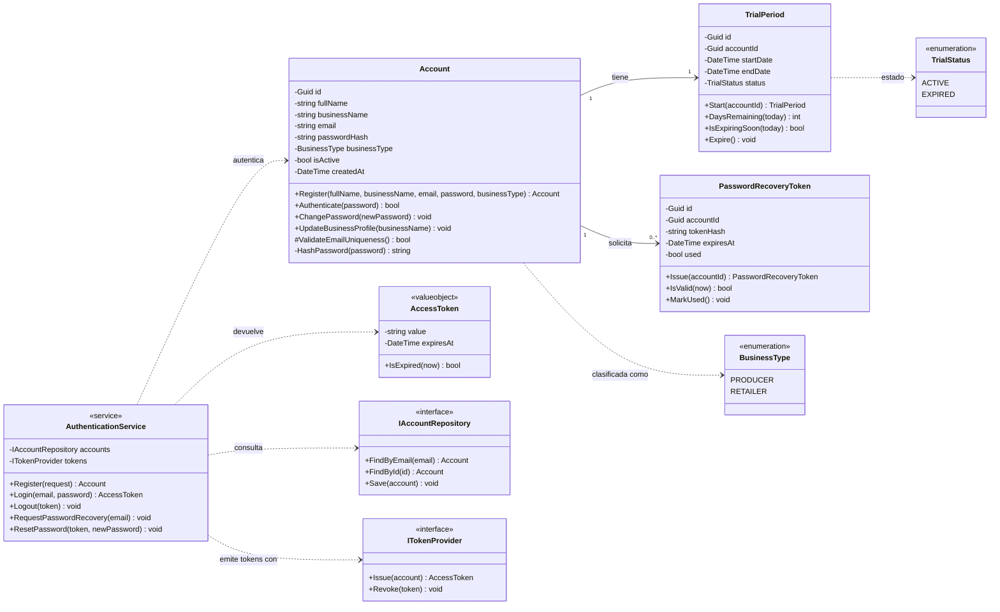
```mermaid
classDiagram
    direction LR
    class Account {
        -Guid id
        -string fullName
        -string businessName
        -string email
        -string passwordHash
        -BusinessType businessType
        -bool isActive
        -DateTime createdAt
        +Register(fullName, businessName, email, password, businessType) Account
        +Authenticate(password) bool
        +ChangePassword(newPassword) void
        +UpdateBusinessProfile(businessName) void
        #ValidateEmailUniqueness() bool
        -HashPassword(password) string
    }
    class TrialPeriod {
        -Guid id
        -Guid accountId
        -DateTime startDate
        -DateTime endDate
        -TrialStatus status
        +Start(accountId) TrialPeriod
        +DaysRemaining(today) int
        +IsExpiringSoon(today) bool
        +Expire() void
    }
    class PasswordRecoveryToken {
        -Guid id
        -Guid accountId
        -string tokenHash
        -DateTime expiresAt
        -bool used
        +Issue(accountId) PasswordRecoveryToken
        +IsValid(now) bool
        +MarkUsed() void
    }
    class AccessToken {
        <<valueobject>>
        -string value
        -DateTime expiresAt
        +IsExpired(now) bool
    }
    class AuthenticationService {
        <<service>>
        -IAccountRepository accounts
        -ITokenProvider tokens
        +Register(request) Account
        +Login(email, password) AccessToken
        +Logout(token) void
        +RequestPasswordRecovery(email) void
        +ResetPassword(token, newPassword) void
    }
    class IAccountRepository {
        <<interface>>
        +FindByEmail(email) Account
        +FindById(id) Account
        +Save(account) void
    }
    class ITokenProvider {
        <<interface>>
        +Issue(account) AccessToken
        +Revoke(token) void
    }
    class BusinessType {
        <<enumeration>>
        PRODUCER
        RETAILER
    }
    class TrialStatus {
        <<enumeration>>
        ACTIVE
        EXPIRED
    }

    Account "1" --> "1" TrialPeriod : tiene
    Account "1" --> "0..*" PasswordRecoveryToken : solicita
    Account ..> BusinessType : clasificada como
    TrialPeriod ..> TrialStatus : estado
    AuthenticationService ..> IAccountRepository : consulta
    AuthenticationService ..> ITokenProvider : emite tokens con
    AuthenticationService ..> AccessToken : devuelve
    AuthenticationService ..> Account : autentica
```

*Nota.* Elaboración propia en Mermaid (2026). Versión PlantUML en `diagramas/plantuml/`.

*Descripción.* El diagrama muestra las clases, interfaces y enumeraciones del contexto IAM (Identity & Access Management) (`Account`, `TrialPeriod`, `PasswordRecoveryToken`, `AccessToken`, `AuthenticationService`, `IAccountRepository`, `ITokenProvider`, `BusinessType`, `TrialStatus`) con sus atributos, métodos y alcance, y las relaciones entre ellas con su nombre y multiplicidad.


`Account` es la raíz del contexto: guarda el correo, el hash de la contraseña y el tipo de negocio (`BusinessType`), y nunca la contraseña en claro. Cada cuenta tiene un único `TrialPeriod`, que calcula los días restantes y si está por vencer, y puede solicitar varios `PasswordRecoveryToken`, de un solo uso y con vencimiento. `AuthenticationService` coordina el registro, el inicio y cierre de sesión y la recuperación de contraseña a través de las interfaces `IAccountRepository` e `ITokenProvider`, de modo que el dominio no depende de la base de datos ni del mecanismo de tokens.

**b. Billing**

**Figura 72**

*Diagrama de clases del Bounded Context Billing*

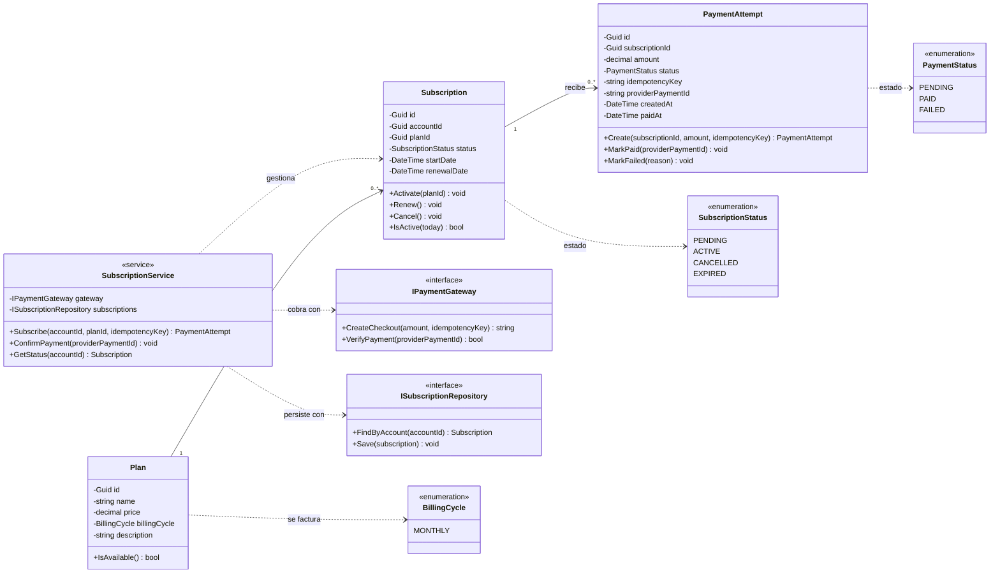
```mermaid
classDiagram
    direction LR
    class Plan {
        -Guid id
        -string name
        -decimal price
        -BillingCycle billingCycle
        -string description
        +IsAvailable() bool
    }
    class Subscription {
        -Guid id
        -Guid accountId
        -Guid planId
        -SubscriptionStatus status
        -DateTime startDate
        -DateTime renewalDate
        +Activate(planId) void
        +Renew() void
        +Cancel() void
        +IsActive(today) bool
    }
    class PaymentAttempt {
        -Guid id
        -Guid subscriptionId
        -decimal amount
        -PaymentStatus status
        -string idempotencyKey
        -string providerPaymentId
        -DateTime createdAt
        -DateTime paidAt
        +Create(subscriptionId, amount, idempotencyKey) PaymentAttempt
        +MarkPaid(providerPaymentId) void
        +MarkFailed(reason) void
    }
    class SubscriptionService {
        <<service>>
        -IPaymentGateway gateway
        -ISubscriptionRepository subscriptions
        +Subscribe(accountId, planId, idempotencyKey) PaymentAttempt
        +ConfirmPayment(providerPaymentId) void
        +GetStatus(accountId) Subscription
    }
    class IPaymentGateway {
        <<interface>>
        +CreateCheckout(amount, idempotencyKey) string
        +VerifyPayment(providerPaymentId) bool
    }
    class ISubscriptionRepository {
        <<interface>>
        +FindByAccount(accountId) Subscription
        +Save(subscription) void
    }
    class BillingCycle {
        <<enumeration>>
        MONTHLY
    }
    class SubscriptionStatus {
        <<enumeration>>
        PENDING
        ACTIVE
        CANCELLED
        EXPIRED
    }
    class PaymentStatus {
        <<enumeration>>
        PENDING
        PAID
        FAILED
    }

    Plan "1" --> "0..*" Subscription : rige
    Subscription "1" --> "0..*" PaymentAttempt : recibe
    Plan ..> BillingCycle : se factura
    Subscription ..> SubscriptionStatus : estado
    PaymentAttempt ..> PaymentStatus : estado
    SubscriptionService ..> IPaymentGateway : cobra con
    SubscriptionService ..> ISubscriptionRepository : persiste con
    SubscriptionService ..> Subscription : gestiona
```

*Nota.* Elaboración propia en Mermaid (2026). Versión PlantUML en `diagramas/plantuml/`.

*Descripción.* El diagrama muestra las clases, interfaces y enumeraciones del contexto Billing (`Plan`, `Subscription`, `PaymentAttempt`, `SubscriptionService`, `IPaymentGateway`, `ISubscriptionRepository`, `BillingCycle`, `SubscriptionStatus`, `PaymentStatus`) con sus atributos, métodos y alcance, y las relaciones entre ellas con su nombre y multiplicidad.


`Plan` describe los planes de suscripción y rige cero o más `Subscription`; cada suscripción recibe cero o más `PaymentAttempt`. Un intento de pago solo pasa a pagado cuando la pasarela lo confirma (`MarkPaid`) y guarda una clave de idempotencia para que un reintento no genere dos cobros. `SubscriptionService` orquesta la contratación y la confirmación del pago mediante `IPaymentGateway`, que aísla al proveedor concreto, y `ISubscriptionRepository`. La referencia a la cuenta (`accountId`) es un identificador lógico hacia IAM.

**c. Production & Monitoring**

**Figura 73**

*Diagrama de clases del Bounded Context Production & Monitoring*

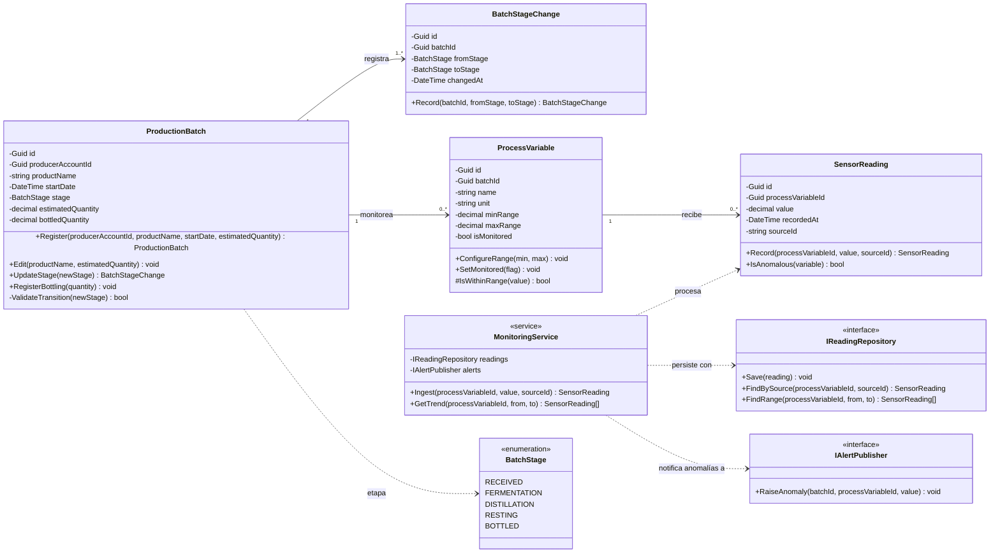
```mermaid
classDiagram
    direction LR
    class ProductionBatch {
        -Guid id
        -Guid producerAccountId
        -string productName
        -DateTime startDate
        -BatchStage stage
        -decimal estimatedQuantity
        -decimal bottledQuantity
        +Register(producerAccountId, productName, startDate, estimatedQuantity) ProductionBatch
        +Edit(productName, estimatedQuantity) void
        +UpdateStage(newStage) BatchStageChange
        +RegisterBottling(quantity) void
        -ValidateTransition(newStage) bool
    }
    class BatchStageChange {
        -Guid id
        -Guid batchId
        -BatchStage fromStage
        -BatchStage toStage
        -DateTime changedAt
        +Record(batchId, fromStage, toStage) BatchStageChange
    }
    class ProcessVariable {
        -Guid id
        -Guid batchId
        -string name
        -string unit
        -decimal minRange
        -decimal maxRange
        -bool isMonitored
        +ConfigureRange(min, max) void
        +SetMonitored(flag) void
        #IsWithinRange(value) bool
    }
    class SensorReading {
        -Guid id
        -Guid processVariableId
        -decimal value
        -DateTime recordedAt
        -string sourceId
        +Record(processVariableId, value, sourceId) SensorReading
        +IsAnomalous(variable) bool
    }
    class MonitoringService {
        <<service>>
        -IReadingRepository readings
        -IAlertPublisher alerts
        +Ingest(processVariableId, value, sourceId) SensorReading
        +GetTrend(processVariableId, from, to) SensorReading[]
    }
    class IReadingRepository {
        <<interface>>
        +Save(reading) void
        +FindBySource(processVariableId, sourceId) SensorReading
        +FindRange(processVariableId, from, to) SensorReading[]
    }
    class IAlertPublisher {
        <<interface>>
        +RaiseAnomaly(batchId, processVariableId, value) void
    }
    class BatchStage {
        <<enumeration>>
        RECEIVED
        FERMENTATION
        DISTILLATION
        RESTING
        BOTTLED
    }

    ProductionBatch "1" --> "1..*" BatchStageChange : registra
    ProductionBatch "1" --> "0..*" ProcessVariable : monitorea
    ProcessVariable "1" --> "0..*" SensorReading : recibe
    ProductionBatch ..> BatchStage : etapa
    MonitoringService ..> SensorReading : procesa
    MonitoringService ..> IReadingRepository : persiste con
    MonitoringService ..> IAlertPublisher : notifica anomalías a
```

*Nota.* Elaboración propia en Mermaid (2026). Versión PlantUML en `diagramas/plantuml/`.

*Descripción.* El diagrama muestra las clases, interfaces y enumeraciones del contexto Production & Monitoring (`ProductionBatch`, `BatchStageChange`, `ProcessVariable`, `SensorReading`, `MonitoringService`, `IReadingRepository`, `IAlertPublisher`, `BatchStage`) con sus atributos, métodos y alcance, y las relaciones entre ellas con su nombre y multiplicidad.


`ProductionBatch` es el agregado raíz: valida las transiciones entre etapas (`BatchStage`) y cada cambio queda registrado como `BatchStageChange`, lo que da trazabilidad. Un lote monitorea cero o más `ProcessVariable`, cada una con su rango normal, y cada variable recibe cero o más `SensorReading`. `MonitoringService` ingiere las lecturas, evita duplicados con `sourceId` y, cuando una lectura sale del rango, notifica la anomalía mediante la interfaz `IAlertPublisher`, sin conocer el módulo de alertas.

**d. Inventory & Stock Management**

**Figura 74**

*Diagrama de clases del Bounded Context Inventory & Stock Management*

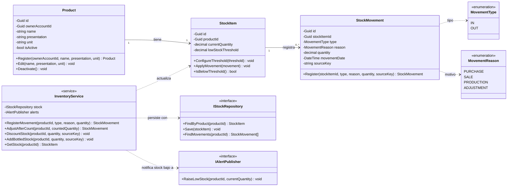
```mermaid
classDiagram
    direction LR
    class Product {
        -Guid id
        -Guid ownerAccountId
        -string name
        -string presentation
        -string unit
        -bool isActive
        +Register(ownerAccountId, name, presentation, unit) Product
        +Edit(name, presentation, unit) void
        +Deactivate() void
    }
    class StockItem {
        -Guid id
        -Guid productId
        -decimal currentQuantity
        -decimal lowStockThreshold
        +ConfigureThreshold(threshold) void
        +ApplyMovement(movement) void
        +IsBelowThreshold() bool
    }
    class StockMovement {
        -Guid id
        -Guid stockItemId
        -MovementType type
        -MovementReason reason
        -decimal quantity
        -DateTime movementDate
        -string sourceKey
        +Register(stockItemId, type, reason, quantity, sourceKey) StockMovement
    }
    class InventoryService {
        <<service>>
        -IStockRepository stock
        -IAlertPublisher alerts
        +RegisterMovement(productId, type, reason, quantity) StockMovement
        +AdjustAfterCount(productId, countedQuantity) StockMovement
        +DiscountStock(productId, quantity, sourceKey) void
        +AddBottledStock(productId, quantity, sourceKey) void
        +GetStock(productId) StockItem
    }
    class IStockRepository {
        <<interface>>
        +FindByProduct(productId) StockItem
        +Save(stockItem) void
        +FindMovements(productId) StockMovement[]
    }
    class IAlertPublisher {
        <<interface>>
        +RaiseLowStock(productId, currentQuantity) void
    }
    class MovementType {
        <<enumeration>>
        IN
        OUT
    }
    class MovementReason {
        <<enumeration>>
        PURCHASE
        SALE
        PRODUCTION
        ADJUSTMENT
    }

    Product "1" --> "1" StockItem : tiene
    StockItem "1" --> "0..*" StockMovement : registra
    StockMovement ..> MovementType : tipo
    StockMovement ..> MovementReason : motivo
    InventoryService ..> IStockRepository : persiste con
    InventoryService ..> IAlertPublisher : notifica stock bajo a
    InventoryService ..> StockItem : actualiza
```

*Nota.* Elaboración propia en Mermaid (2026). Versión PlantUML en `diagramas/plantuml/`.

*Descripción.* El diagrama muestra las clases, interfaces y enumeraciones del contexto Inventory & Stock Management (`Product`, `StockItem`, `StockMovement`, `InventoryService`, `IStockRepository`, `IAlertPublisher`, `MovementType`, `MovementReason`) con sus atributos, métodos y alcance, y las relaciones entre ellas con su nombre y multiplicidad.


`Product` representa el catálogo y tiene un único `StockItem` con el saldo y el umbral de stock bajo. Cada cambio del saldo deja un `StockMovement` con tipo (`MovementType`), motivo (`MovementReason`) y una clave de origen (`sourceKey`) que evita registrar dos veces el mismo movimiento. `InventoryService` expone las operaciones que usan otros contextos, `DiscountStock` y `AddBottledStock`, y avisa del stock bajo mediante `IAlertPublisher`.

**e. Orders & Replenishment**

**Figura 75**

*Diagrama de clases del Bounded Context Orders & Replenishment*

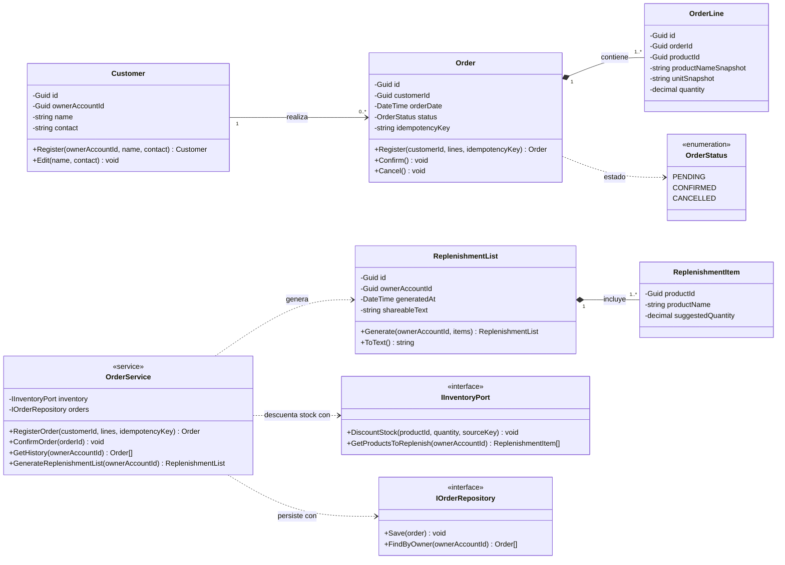
```mermaid
classDiagram
    direction LR
    class Customer {
        -Guid id
        -Guid ownerAccountId
        -string name
        -string contact
        +Register(ownerAccountId, name, contact) Customer
        +Edit(name, contact) void
    }
    class Order {
        -Guid id
        -Guid customerId
        -DateTime orderDate
        -OrderStatus status
        -string idempotencyKey
        +Register(customerId, lines, idempotencyKey) Order
        +Confirm() void
        +Cancel() void
    }
    class OrderLine {
        -Guid id
        -Guid orderId
        -Guid productId
        -string productNameSnapshot
        -string unitSnapshot
        -decimal quantity
    }
    class ReplenishmentList {
        -Guid id
        -Guid ownerAccountId
        -DateTime generatedAt
        -string shareableText
        +Generate(ownerAccountId, items) ReplenishmentList
        +ToText() string
    }
    class ReplenishmentItem {
        -Guid productId
        -string productName
        -decimal suggestedQuantity
    }
    class OrderService {
        <<service>>
        -IInventoryPort inventory
        -IOrderRepository orders
        +RegisterOrder(customerId, lines, idempotencyKey) Order
        +ConfirmOrder(orderId) void
        +GetHistory(ownerAccountId) Order[]
        +GenerateReplenishmentList(ownerAccountId) ReplenishmentList
    }
    class IInventoryPort {
        <<interface>>
        +DiscountStock(productId, quantity, sourceKey) void
        +GetProductsToReplenish(ownerAccountId) ReplenishmentItem[]
    }
    class IOrderRepository {
        <<interface>>
        +Save(order) void
        +FindByOwner(ownerAccountId) Order[]
    }
    class OrderStatus {
        <<enumeration>>
        PENDING
        CONFIRMED
        CANCELLED
    }

    Customer "1" --> "0..*" Order : realiza
    Order "1" *-- "1..*" OrderLine : contiene
    ReplenishmentList "1" *-- "1..*" ReplenishmentItem : incluye
    Order ..> OrderStatus : estado
    OrderService ..> IInventoryPort : descuenta stock con
    OrderService ..> IOrderRepository : persiste con
    OrderService ..> ReplenishmentList : genera
```

*Nota.* Elaboración propia en Mermaid (2026). Versión PlantUML en `diagramas/plantuml/`.

*Descripción.* El diagrama muestra las clases, interfaces y enumeraciones del contexto Orders & Replenishment (`Customer`, `Order`, `OrderLine`, `ReplenishmentList`, `ReplenishmentItem`, `OrderService`, `IInventoryPort`, `IOrderRepository`, `OrderStatus`) con sus atributos, métodos y alcance, y las relaciones entre ellas con su nombre y multiplicidad.


`Customer` realiza cero o más `Order`, y cada `Order` contiene una o más `OrderLine`, que guardan una copia del nombre y la unidad del producto para que el historial no cambie si el producto se edita. `ReplenishmentList` agrupa los `ReplenishmentItem` sugeridos y produce un texto listo para compartir. `OrderService` registra y confirma pedidos con una clave de idempotencia y pide la salida de stock a Inventory mediante la interfaz `IInventoryPort`.

**f. Alerts & Notifications**

**Figura 76**

*Diagrama de clases del Bounded Context Alerts & Notifications*

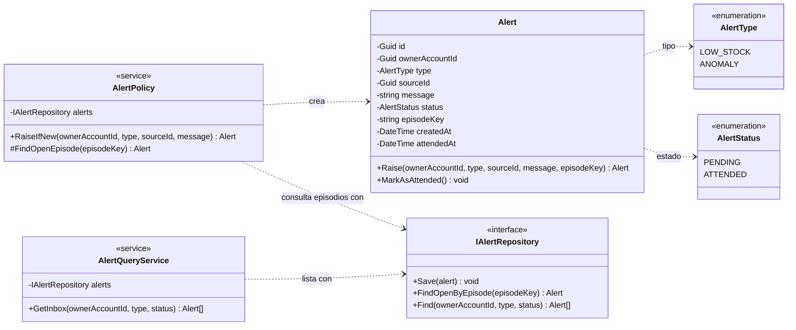
```mermaid
classDiagram
    direction LR
    class Alert {
        -Guid id
        -Guid ownerAccountId
        -AlertType type
        -Guid sourceId
        -string message
        -AlertStatus status
        -string episodeKey
        -DateTime createdAt
        -DateTime attendedAt
        +Raise(ownerAccountId, type, sourceId, message, episodeKey) Alert
        +MarkAsAttended() void
    }
    class AlertPolicy {
        <<service>>
        -IAlertRepository alerts
        +RaiseIfNew(ownerAccountId, type, sourceId, message) Alert
        #FindOpenEpisode(episodeKey) Alert
    }
    class AlertQueryService {
        <<service>>
        -IAlertRepository alerts
        +GetInbox(ownerAccountId, type, status) Alert[]
    }
    class IAlertRepository {
        <<interface>>
        +Save(alert) void
        +FindOpenByEpisode(episodeKey) Alert
        +Find(ownerAccountId, type, status) Alert[]
    }
    class AlertType {
        <<enumeration>>
        LOW_STOCK
        ANOMALY
    }
    class AlertStatus {
        <<enumeration>>
        PENDING
        ATTENDED
    }

    Alert ..> AlertType : tipo
    Alert ..> AlertStatus : estado
    AlertPolicy ..> Alert : crea
    AlertPolicy ..> IAlertRepository : consulta episodios con
    AlertQueryService ..> IAlertRepository : lista con
```

*Nota.* Elaboración propia en Mermaid (2026). Versión PlantUML en `diagramas/plantuml/`.

*Descripción.* El diagrama muestra las clases, interfaces y enumeraciones del contexto Alerts & Notifications (`Alert`, `AlertPolicy`, `AlertQueryService`, `IAlertRepository`, `AlertType`, `AlertStatus`) con sus atributos, métodos y alcance, y las relaciones entre ellas con su nombre y multiplicidad.


`Alert` es el único agregado del contexto y se crea desde commands de otros contextos. `AlertPolicy` consulta si ya existe una alerta abierta para el mismo episodio (`episodeKey`) antes de crear otra, de modo que un mismo problema no genere avisos duplicados. `AlertQueryService` entrega la bandeja filtrada por tipo y estado, y `Alert.MarkAsAttended` registra cuándo se atendió.

**g. Analytics & Estimations**

**Figura 77**

*Diagrama de clases del Bounded Context Analytics & Estimations*

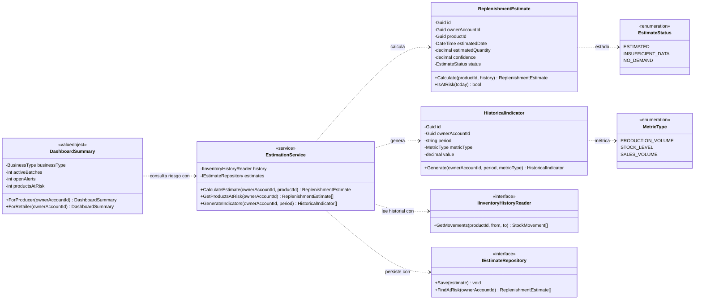
```mermaid
classDiagram
    direction LR
    class ReplenishmentEstimate {
        -Guid id
        -Guid ownerAccountId
        -Guid productId
        -DateTime estimatedDate
        -decimal estimatedQuantity
        -decimal confidence
        -EstimateStatus status
        +Calculate(productId, history) ReplenishmentEstimate
        +IsAtRisk(today) bool
    }
    class HistoricalIndicator {
        -Guid id
        -Guid ownerAccountId
        -string period
        -MetricType metricType
        -decimal value
        +Generate(ownerAccountId, period, metricType) HistoricalIndicator
    }
    class DashboardSummary {
        <<valueobject>>
        -BusinessType businessType
        -int activeBatches
        -int openAlerts
        -int productsAtRisk
        +ForProducer(ownerAccountId) DashboardSummary
        +ForRetailer(ownerAccountId) DashboardSummary
    }
    class EstimationService {
        <<service>>
        -IInventoryHistoryReader history
        -IEstimateRepository estimates
        +CalculateEstimate(ownerAccountId, productId) ReplenishmentEstimate
        +GetProductsAtRisk(ownerAccountId) ReplenishmentEstimate[]
        +GenerateIndicators(ownerAccountId, period) HistoricalIndicator[]
    }
    class IInventoryHistoryReader {
        <<interface>>
        +GetMovements(productId, from, to) StockMovement[]
    }
    class IEstimateRepository {
        <<interface>>
        +Save(estimate) void
        +FindAtRisk(ownerAccountId) ReplenishmentEstimate[]
    }
    class EstimateStatus {
        <<enumeration>>
        ESTIMATED
        INSUFFICIENT_DATA
        NO_DEMAND
    }
    class MetricType {
        <<enumeration>>
        PRODUCTION_VOLUME
        STOCK_LEVEL
        SALES_VOLUME
    }

    ReplenishmentEstimate ..> EstimateStatus : estado
    HistoricalIndicator ..> MetricType : métrica
    EstimationService ..> IInventoryHistoryReader : lee historial con
    EstimationService ..> IEstimateRepository : persiste con
    EstimationService ..> ReplenishmentEstimate : calcula
    EstimationService ..> HistoricalIndicator : genera
    DashboardSummary ..> EstimationService : consulta riesgo con
```

*Nota.* Elaboración propia en Mermaid (2026). Versión PlantUML en `diagramas/plantuml/`.

*Descripción.* El diagrama muestra las clases, interfaces y enumeraciones del contexto Analytics & Estimations (`ReplenishmentEstimate`, `HistoricalIndicator`, `DashboardSummary`, `EstimationService`, `IInventoryHistoryReader`, `IEstimateRepository`, `EstimateStatus`, `MetricType`) con sus atributos, métodos y alcance, y las relaciones entre ellas con su nombre y multiplicidad.


`ReplenishmentEstimate` calcula la fecha y la cantidad estimadas de reposición a partir del historial de movimientos, con un nivel de confianza y un estado (`EstimateStatus`) que distingue los casos de datos insuficientes y de producto sin demanda. `HistoricalIndicator` guarda los indicadores por periodo y `DashboardSummary` agrupa los valores de los dashboards según el tipo de negocio. `EstimationService` solo lee el historial mediante `IInventoryHistoryReader`; no modifica datos de otros contextos.

### 4.8. Database Design

La base de datos de Destilatech es relacional y se implementa en **MySQL**, con acceso desde la API mediante Entity Framework Core. Las convenciones de diseño son:

- Cada tabla lleva el prefijo de su módulo: `iam_`, `billing_`, `production_`, `inventory_`, `orders_`, `alerts_` y `analytics_`.
- Las claves primarias son identificadores únicos (UUID, `char(36)`) generados por la aplicación.
- Las notaciones `PK`, `FK` y `UK` indican clave primaria, clave foránea y restricción de unicidad.
- Las referencias entre contextos (por ejemplo, `account_id` en Billing) son identificadores lógicos y no llaves foráneas físicas, para preservar el desacoplamiento de los módulos.
- Los valores monetarios se almacenan como `decimal(10,2)`, las cantidades como `decimal(12,2)` y las fechas como `datetime`.
- Las columnas cuyo comentario dice *nullable* admiten valor nulo; las demás son obligatorias.

#### 4.8.1. Database Diagrams

Se presenta un diagrama entidad-relación por cada *bounded context*, derivado de los diagramas de clases de la sección 4.7.1. Los diagramas están escritos en Mermaid y embebidos en este documento.

**a. IAM**

**Figura 78**

*Diagrama entidad-relación del Bounded Context IAM*

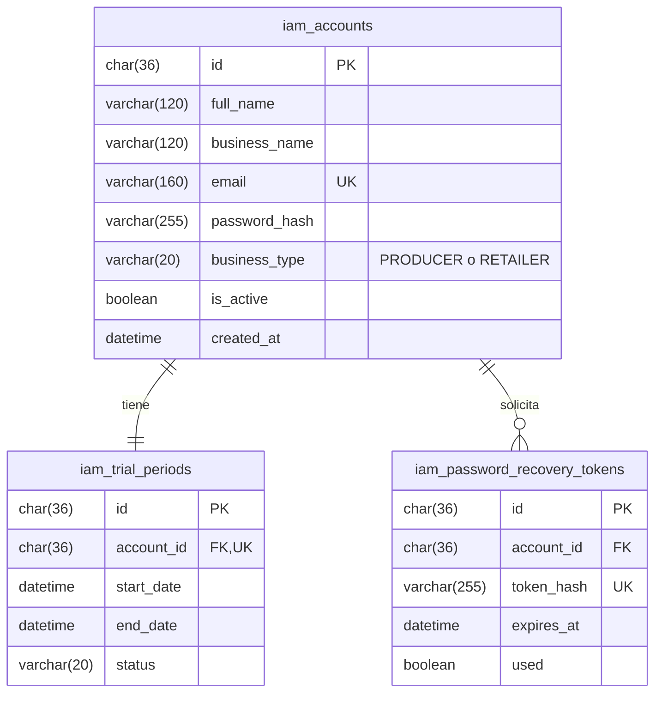
```mermaid
erDiagram
    iam_accounts ||--|| iam_trial_periods : tiene
    iam_accounts ||--o{ iam_password_recovery_tokens : solicita
    iam_accounts {
        char(36) id PK
        varchar(120) full_name
        varchar(120) business_name
        varchar(160) email UK
        varchar(255) password_hash
        varchar(20) business_type "PRODUCER o RETAILER"
        boolean is_active
        datetime created_at
    }
    iam_trial_periods {
        char(36) id PK
        char(36) account_id FK, UK
        datetime start_date
        datetime end_date
        varchar(20) status
    }
    iam_password_recovery_tokens {
        char(36) id PK
        char(36) account_id FK
        varchar(255) token_hash UK
        datetime expires_at
        boolean used
    }
```

*Nota.* Elaboración propia en Mermaid (2026).

*Descripción.* El diagrama entidad-relación del contexto IAM contiene las tablas `iam_accounts`, `iam_trial_periods`, `iam_password_recovery_tokens`, con el tipo de cada columna, sus claves primarias (PK), foráneas (FK) y únicas (UK) y la cardinalidad de las relaciones.


Una cuenta (`iam_accounts`) tiene un único periodo de prueba (`iam_trial_periods`), garantizado por la restricción de unicidad de `account_id`, y cero o más tokens de recuperación de contraseña (`iam_password_recovery_tokens`). El correo es único y el token se guarda como hash, también único.

**b. Billing**

**Figura 79**

*Diagrama entidad-relación del Bounded Context Billing*

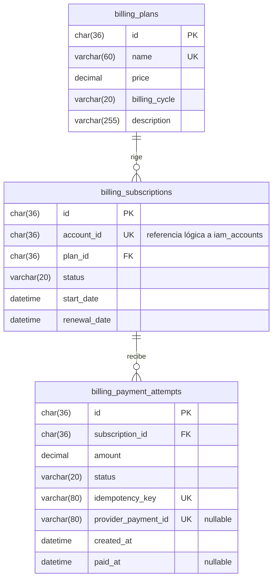
```mermaid
erDiagram
    billing_plans ||--o{ billing_subscriptions : rige
    billing_subscriptions ||--o{ billing_payment_attempts : recibe
    billing_plans {
        char(36) id PK
        varchar(60) name UK
        decimal price
        varchar(20) billing_cycle
        varchar(255) description
    }
    billing_subscriptions {
        char(36) id PK
        char(36) account_id UK "referencia lógica a iam_accounts"
        char(36) plan_id FK
        varchar(20) status
        datetime start_date
        datetime renewal_date
    }
    billing_payment_attempts {
        char(36) id PK
        char(36) subscription_id FK
        decimal amount
        varchar(20) status
        varchar(80) idempotency_key UK
        varchar(80) provider_payment_id UK "nullable"
        datetime created_at
        datetime paid_at "nullable"
    }
```

*Nota.* Elaboración propia en Mermaid (2026).

*Descripción.* El diagrama entidad-relación del contexto Billing contiene las tablas `billing_plans`, `billing_subscriptions`, `billing_payment_attempts`, con el tipo de cada columna, sus claves primarias (PK), foráneas (FK) y únicas (UK) y la cardinalidad de las relaciones.


Un plan (`billing_plans`) rige cero o más suscripciones (`billing_subscriptions`) y cada suscripción recibe cero o más intentos de pago (`billing_payment_attempts`). `account_id` es único en suscripciones, lo que asegura una sola suscripción por cuenta, y es una referencia lógica a IAM. `idempotency_key` y `provider_payment_id` son únicos, para no registrar dos veces un mismo cobro; `provider_payment_id` y `paid_at` admiten nulo mientras el pago no se confirma.

**c. Production & Monitoring**

**Figura 80**

*Diagrama entidad-relación del Bounded Context Production & Monitoring*

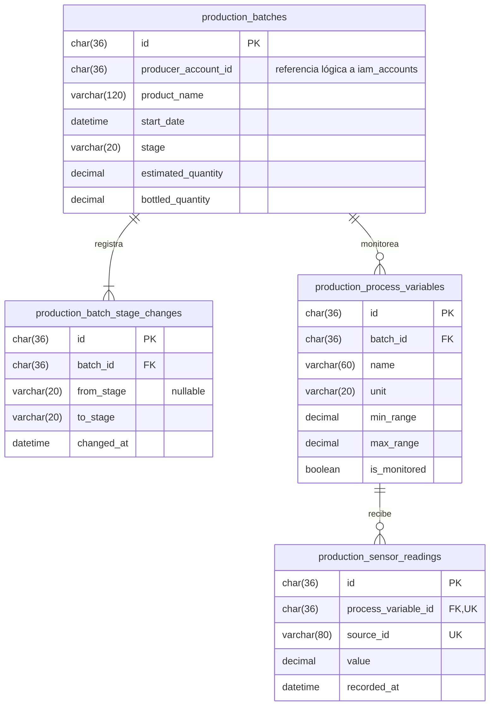
```mermaid
erDiagram
    production_batches ||--|{ production_batch_stage_changes : registra
    production_batches ||--o{ production_process_variables : monitorea
    production_process_variables ||--o{ production_sensor_readings : recibe
    production_batches {
        char(36) id PK
        char(36) producer_account_id "referencia lógica a iam_accounts"
        varchar(120) product_name
        datetime start_date
        varchar(20) stage
        decimal estimated_quantity
        decimal bottled_quantity
    }
    production_batch_stage_changes {
        char(36) id PK
        char(36) batch_id FK
        varchar(20) from_stage "nullable"
        varchar(20) to_stage
        datetime changed_at
    }
    production_process_variables {
        char(36) id PK
        char(36) batch_id FK
        varchar(60) name
        varchar(20) unit
        decimal min_range
        decimal max_range
        boolean is_monitored
    }
    production_sensor_readings {
        char(36) id PK
        char(36) process_variable_id FK, UK
        varchar(80) source_id UK
        decimal value
        datetime recorded_at
    }
```

*Nota.* Elaboración propia en Mermaid (2026).

*Descripción.* El diagrama entidad-relación del contexto Production & Monitoring contiene las tablas `production_batches`, `production_batch_stage_changes`, `production_process_variables`, `production_sensor_readings`, con el tipo de cada columna, sus claves primarias (PK), foráneas (FK) y únicas (UK) y la cardinalidad de las relaciones.


Un lote (`production_batches`) tiene uno o más cambios de etapa (`production_batch_stage_changes`) y cero o más variables de proceso (`production_process_variables`); cada variable recibe cero o más lecturas (`production_sensor_readings`). `from_stage` admite nulo porque el primer registro del lote no tiene etapa previa, y la combinación de variable y `source_id` es única para evitar lecturas duplicadas.

**d. Inventory & Stock Management**

**Figura 81**

*Diagrama entidad-relación del Bounded Context Inventory & Stock Management*

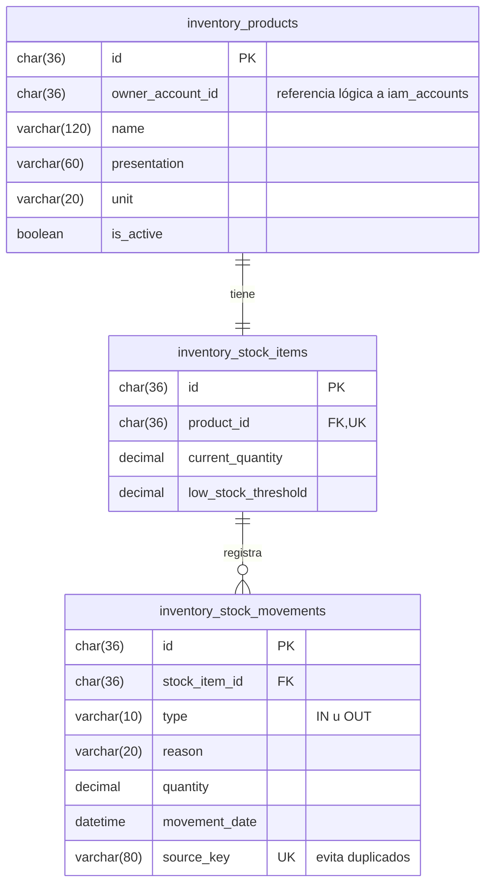
```mermaid
erDiagram
    inventory_products ||--|| inventory_stock_items : tiene
    inventory_stock_items ||--o{ inventory_stock_movements : registra
    inventory_products {
        char(36) id PK
        char(36) owner_account_id "referencia lógica a iam_accounts"
        varchar(120) name
        varchar(60) presentation
        varchar(20) unit
        boolean is_active
    }
    inventory_stock_items {
        char(36) id PK
        char(36) product_id FK, UK
        decimal current_quantity
        decimal low_stock_threshold
    }
    inventory_stock_movements {
        char(36) id PK
        char(36) stock_item_id FK
        varchar(10) type "IN u OUT"
        varchar(20) reason
        decimal quantity
        datetime movement_date
        varchar(80) source_key UK "evita duplicados"
    }
```

*Nota.* Elaboración propia en Mermaid (2026).

*Descripción.* El diagrama entidad-relación del contexto Inventory & Stock Management contiene las tablas `inventory_products`, `inventory_stock_items`, `inventory_stock_movements`, con el tipo de cada columna, sus claves primarias (PK), foráneas (FK) y únicas (UK) y la cardinalidad de las relaciones.


Cada producto (`inventory_products`) tiene un único saldo (`inventory_stock_items`), garantizado por la unicidad de `product_id`, y cada saldo tiene cero o más movimientos (`inventory_stock_movements`). `source_key` es único, de modo que un mismo movimiento no se registra dos veces.

**e. Orders & Replenishment**

**Figura 82**

*Diagrama entidad-relación del Bounded Context Orders & Replenishment*

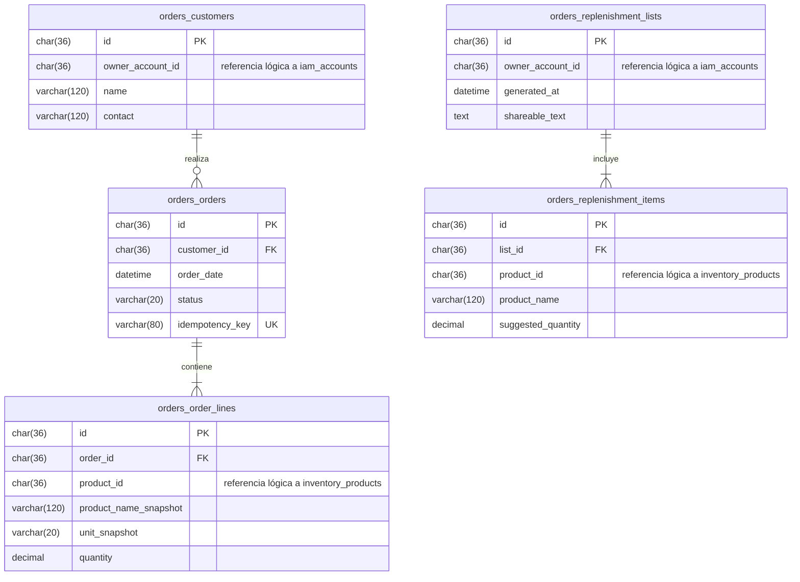
```mermaid
erDiagram
    orders_customers ||--o{ orders_orders : realiza
    orders_orders ||--|{ orders_order_lines : contiene
    orders_replenishment_lists ||--|{ orders_replenishment_items : incluye
    orders_customers {
        char(36) id PK
        char(36) owner_account_id "referencia lógica a iam_accounts"
        varchar(120) name
        varchar(120) contact
    }
    orders_orders {
        char(36) id PK
        char(36) customer_id FK
        datetime order_date
        varchar(20) status
        varchar(80) idempotency_key UK
    }
    orders_order_lines {
        char(36) id PK
        char(36) order_id FK
        char(36) product_id "referencia lógica a inventory_products"
        varchar(120) product_name_snapshot
        varchar(20) unit_snapshot
        decimal quantity
    }
    orders_replenishment_lists {
        char(36) id PK
        char(36) owner_account_id "referencia lógica a iam_accounts"
        datetime generated_at
        text shareable_text
    }
    orders_replenishment_items {
        char(36) id PK
        char(36) list_id FK
        char(36) product_id "referencia lógica a inventory_products"
        varchar(120) product_name
        decimal suggested_quantity
    }
```

*Nota.* Elaboración propia en Mermaid (2026).

*Descripción.* El diagrama entidad-relación del contexto Orders & Replenishment contiene las tablas `orders_customers`, `orders_orders`, `orders_order_lines`, `orders_replenishment_lists`, `orders_replenishment_items`, con el tipo de cada columna, sus claves primarias (PK), foráneas (FK) y únicas (UK) y la cardinalidad de las relaciones.


Un cliente (`orders_customers`) realiza cero o más pedidos (`orders_orders`) y cada pedido contiene una o más líneas (`orders_order_lines`). `idempotency_key` es único para que un reintento no cree dos pedidos, y las líneas conservan el nombre y la unidad del producto al momento de la venta. Las listas de compra (`orders_replenishment_lists`) incluyen uno o más ítems (`orders_replenishment_items`).

**f. Alerts & Notifications**

**Figura 83**

*Diagrama entidad-relación del Bounded Context Alerts & Notifications*

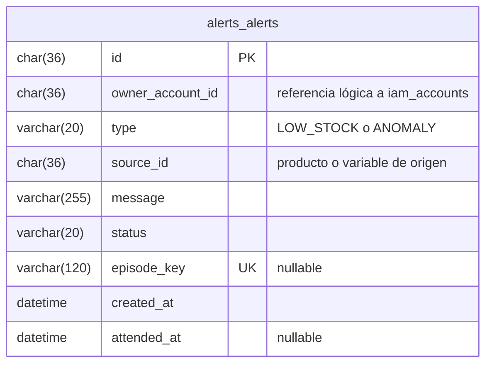
```mermaid
erDiagram
    alerts_alerts {
        char(36) id PK
        char(36) owner_account_id "referencia lógica a iam_accounts"
        varchar(20) type "LOW_STOCK o ANOMALY"
        char(36) source_id "producto o variable de origen"
        varchar(255) message
        varchar(20) status
        varchar(120) episode_key UK "nullable"
        datetime created_at
        datetime attended_at "nullable"
    }
```

*Nota.* Elaboración propia en Mermaid (2026).

*Descripción.* El diagrama entidad-relación del contexto Alerts & Notifications contiene las tablas `alerts_alerts`, con el tipo de cada columna, sus claves primarias (PK), foráneas (FK) y únicas (UK) y la cardinalidad de las relaciones.


La tabla `alerts_alerts` guarda cada alerta con su tipo, el identificador del producto o de la variable de origen y su estado. `episode_key` es único cuando existe, lo que impide abrir dos alertas para el mismo episodio, y `attended_at` admite nulo mientras la alerta está pendiente.

**g. Analytics & Estimations**

**Figura 84**

*Diagrama entidad-relación del Bounded Context Analytics & Estimations*

```mermaid
erDiagram
    analytics_replenishment_estimates {
        char(36) id PK
        char(36) owner_account_id "referencia lógica a iam_accounts"
        char(36) product_id "referencia lógica a inventory_products"
        datetime estimated_date "nullable"
        decimal estimated_quantity
        decimal confidence
        varchar(20) status
        datetime calculated_at
    }
    analytics_historical_indicators {
        char(36) id PK
        char(36) owner_account_id "referencia lógica a iam_accounts"
        varchar(20) period
        varchar(30) metric_type
        decimal value
        datetime generated_at
    }
```

*Nota.* Elaboración propia en Mermaid (2026).

*Descripción.* El diagrama entidad-relación del contexto Analytics & Estimations contiene las tablas `analytics_replenishment_estimates`, `analytics_historical_indicators`, con el tipo de cada columna, sus claves primarias (PK), foráneas (FK) y únicas (UK) y la cardinalidad de las relaciones.


`analytics_replenishment_estimates` guarda cada estimación con su fecha, cantidad, confianza y estado; `estimated_date` admite nulo cuando no hay datos suficientes o no hay demanda. `analytics_historical_indicators` guarda los indicadores por periodo y tipo de métrica. Ambas tablas referencian de forma lógica a la cuenta y al producto.


## Capítulo V: Product Implementation, Validation & Deployment

### 5.1. Software Configuration Management

En esta sección se detallan las decisiones tecnológicas, las herramientas de colaboración y las convenciones de código que sostienen la integridad y la mantenibilidad de Destilatech. Según Bourque y Fairley (2014) en el SWEBOK, la gestión de la configuración del software es necesaria para mantener la visibilidad y el control del producto durante todo su ciclo de vida.

#### 5.1.1. Software Development Environment Configuration


Para el desarrollo del ecosistema de Destilatech, el equipo integró las siguientes herramientas y plataformas, organizadas según su propósito en el ciclo de vida del software:

+ **Project Management**<br>La gestión de proyectos asegura que el desarrollo se entregue dentro de los plazos y presupuestos previstos. Según el Project Management Institute (2021), una gestión efectiva es fundamental para coordinar recursos, mitigar riesgos y alinear el trabajo colaborativo con los objetivos del negocio.<br><br>
  +	**Jira Software:** Herramienta de gestión de proyectos ágil (Atlassian, 2023) que permite planificar y gestionar el trabajo mediante tableros Scrum o Kanban, facilitando la colaboración transparente entre los equipos de desarrollo.<br>https://www.atlassian.com/software/jira<br><br>
  + **Trello:** Herramienta visual basada en tableros Kanban (Atlassian, 2024), utilizada para el tablero de cada Sprint y para organizar el trabajo diario del equipo.<br>https://trello.com/<br><br>

+ **Requirements Management**<br>Implica transformar las necesidades abstractas de los usuarios en requisitos de software medibles. La trazabilidad de estos requisitos garantiza que el producto final no diverja del valor de negocio esperado por los *stakeholders* (Bourque & Fairley, 2014).<br><br>
  + **Jira Software:** En su función de gestión de backlog, permite estructurar Historias de Usuario (*User Stories*) y Épicas, priorizando el trabajo orientado a aportar valor continuo en cada iteración.<br>https://www.atlassian.com/software/jira<br><br>

+ **Product UX/UI Design**<br>El diseño de experiencia (UX) e interfaz (UI) se apoya en el modelo de diseño centrado en el humano (Norman, 2013), buscando optimizar la forma en que los usuarios interactúan con el sistema en momentos de alta carga cognitiva.<br><br>
  + **Figma:** Herramienta colaborativa en la nube para la creación de interfaces y prototipos de alta fidelidad, vital para validar flujos antes del desarrollo de código.<br>https://www.figma.com/ <br><br>
  + **UXPressia:** Plataforma empleada para mapear el *Customer Journey* y construir *User Personas*, traduciendo la investigación cualitativa en artefactos visuales de diseño.<br>https://uxpressia.com/ <br><br>
  + **MIRO:** Tablero digital colaborativo utilizado para las sesiones de *Big Picture Event Storming* y *Domain-Driven Design*.<br>https://miro.com/ <br><br> 
  + **Canva:** Herramienta de diseño gráfico en línea utilizada para la elaboración de la identidad visual de la marca y la estructuración de la presentación final del proyecto.<br>https://www.canva.com/<br><br> 
  + **Structurizr:** Plataforma basada en el modelo C4 para visualizar los contenedores, componentes y contextos delimitados (*Bounded Contexts*) del sistema (Brown, 2018).<br>https://structurizr.com/ <br><br>
  + **Lucidchart:** Herramienta de diagramación empleada para los esquemas lógicos, flujos de base de datos y arquitectura preliminar.<br>https://www.lucidchart.com/<br><br>
  + **PlantUML:** Herramienta de código abierto que implementa *Diagrams as Code*, permitiendo que la arquitectura del sistema evolucione y se versione junto con el código fuente en GitHub.<br>https://plantuml.com/es/<br><br>
  + **Mermaid:** Biblioteca JavaScript utilizada para los diagramas del Capítulo IV (Event Storming de diseño, C4, clases y entidad-relación) mediante sintaxis textual versionable, soportada directamente por GitHub (Mermaid, 2023).<br>https://mermaid.js.org/<br><br>

+ **Software Development**<br>Etapa donde se materializa la arquitectura de software. Se seleccionaron lenguajes y marcos de trabajo (*frameworks*) de uso extendido en la industria para garantizar la mantenibilidad y la fiabilidad del sistema.<br><br> 
  + **GitHub:** Plataforma base para el control de versiones distribuido mediante Git, permitiendo la integración y revisión de código asíncrona.<br>https://github.com/ <br><br> 
  + **Visual Studio Code:** Editor de código fuente ligero y versátil (Microsoft, 2024a), utilizado por parte del equipo gracias a su amplio ecosistema de extensiones para múltiples lenguajes.<br>https://code.visualstudio.com/ <br><br>
  + **JetBrains Rider:** Entorno de Desarrollo Integrado (IDE) multiplataforma y de alto rendimiento (JetBrains, 2024a), utilizado como herramienta principal para el desarrollo de la lógica de negocio y la API en C# / .NET.<br>https://www.jetbrains.com/rider/<br><br>
  + **JetBrains WebStorm:** IDE especializado en el desarrollo web moderno (JetBrains, 2024b), empleado para la programación y depuración de todo el ecosistema frontend con Vue.js y JavaScript.<br>https://www.jetbrains.com/webstorm/<br><br>
  + **HTML & CSS:** Lenguajes estándar web utilizados para estructurar el contenido (HTML) y definir la apariencia y diseño visual (CSS) de la Landing Page y la Web App.<br>https://developer.mozilla.org/es/docs/Web/HTML<br><br> 
  + **JavaScript:** Lenguaje del cliente web, utilizado en la landing page (JavaScript puro) y en la aplicación web (Vue.js).<br>https://developer.mozilla.org/es/docs/Web/JavaScript<br><br>
  + **Vue.js y PrimeVue:** Framework progresivo para construir la interfaz de la aplicación web y biblioteca de componentes visuales.<br>https://vuejs.org/ · https://primevue.org/<br><br>
  + **C# y ASP.NET Core:** Lenguaje y marco de trabajo del servicio REST (API), con Entity Framework Core para el acceso a datos.<br>https://learn.microsoft.com/es-es/aspnet/core/<br><br>
  + **MySQL:** Sistema de gestión de base de datos relacional que almacena los datos operativos.<br>https://www.mysql.com/<br><br>

+ **Software Testing**<br>La evaluación de la calidad del software garantiza que la solución cumpla los criterios de aceptación acordados.<br><br> 
  + **Lenguaje Gherkin (Cucumber):** Lenguaje de dominio (DSL) implementado para el *Behavior-Driven Development* (BDD) (Smart, 2014). Permite traducir criterios de aceptación en pruebas legibles por negocio mediante sintaxis *Given-When-Then*.<br>https://cucumber.io/<br><br> 

+ **Software Deployment**<br>Consiste en la automatización y alojamiento de los artefactos compilados para su consumo público.<br><br> 
  + **Github Pages:** Servicio de *hosting* estático aprovechado para el despliegue automático de la *Landing Page* institucional.<br>https://pages.github.com/ <br><br>

+ **Software Documentation**<br>Mantenimiento de la información técnica esencial para reducir la curva de aprendizaje de nuevos desarrolladores e interesados en el proyecto.<br><br> 
  + **Markdown:** Lenguaje de marcado ligero, pilar de la documentación técnica moderna en repositorios, facilitando legibilidad humana y renderización web.<br>https://www.markdownguide.org/getting-started/<br><br>
  + **Microsoft Office 365:** Suite colaborativa en la nube para la gestión del reporte académico final y documentación adjunta.<br>https://www.microsoft.com/microsoft-365<br><br>


#### 5.1.2. Source Code Management

El código se versiona con Git y se aloja en GitHub, dentro de la organización del curso. El equipo usa dos repositorios: uno para el informe (documentación) y otro para la landing page.

| Repositorio | Contenido | Enlace |
| :--- | :--- | :--- |
| destilatech-report | Informe del trabajo final (README, imágenes y diagramas). | [https://github.com/upc-pre-202620-1ASI0730-2620-8084-desti/destilatech-report](https://github.com/upc-pre-202620-1ASI0730-2620-8084-desti/destilatech-report) |
| destilatech-website | Landing page (HTML, CSS y JavaScript). | [https://github.com/upc-pre-202620-1ASI0730-2620-8084-desti/destilatech-website](https://github.com/upc-pre-202620-1ASI0730-2620-8084-desti/destilatech-website) |

**Sitio publicado (landing page):** [https://upc-pre-202620-1asi0730-2620-8084-desti.github.io/destilatech-website/](https://upc-pre-202620-1asi0730-2620-8084-desti.github.io/destilatech-website/)

**Figura 85**

*Landing page publicada en GitHub Pages*

<p align="center">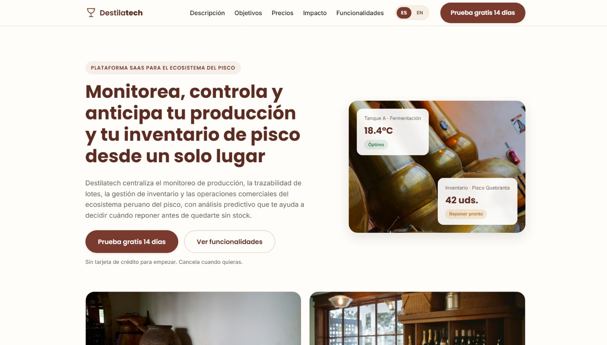</p>

*Nota.* Captura propia del sitio publicado (2026).

*Descripción.* Captura de la sección inicial de la landing page de Destilatech: encabezado con logotipo, menú de secciones, selector de idioma ES / EN y botón «Prueba gratis 14 días»; título «Monitorea, controla y anticipa tu producción y tu inventario de pisco desde un solo lugar», dos botones de acción y, a la derecha, una fotografía de botellas con tarjetas de temperatura (18.4 °C, Óptimo) e inventario (42 uds., Reponer pronto).


**Flujo de trabajo: GitFlow**

El equipo aplica el flujo de trabajo GitFlow (Driessen, 2010). Cada rama tiene un propósito definido:

| Rama | Propósito | Se crea desde | Se integra en |
| :--- | :--- | :--- | :--- |
| `main` | Versión estable y publicada. Cada integración en `main` corresponde a una versión etiquetada. | — | — |
| `develop` | Rama de integración del trabajo del equipo. | `main` | `main` (mediante `release/*`) |
| `feature/<nombre>` | Una funcionalidad o sección del informe (por ejemplo, `feature/product-design`). | `develop` | `develop` (mediante Pull Request) |
| `release/<versión>` | Preparación de una versión: revisión final y corrección de detalles menores. | `develop` | `main` y `develop` |
| `hotfix/<descripción>` | Corrección urgente de un error detectado en `main`. | `main` | `main` y `develop` |

Los cambios llegan a `develop` y a `main` mediante Pull Requests revisadas por otro integrante del equipo.

**Conventional Commits**

Los mensajes de commit siguen la especificación Conventional Commits (s. f.), con el formato `<tipo>(<ámbito opcional>): <descripción>`, y un cuerpo opcional que explica el motivo del cambio. Los tipos que usa el equipo son:

| Tipo | Uso |
| :--- | :--- |
| `feat` | Nueva funcionalidad o sección. |
| `fix` | Corrección de un error. |
| `docs` | Cambios en documentación. |
| `style` | Cambios de formato o estilo que no alteran el comportamiento. |
| `refactor` | Reorganización del código sin cambiar su comportamiento. |
| `test` | Pruebas. |
| `chore` | Tareas de mantenimiento. |

**Semantic Versioning**

Las versiones del informe y del software siguen el versionado semántico (Preston-Werner, 2013), con el formato `MAJOR.MINOR.PATCH`: se incrementa `MAJOR` ante un cambio incompatible, `MINOR` al añadir funcionalidad compatible y `PATCH` al corregir errores. La versión del informe se registra en el *Registro de Versiones* al inicio de este documento.

**Figura 86**

*Ramas del repositorio del informe*

<p align="center">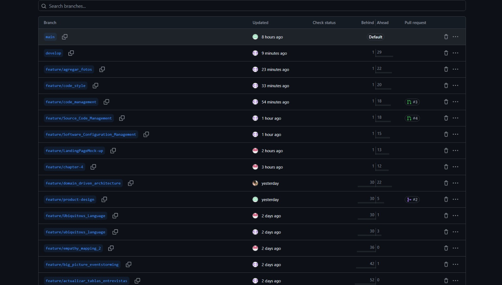</p>

*Nota.* Captura de GitHub (2026).

*Descripción.* Listado de ramas del repositorio con las columnas de actualización, estado de las verificaciones, commits por detrás y por delante de la rama por defecto, y Pull Request asociada. Aparecen la rama por defecto `main`, la rama de integración `develop` y varias ramas `feature/*` con nombres descriptivos (por ejemplo `feature/product-design`, `feature/domain_driven_architecture` y `feature/chapter-4`). Algunas ramas muestran Pull Requests asociadas, numeradas #2, #3 y #4.


#### 5.1.3. Source Code Style Guide & Conventions

Esta sección define las reglas de codificación y nomenclatura definidas por el equipo de trabajo que serán aplicadas en Destilatech. De esta manera, el grupo asegura la conservación de la legibilidad, mantenibilidad y escalabilidad en las etapas de desarrollo de la solución.

El proyecto utilizará HTML, CSS, JavaScript, C# y Gherkin con el propósito de favorecer la implementación y validación de comportamiento. Para el código fuente, el idioma empleado será el inglés y se respetará el uso de estándares tecnológicos oficiales.

##### 5.1.3.1 Principios generales para todos los lenguajes

###### 5.1.3.1.1 Nomenclatura obligatoria en inglés

Todo el código (variables, clases, comentarios y, a partir del siguiente sprint, mensajes de commit) debe ser redactado en inglés.

Reglas transversales:

- Los nombres deben ser descriptivos y orientados al dominio.
- Las abreviaciones ambiguas (`tmp`, `obj`, `val`) están prohibidas a excepción de tratarse de contextos locales muy acotados.
- La semántica del nombre debe anticipar su responsabilidad y tipo de dato.
- Los nombres de una sola letra se reservan para iteradores de alcance corto (`i`, `j`) o coordenadas matemáticas (`x`, `y`, `z`).

###### 5.1.3.1.2 Formato base de código

- Los archivos serán guardados en UTF-8.
- Las líneas de código excesivamente largas serán evitadas, debido a que se prioriza la legibilidad.
- Los comentarios serán usados para la documentación técnica de las clases y métodos complejos.

###### 5.1.3.1.3 Convenciones de estilo por tecnología

Cada lenguaje conserva su convención estándar:

- HTML, CSS y JavaScript: guías de estilo de Google (s. f.-a, s. f.-b), documentación de MDN Web Docs (s. f.) y la guía de estilo oficial de Vue.js (Vue.js, 2024).
- C#: convenciones de código de Microsoft (2024b) y del ecosistema ASP.NET Core.
- Gherkin: referencia de Cucumber (s. f.), con enfoque de legibilidad y comportamiento orientado al negocio.

##### 5.1.3.2 Convenciones para HTML

Se adoptará HTML5 con el objetivo de buscar un enfoque semántico y accesible.

###### 5.1.3.2.1 Estructura y sintaxis

- Es necesario declarar `<!doctype html>` al inicio.
- Se requiere escribir etiquetas y atributos en minúsculas.
- Se necesita el uso de comillas dobles para valores de atributos.

###### 5.1.3.2.2 Semántica y accesibilidad

- Se requerirá del uso de elementos semánticos (`header`, `main`, `nav`, `section`, `article`, `footer`) en lugar de `div` sin propósito.
- Se prefiere evitar controladores *inline* (`onclick`, `onchange`), debido a que se busca que la lógica sea delegada a los eventos de Vue.js (`@click`, `@change`).
- Se exige la inclusión de texto alternativo significativo en imágenes.
- Se desea asociar etiquetas y controles de formulario (`label` + `for`).

Ejemplo recomendado:

```html
<!doctype html>
<html lang="en">
  <head>
    <meta charset="utf-8">
    <meta name="viewport" content="width=device-width, initial-scale=1">
    <title>Account Settings</title>
  </head>
  <body>
    <main>
      <h1>Account Settings</h1>
      
      <a href="/comments">All comments</a>
    </main>
  </body>
</html>
```

##### 5.1.3.3 Convenciones para CSS

Se adopta CSS con enfoque mantenible, predecible y escalable.

###### 5.1.3.3.1 Nomenclatura

- Se exige nomenclatura de clases en inglés y formato `kebab-case`.
- Se prioriza semántica de componente/rol (`checkout-form`, `product-card-title`).
- Se busca evitar nombres crípticos (`.rg`, `.x`, `.blueText`).

###### 5.1.3.3.2 Reglas de estilo

- Se requiere del uso de un espacio después de `:` en cada declaración.
- Se necesita finalizar cada declaración con `;`.
- Se sugiere usar las llaves de apertura en la misma línea del selector.
- Se recomienda evitar la sentencia `!important` salvo justificación técnica documentada.

Ejemplo recomendado:

```css
.checkout-form {
  padding: 0 1rem 1.5rem;
  border-top: 0;
}

.checkout-form__title {
  margin-bottom: 0.75rem;
  font: 600 1.25rem/1.4 "Poppins", sans-serif;
}
```

Complementación conveniente:

- Se recomienda el uso de unidades relativas (`rem`, `%`) con el propósito de mejorar la escalabilidad y accesibilidad.
- Se sugiere realizar la estandarización de la paleta de colores y espaciados mediante variables CSS (`:root { --color-primary: ... }`).

##### 5.1.3.4 Convenciones para JavaScript

Se adopta JavaScript moderno (ES2022 o superior) como lenguaje del cliente web, tanto en la landing page como en la aplicación Vue.js.

###### 5.1.3.4.1 Nomenclatura y estructura

- Se exige el uso de identificadores en inglés.
- Se sugiere la denominación de variables y funciones en `camelCase`.
- Se sugiere la denominación de clases y constructores en `PascalCase`.
- Se recomienda la denominación de constantes globales en `UPPER_SNAKE_CASE`.

###### 5.1.3.4.2 Reglas de codificación

- Preferir el uso de la igualdad estricta (`===`, `!==`).
- Dejar espacios alrededor de operadores y después de comas.
- Incorporar el uso del punto y coma al final de sentencias.
- Usar comillas simples por defecto; reservar *template literals* (``) para interpolación.
- Manejar errores de forma explícita (`try/catch` o propagación controlada).

###### 5.1.3.4.3 Reglas específicas para Vue.js

- Documentar con JSDoc los contratos de datos que intercambia la API cuando no sean evidentes.
- Mantener el uso de componentes con una sola responsabilidad.
- Nombrar archivos de Vue.js siguiendo la convención *Single File Component (SFC)* en `PascalCase` (`BatchDashboard.vue`, `MetricCard.vue`).
- Evitar lógica compleja en templates HTML; mover cálculos y transformaciones a propiedades computadas (`computed`) o al store global (`Pinia`).

Ejemplo recomendado:

```js
const MAX_RETRY_ATTEMPTS = 3;

function calculateSquare(value) {
  return value * value;
}

function getGreeting(hour) {
  if (hour < 20) {
    return 'Good day';
  }

  return 'Good evening';
}
```

##### 5.1.3.5 Convenciones para C# y .NET

Se adoptan las convenciones oficiales de Microsoft y buenas prácticas compatibles con ASP.NET Core.

###### 5.1.3.5.1 Nomenclatura

Todos los nombres serán escritos en el idioma inglés.

- Las clases, registros (*records*), métodos, propiedades y eventos serán denominados bajo `PascalCase`.
- Las variables locales y parámetros de métodos serán nombrados bajo `camelCase`.
- Los campos privados de una clase deben llevar el prefijo guion bajo (`_camelCase`) para distinguirlos rápidamente de las variables locales.
- En las interfaces, el prefijo `I` es **obligatorio** (`IOrderRepository`, `IPaymentService`).

###### 5.1.3.5.2 Formato y prácticas

- Se exige el uso de llaves `{}` en líneas separadas (convención Allman).
- Se exige que los métodos posean una responsabilidad única y clara.
- Las clases de servicio y repositorios requieren nombres orientados al modelo de dominio.
- Los métodos asíncronos obligatoriamente deben llevar el sufijo `Async` (Ej. `SaveDataAsync`).

Ejemplo recomendado:

```csharp
public class OrderService
{
    private readonly IOrderRepository _orderRepository;

    public OrderService(IOrderRepository orderRepository)
    {
        _orderRepository = orderRepository;
    }

    public async Task<Order?> FindByIdAsync(Guid orderId)
    {
        if (orderId == Guid.Empty)
        {
            return null;
        }

        return await _orderRepository.FindByIdAsync(orderId);
    }
}
```

##### 5.1.3.6 Convenciones para Gherkin

Gherkin se utiliza para especificaciones legibles por negocio y equipo técnico.

###### 5.1.3.6.1 Reglas de legibilidad

- Los escenarios presentan estructura clara, mediante la denominación `Given-When-Then`.
- La sentencia `And` se usa para continuidad lógica dentro del mismo bloque.
- Se exigen *steps* concretos, observables y sin ruido irrelevante.
- Cuando un *step* requiere una tabla de datos, debe finalizar con `:`.
- Se recomienda dejar líneas en blanco entre escenarios para facilitar su lectura.

Ejemplo recomendado:

```gherkin
Feature: Contact channels

  Scenario: Visitor sends a contact form request
    Given the visitor provides the following data:
      | field   | value               |
      | name    | Ana Torres          |
      | email   | ana@example.com     |
      | message | I need more details |
    When the visitor submits the form
    Then the system confirms the request was received
```

Estas referencias serán aplicadas de manera complementaria. Si existiera conflicto entre guías, se priorizará la convención oficial de Microsoft (.NET) o de Vue.js según el módulo implementado.

#### 5.1.4. Software Deployment Configuration

Esta sección describe cómo se publica la landing page. La landing page es un sitio estático (HTML, CSS y JavaScript), por lo que se despliega en **GitHub Pages**, un servicio de alojamiento gratuito integrado con el repositorio. El despliegue de la aplicación web y de la API se documentará cuando se implementen.

**URL de producción:** [https://upc-pre-202620-1asi0730-2620-8084-desti.github.io/destilatech-website/](https://upc-pre-202620-1asi0730-2620-8084-desti.github.io/destilatech-website/)

##### 5.1.4.1. Landing Page

Pasos realizados para publicar la landing page:

**Figura 87**

*Despliegue en GitHub Pages, paso 1. Ingresamos al repositorio de la landing page*

<p align="center">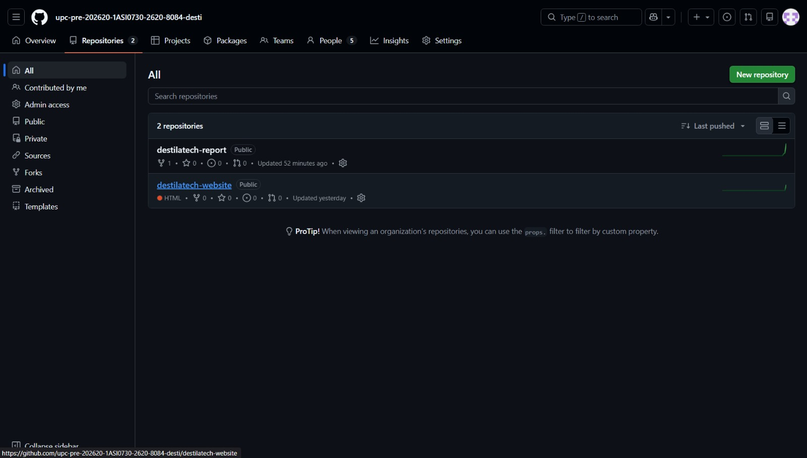</p>

*Nota.* Captura de GitHub (2026).

*Descripción.* Página de la organización en GitHub con el listado «All» de repositorios. Se ven dos repositorios públicos: `destilatech-report` (actualizado hace 52 minutos) y `destilatech-website` (HTML, actualizado el día anterior), este último resaltado.


**Figura 88**

*Despliegue en GitHub Pages, paso 2. Abrimos el repositorio y su configuración*

<p align="center">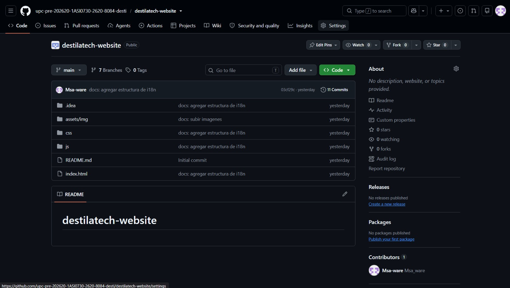</p>

*Nota.* Captura de GitHub (2026).

*Descripción.* Página principal del repositorio `destilatech-website`: rama `main`, 7 ramas, 11 commits y los archivos `.idea`, `assets/img`, `css`, `js`, `README.md` e `index.html`. En la barra superior se resalta la pestaña Settings.


**Figura 89**

*Despliegue en GitHub Pages, paso 3. Ingresamos a la sección Pages*

<p align="center">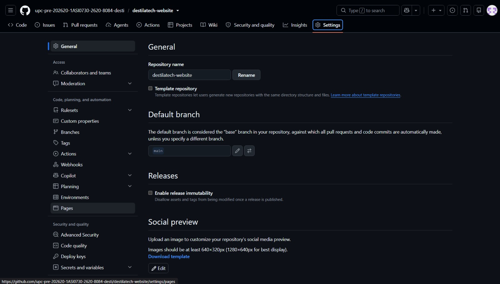</p>

*Nota.* Captura de GitHub (2026).

*Descripción.* Página Settings > General del repositorio, con el nombre del repositorio, la rama por defecto `main` y la opción Pages resaltada en el menú lateral izquierdo.


**Figura 90**

*Despliegue en GitHub Pages, paso 4. Seleccionamos la rama de origen y guardamos*

<p align="center">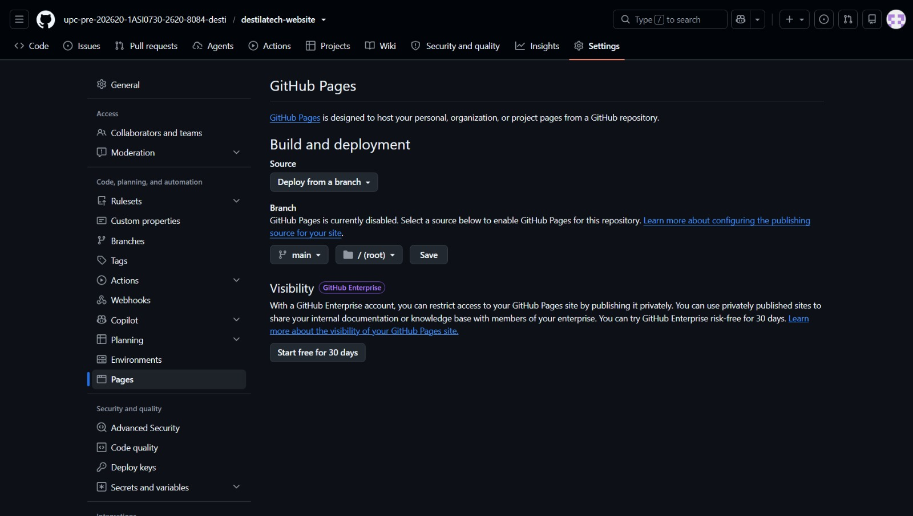</p>

*Nota.* Captura de GitHub (2026).

*Descripción.* Sección GitHub Pages en Build and deployment: la fuente es «Deploy from a branch», la rama seleccionada es `main` con la carpeta `/ (root)` y el botón Save. El texto indica que GitHub Pages aún está deshabilitado antes de guardar.


**Figura 91**

*Despliegue en GitHub Pages, paso 5. Verificamos el despliegue*

<p align="center">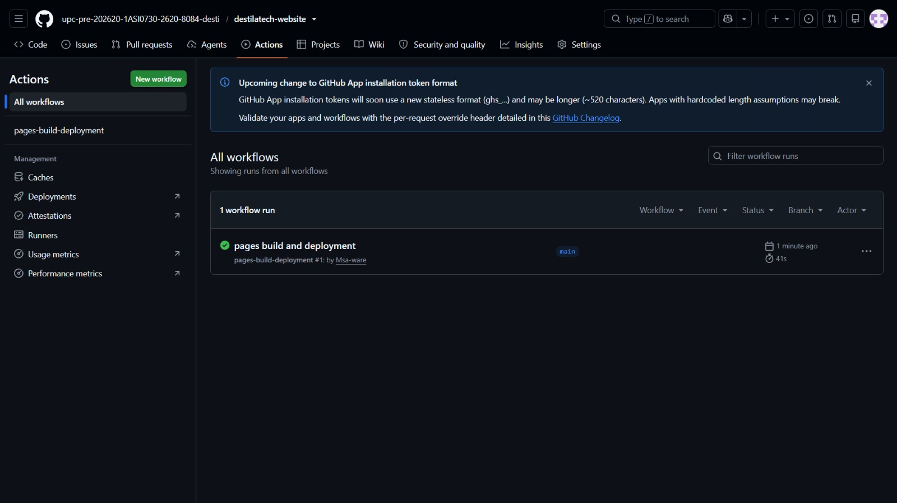</p>

*Nota.* Captura de GitHub (2026).

*Descripción.* Pestaña Actions del repositorio con el flujo de trabajo `pages build and deployment` ejecutado correctamente sobre la rama `main` en 41 segundos.


GitHub Pages usa la rama `main` como origen de producción: cada integración en `main` vuelve a publicar el sitio mediante el flujo de trabajo automático `pages build and deployment`, que se ejecuta sin configuración adicional y tarda menos de un minuto.

##### 5.1.4.2. Web Application

La aplicación web es una SPA construida con Vue 3 y Vite, por lo que se compila a archivos estáticos que se pueden alojar en cualquier servicio de hosting estático. La configuración de compilación está en el repositorio [destilatech-webapp](https://github.com/upc-pre-202620-1ASI0730-2620-8084-desti/destilatech-webapp):

- **Compilación:** `npm run build` genera la carpeta `dist/` (`index.html` y `assets/`) usando las variables de `.env.production`.
- **API en producción:** mientras no exista el *backend*, `.env.production` apunta a un CRUD API de Beeceptor (`https://<endpoint>.free.beeceptor.com/api/v1`); en desarrollo, `.env.development` apunta al Fake API local (`http://localhost:3000/api/v1`).
- **Enlace con la landing page:** la variable `VITE_LANDING_PAGE_URL` apunta a la landing page publicada y la landing page enlaza al registro de la aplicación (`/registro?plan=...`).
- **Estado:** al cierre del Sprint 2 la aplicación web aún no está desplegada en un servicio público; la URL se registrará en la sección 5.2.2.7 cuando se publique.

### 5.2. Landing Page, Services & Applications Implementation

El trabajo de implementación se organiza en Sprints. El **Sprint 1** implementa y publica la primera versión de la landing page de Destilatech; la investigación, la especificación y el diseño que lo preceden se documentan en los capítulos I a IV. Cada sprint se documenta con las secciones del Sprint Planning, la matriz de líderes y colaboradores, el Sprint Backlog, las evidencias de desarrollo, ejecución, documentación de servicios y despliegue, y los analíticos de colaboración.

#### 5.2.1. Sprint 1

##### 5.2.1.1. Sprint Planning 1

El Sprint 1 se dedicó a implementar y publicar la primera versión de la landing page, con el fin de presentar la propuesta de valor de Destilatech a productores y comercializadores. El desarrollo de la aplicación web y del backend se reservó para sprints posteriores.

**Tabla 13**

*Resumen de la reunión de Sprint Planning 1*

| Sprint # | Sprint 1 |
| :--- | :--- |
| **Antecedentes de la planificación** | Con la investigación de usuarios, la especificación de requisitos, la guía de estilo y los diseños de la landing page concluidos (capítulos I a IV del informe), el equipo decidió que el primer producto en construir sería la landing page, para validar la propuesta de valor y abrir un canal de contacto con los prospectos. |
| **Fecha** | 2026-09-15 |
| **Hora** | 11:00 AM |
| **Ubicación** | Reunión virtual (Discord) |
| **Preparada por** | Santiago Atanacio, Jairo Mathias |
| **Asistentes** | Fernandez Seer, Mario Alonso; Santiago Atanacio, Jairo Mathias; Almandroz Carbajal, Pierina Marysabel; Condor Sandoval, Jean Pierre; Domenack Angeles, Miguel |
| **Sprint -1 Review Summary** | No aplica: es el primer sprint. |
| **Sprint -1 Retrospective Summary** | No aplica: es el primer sprint. |
| **Sprint 1 Goal** | *Our focus is on* que los productores de pisco y los pequeños comercializadores puedan conocer qué es Destilatech, qué beneficios les ofrece, cuánto cuestan sus planes y cómo comenzar la prueba gratuita de 14 días, desde su teléfono o su computadora. *We believe it delivers* claridad sobre la propuesta de valor y confianza para evaluar la plataforma antes de registrarse, sin necesidad de contactar a un asesor. *This will be confirmed when* un visitante de cada segmento, desde su teléfono o su computadora, pueda explicar qué hace Destilatech, identificar el plan que le corresponde y llegar al registro de la prueba gratuita. |
| **Sprint 1 Velocity** | 20 horas de trabajo planificadas por el equipo. |
| **Sum of Story Points** | 18 Story Points (US30 a US37). |

##### 5.2.1.2. Aspect Leaders and Collaborators

En el Sprint 1 los aspectos son las secciones de la landing page (épica EP09) y su adaptabilidad móvil. El líder de cada aspecto es el responsable de las tareas correspondientes en la sección 5.2.1.3.

| Team Member (Last Name, First Name) | GitHub Username | Header (US30) | Description (US31) | Goals (US32) | Pricing (US33) | Impact (US34) | Platform Features (US35) | Footer (US36) | Responsive Design (US37) |
| :--- | :--- | :---: | :---: | :---: | :---: | :---: | :---: | :---: | :---: |
| Fernandez Seer, Mario Alonso | MrBaru | C | C | C | L | L | C | C | C |
| Santiago Atanacio, Jairo Mathias | Msa-ware | L | C | C | C | C | C | L | C |
| Almandroz Carbajal, Pierina Marysabel | pierinaaa29 | C | C | C | C | C | L | C | C |
| Condor Sandoval, Jean Pierre | jeanpcs | C | L | L | C | C | C | C | C |
| Domenack Angeles, Miguel | midoan0805 | C | C | C | C | C | C | C | L |

**Leyenda:** L = Líder (*Leader*); C = Colaborador (*Collaborator*). Cada aspecto tiene un solo líder, que coincide con el responsable de la tarea correspondiente en el Sprint Backlog.

##### 5.2.1.3. Sprint Backlog 1

El objetivo del Sprint 1 es que los visitantes de ambos segmentos entiendan la propuesta de valor de Destilatech y puedan iniciar su prueba gratuita; para lograrlo se publica la versión inicial de la landing page. Cada sección de la página se asignó a un integrante, de modo que todos participaran en la implementación.

**Tablero del equipo en Trello:** [https://trello.com/b/4HZaQ3o7/destilatech-app-web](https://trello.com/b/4HZaQ3o7/destilatech-app-web) (columnas To Do, In Process, To Review y Done)

**Figura 92**

*Tablero del Sprint 1 en Trello*

<p align="center">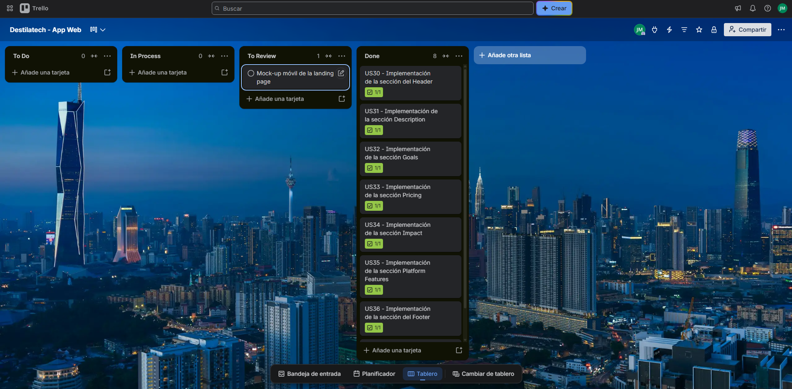</p>

*Nota.* Captura propia de Trello (2026). Tablero disponible en [https://trello.com/b/4HZaQ3o7/destilatech-app-web](https://trello.com/b/4HZaQ3o7/destilatech-app-web).

*Descripción.* El tablero «Destilatech - App Web» organiza el trabajo en cuatro columnas. To Do e In Process están vacías (0 tarjetas); To Review contiene la tarjeta «Mock-up móvil de la landing page» (1 tarjeta) y Done concentra las 8 tarjetas de las historias de usuario US30 a US37 (Header, Description, Goals, Pricing, Impact, Platform Features, Footer y Responsive Design; esta última queda oculta bajo el desplazamiento de la columna), cada una con su lista de verificación completada (1/1).


**Tabla 14**

*Sprint Backlog 1*

| User Story Id | User Story Title | Task Id | Task Title | Description | Estimation (Hours) | Assigned To | Status |
| :--- | :--- | :--- | :--- | :--- | :---: | :--- | :---: |
| **US30** | Navegar desde el encabezado (Header) | TK-01 | Header Markup and Styles | Estructura HTML y estilos CSS del Header con el logotipo | 1 | Santiago Atanacio, Jairo Mathias | Done |
| **US30** | Navegar desde el encabezado (Header) | TK-02 | Header Navigation | Enlaces de navegación hacia las secciones de la página | 1 | Santiago Atanacio, Jairo Mathias | Done |
| **US31** | Entender qué es Destilatech (sección Description) | TK-03 | Description Markup and Styles | Estructura HTML y estilos CSS de la sección Description | 1 | Condor Sandoval, Jean Pierre | Done |
| **US31** | Entender qué es Destilatech (sección Description) | TK-04 | Description Content | Textos que explican qué es Destilatech | 1 | Condor Sandoval, Jean Pierre | Done |
| **US32** | Conocer los beneficios principales (sección Goals) | TK-05 | Goals Markup and Styles | Estructura HTML y estilos CSS de la sección Goals | 1 | Condor Sandoval, Jean Pierre | Done |
| **US32** | Conocer los beneficios principales (sección Goals) | TK-06 | Goals Content | Contenido de los beneficios principales de la plataforma | 1 | Condor Sandoval, Jean Pierre | Done |
| **US33** | Comparar planes de suscripción (sección Pricing) | TK-07 | Pricing Cards Layout | Tarjetas de los planes de suscripción y sus estilos | 2 | Fernandez Seer, Mario Alonso | Done |
| **US33** | Comparar planes de suscripción (sección Pricing) | TK-08 | Free Trial Highlight | Destacado de la prueba gratuita de 14 días y llamada a la acción | 1 | Fernandez Seer, Mario Alonso | Done |
| **US34** | Ver cifras del sector (sección Impact) | TK-09 | Impact Layout | Estructura y estilos de la sección Impact | 1 | Fernandez Seer, Mario Alonso | Done |
| **US34** | Ver cifras del sector (sección Impact) | TK-10 | Impact Figures | Cifras del sector pisquero peruano | 1 | Fernandez Seer, Mario Alonso | Done |
| **US35** | Conocer las funcionalidades por segmento (sección Platform Features) | TK-11 | Platform Features Layout | Estructura y estilos de la sección Platform Features | 2 | Almandroz Carbajal, Pierina Marysabel | Done |
| **US35** | Conocer las funcionalidades por segmento (sección Platform Features) | TK-12 | Features by Segment Content | Funcionalidades presentadas por segmento objetivo | 1 | Almandroz Carbajal, Pierina Marysabel | Done |
| **US36** | Encontrar contacto y enlaces en el pie de página (Footer) | TK-13 | Footer Layout | Estructura y estilos de la sección Footer | 0.5 | Santiago Atanacio, Jairo Mathias | Done |
| **US36** | Encontrar contacto y enlaces en el pie de página (Footer) | TK-14 | Footer Links and Contact | Datos de contacto y enlaces del pie de página | 0.5 | Santiago Atanacio, Jairo Mathias | Done |
| **US37** | Usar la landing page en cualquier dispositivo (adaptabilidad móvil) | TK-15 | Responsive Design | Implementación de la adaptabilidad móvil de todas las secciones | 3 | Domenack Angeles, Miguel | Done |
| **US37** | Usar la landing page en cualquier dispositivo (adaptabilidad móvil) | TK-16 | Mock-up móvil de la landing page | Diseño del mock-up de la landing page para smartphone, como referencia visual de la adaptabilidad móvil | 2 | Fernandez Seer, Mario Alonso | To Review |

**Observación.** Cada historia se descompone en al menos dos tareas, que se registran como una checklist dentro de su tarjeta en Trello; las dos tareas de una misma historia las ejecuta el responsable del aspecto. La tarea TK-16 es de apoyo a la historia US37 y no modifica su responsable: el líder del aspecto Responsive Design sigue siendo Domenack Angeles, Miguel. Al cierre del tablero (Figura 92) se encuentra en la columna To Review, pendiente de revisión por el equipo.

##### 5.2.1.4. Development Evidence for Sprint Review

Durante el Sprint 1 se implementaron en el repositorio [destilatech-website](https://github.com/upc-pre-202620-1ASI0730-2620-8084-desti/destilatech-website) la estructura HTML, los estilos, la adaptabilidad móvil, el ícono del logotipo, las pestañas de funcionalidades por segmento y la estructura base de internacionalización (i18n). La tabla lista los commits en orden cronológico.

**Tabla 15**

*Commits del repositorio de la landing page*

| Repository | Branch | Commit Id | Commit Message | Commit Message Body | Committed on (Date) |
| :--- | :--- | :--- | :--- | :--- | :---: |
| `upc-pre-202620-1ASI0730-2620-8084-desti/destilatech-website` | main | `6f9d1f4` | Initial commit | — | 2026-09-04 |
| `upc-pre-202620-1ASI0730-2620-8084-desti/destilatech-website` | main | `a524f80` | docs: subir imagenes a assets | — | 2026-09-05 |
| `upc-pre-202620-1ASI0730-2620-8084-desti/destilatech-website` | main | `a438143` | docs: eliminando | — | 2026-09-05 |
| `upc-pre-202620-1ASI0730-2620-8084-desti/destilatech-website` | main | `a1d574c` | docs: subir imagenes | — | 2026-09-06 |
| `upc-pre-202620-1ASI0730-2620-8084-desti/destilatech-website` | main | `9e034db` | docs: agregar parte del index, js | — | 2026-09-08 |
| `upc-pre-202620-1ASI0730-2620-8084-desti/destilatech-website` | main | `9ff557f` | docs: eliminando | — | 2026-09-08 |
| `upc-pre-202620-1ASI0730-2620-8084-desti/destilatech-website` | main | `5d16532` | docs: subiendo archuvi html, js y css | — | 2026-09-10 |
| `upc-pre-202620-1ASI0730-2620-8084-desti/destilatech-website` | main | `5be25df` | docs: agregar estrucutra de responsive design | — | 2026-09-12 |
| `upc-pre-202620-1ASI0730-2620-8084-desti/destilatech-website` | main | `f521716` | docs: agregar estructura de logo-icon | — | 2026-09-14 |
| `upc-pre-202620-1ASI0730-2620-8084-desti/destilatech-website` | main | `70141ff` | docs: agregar estructura de platform feature tabs | — | 2026-09-16 |
| `upc-pre-202620-1ASI0730-2620-8084-desti/destilatech-website` | main | `03cf29c` | docs: agregar estructura de i18n | — | 2026-09-18 |

**Observaciones sobre los commits.** Los mensajes de este sprint están redactados en español y usan el tipo `docs`, aunque la mayoría de los cambios corresponde a funcionalidad (`feat`) o estilos (`style`). Los mensajes se conservan tal como quedaron registrados en GitHub; a partir del siguiente sprint el equipo aplicará la convención de la sección 5.1.2 (tipo adecuado y descripción en inglés). La estructura base de i18n se inició en este sprint, pero la historia US52 (cambio de idioma) no forma parte del Sprint Backlog 1.

**Commits del repositorio del informe.** Durante el mismo periodo el equipo avanzó en el informe, que se registra en el repositorio [destilatech-report](https://github.com/upc-pre-202620-1ASI0730-2620-8084-desti/destilatech-report). El equipo trabajó con ramas `feature/*` integradas en `develop` mediante Pull Requests, como se describe en la sección 5.1.2. La tabla siguiente reúne los commits visibles en el historial de GitHub de cada rama; cuando un commit aparece en varias ramas por compartir historial, se registra una sola vez, en la primera rama donde se observó.

El historial de GitHub no muestra el cuerpo del mensaje de los commits, por lo que esa columna se indica con «—».

**Tabla 16**

*Commits del repositorio del informe*

| Repository | Branch | Commit Id | Commit Message | Commit Message Body | Committed on (Date) |
| :--- | :--- | :--- | :--- | :--- | :---: |
| destilatech-report | `feature/agregar-entrevistas-o-fix/corregir-readme` | [`a56bac5`](https://github.com/upc-pre-202620-1ASI0730-2620-8084-desti/destilatech-report/commit/a56bac5) | docs: add segment 2 interviews and images to README | — | 2026-09-15 |
| destilatech-report | `feature/big_picture_eventstorming` | [`10ba45f`](https://github.com/upc-pre-202620-1ASI0730-2620-8084-desti/destilatech-report/commit/10ba45f) | Update README.md | — | 2026-09-15 |
| destilatech-report | `feature/big_picture_eventstorming` | [`1d8f888`](https://github.com/upc-pre-202620-1ASI0730-2620-8084-desti/destilatech-report/commit/1d8f888) | docs: agregar estructura de user stories y product backlog | — | 2026-09-15 |
| destilatech-report | `feature/big_picture_eventstorming` | [`341e6e6`](https://github.com/upc-pre-202620-1ASI0730-2620-8084-desti/destilatech-report/commit/341e6e6) | Adjust image size in README | — | 2026-09-15 |
| destilatech-report | `feature/big_picture_eventstorming` | [`6e28ebe`](https://github.com/upc-pre-202620-1ASI0730-2620-8084-desti/destilatech-report/commit/6e28ebe) | Merge branch 'feature/actualizar_tablas_entrevistas' into develop | — | 2026-09-15 |
| destilatech-report | `feature/big_picture_eventstorming` | [`962a753`](https://github.com/upc-pre-202620-1ASI0730-2620-8084-desti/destilatech-report/commit/962a753) | docs: actualizar estructura de registro de entrevistas | — | 2026-09-15 |
| destilatech-report | `feature/big_picture_eventstorming` | [`c489e2d`](https://github.com/upc-pre-202620-1ASI0730-2620-8084-desti/destilatech-report/commit/c489e2d) | Add files via upload | — | 2026-09-15 |
| destilatech-report | `feature/empathy_mapping_2` | [`046034e`](https://github.com/upc-pre-202620-1ASI0730-2620-8084-desti/destilatech-report/commit/046034e) | Merge branch 'develop' of https://github.com/upc-pre-202620-1ASI0730-2620-8084-desti/destilatech-report into develop | — | 2026-09-15 |
| destilatech-report | `feature/empathy_mapping_2` | [`46c1788`](https://github.com/upc-pre-202620-1ASI0730-2620-8084-desti/destilatech-report/commit/46c1788) | docs: actualizar capitulo 3 y product backlog | — | 2026-09-15 |
| destilatech-report | `feature/empathy_mapping_2` | [`47767a5`](https://github.com/upc-pre-202620-1ASI0730-2620-8084-desti/destilatech-report/commit/47767a5) | Merge branch 'feature/agregar-entrevistas-o-fix/corregir-readme' into develop | — | 2026-09-15 |
| destilatech-report | `feature/empathy_mapping_2` | [`4fa13c8`](https://github.com/upc-pre-202620-1ASI0730-2620-8084-desti/destilatech-report/commit/4fa13c8) | Merge branch 'develop' of https://github.com/upc-pre-202620-1ASI0730-2620-8084-desti/destilatech-report into develop | — | 2026-09-15 |
| destilatech-report | `feature/empathy_mapping_2` | [`772ef0f`](https://github.com/upc-pre-202620-1ASI0730-2620-8084-desti/destilatech-report/commit/772ef0f) | docs: update README sections and add user journey map image | — | 2026-09-15 |
| destilatech-report | `feature/empathy_mapping_2` | [`c491714`](https://github.com/upc-pre-202620-1ASI0730-2620-8084-desti/destilatech-report/commit/c491714) | Update README.md | — | 2026-09-15 |
| destilatech-report | `feature/empathy_mapping_2` | [`c64fdfd`](https://github.com/upc-pre-202620-1ASI0730-2620-8084-desti/destilatech-report/commit/c64fdfd) | feat: agregar imagen UXPressia y actualizar readme | — | 2026-09-15 |
| destilatech-report | `feature/empathy_mapping_2` | [`d1ca28f`](https://github.com/upc-pre-202620-1ASI0730-2620-8084-desti/destilatech-report/commit/d1ca28f) | docs: actualizar secciones del README | — | 2026-09-15 |
| destilatech-report | `feature/empathy_mapping_2` | [`ea01a93`](https://github.com/upc-pre-202620-1ASI0730-2620-8084-desti/destilatech-report/commit/ea01a93) | docs: actualizar secciones del README | — | 2026-09-15 |
| destilatech-report | `feature/entrevistas` | [`c7e1c2f`](https://github.com/upc-pre-202620-1ASI0730-2620-8084-desti/destilatech-report/commit/c7e1c2f) | docs: agregar estructura del competidores | — | 2026-09-15 |
| destilatech-report | `feature/entrevistas` | [`d89a80f`](https://github.com/upc-pre-202620-1ASI0730-2620-8084-desti/destilatech-report/commit/d89a80f) | docs: agregar estructura de entrevistas | — | 2026-09-15 |
| destilatech-report | `feature/segmentos_objetivo` | [`c5c6552`](https://github.com/upc-pre-202620-1ASI0730-2620-8084-desti/destilatech-report/commit/c5c6552) | docs: agregar estructura de segmentos objetivo | — | 2026-09-15 |
| destilatech-report | `feature/solution_profile` | [`dbcf1fa`](https://github.com/upc-pre-202620-1ASI0730-2620-8084-desti/destilatech-report/commit/dbcf1fa) | docs: agregar estructura del solution profile | — | 2026-09-15 |
| destilatech-report | `feature/startup_profile` | [`3700507`](https://github.com/upc-pre-202620-1ASI0730-2620-8084-desti/destilatech-report/commit/3700507) | chore: agregar recursos e imagenes desde main | — | 2026-09-15 |
| destilatech-report | `feature/startup_profile` | [`4ffa766`](https://github.com/upc-pre-202620-1ASI0730-2620-8084-desti/destilatech-report/commit/4ffa766) | Delete assets directory | — | 2026-09-15 |
| destilatech-report | `feature/startup_profile` | [`6c018b5`](https://github.com/upc-pre-202620-1ASI0730-2620-8084-desti/destilatech-report/commit/6c018b5) | docs: agregar estructura del indice | — | 2026-09-15 |
| destilatech-report | `feature/startup_profile` | [`84148af`](https://github.com/upc-pre-202620-1ASI0730-2620-8084-desti/destilatech-report/commit/84148af) | docs: agregar startup profile | — | 2026-09-15 |
| destilatech-report | `feature/startup_profile` | [`ab668c8`](https://github.com/upc-pre-202620-1ASI0730-2620-8084-desti/destilatech-report/commit/ab668c8) | Merge pull request #1 from upc-pre-202620-1ASI0730-2620-8084-desti/feature/indice | — | 2026-09-15 |
| destilatech-report | `feature/startup_profile` | [`b2f9ef9`](https://github.com/upc-pre-202620-1ASI0730-2620-8084-desti/destilatech-report/commit/b2f9ef9) | Create md-images-front-matter | — | 2026-09-15 |
| destilatech-report | `feature/startup_profile` | [`d542fa3`](https://github.com/upc-pre-202620-1ASI0730-2620-8084-desti/destilatech-report/commit/d542fa3) | chore: iniciar rama develop vacia | — | 2026-09-15 |
| destilatech-report | `feature/ubiquitous_language` | [`17886a4`](https://github.com/upc-pre-202620-1ASI0730-2620-8084-desti/destilatech-report/commit/17886a4) | docs: agregar big pivture eventstorming | — | 2026-09-15 |
| destilatech-report | `feature/ubiquitous_language` | [`35d68f8`](https://github.com/upc-pre-202620-1ASI0730-2620-8084-desti/destilatech-report/commit/35d68f8) | docs: redactar y colocar imagenes de los big picture event storming | — | 2026-09-15 |
| destilatech-report | `feature/ubiquitous_language` | [`5cb1d76`](https://github.com/upc-pre-202620-1ASI0730-2620-8084-desti/destilatech-report/commit/5cb1d76) | Add files via upload | — | 2026-09-15 |
| destilatech-report | `feature/ubiquitous_language` | [`62f8e46`](https://github.com/upc-pre-202620-1ASI0730-2620-8084-desti/destilatech-report/commit/62f8e46) | docs: descripcion de ubiquitous-language | — | 2026-09-15 |
| destilatech-report | `feature/ubiquitous_language` | [`948f7f9`](https://github.com/upc-pre-202620-1ASI0730-2620-8084-desti/destilatech-report/commit/948f7f9) | Adjust image sizes in README for Big Picture section | — | 2026-09-15 |
| destilatech-report | `feature/ubiquitous_language` | [`a3c85c2`](https://github.com/upc-pre-202620-1ASI0730-2620-8084-desti/destilatech-report/commit/a3c85c2) | Update README.md | — | 2026-09-15 |
| destilatech-report | `feature/ubiquitous_language` | [`a448ff6`](https://github.com/upc-pre-202620-1ASI0730-2620-8084-desti/destilatech-report/commit/a448ff6) | docs: agregar estrucutra de ubiquitous language | — | 2026-09-15 |
| destilatech-report | `feature/ubiquitous_language` | [`de7235f`](https://github.com/upc-pre-202620-1ASI0730-2620-8084-desti/destilatech-report/commit/de7235f) | Remove Big Picture Event Storming section from README | — | 2026-09-15 |
| destilatech-report | `feature/ubiquitous_language` | [`f2b389b`](https://github.com/upc-pre-202620-1ASI0730-2620-8084-desti/destilatech-report/commit/f2b389b) | docs: update README sections and add empathy mapping image | — | 2026-09-15 |
| destilatech-report | `feature/ubiquitous_language` | [`f3f59f3`](https://github.com/upc-pre-202620-1ASI0730-2620-8084-desti/destilatech-report/commit/f3f59f3) | Merge branch 'develop' of https://github.com/upc-pre-202620-1ASI0730-2620-8084-desti/destilatech-report into develop | — | 2026-09-15 |
| destilatech-report | `docs/chapter-4-webapp-ux-ui` | [`c63b578`](https://github.com/upc-pre-202620-1ASI0730-2620-8084-desti/destilatech-report/commit/c63b578) | add segment 1 producer interview | — | 2026-09-16 |
| destilatech-report | `feature/LandingPageMock-up` | [`6593ccb`](https://github.com/upc-pre-202620-1ASI0730-2620-8084-desti/destilatech-report/commit/6593ccb) | Add files via upload | — | 2026-09-16 |
| destilatech-report | `feature/domain_driven_architecture` | [`0be6549`](https://github.com/upc-pre-202620-1ASI0730-2620-8084-desti/destilatech-report/commit/0be6549) | docs: add Class Diagram for Analytics & Estimations | — | 2026-09-16 |
| destilatech-report | `feature/domain_driven_architecture` | [`228bfb1`](https://github.com/upc-pre-202620-1ASI0730-2620-8084-desti/destilatech-report/commit/228bfb1) | docs: add Event Storming diagram for Orders & Replenishment | — | 2026-09-16 |
| destilatech-report | `feature/domain_driven_architecture` | [`32ff465`](https://github.com/upc-pre-202620-1ASI0730-2620-8084-desti/destilatech-report/commit/32ff465) | docs: add Class Diagram for Production & Monitoring | — | 2026-09-16 |
| destilatech-report | `feature/domain_driven_architecture` | [`3ac965d`](https://github.com/upc-pre-202620-1ASI0730-2620-8084-desti/destilatech-report/commit/3ac965d) | docs: add Event Storming diagram for Analytics & Estimations | — | 2026-09-16 |
| destilatech-report | `feature/domain_driven_architecture` | [`423df99`](https://github.com/upc-pre-202620-1ASI0730-2620-8084-desti/destilatech-report/commit/423df99) | docs: add Class Diagram for Orders & Replenishment | — | 2026-09-16 |
| destilatech-report | `feature/domain_driven_architecture` | [`7d9371c`](https://github.com/upc-pre-202620-1ASI0730-2620-8084-desti/destilatech-report/commit/7d9371c) | docs: add Class Diagram for Identity/Access & Subscriptions | — | 2026-09-16 |
| destilatech-report | `feature/domain_driven_architecture` | [`98cd696`](https://github.com/upc-pre-202620-1ASI0730-2620-8084-desti/destilatech-report/commit/98cd696) | docs: add Software Object-Oriented Design intro | — | 2026-09-16 |
| destilatech-report | `feature/domain_driven_architecture` | [`aa69c20`](https://github.com/upc-pre-202620-1ASI0730-2620-8084-desti/destilatech-report/commit/aa69c20) | docs: add Class Diagram for Inventory & Stock Management | — | 2026-09-16 |
| destilatech-report | `feature/domain_driven_architecture` | [`e7108e2`](https://github.com/upc-pre-202620-1ASI0730-2620-8084-desti/destilatech-report/commit/e7108e2) | docs: add Class Diagram for Alerts & Notifications | — | 2026-09-16 |
| destilatech-report | `feature/domain_driven_architecture` | [`ff2cdde`](https://github.com/upc-pre-202620-1ASI0730-2620-8084-desti/destilatech-report/commit/ff2cdde) | docs: add Event Storming diagram for Alerts & Notifications | — | 2026-09-16 |
| destilatech-report | `feature/product-design` | [`69897f8`](https://github.com/upc-pre-202620-1ASI0730-2620-8084-desti/destilatech-report/commit/69897f8) | docs: add product design sections 4.6 to 4.8 | — | 2026-09-16 |
| destilatech-report | `feature/product-design` | [`ce5a4aa`](https://github.com/upc-pre-202620-1ASI0730-2620-8084-desti/destilatech-report/commit/ce5a4aa) | docs: add architecture diagrams | — | 2026-09-16 |
| destilatech-report | `docs/chapter-4-webapp-ux-ui` | [`04bdbc7`](https://github.com/upc-pre-202620-1ASI0730-2620-8084-desti/destilatech-report/commit/04bdbc7) | Update team member details in README.md | — | 2026-09-17 |
| destilatech-report | `feature/chapter-4` | [`2bd2abc`](https://github.com/upc-pre-202620-1ASI0730-2620-8084-desti/destilatech-report/commit/2bd2abc) | Merge branch 'develop' of https://github.com/upc-pre-202620-1ASI0730-2620-8084-desti/destilatech-report | — | 2026-09-17 |
| destilatech-report | `feature/chapter-4` | [`aa303d6`](https://github.com/upc-pre-202620-1ASI0730-2620-8084-desti/destilatech-report/commit/aa303d6) | Revise timing and summary details in README | — | 2026-09-17 |
| destilatech-report | `feature/chapter-4` | [`f22c0e4`](https://github.com/upc-pre-202620-1ASI0730-2620-8084-desti/destilatech-report/commit/f22c0e4) | Update video URL in README | — | 2026-09-17 |
| destilatech-report | `feature/code_management` | [`30f6db6`](https://github.com/upc-pre-202620-1ASI0730-2620-8084-desti/destilatech-report/commit/30f6db6) | docs: update user personas and task matrix in README | — | 2026-09-17 |
| destilatech-report | `feature/code_management` | [`3b78422`](https://github.com/upc-pre-202620-1ASI0730-2620-8084-desti/destilatech-report/commit/3b78422) | docs: update user personas and task matrix in README | — | 2026-09-17 |
| destilatech-report | `feature/code_style` | [`1c53631`](https://github.com/upc-pre-202620-1ASI0730-2620-8084-desti/destilatech-report/commit/1c53631) | docs: add LandingPageMock up content | — | 2026-09-17 |
| destilatech-report | `feature/code_style` | [`ac2a791`](https://github.com/upc-pre-202620-1ASI0730-2620-8084-desti/destilatech-report/commit/ac2a791) | docs: add chapter 4 content | — | 2026-09-17 |
| destilatech-report | `feature/code_style` | [`ba2f25b`](https://github.com/upc-pre-202620-1ASI0730-2620-8084-desti/destilatech-report/commit/ba2f25b) | Add files via upload | — | 2026-09-17 |
| destilatech-report | `feature/code_style` | [`c574b92`](https://github.com/upc-pre-202620-1ASI0730-2620-8084-desti/destilatech-report/commit/c574b92) | docs: add new asset image and update README section | — | 2026-09-17 |
| destilatech-report | `develop` | [`0fdf365`](https://github.com/upc-pre-202620-1ASI0730-2620-8084-desti/destilatech-report/commit/0fdf365) | fix: resolve merge conflicts in README | — | 2026-09-18 |
| destilatech-report | `develop` | [`1dae533`](https://github.com/upc-pre-202620-1ASI0730-2620-8084-desti/destilatech-report/commit/1dae533) | fix: sync develop with resolved main | — | 2026-09-18 |
| destilatech-report | `develop` | [`c2b87b0`](https://github.com/upc-pre-202620-1ASI0730-2620-8084-desti/destilatech-report/commit/c2b87b0) | Merge pull request #5 from upc-pre-202620-1ASI0730-2620-8084-desti/feature/student-profile | — | 2026-09-18 |
| destilatech-report | `docs/chapter-4-webapp-ux-ui` | [`7686841`](https://github.com/upc-pre-202620-1ASI0730-2620-8084-desti/destilatech-report/commit/7686841) | docs: add web application ux ui assets | — | 2026-09-18 |
| destilatech-report | `docs/chapter-4-webapp-ux-ui` | [`a58e500`](https://github.com/upc-pre-202620-1ASI0730-2620-8084-desti/destilatech-report/commit/a58e500) | docs: add web application ux ui documentation | — | 2026-09-18 |
| destilatech-report | `docs/chapter-4-webapp-ux-ui` | [`b3a11f7`](https://github.com/upc-pre-202620-1ASI0730-2620-8084-desti/destilatech-report/commit/b3a11f7) | docs: align web app ux ui section with chapter four | — | 2026-09-18 |
| destilatech-report | `docs/chapter-4-webapp-ux-ui` | [`c47bf41`](https://github.com/upc-pre-202620-1ASI0730-2620-8084-desti/destilatech-report/commit/c47bf41) | Update README.md | — | 2026-09-18 |
| destilatech-report | `feature/Source_Code_Management` | [`7b8847e`](https://github.com/upc-pre-202620-1ASI0730-2620-8084-desti/destilatech-report/commit/7b8847e) | docs: agregar estructura de Source_Code_Management | — | 2026-09-18 |
| destilatech-report | `feature/Student_Jean` | [`023c9ea`](https://github.com/upc-pre-202620-1ASI0730-2620-8084-desti/destilatech-report/commit/023c9ea) | Revise Sprint 1 details in README | — | 2026-09-18 |
| destilatech-report | `feature/Student_Jean` | [`3cf7060`](https://github.com/upc-pre-202620-1ASI0730-2620-8084-desti/destilatech-report/commit/3cf7060) | Add files via upload | — | 2026-09-18 |
| destilatech-report | `feature/Student_Jean` | [`494efc8`](https://github.com/upc-pre-202620-1ASI0730-2620-8084-desti/destilatech-report/commit/494efc8) | Update README.md | — | 2026-09-18 |
| destilatech-report | `feature/Student_Jean` | [`521c7c9`](https://github.com/upc-pre-202620-1ASI0730-2620-8084-desti/destilatech-report/commit/521c7c9) | Update README.md | — | 2026-09-18 |
| destilatech-report | `feature/Student_Jean` | [`61c83c2`](https://github.com/upc-pre-202620-1ASI0730-2620-8084-desti/destilatech-report/commit/61c83c2) | docs: add Student Jean content | — | 2026-09-18 |
| destilatech-report | `feature/Student_Jean` | [`63264b3`](https://github.com/upc-pre-202620-1ASI0730-2620-8084-desti/destilatech-report/commit/63264b3) | Add files via upload | — | 2026-09-18 |
| destilatech-report | `feature/Student_Jean` | [`9409eae`](https://github.com/upc-pre-202620-1ASI0730-2620-8084-desti/destilatech-report/commit/9409eae) | Update user stories and tasks in README | — | 2026-09-18 |
| destilatech-report | `feature/Student_Jean` | [`9aeb97c`](https://github.com/upc-pre-202620-1ASI0730-2620-8084-desti/destilatech-report/commit/9aeb97c) | Update README.md | — | 2026-09-18 |
| destilatech-report | `feature/Student_Jean` | [`bf9933f`](https://github.com/upc-pre-202620-1ASI0730-2620-8084-desti/destilatech-report/commit/bf9933f) | Add files via upload | — | 2026-09-18 |
| destilatech-report | `feature/Student_Jean` | [`c669a0e`](https://github.com/upc-pre-202620-1ASI0730-2620-8084-desti/destilatech-report/commit/c669a0e) | Update README.md | — | 2026-09-18 |
| destilatech-report | `feature/agregar_fotos` | [`45967d5`](https://github.com/upc-pre-202620-1ASI0730-2620-8084-desti/destilatech-report/commit/45967d5) | merge: integrar cambios en develop | — | 2026-09-18 |
| destilatech-report | `feature/agregar_fotos` | [`b47a668`](https://github.com/upc-pre-202620-1ASI0730-2620-8084-desti/destilatech-report/commit/b47a668) | docs: completar capitulo 5.1.4 | — | 2026-09-18 |
| destilatech-report | `feature/chapter-4` | [`583a8c9`](https://github.com/upc-pre-202620-1ASI0730-2620-8084-desti/destilatech-report/commit/583a8c9) | complete web application ux ui design | — | 2026-09-18 |
| destilatech-report | `feature/chapter-4` | [`e0cdc23`](https://github.com/upc-pre-202620-1ASI0730-2620-8084-desti/destilatech-report/commit/e0cdc23) | Add files via upload | — | 2026-09-18 |
| destilatech-report | `feature/code_style` | [`0f0a2d5`](https://github.com/upc-pre-202620-1ASI0730-2620-8084-desti/destilatech-report/commit/0f0a2d5) | merge: integrar feature/code_management en develop | — | 2026-09-18 |
| destilatech-report | `feature/code_style` | [`3d2f9d9`](https://github.com/upc-pre-202620-1ASI0730-2620-8084-desti/destilatech-report/commit/3d2f9d9) | docs: agregar estructura de Software_Configuration_Management | — | 2026-09-18 |
| destilatech-report | `feature/code_style` | [`48d5455`](https://github.com/upc-pre-202620-1ASI0730-2620-8084-desti/destilatech-report/commit/48d5455) | docs: agregar estructura de source code management | — | 2026-09-18 |
| destilatech-report | `feature/code_style` | [`524175e`](https://github.com/upc-pre-202620-1ASI0730-2620-8084-desti/destilatech-report/commit/524175e) | docs: agregando el code style | — | 2026-09-18 |
| destilatech-report | `feature/code_style` | [`6bf2772`](https://github.com/upc-pre-202620-1ASI0730-2620-8084-desti/destilatech-report/commit/6bf2772) | docs: agregar estructura de capitulo 5 | — | 2026-09-18 |
| destilatech-report | `feature/code_style` | [`e1e739a`](https://github.com/upc-pre-202620-1ASI0730-2620-8084-desti/destilatech-report/commit/e1e739a) | docs: realizando capitulo 5.1 | — | 2026-09-18 |
| destilatech-report | `feature/dda_diagrams` | [`076b85a`](https://github.com/upc-pre-202620-1ASI0730-2620-8084-desti/destilatech-report/commit/076b85a) | docs: add Database Diagram for Orders & Replenishment | — | 2026-09-18 |
| destilatech-report | `feature/dda_diagrams` | [`1cfd628`](https://github.com/upc-pre-202620-1ASI0730-2620-8084-desti/destilatech-report/commit/1cfd628) | docs: add Component Diagram for Web Application with Billing Module | — | 2026-09-18 |
| destilatech-report | `feature/dda_diagrams` | [`23a1199`](https://github.com/upc-pre-202620-1ASI0730-2620-8084-desti/destilatech-report/commit/23a1199) | docs: add Component Diagram for Landing Page | — | 2026-09-18 |
| destilatech-report | `feature/dda_diagrams` | [`31f458b`](https://github.com/upc-pre-202620-1ASI0730-2620-8084-desti/destilatech-report/commit/31f458b) | docs: add Component Diagram for RESTful API with IAM/Billing split | — | 2026-09-18 |
| destilatech-report | `feature/dda_diagrams` | [`35629ae`](https://github.com/upc-pre-202620-1ASI0730-2620-8084-desti/destilatech-report/commit/35629ae) | docs: add Database Diagram for Production & Monitoring | — | 2026-09-18 |
| destilatech-report | `feature/dda_diagrams` | [`35fad69`](https://github.com/upc-pre-202620-1ASI0730-2620-8084-desti/destilatech-report/commit/35fad69) | docs: add Database Diagram for Billing | — | 2026-09-18 |
| destilatech-report | `feature/dda_diagrams` | [`400ca59`](https://github.com/upc-pre-202620-1ASI0730-2620-8084-desti/destilatech-report/commit/400ca59) | docs: add Database Diagram for Alerts & Notifications | — | 2026-09-18 |
| destilatech-report | `feature/dda_diagrams` | [`8781f0c`](https://github.com/upc-pre-202620-1ASI0730-2620-8084-desti/destilatech-report/commit/8781f0c) | docs: add Database Diagram for Inventory & Stock Management | — | 2026-09-18 |
| destilatech-report | `feature/dda_diagrams` | [`8ef8afe`](https://github.com/upc-pre-202620-1ASI0730-2620-8084-desti/destilatech-report/commit/8ef8afe) | docs: add Database Diagram for IAM | — | 2026-09-18 |
| destilatech-report | `feature/dda_diagrams` | [`a5e2db2`](https://github.com/upc-pre-202620-1ASI0730-2620-8084-desti/destilatech-report/commit/a5e2db2) | docs: add Database Diagram for Analytics & Estimations | — | 2026-09-18 |
| destilatech-report | `feature/student-profile` | [`265d16a`](https://github.com/upc-pre-202620-1ASI0730-2620-8084-desti/destilatech-report/commit/265d16a) | Correccion de detalles y completado de puntos faltantes | — | 2026-09-18 |
| destilatech-report | `feature/student-profile` | [`3813d28`](https://github.com/upc-pre-202620-1ASI0730-2620-8084-desti/destilatech-report/commit/3813d28) | Foto Miguel para Perfiles de Integrantes | — | 2026-09-18 |
| destilatech-report | `feature/student-profile` | [`5aeb520`](https://github.com/upc-pre-202620-1ASI0730-2620-8084-desti/destilatech-report/commit/5aeb520) | docs: Fix and update team member descriptions in README.md | — | 2026-09-18 |
| destilatech-report | `feature/student-profile` | [`6a297bf`](https://github.com/upc-pre-202620-1ASI0730-2620-8084-desti/destilatech-report/commit/6a297bf) | Revise Web Applications UX/UI Design section in README | — | 2026-09-18 |
| destilatech-report | `feature/student-profile` | [`7853fd8`](https://github.com/upc-pre-202620-1ASI0730-2620-8084-desti/destilatech-report/commit/7853fd8) | Add images to team member profiles | — | 2026-09-18 |
| destilatech-report | `feature/student-profile` | [`add6811`](https://github.com/upc-pre-202620-1ASI0730-2620-8084-desti/destilatech-report/commit/add6811) | Merge branch 'develop' into feature/student-profile | — | 2026-09-18 |
| destilatech-report | `feature/student-profile` | [`bebfabb`](https://github.com/upc-pre-202620-1ASI0730-2620-8084-desti/destilatech-report/commit/bebfabb) | Registro de Versiones del Informe Actualizado | — | 2026-09-18 |
| destilatech-report | `feature/student-profile` | [`bf51a28`](https://github.com/upc-pre-202620-1ASI0730-2620-8084-desti/destilatech-report/commit/bf51a28) | update Mario Student Outcome contribution | — | 2026-09-18 |
| destilatech-report | `feature/student-profile` | [`ddd65b3`](https://github.com/upc-pre-202620-1ASI0730-2620-8084-desti/destilatech-report/commit/ddd65b3) | Merge pull request #6 from upc-pre-202620-1ASI0730-2620-8084-desti/feature/dda_diagrams | — | 2026-09-18 |
| destilatech-report | `feature/student-profile` | [`fbbbcb5`](https://github.com/upc-pre-202620-1ASI0730-2620-8084-desti/destilatech-report/commit/fbbbcb5) | Add files via upload | — | 2026-09-18 |
| destilatech-report | `main` | [`34d560a`](https://github.com/upc-pre-202620-1ASI0730-2620-8084-desti/destilatech-report/commit/34d560a) | fix: sync develop with main README | — | 2026-09-18 |
| destilatech-report | `develop` | [`455a7db`](https://github.com/upc-pre-202620-1ASI0730-2620-8084-desti/destilatech-report/commit/455a7db) | Fix table closing tag in README.md | — | 2026-09-30 |
| destilatech-report | `main` | [`4182625`](https://github.com/upc-pre-202620-1ASI0730-2620-8084-desti/destilatech-report/commit/4182625) | Merge pull request #7 from upc-pre-202620-1ASI0730-2620-8084-desti/develop | — | 2026-09-30 |
| destilatech-report | `main` | [`9eaaa9c`](https://github.com/upc-pre-202620-1ASI0730-2620-8084-desti/destilatech-report/commit/9eaaa9c) | docs: sync report content from develop to main | — | 2026-09-30 |

Las capturas siguientes muestran el historial de cada rama en GitHub, que respalda la tabla anterior.

**Figura 93**

*Historial de commits de la rama feature/ubiquitous_language*

<p align="center">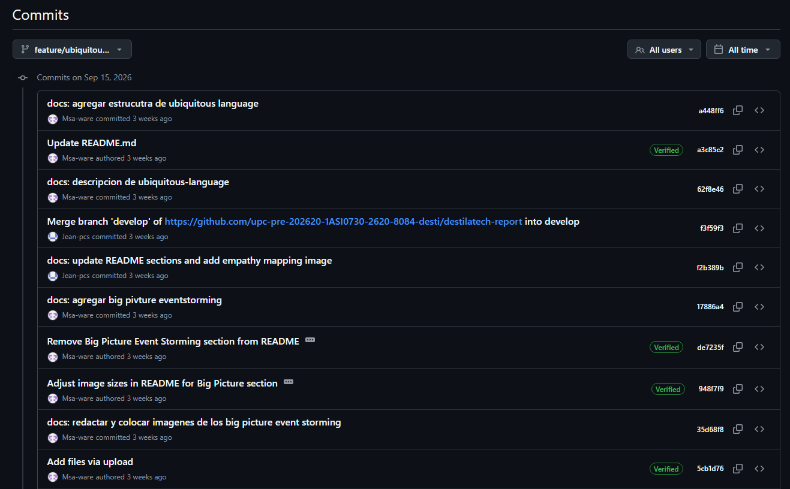</p>

*Nota.* Captura de GitHub (2026).

*Descripción.* Página «Commits» del repositorio destilatech-report filtrada por la rama `feature/ubiquitous_language`, con el mensaje, el autor y el identificador de cada commit.


**Figura 94**

*Historial de commits de la rama feature/student-profile*

<p align="center">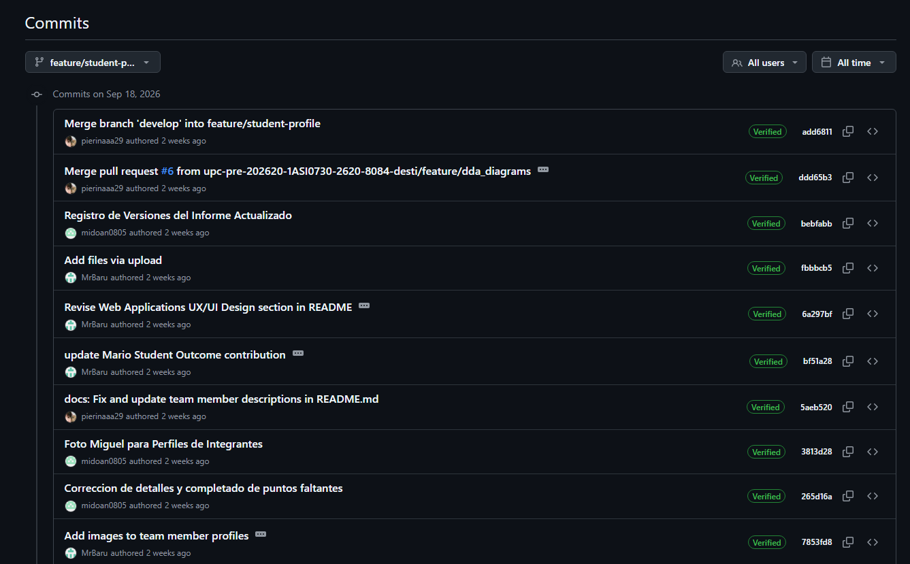</p>

*Nota.* Captura de GitHub (2026).

*Descripción.* Página «Commits» del repositorio destilatech-report filtrada por la rama `feature/student-profile`, con el mensaje, el autor y el identificador de cada commit.


**Figura 95**

*Historial de commits de la rama feature/startup_profile*

<p align="center">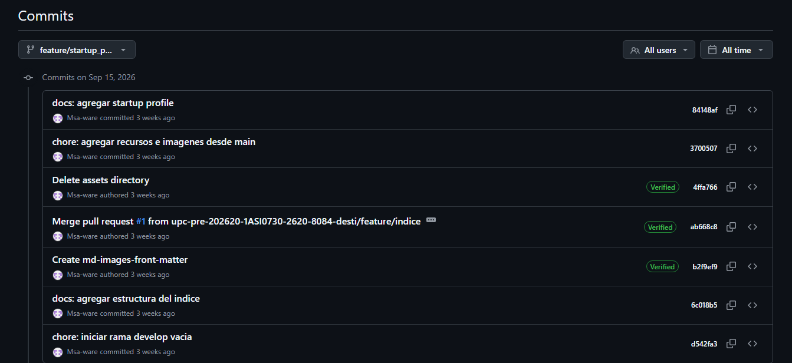</p>

*Nota.* Captura de GitHub (2026).

*Descripción.* Página «Commits» del repositorio destilatech-report filtrada por la rama `feature/startup_profile`, con el mensaje, el autor y el identificador de cada commit.


**Figura 96**

*Historial de commits de la rama feature/solution_profile*

<p align="center">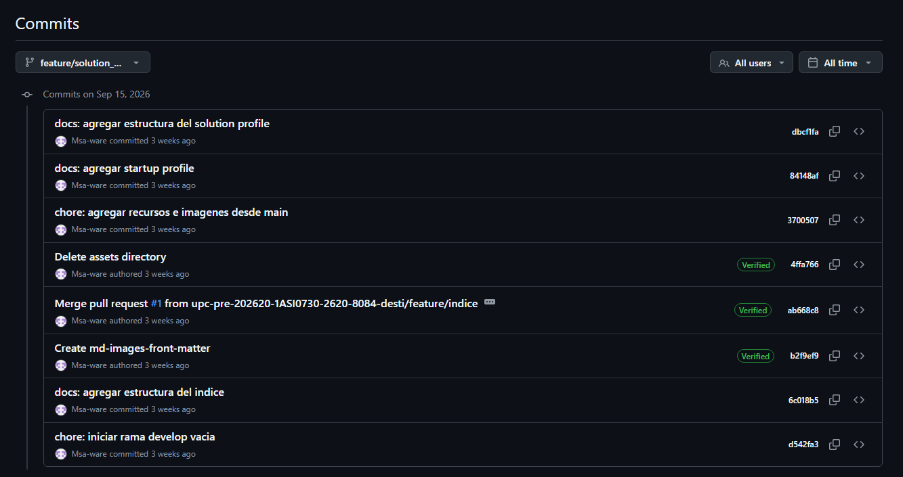</p>

*Nota.* Captura de GitHub (2026).

*Descripción.* Página «Commits» del repositorio destilatech-report filtrada por la rama `feature/solution_profile`, con el mensaje, el autor y el identificador de cada commit.


**Figura 97**

*Historial de commits de la rama feature/segmentos_objetivo*

<p align="center">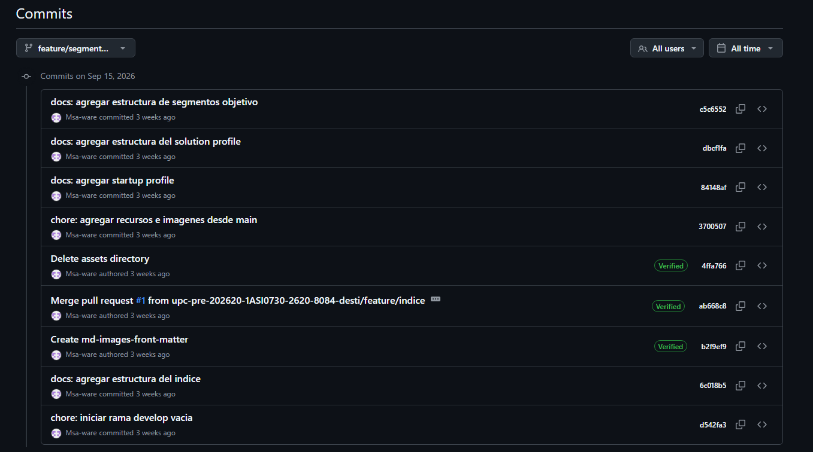</p>

*Nota.* Captura de GitHub (2026).

*Descripción.* Página «Commits» del repositorio destilatech-report filtrada por la rama `feature/segmentos_objetivo`, con el mensaje, el autor y el identificador de cada commit.


**Figura 98**

*Historial de commits de la rama feature/product-design*

<p align="center">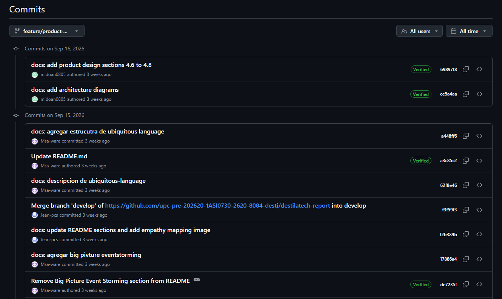</p>

*Nota.* Captura de GitHub (2026).

*Descripción.* Página «Commits» del repositorio destilatech-report filtrada por la rama `feature/product-design`, con el mensaje, el autor y el identificador de cada commit.


**Figura 99**

*Historial de commits de la rama feature/entrevistas*

<p align="center">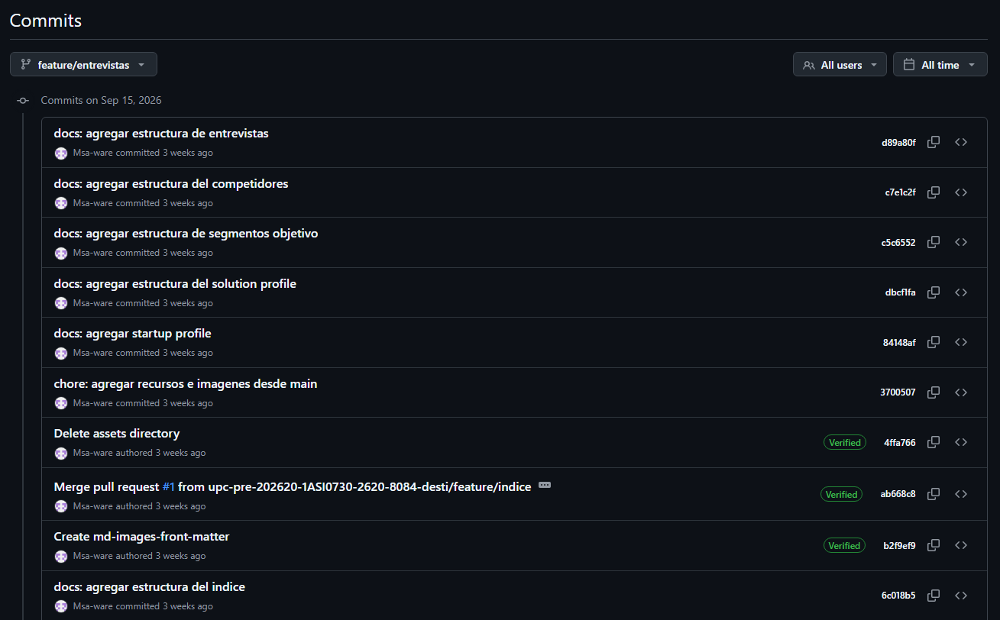</p>

*Nota.* Captura de GitHub (2026).

*Descripción.* Página «Commits» del repositorio destilatech-report filtrada por la rama `feature/entrevistas`, con el mensaje, el autor y el identificador de cada commit.


**Figura 100**

*Historial de commits de la rama feature/empathy_mapping_2*

<p align="center">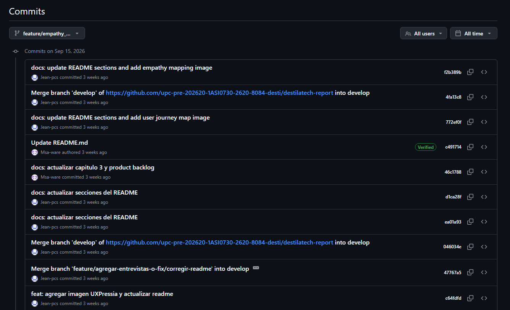</p>

*Nota.* Captura de GitHub (2026).

*Descripción.* Página «Commits» del repositorio destilatech-report filtrada por la rama `feature/empathy_mapping_2`, con el mensaje, el autor y el identificador de cada commit.


**Figura 101**

*Historial de commits de la rama feature/domain_driven_architecture*

<p align="center">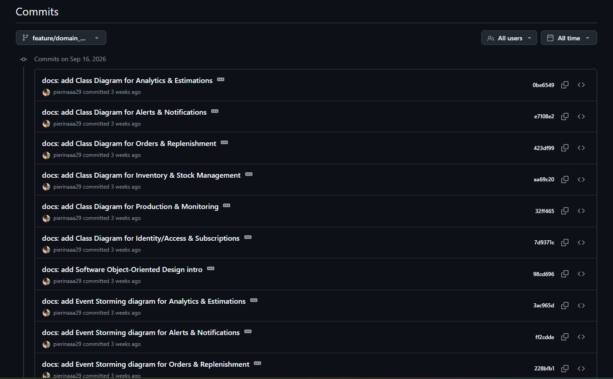</p>

*Nota.* Captura de GitHub (2026).

*Descripción.* Página «Commits» del repositorio destilatech-report filtrada por la rama `feature/domain_driven_architecture`, con el mensaje, el autor y el identificador de cada commit.


**Figura 102**

*Historial de commits de la rama feature/dda_diagrams*

<p align="center">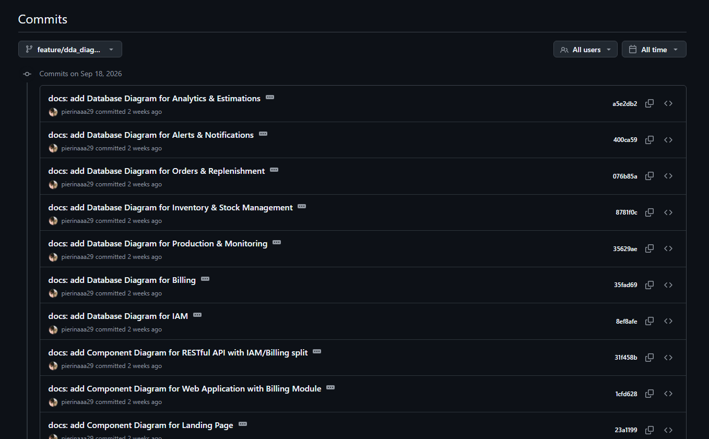</p>

*Nota.* Captura de GitHub (2026).

*Descripción.* Página «Commits» del repositorio destilatech-report filtrada por la rama `feature/dda_diagrams`, con el mensaje, el autor y el identificador de cada commit.


**Figura 103**

*Historial de commits de la rama feature/competidores*

<p align="center">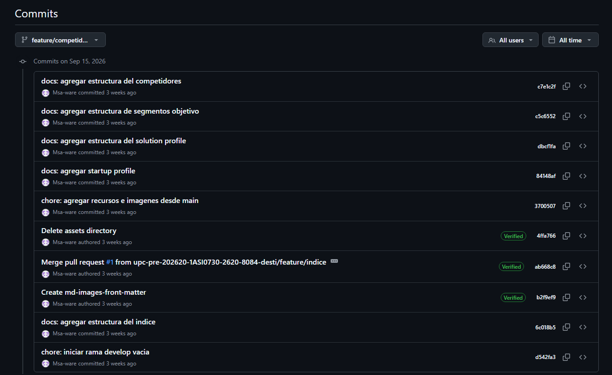</p>

*Nota.* Captura de GitHub (2026).

*Descripción.* Página «Commits» del repositorio destilatech-report filtrada por la rama `feature/competidores`, con el mensaje, el autor y el identificador de cada commit.


**Figura 104**

*Historial de commits de la rama feature/code_style*

<p align="center">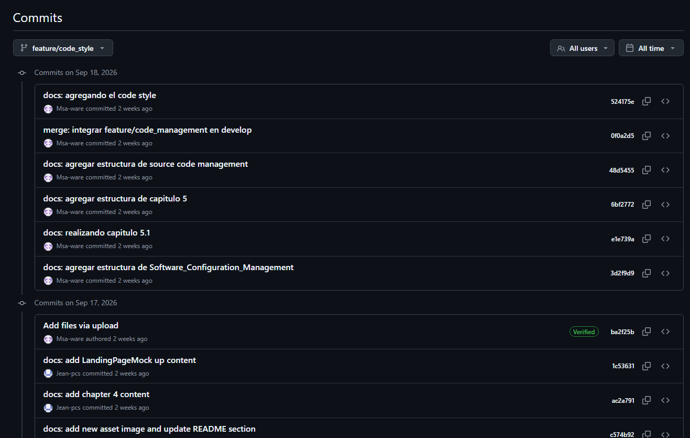</p>

*Nota.* Captura de GitHub (2026).

*Descripción.* Página «Commits» del repositorio destilatech-report filtrada por la rama `feature/code_style`, con el mensaje, el autor y el identificador de cada commit.


**Figura 105**

*Historial de commits de la rama feature/code_management*

<p align="center">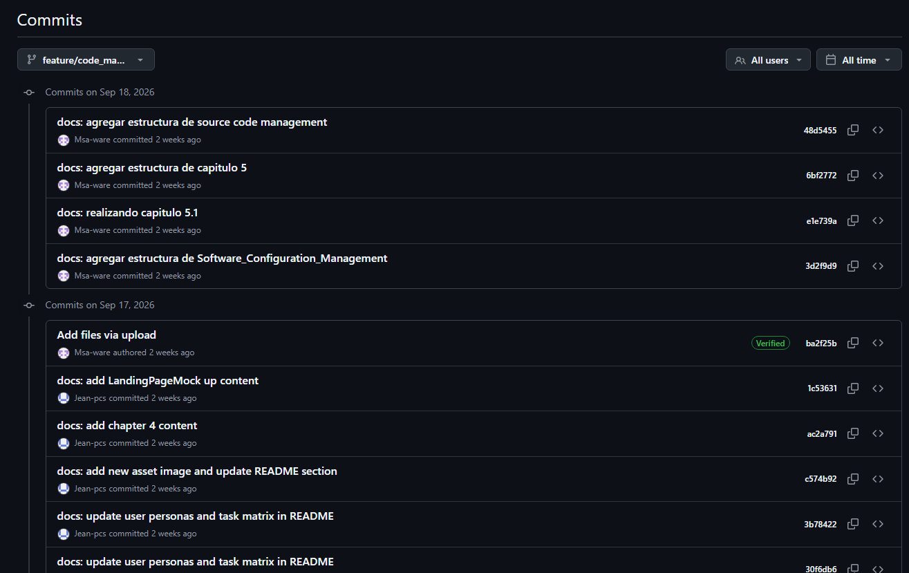</p>

*Nota.* Captura de GitHub (2026).

*Descripción.* Página «Commits» del repositorio destilatech-report filtrada por la rama `feature/code_management`, con el mensaje, el autor y el identificador de cada commit.


**Figura 106**

*Historial de commits de la rama feature/chapter-4*

<p align="center">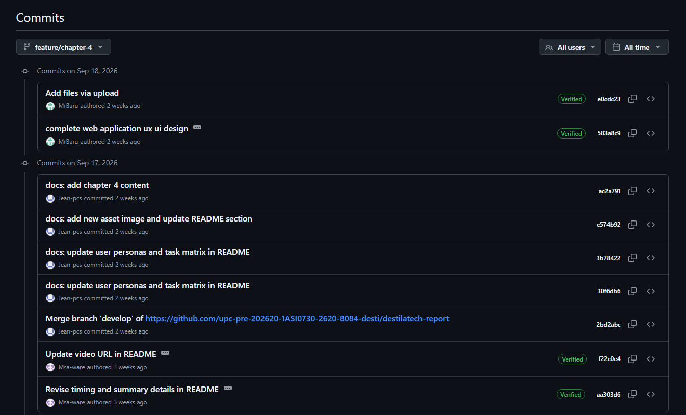</p>

*Nota.* Captura de GitHub (2026).

*Descripción.* Página «Commits» del repositorio destilatech-report filtrada por la rama `feature/chapter-4`, con el mensaje, el autor y el identificador de cada commit.


**Figura 107**

*Historial de commits de la rama feature/big_picture_eventstorming*

<p align="center">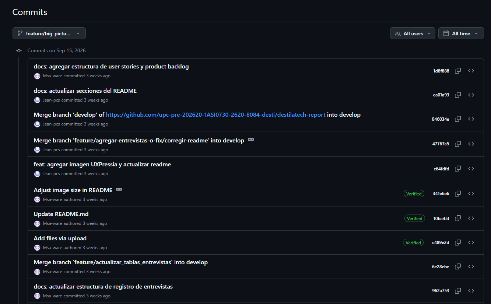</p>

*Nota.* Captura de GitHub (2026).

*Descripción.* Página «Commits» del repositorio destilatech-report filtrada por la rama `feature/big_picture_eventstorming`, con el mensaje, el autor y el identificador de cada commit.


**Figura 108**

*Historial de commits de la rama feature/agregar-entrevistas-o-fix/corregir-readme*

<p align="center">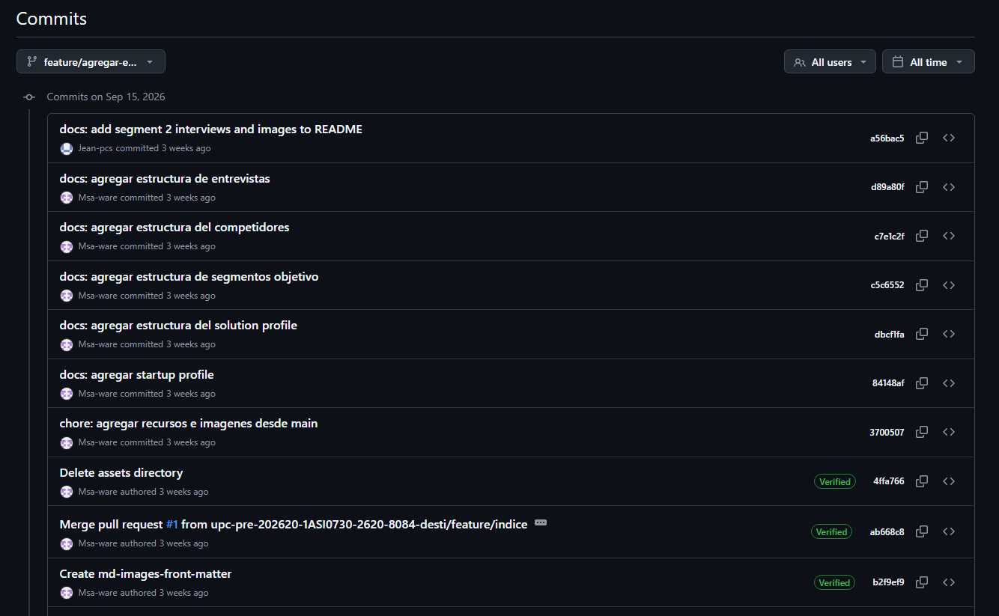</p>

*Nota.* Captura de GitHub (2026).

*Descripción.* Página «Commits» del repositorio destilatech-report filtrada por la rama `feature/agregar-entrevistas-o-fix/corregir-readme`, con el mensaje, el autor y el identificador de cada commit.


**Figura 109**

*Historial de commits de la rama feature/agregar_fotos*

<p align="center">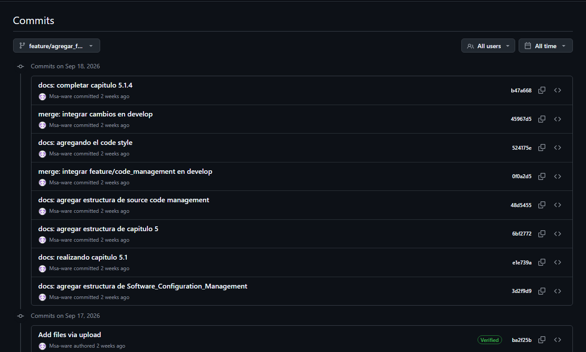</p>

*Nota.* Captura de GitHub (2026).

*Descripción.* Página «Commits» del repositorio destilatech-report filtrada por la rama `feature/agregar_fotos`, con el mensaje, el autor y el identificador de cada commit.


**Figura 110**

*Historial de commits de la rama feature/actualizar_tablas_entrevistas*

<p align="center">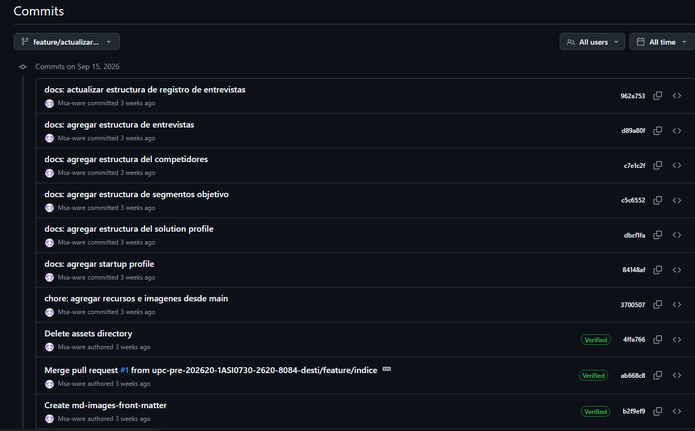</p>

*Nota.* Captura de GitHub (2026).

*Descripción.* Página «Commits» del repositorio destilatech-report filtrada por la rama `feature/actualizar_tablas_entrevistas`, con el mensaje, el autor y el identificador de cada commit.


**Figura 111**

*Historial de commits de la rama feature/Student_Jean*

<p align="center">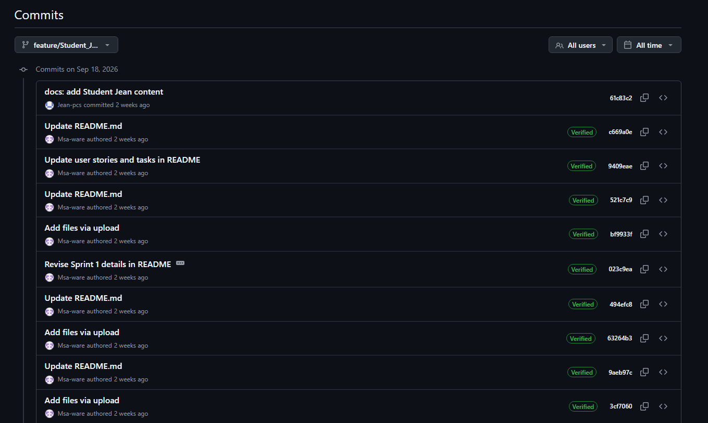</p>

*Nota.* Captura de GitHub (2026).

*Descripción.* Página «Commits» del repositorio destilatech-report filtrada por la rama `feature/Student_Jean`, con el mensaje, el autor y el identificador de cada commit.


**Figura 112**

*Historial de commits de la rama feature/Source_Code_Management*

<p align="center">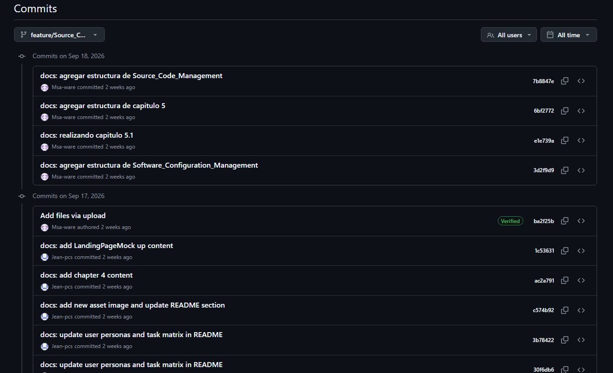</p>

*Nota.* Captura de GitHub (2026).

*Descripción.* Página «Commits» del repositorio destilatech-report filtrada por la rama `feature/Source_Code_Management`, con el mensaje, el autor y el identificador de cada commit.


**Figura 113**

*Historial de commits de la rama feature/Software_Configuration_Management*

<p align="center">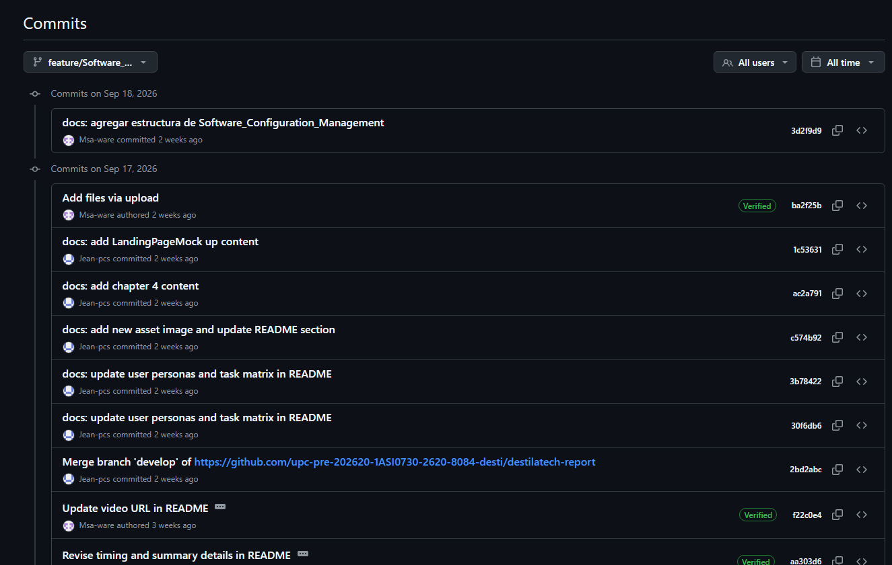</p>

*Nota.* Captura de GitHub (2026).

*Descripción.* Página «Commits» del repositorio destilatech-report filtrada por la rama `feature/Software_Configuration_Management`, con el mensaje, el autor y el identificador de cada commit.


**Figura 114**

*Historial de commits de la rama feature/LandingPageMock-up*

<p align="center">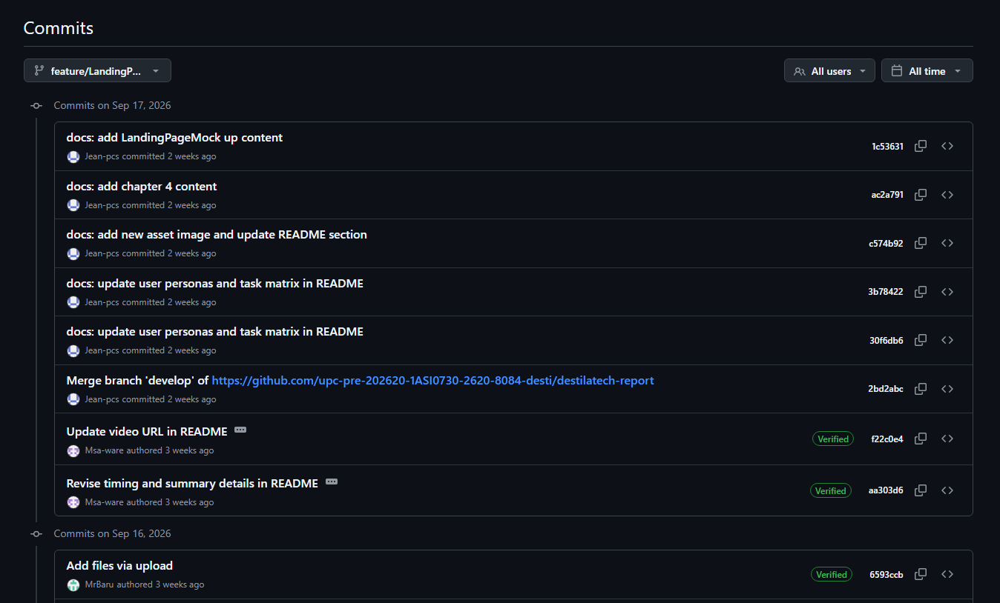</p>

*Nota.* Captura de GitHub (2026).

*Descripción.* Página «Commits» del repositorio destilatech-report filtrada por la rama `feature/LandingPageMock-up`, con el mensaje, el autor y el identificador de cada commit.


**Figura 115**

*Historial de commits de la rama docs/chapter-4-webapp-ux-ui*

<p align="center">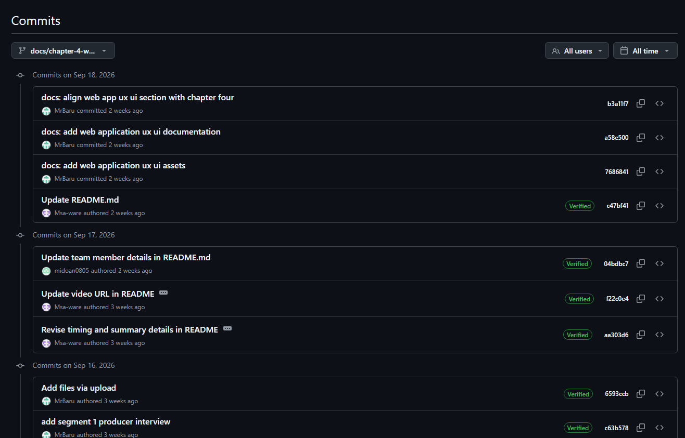</p>

*Nota.* Captura de GitHub (2026).

*Descripción.* Página «Commits» del repositorio destilatech-report filtrada por la rama `docs/chapter-4-webapp-ux-ui`, con el mensaje, el autor y el identificador de cada commit.


**Figura 116**

*Historial de commits de la rama develop*

<p align="center">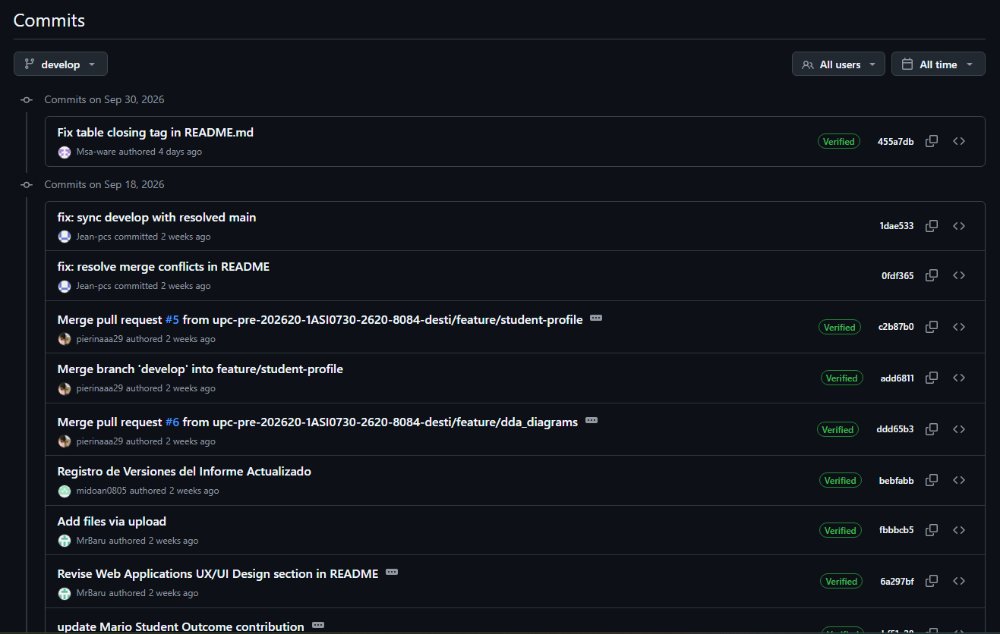</p>

*Nota.* Captura de GitHub (2026).

*Descripción.* Página «Commits» del repositorio destilatech-report filtrada por la rama `develop`, con el mensaje, el autor y el identificador de cada commit.


**Figura 117**

*Historial de commits de la rama main*

<p align="center">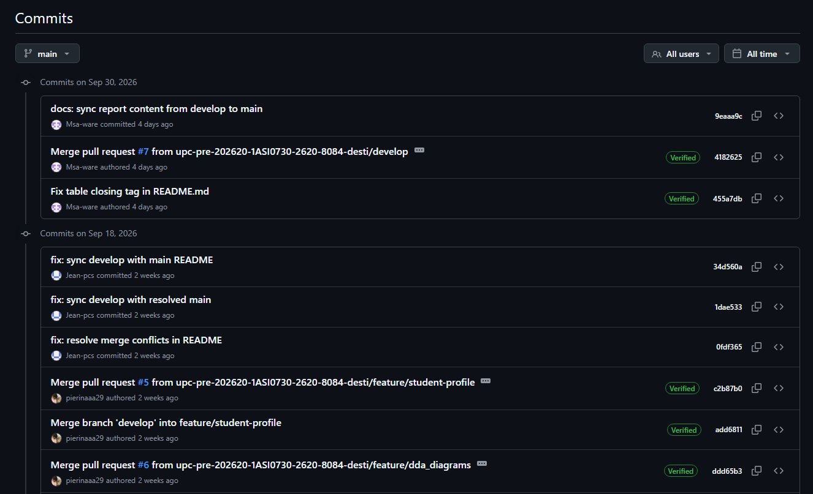</p>

*Nota.* Captura de GitHub (2026).

*Descripción.* Página «Commits» del repositorio destilatech-report filtrada por la rama `main`, con el mensaje, el autor y el identificador de cada commit.


##### 5.2.1.5. Execution Evidence for Sprint Review

El logro del Sprint 1 es la primera versión de la landing page publicada, con las siete secciones previstas: Header, Description, Goals, Pricing, Impact, Platform Features y Footer, junto con el selector de idioma ES / EN y el botón de prueba gratuita de 14 días. Las capturas muestran las vistas principales en escritorio.

**Video de navegación.** El equipo grabó un video de navegación de la landing page publicada, que consolida el flujo principal del visitante: ingreso a la página y lectura de la sección principal, recorrido de las secciones desde el menú del encabezado (Descripción, Objetivos, Precios, Impacto y Funcionalidades), cambio de idioma ES / EN, revisión de las funcionalidades por segmento y acceso al botón «Prueba gratis 14 días», hasta llegar al pie de página con los datos de contacto. El video prioriza el flujo relacionado con el negocio central, que es la captación de prospectos para la prueba gratuita.

- **Duración:** **[CONFIRMAR: duración mm:ss]**
- **Enlace (Microsoft Stream, enlace privado):** **[CONFIRMAR: URL del video que muestra y explica la navegación de la landing page]**
- **Captura del video:** **[CONFIRMAR: captura del video con el enlace]**

**Figura 118**

*Landing page: encabezado*

<p align="center"></p>

*Nota.* Captura propia del sitio publicado (2026).

*Descripción.* Encabezado de la landing page con el logotipo de Destilatech a la izquierda, el menú de secciones (Descripción, Objetivos, Precios, Impacto y Funcionalidades), el selector de idioma ES / EN con ES activo y el botón «Prueba gratis 14 días» a la derecha.


**Figura 119**

*Landing page: sección principal*

<p align="center">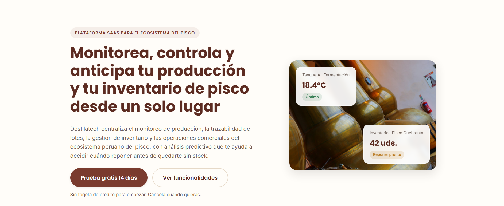</p>

*Nota.* Captura propia del sitio publicado (2026).

*Descripción.* Sección principal con la etiqueta «Plataforma SaaS para el ecosistema del pisco», el título «Monitorea, controla y anticipa tu producción y tu inventario de pisco desde un solo lugar», un párrafo de descripción, los botones «Prueba gratis 14 días» y «Ver funcionalidades», y a la derecha una fotografía de alambiques con tarjetas de temperatura (18.4 °C, Óptimo) e inventario (42 uds., Reponer pronto).


**Figura 120**

*Landing page: pie de página*

<p align="center">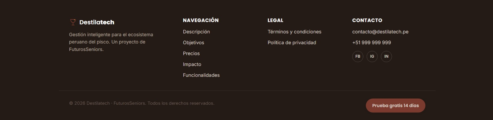</p>

*Nota.* Captura propia del sitio publicado (2026).

*Descripción.* Pie de página en tono oscuro con la marca y el eslogan, y columnas de Navegación (Descripción, Objetivos, Precios, Impacto y Funcionalidades), Legal (Términos y condiciones y Política de privacidad) y Contacto (correo, teléfono y enlaces a redes sociales). En la parte inferior aparecen los derechos reservados y un botón de prueba gratuita.


##### 5.2.1.6. Services Documentation Evidence for Sprint Review

El Sprint 1 se centró en la landing page, por lo que no se implementaron servicios web ni se generó documentación OpenAPI. Los endpoints previstos están especificados como historias técnicas en el capítulo III (épica EP10).

##### 5.2.1.7. Software Deployment Evidence for Sprint Review

En el Sprint 1 se desplegó la landing page en GitHub Pages desde la rama `main` del repositorio `destilatech-website`, con los pasos documentados en la sección 5.1.4. El despliegue se ejecuta de forma automática con el flujo `pages build and deployment` en cada integración en `main`.

**Enlace de producción:** [https://upc-pre-202620-1asi0730-2620-8084-desti.github.io/destilatech-website/](https://upc-pre-202620-1asi0730-2620-8084-desti.github.io/destilatech-website/)

##### 5.2.1.8. Team Collaboration Insights during Sprint

El equipo repartió las secciones de la landing page según la sección 5.2.1.3 y coordinó el trabajo por Discord. Los 11 commits del repositorio de la landing page se registraron desde una única cuenta del equipo; por esta razón, los aportes individuales por integrante se muestran con el repositorio del informe (sección «Project Report Collaboration Insights» y sección 5.2.1.4), donde cada persona trabajó desde su propia cuenta y rama.

**Figura 121**

*Commits del repositorio de la landing page*

<p align="center">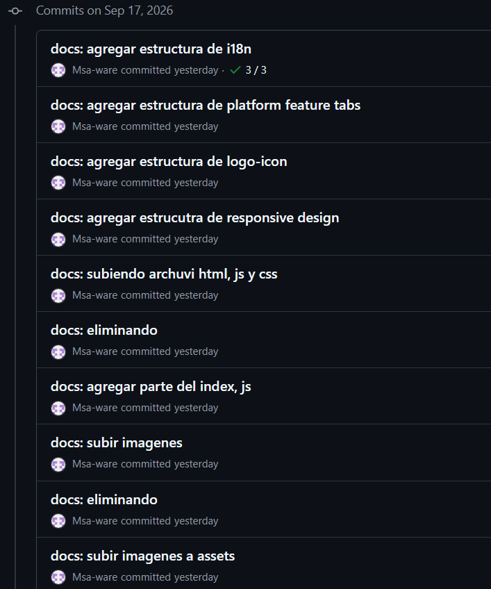</p>

*Nota.* Captura de GitHub (2026).

*Descripción.* Historial de commits del repositorio de la landing page del 17 de septiembre de 2026 y días anteriores, con los mensajes «agregar estructura de i18n», «agregar estructura de platform feature tabs», «agregar estructura de logo-icon», «agregar estructura de responsive design», «subiendo archivo html, js y css», «agregar parte del index, js», «subir imagenes», «subir imagenes a assets» y «eliminando».


**Figura 122**

*Contributors Insights del repositorio del informe (Sprint 1)*

<p align="center"></p>

*Nota.* Captura de GitHub Insights (2026).

*Descripción.* Aportes de los cinco integrantes al repositorio del informe entre el 31 de agosto y el 28 de septiembre de 2026, con pico de actividad en torno al 14 de septiembre. Msa-ware registra 77 commits (4,736 líneas añadidas y 506 eliminadas), pierinaaa29 25 (398 y 40), Jean-pcs 18 (1,198 y 2,444), MrBaru 8 (557 y 11) y midoan0805 7 (3,204 y 63).

El repositorio de la landing page no se muestra en un gráfico de Contributors porque todos sus commits se registraron desde una única cuenta del equipo (ver arriba).

#### 5.2.2. Sprint 2

##### 5.2.2.1. Sprint Planning 2

El Sprint 2 se dedicó a construir la primera versión de la aplicación web (*Web Application*) de Destilatech, con la landing page ya publicada en el Sprint 1. La aplicación implementa seis de los siete *bounded contexts* del diseño de software (capítulo IV): el contexto IAM (registro, inicio de sesión y perfil) queda para un sprint posterior porque el curso aún no aborda la autenticación. La aplicación consume un Fake API mientras se construye el *backend* en ASP.NET Core, que se reserva para el siguiente sprint.
**Tabla 17**

*Resumen de la reunión de Sprint Planning 2*


| Sprint # | Sprint 2 |
| :--- | :--- |
| **Antecedentes de la planificación** | Con la landing page publicada y el Product Backlog priorizado (sección 3.3), el equipo decidió construir la primera versión de la aplicación web con las historias de interfaz de seis *bounded contexts* (todos menos IAM, que el curso aún no aborda). Los endpoints de la RESTful API (épica EP10) se dejaron para el sprint del *backend*. |
| **Fecha** | 2026-09-29 |
| **Hora** | 11:00 a.m. |
| **Ubicación** | Reunión virtual (WhatsApp, Discord y Google Meet); aún no hay URL de despliegue |
| **Preparada por** | Santiago Atanacio, Jairo Mathias |
| **Asistentes** | Fernandez Seer, Mario Alonso; Santiago Atanacio, Jairo Mathias; Almandroz Carbajal, Pierina Marysabel; Condor Sandoval, Jean Pierre; Domenack Angeles, Miguel |
| **Sprint 1 Review Summary** | La landing page se publicó en GitHub Pages con las siete secciones previstas (Header, Description, Goals, Pricing, Impact, Platform Features y Footer), el selector de idioma ES / EN y el botón de prueba gratuita de 14 días. Al cierre del tablero quedaba en To Review la tarjeta «Mock-up móvil de la landing page». |
| **Sprint 1 Retrospective Summary** | Funcionó el reparto de la landing page por secciones y la coordinación por Discord. A mejorar: los 11 commits de la landing se registraron desde una sola cuenta y con el tipo `docs`, lo que impidió medir aportes individuales. Para el Sprint 2 se trabaja con ramas `feature/*` por *bounded context*, cada integrante desde su propia cuenta y con mensajes en formato Conventional Commits. |
| **Sprint 2 Goal** | *Our focus is on* que el productor y el comercializador de pisco puedan controlar su operación desde una sola plataforma: el productor, registrar sus lotes y vigilar las condiciones del proceso con lecturas simuladas; el comercializador, controlar su stock, registrar clientes y pedidos, y saber cuándo reponer. *We believe it delivers* visibilidad del estado de su producción y de su inventario sin cuadernos ni hojas de cálculo, y un aviso oportuno antes de perder un lote o de quedarse sin producto. *This will be confirmed when* un productor de demostración pueda registrar un lote, ver sus lecturas y recibir una alerta cuando una variable salga de su rango, y un comercializador de demostración pueda registrar un pedido, ver el stock descontado y recibir la sugerencia de reposición de un producto con stock bajo. |
| **Sprint 2 Velocity** | 132 horas de trabajo planificadas por el equipo. |
| **Sum of Story Points** | 92 Story Points (29 historias de usuario). |


##### 5.2.2.2. Aspect Leaders and Collaborators

En el Sprint 2 los aspectos son los módulos de la aplicación, que coinciden con los *bounded contexts* del capítulo IV más el *Shared Kernel*, el Fake API y la internacionalización. El líder de cada aspecto es el responsable de las tareas correspondientes en la sección 5.2.2.3; el rol de colaborador se asignó a quien registra commits en la rama del aspecto (sección 5.2.2.4).

| Team Member (Last Name, First Name) | GitHub Username | Shared Kernel | Fake API & i18n | Billing | Production & Monitoring | Inventory & Stock | Orders & Replenishment | Alerts & Notifications | Analytics & Estimations | Pruebas funcionales |
| :--- | :--- | :---: | :---: | :---: | :---: | :---: | :---: | :---: | :---: | :---: |
| Fernandez Seer, Mario Alonso | MrBaru | - | - | - | L | - | - | - | - | - |
| Santiago Atanacio, Jairo Mathias | Msa-ware | L | L | - | - | - | L | - | - | - |
| Almandroz Carbajal, Pierina Marysabel | pierinaaa29 | - | - | - | - | L | - | L | L | - |
| Condor Sandoval, Jean Pierre | jeanpcs | C | C | L | - | - | C | - | - | - |
| Domenack Angeles, Miguel | midoan0805 | - | - | - | - | - | - | - | - | L |

**Leyenda:** L = Líder (*Leader*); C = Colaborador (*Collaborator*); - = sin participación registrada en el aspecto. Miguel Domenack lideró las pruebas funcionales de la aplicación, que abarcan todos los módulos y no registran commits en el repositorio. Los dashboards (US04 y US05) pertenecen al contexto Analytics & Estimations.


## Conclusiones

**Conclusiones**

1. Las entrevistas a siete personas de los dos segmentos (tres productores y cuatro comercializadores) mostraron que el problema principal de los productores es la dificultad para monitorear las variables del proceso y llevar registros sin errores, y el de los comercializadores, quedarse sin stock con clientes esperando. Estas necesidades justifican las tres capacidades de Destilatech: monitoreo, gestión de inventario y estimaciones de reposición.
2. El análisis estadístico de las entrevistas indica coincidencias entre los segmentos (todos usan teléfono inteligente y Excel o cuaderno, y todos los que respondieron estarían dispuestos a pagar una suscripción mensual), con un rango medio de pago cercano a S/ 66. Por la muestra pequeña (n = 7), estos resultados son indicativos y deben validarse con más usuarios.
3. El Big Picture EventStorming, modelado como el negocio actual, permitió identificar cuatro áreas candidatas y el Design-Level EventStorming, al incorporar la solución, llegó a siete *bounded contexts* (con IAM y Billing como contextos nuevos de la plataforma), implementados como módulos de la API. Esto mantiene la coherencia entre el análisis del negocio, las historias de usuario (65 historias, 10 épicas) y el diseño de software.
4. La arquitectura elegida —un monolito modular en ASP.NET Core con base de datos MySQL, una aplicación web en Vue.js y un simulador de lecturas IoT— es proporcionada al tamaño del equipo y permite incorporar sensores reales en el futuro sin cambiar la API.
5. La landing page se publicó en GitHub Pages con sus siete secciones, lo que cumple el objetivo del Sprint 1 y deja un canal de presentación del producto a los prospectos.

**Recomendaciones**

1. Validar los resultados de las entrevistas con una muestra mayor de productores y comercializadores, y realizar las entrevistas de validación de la landing page y de la aplicación con usuarios reales.
2. Aplicar desde el siguiente sprint la convención de Conventional Commits, con el tipo correcto y mensajes en inglés, y hacer que cada integrante registre sus commits desde su propia cuenta en todos los repositorios.
3. Definir el proveedor de la pasarela de pago y confirmar con los usuarios los precios de los planes antes de implementar la suscripción.
4. Implementar primero los módulos de mayor valor del Product Backlog (lotes, monitoreo simulado, inventario, pedidos y alertas), incorporar el contexto IAM (registro e inicio de sesión) cuando el curso aborde la autenticación y documentar cada sprint con sus evidencias.

## Bibliografía

Agraria.pe. (2011, 15 de junio). *ERP para industria vitivinícola busca entrar a Perú*. https://agraria.pe/noticias/tecnologia-erp-para-industria-vitivinicola-busca-entrar-a-pe-1658

Atlassian. (2023). *Jira Software*. https://www.atlassian.com/software/jira

Atlassian. (2024). *Trello*. https://trello.com/

Baas-Schwegler, K., & Richardson, C. (s. f.). *EventStorming glossary & cheat sheet* [Repositorio]. GitHub. https://github.com/ddd-crew/eventstorming-glossary-cheat-sheet

Bourque, P., & Fairley, R. E. (Eds.). (2014). *Guide to the software engineering body of knowledge (SWEBOK), version 3.0*. IEEE Computer Society.

Brandolini, A. (2021). *Introducing EventStorming: An act of deliberate collective learning*. Leanpub. https://leanpub.com/introducing_eventstorming

Brown, S. (2018). *The C4 model for visualising software architecture*. https://c4model.com/

Cohn, M. (2004). *User stories applied: For agile software development*. Addison-Wesley.

Conventional Commits. (s. f.). *Conventional Commits 1.0.0*. https://www.conventionalcommits.org/

Cucumber. (s. f.). *Gherkin reference*. https://cucumber.io/docs/gherkin/reference/

Driessen, V. (2010, 5 de enero). *A successful Git branching model*. https://nvie.com/posts/a-successful-git-branching-model/

Evans, E. (2003). *Domain-driven design: Tackling complexity in the heart of software*. Addison-Wesley.

Google. (s. f.-a). *Google HTML/CSS style guide*. https://google.github.io/styleguide/htmlcssguide.html

Google. (s. f.-b). *Google JavaScript style guide*. https://google.github.io/styleguide/jsguide.html

JetBrains. (2024a). *JetBrains Rider*. https://www.jetbrains.com/rider/

JetBrains. (2024b). *JetBrains WebStorm*. https://www.jetbrains.com/webstorm/

MDN Web Docs. (s. f.). *MDN Web Docs*. Mozilla. https://developer.mozilla.org/

Mermaid. (2023). *Mermaid documentation*. https://mermaid.js.org/

Microsoft. (2024a). *Visual Studio Code*. https://code.visualstudio.com/

Microsoft. (2024b). *C# coding conventions*. Microsoft Learn. https://learn.microsoft.com/dotnet/csharp/fundamentals/coding-style/coding-conventions

Norman, D. A. (2013). *The design of everyday things* (Ed. rev. y ampl.). Basic Books.

Preston-Werner, T. (2013). *Semantic versioning 2.0.0*. https://semver.org/

Project Management Institute. (2021). *A guide to the project management body of knowledge (PMBOK guide)* (7.ª ed.).

Rosenfeld, L., Morville, P., & Arango, J. (2015). *Information architecture: For the web and beyond* (4.ª ed.). O'Reilly Media.

Smart, J. F. (2014). *BDD in action: Behavior-driven development for the whole software lifecycle*. Manning Publications.

Ubidots. (2026). *Ubidots pricing*. https://ubidots.com/pricing/

Vue.js. (2024). *Style guide*. https://vuejs.org/style-guide/


## Anexos

### Anexo A. Archivos complementarios

| Archivo | Descripción |
| :--- | :--- |
| [analisis_entrevistas_destilatech.xlsx](assets/analisis_entrevistas_destilatech.xlsx) | Libro de Excel con los datos codificados de las entrevistas, las estadísticas por segmento, el comparativo y los gráficos (sección 2.2.3). |
| [workspace.dsl](diagramas/structurizr/workspace.dsl) | Modelo de arquitectura en Structurizr DSL del que provienen los diagramas C4 (secciones 4.6.2 a 4.6.4). |
| Carpeta `diagramas/plantuml/` | Código PlantUML de los diagramas de clases de los siete *bounded contexts* (sección 4.7). |
| Carpeta `assets/arquitectura/` | Imágenes de los diagramas C4 exportadas desde Structurizr. |
| Carpeta `assets/commits/` | Capturas del historial de commits del repositorio del informe (sección 5.2.1.4) y de la aplicación web (sección 5.2.2.4). |
| Carpeta `assets/webapp/` | Capturas de la aplicación web en ejecución (sección 5.2.2.5). |

### Anexo B. Videos de Exposiciones

| Entrega | Descripción | Enlace |
| :--- | :--- | :--- |
| AV1 | Exposición del avance 1 (Sprint Review) | Se entrega directamente al docente en el formato solicitado; no se publica un enlace. |

### Anexo C. Video de las entrevistas

Las siete entrevistas (tres a productores y cuatro a comercializadores) se entregan en un único video continuo.

| Video | Contenido | Enlace |
| :---: | :--- | :--- |
| 1 | Entrevistas a Luciana Cueva, Mario Fernández y Stacy Guerra (productores) y a Marco Vargas, Carlos Moreno, Rubens Moreno y Andrea Mendoza (comercializadores) | [Ver video](https://upcedupe-my.sharepoint.com/personal/u202418755_upc_edu_pe/_layouts/15/stream.aspx?id=%2Fpersonal%2Fu202418755%5Fupc%5Fedu%5Fpe%2FDocuments%2Fentrevistas%2Emp4&referrer=StreamWebApp%2EWeb&referrerScenario=AddressBarCopied%2Eview%2E8a859f76%2D82ca%2D49cb%2D84d8%2D934b1dd892e3) |
| 2 | Navegación de la landing page (Sprint 1) | **[CONFIRMAR: URL en Microsoft Stream]** |
| 3 | Navegación de la landing page y de la aplicación web (Sprint 2) | **[CONFIRMAR: URL en Microsoft Stream]** |

