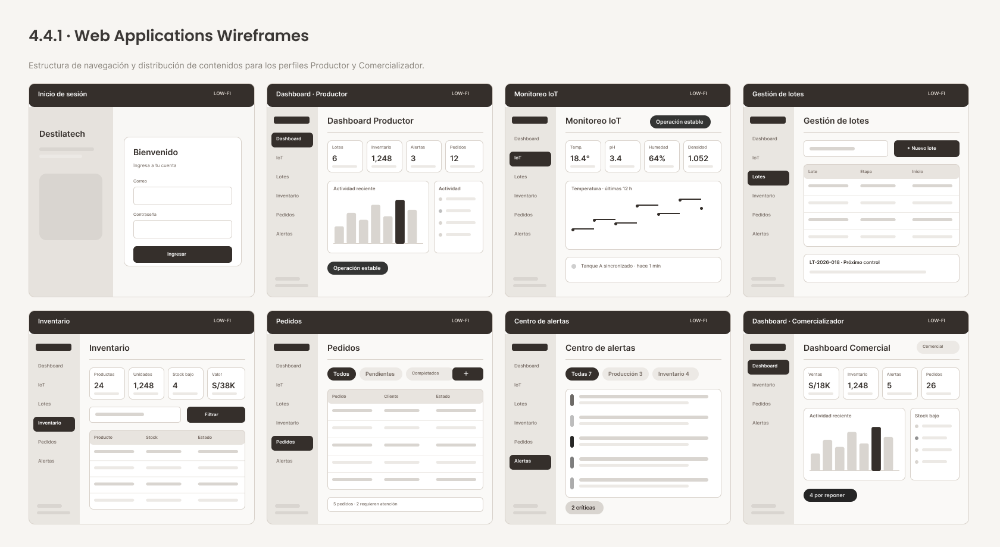
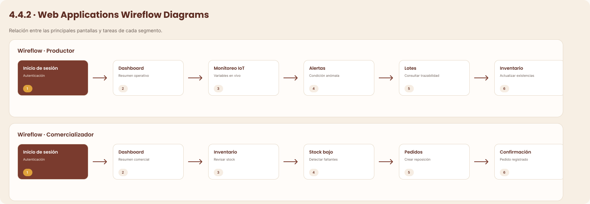
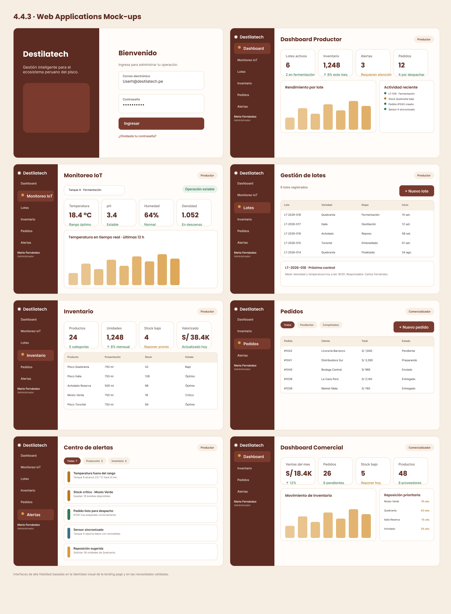
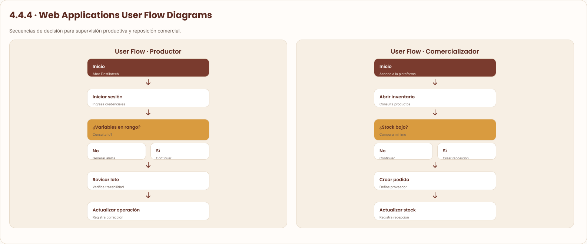
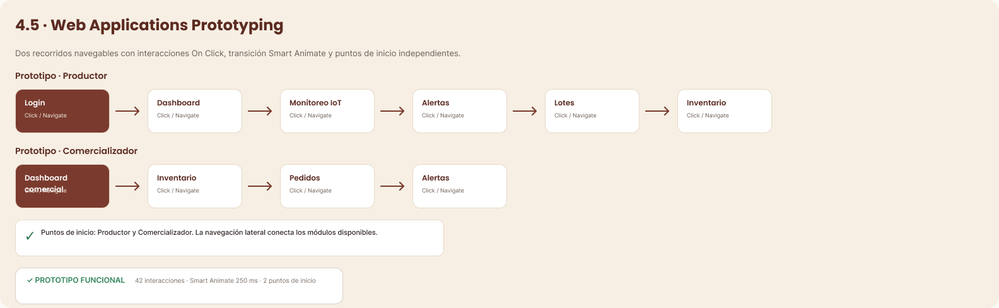

# Capítulo IV: Product Design

## 4.4. Web Applications UX/UI Design

El diseño UX/UI de la aplicación web de Destilatech considera las necesidades de sus dos segmentos objetivo: productores de pisco y pequeños comercializadores. La solución emplea una estructura visual común, pero adapta la navegación y la información disponible según las responsabilidades de cada perfil.

El Productor accede a monitoreo IoT, gestión de lotes, inventario, pedidos y alertas. El Comercializador utiliza una navegación simplificada centrada en inventario, pedidos y alertas de reposición.

- [Archivo completo de Destilatech en Figma](https://www.figma.com/design/l1g2fiZCTh5QYzOwzvGh9n/Untitled--Copy-?node-id=2007-2)

### 4.4.1. Web Applications Wireframes

Los wireframes representan la estructura inicial de las pantallas antes de aplicar los elementos visuales definitivos. Se diseñaron ocho vistas: inicio de sesión, dashboard del productor, monitoreo IoT, gestión de lotes, inventario, pedidos, centro de alertas y dashboard del comercializador.

Las vistas permiten validar la jerarquía de información, la distribución de componentes y las diferencias entre perfiles. Incluyen indicadores, tablas, gráficos, estados operativos y acciones vinculadas con la producción y comercialización del pisco.

  

### 4.4.2. Web Applications Wireflow Diagrams

Los wireflows muestran la relación entre las pantallas y las tareas principales de cada segmento. El Productor inicia sesión, consulta su dashboard, supervisa las variables IoT, revisa alertas, consulta la trazabilidad de los lotes y actualiza el inventario. El Comercializador consulta su dashboard e inventario, identifica productos con stock bajo, registra la reposición y confirma el pedido.

  

### 4.4.3. Web Applications Mock-ups

Los mockups presentan la propuesta visual de alta fidelidad. Para mantener consistencia con la Landing Page se empleó una paleta de tonos vino, terracota, crema y dorado, junto con las tipografías Poppins e Inter.

Las interfaces muestran información simulada coherente con el dominio: lotes, temperatura, pH, humedad, densidad, niveles de inventario, pedidos y alertas. Las etiquetas de rol y los menús laterales distinguen las funcionalidades disponibles para productores y comercializadores.

  

### 4.4.4. Web Applications User Flow Diagrams

Los User Flow Diagrams describen dos procesos prioritarios. En el flujo del Productor, el sistema evalúa las variables IoT y genera una alerta cuando alguna se encuentra fuera del rango esperado, permitiendo revisar el lote y registrar una acción correctiva. En el flujo del Comercializador, el sistema facilita detectar stock bajo, crear una reposición, registrar el pedido al proveedor y actualizar las existencias después de recibir los productos.

  

## 4.5. Web Applications Prototyping

El prototipo interactivo fue construido en Figma a partir de los mockups de alta fidelidad. Está compuesto por doce pantallas y cuarenta y dos interacciones configuradas mediante eventos **On Click** y transiciones **Smart Animate** de 250 ms.

Se definieron dos puntos de inicio. El recorrido del Productor incluye dashboard de producción, monitoreo IoT, lotes, inventario, pedidos y alertas. El recorrido del Comercializador presenta una navegación simplificada hacia dashboard comercial, inventario, pedidos y alertas.

  

**Enlaces del prototipo interactivo:**

- [Flujo del Productor](https://www.figma.com/design/l1g2fiZCTh5QYzOwzvGh9n/Untitled--Copy-?node-id=2031-525)
- [Flujo del Comercializador](https://www.figma.com/design/l1g2fiZCTh5QYzOwzvGh9n/Untitled--Copy-?node-id=2031-874)
